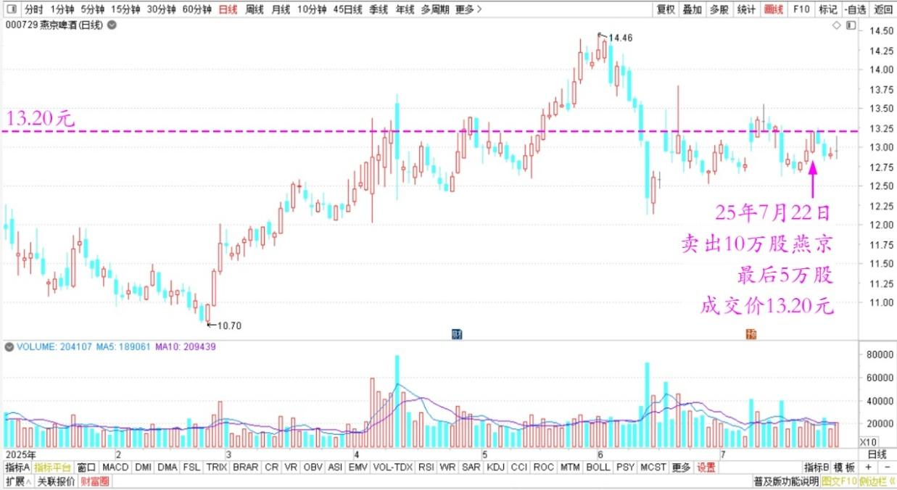
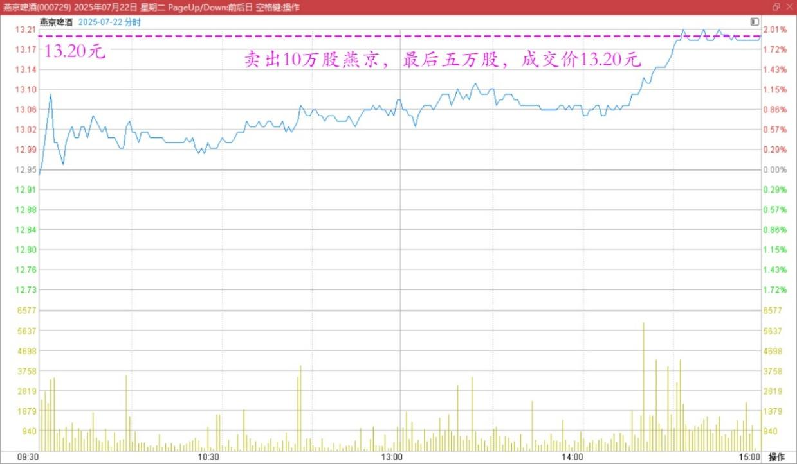
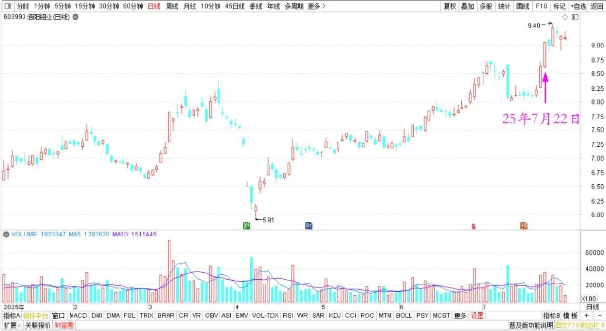
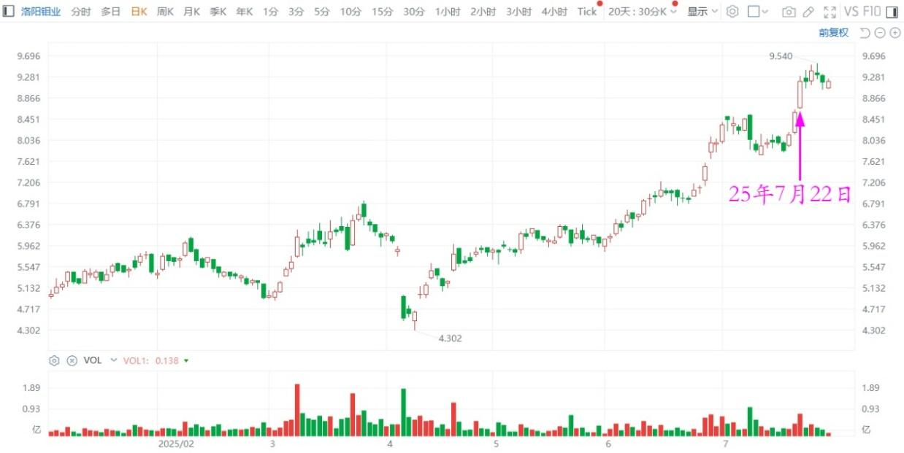

168篇.卖出10万股燕京还融资

清一山长[2025年7月22日15:11](https://www.zhihu.com/pin/1931008477691613912)

今天卖了10万股燕京出去，最后的五万股，成交价是13.20元，我挺满意的。因为今天最高价也才13.21元呢！

**燕京啤酒2025年日线图**

**燕京啤酒2025年7月22日分时图**

我的洛阳钼业涨得也很好！

**洛阳钼业（A股）2025年日线图**

**洛阳钼业（H股）2025年日线图**

就是想找便宜股，越来越难了。

先还了融资，再说吧！都是我低价买的股票，现在这个价格，我来用融资持有，就太贪心了。

**（标题、图片为编者所加）**
**文章音频**：

[585篇. 卖出10万股燕京还融资](http://link.zhihu.com/?target=https%3A//www.ximalaya.com/sound/897875184)

**参考链接：**

[160篇.贬低巴菲特，并不能让自己赚钱！](https://zhuanlan.zhihu.com/p/1925299829367608333)

[161篇.7年10倍利润增长](https://zhuanlan.zhihu.com/p/1927944535373247107)

[162篇.只想拿股息，没想赚快钱](https://zhuanlan.zhihu.com/p/1928066355866861887)

[163篇.比亚迪的对手，应该是丰田](https://zhuanlan.zhihu.com/p/1927780975305266754)

[164篇.如果德隆能坚持到今天](https://zhuanlan.zhihu.com/p/1932814644625510702)

[165篇.反身性理论看冠农](https://zhuanlan.zhihu.com/p/1932822111392621569)

[166篇.什么是匮乏之心？什么是富足之心？](https://zhuanlan.zhihu.com/p/1933972314027984331)

[167篇.一年20倍，是怎样做到的？](https://zhuanlan.zhihu.com/p/1936417228665881673)

