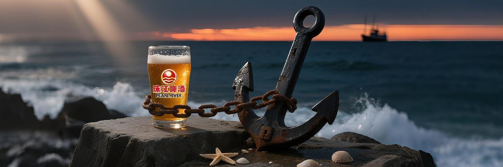
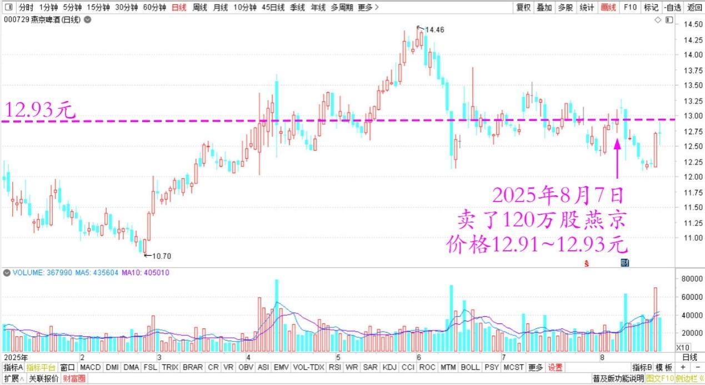
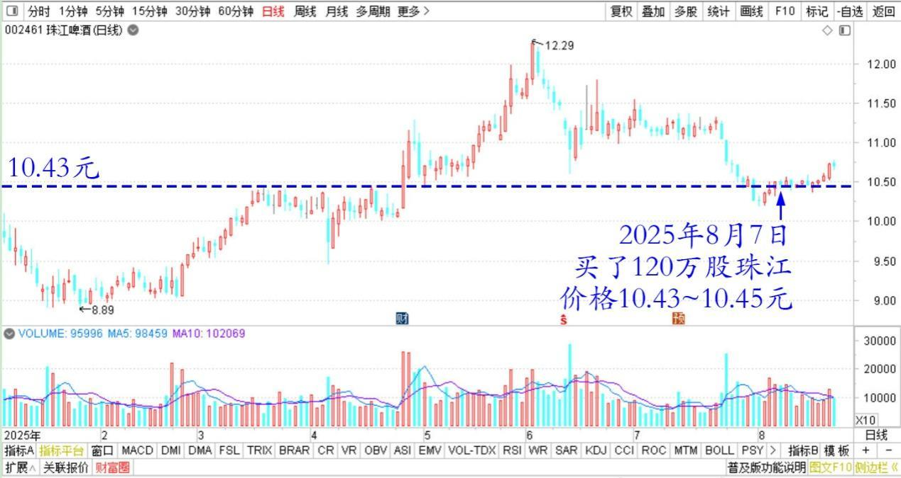
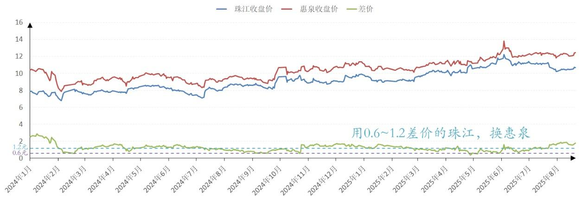
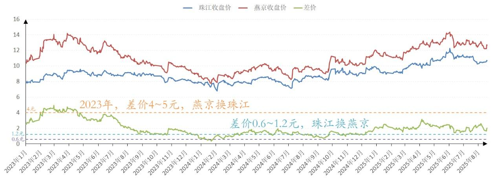
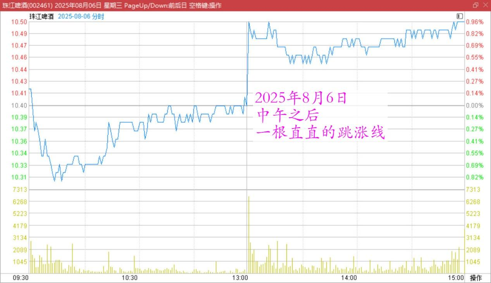
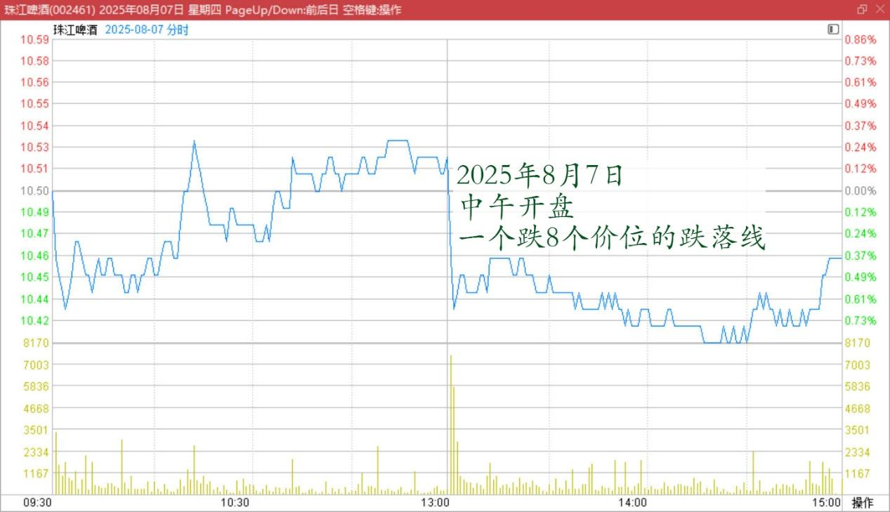
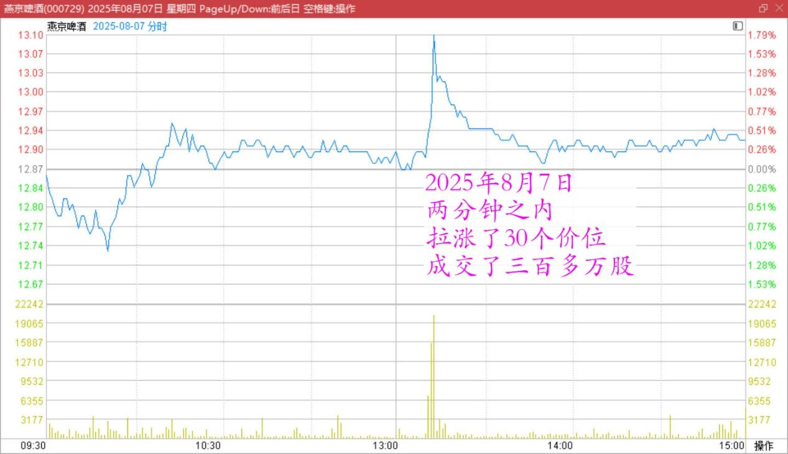

**173篇.赖皮在珠江就是不走**

清一山长[2025年8月7日17:43](https://www.zhihu.com/pin/1936844925917439458)

今日操盘：

**今天卖了120万股燕京，价格是12.91～12.93元。买了120万股珠江，价格是10.43～10.45元。**两者价差，差不多是2.5元弱一点的样子。

燕京啤酒2025年日线图

珠江啤酒2025年日线图

相当于几年前，用7.5元的燕京换了5元的珠江？

其实我也不知道这样对不对？按道理是不对的。因为燕京至少应该比珠江贵一倍才对。销量比较，虽然利润是差不多的。

但我原本就是用0.6～1.2差价的珠江，换的惠泉啤酒和燕京。现在只是补回来原来的珠江头寸罢了，不算是净买入。

珠江啤酒、惠泉啤酒2024～2025收盘价

而两年前，我又是卖出了13～14元的燕京，换了9元以下的珠江。差价是4～5元换的。本来之前的珠江是空仓，这下就导致珠江、惠泉双双进入十大了。

珠江啤酒、燕京啤酒2023～2025收盘价

**倒来倒去的，导致我的啤酒仓位的成本，都在向零成本靠齐了。**以零成本做十大股东，还是很有成就感的！

就是我有一点迷惑：为啥现在两个股票，不管是买，还是卖，都可以轻易地成交上百万股？还不影响价格？今天在干什么？总成交似乎也不大？

另外：昨天中午之后，午盘珠江是跳上去10个价位，一根直直的跳涨线。今天是中午开盘，一个跌8个价位的跌落线。你们在玩啥呢？坐电梯吗？

珠江啤酒2025年8月6日分时图

珠江啤酒2025年8月7日分时图

燕京也是在中午1点过一点，两分钟之内，拉涨了30个价位，成交了三百多万股，有点像是换庄的样子？

珠江啤酒2025年8月7日分时图

反正我也不懂，我就是死不下车。燕京让我走，我就走。**我赖皮在珠江就是不走，卖多少，我买回来多少，就是一股不少。我不挣钱，我挣股！**

**评论回复：**

[英子同学](https://www.zhihu.com/people/yingzitx)2025-08-07江西

我也买了点珠江，看你昨天说的，嘿嘿

山河有型2025-08-07广东

开新仓和买回原来卖出的仓位，那可是不一样的！

[英子同学](https://www.zhihu.com/people/yingzitx)2025-08-07江西回复山河有型

[红心][红心]哦哦

山长 清一2025-08-07泰国

让你别炒股的[捂脸]

​[英子同学](https://www.zhihu.com/people/yingzitx)2025-08-07江西回复山长 清一

我就买了一万块钱啊[飙泪笑]

山长 清一2025-08-07泰国

珠江我是5元建仓的，建完后跌到4元，死拿不放。13元跑光。现在我的成本是1～2元，你怎么比？[捂脸]

[英子同学](https://www.zhihu.com/people/yingzitx)2025-08-07江西回复山长 清一

[发呆][发呆][发呆][发呆]哦！那……[发呆]我，不知道说啥了[发呆]

山长 清一2025-08-07泰国回复英子同学

媒体你专业，炒股我专业 [飙泪笑]

​Lily-小丽2025-08-07河北

英子姐可以买山长之前在雪球上分享的文章被整理成册的书籍，以及新财富新思维的书，或许能帮助到你。我就是通过不断看山长之前分享的这些文章慢慢明白的，看了十年，现在慢慢懂一些了，小有收获。祝福英子姐在投资上也一定会收获满满。

潘春娟2025-08-07广东

感恩山长的分享，紧跟山长，股票账户在不断的变多，个人也在不断成长，慢慢的，觉得自己各方面越来越好，祝福山长阖家幸福安康[红心]

**（标题、图片为编者所加）** **文章音频**：

[喜马拉雅-国内专业音频分享平台,随时随地,听我想听！](http://link.zhihu.com/?target=https%3A//www.ximalaya.com/sound/904284733)

**参考链接：**

[167篇.一年20倍，是怎样做到的？](https://zhuanlan.zhihu.com/p/1936417228665881673)

[168篇.卖出10万股燕京还融资](https://zhuanlan.zhihu.com/p/1937126670973776622)

[169篇.金钼股份涨停卖出](https://zhuanlan.zhihu.com/p/1937910581056213786)

[170篇.金钼股份继续涨，但我看多不做多](https://zhuanlan.zhihu.com/p/1940509051663385324)

[171篇.慢牛行情，长期持股才是制胜之道](https://zhuanlan.zhihu.com/p/1940513233216725976)

[172篇.主账户燕京首次跌破千万股](https://zhuanlan.zhihu.com/p/1942800743519220338)

[链接汇总（截止2025年8月1日）](https://zhuanlan.zhihu.com/p/621215591)

