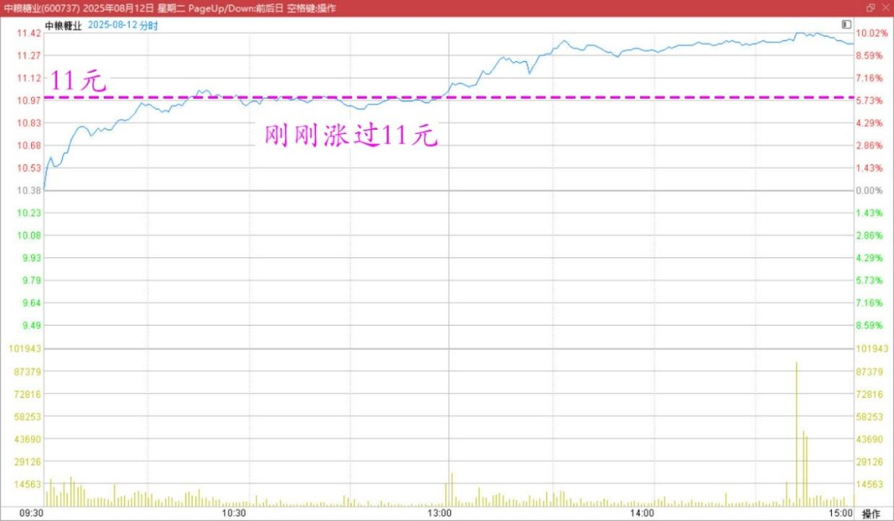
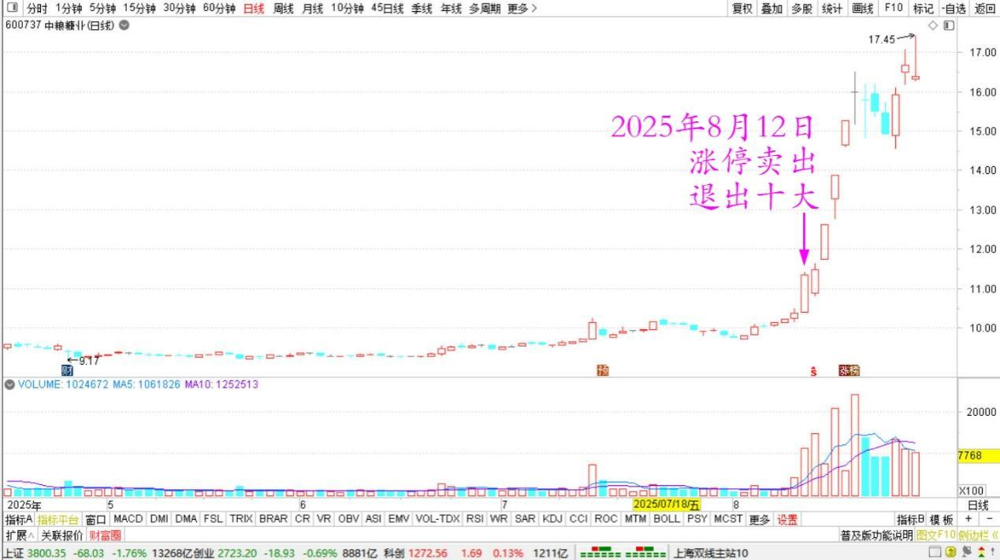
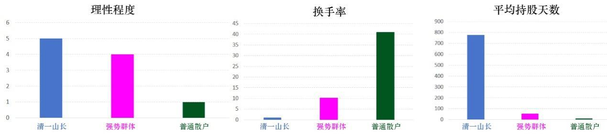

175篇.中粮糖业涨停，卖出退出十大

**清一山长**[2025年8月12日11:30](https://www.zhihu.com/pin/1938562914601636874)

**一、关于赚钱的好消息和坏消息**

好消息是——中粮糖业刚刚涨过11元了。清粉们有福了！

**中粮糖业2025年8月12日分时图**

坏消息是，我是这家公司半年报新的十大股东。我过生日这天，你们就会看到我的持仓有多少了。但我真实持仓比公布的数量只多不少，因为最近两个月，我只买不卖。上周跌破10元，我还在继续买。

之所以是坏消息，因为清黑们总想看我笑话，你们会失望的！

明天，中粮糖业就会送我7位数的红利股息。我拿来培养更多的世界冠军，气死你们！

清黑万岁！感谢你们的加持，你们就像火箭系统的燃料一样。用跑出火箭，强烈喷发，与我们反向而行的方式，来成就我们！

你们越黑，我们就飞得越高。

我们现在又拿冠军又赚钱。名利双收，会不会气死你们呀？

谁让你们不懂随喜功德的！[大笑][大笑]

**二、不争不抢，涨停就卖**

[2025年8月12日15:22](https://www.zhihu.com/pin/1938621310424028362)

今天中糖涨停，根据我“不争不抢，涨停就卖”的原则，今天我就退出十大了。

**中粮糖业2025年5月～8月日线图**

当然，还有一些持仓，但我卖不赢了，跟不上。

这是我最短命的十大，才一个季度就闪退了！资金今天全拿来还融资了，是一大笔钱，一年可以省掉我上百万的利息。

今天我的券商，铁定进了中粮的成交龙虎榜。

本来中糖是计划长持的，根本没指望它会有涨停的机会，我就是计划拿股息长持10年的。没想到送我这么多的短期收益，够我好多年的股息了！所以，也没啥遗憾的。如果退回来，我还会买一点的。

另外有个笑话：我的券商软件，有个对我综合投资能力的测评，我就去看了一下。

我发现：我的投资能力非常的不平衡，长处很长，远超一般人。短处很短，不如一般人。

1、风险控制能力最强，几乎接近满分。

2、投资稳定性其次。大概是80分，超越平均值。

3、择时的能力，一般般……好像不及格？因为我总是满仓，千股跌停的时候也满仓（就是不满融）。

4、盈利能力，一般般（奇怪，没几个人超过我吧？）。当然，短期来看，我的成绩的确很一般，没啥亮眼的！每天看上去就一般般。

5、以上五个方面，我还算是超过同类账户平均水平的！但最关键的指标，投资最重要的能力，我是不及格的！

6、选股能力。我是最差的，是我所有指标中，低于“同类账户”的超级差的指标！

也就是说：根据大数据来分析我的行为，我是一个不会选股的傻瓜。但风险控制良好，投资风格稳定性良好！

好吧！我同意，这也是我！

我真倒霉：我的账户连电脑AI，都瞧不起我的投资选股的能力，都要做清黑，要打击我的自信心。

你们散了吧！以后千万别跟我买股了。我的指标不及格，赶不上普通人！我哭去了！我去找一家面馆，关灯吃面去！

**三、我和散户的主要区别**

[2025年8月12日17:27](https://www.zhihu.com/pin/1938652873434076304)

我的账户，有北极星诊断账户。

结论是：过度自信！

1、我的理性程度是五颗星。超越了投资能力较强的群体（4星），而普通散户是一个星。

2、换手率，我是1.02，强势群体是10.22，高了10倍。散户是41倍。厉害！

3、平均持股天数，我是776天。强势群体52天，普通散户9天。

其他几个指标，我的打分根本就没有出来。

处置效应——我没有，对比组都有。

止损画像——我没有。

止盈画像……我也没有。

所以，我的确是电脑无法定义的投资人。

供你们参考吧！

**你的行为，越接近我，可能就越赚钱。越接近散户，恐怕越赔钱。**

**（标题、图片为编者所加）** **文章音频**：

[592篇. 中粮糖业涨停，卖出退出十大](http://link.zhihu.com/?target=https%3A//www.ximalaya.com/sound/906935761)

**参考链接：**

[169篇.金钼股份涨停卖出](https://zhuanlan.zhihu.com/p/1937910581056213786)

[170篇.金钼股份继续涨，但我看多不做多](https://zhuanlan.zhihu.com/p/1940509051663385324)

[171篇.慢牛行情，长期持股才是制胜之道](https://zhuanlan.zhihu.com/p/1940513233216725976)

[172篇.主账户燕京首次跌破千万股](https://zhuanlan.zhihu.com/p/1942800743519220338)

[173篇.赖皮在珠江就是不走](https://zhuanlan.zhihu.com/p/1942710092614054086)

[174篇.珠江再次突破千万级持仓](https://zhuanlan.zhihu.com/p/1945617387413021286)

[链接汇总（截止2025年8月1日）](https://zhuanlan.zhihu.com/p/621215591)

