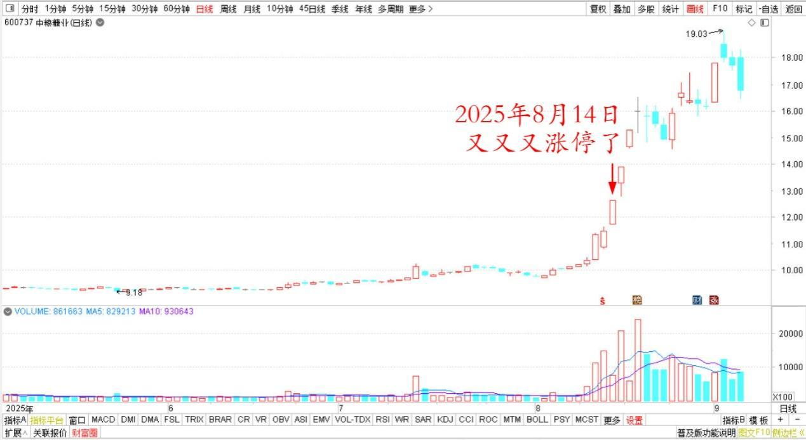
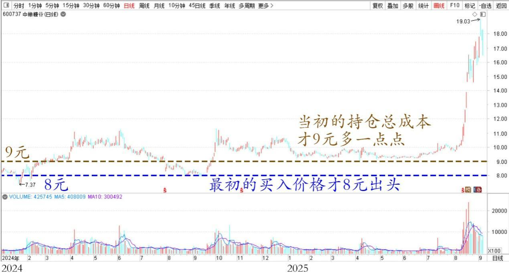
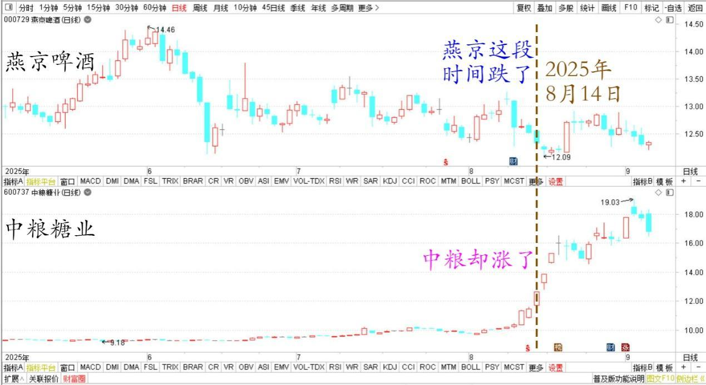
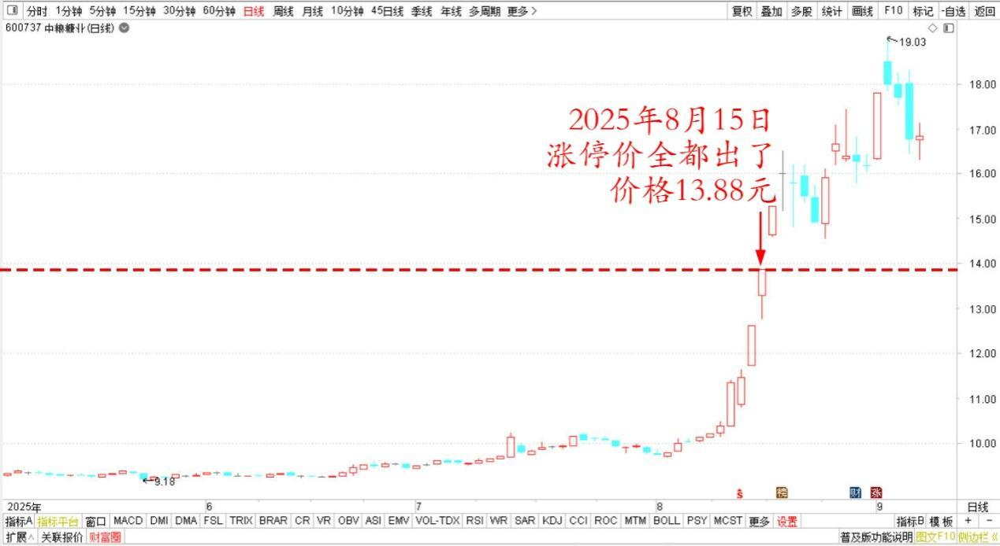

**

**

**177篇.只能赚认知范围内的利润**

**清一山长2025年8月14日～15日**

**一、感恩买我股票和卖给我股票的人**

**清一山长[2025年8月14日16:54](https://www.zhihu.com/pin/1939369216760340952)**

恭喜中粮再度打脸——又又又涨停了！

**中粮糖业2025年5月～8月日线图**

今天我在焦作市，太极之乡，与当地的领导们畅谈中华太极的发展大计。参与交流活动的最高官员是厅级，还有文化部的前任部长，太极协会的会长等人。大家都因为木兰明晓夺取了世界冠军，他们都非常的高兴，认为是焦作人的自豪。这是他们焦作的文化符号代表，由焦作的老师父（我师父）的徒孙，打出来的中国第一个泰拳世界冠军。

因此，今天的领导们都很开心，一聊就聊到了三点钟。

中间有一个领导，问我怎样供养武道馆的，我说是我买股票，拿分红。我是炒股30多年，炒成了十大！问我是哪只股？我就说了：“中粮半年报，应该会有我的名字出现在十大股东里面！”

领导很有心，就去查看行情，说中粮今天涨停。我说：“是前天涨停的吧！看错了？”领导说：“昨天涨停一次，今天一上午就涨停了。”

我有点惊讶……还有这么涨的？难得，一个温股，怎么突然变妖股了，我真的很不适应。幸亏我没看盘，不然一看涨了，我又要开始卖了！

不过我很高兴，欢喜、感恩！

你们说：“打脸了还很高兴？”中粮每天都在打我一耳光，我现在脸都被打肿了。明天也许还打一耳光狠的。

额……我不认为我被打肿了脸，我认为我被打赏了。

中粮涨停，拿了我股票的人，享受了涨停的快乐，我为这些人的勇敢而自豪。我干嘛不为他们高兴？为他们前天敢于勇敢地杀入涨停板，两天就拿到超过15%的收益而自豪呢？

这就是随喜赞叹！

另外——我没啥损失呀！我已经得到了我想要的，有啥遗憾的呢?

你说我卖出了几百万股，损失了本来可以拿到的数百万利润——错了，这些利润不属于我。**我就不要贪心，我只能赚我认知范围内的利润！**

**我的认知就是涨停就要走一部分，随喜。宇宙给我的就这一部分钱，我已经拿到了！要懂得感恩自己得到的，不要去怨恨、愤怒自己没有得到的。如果没有得到，就是自己配不上这一部分！**

至于涨停追入，还可以赚钱的认知，我是没有的。我的认知是涨停追入买股很危险。因此，我肯定赚不到这份认知的钱。因此，这几百万额外的利润，就不是我的！

但我可以用这些退出来的钱，去买没有涨的股票，特别是我看有一只我想买的股票，今天还绿了。绿了好呀……我正好多买一点！

另外，我还有大量没有卖出的中粮，这些股票，也让我享受了短期内快速的上涨！

所以，**我就应该欢喜赞叹拿了我股票的人！**我也应该欢喜赞叹我的卖出行为。

**我更要为现在我的持仓大幅上涨，去感恩当初愿意低价卖中粮给我的众多散户、大户了！**我原来最初的买入价格才8元出头，当初的持仓总成本才9元多一点点。现在大幅上涨，我有啥不满意的？还去怨恨？

这种人，就是太贪婪了！

**中粮糖业2024～2025年日线图**

（小秘密：这些中粮，有很多是燕京、珠江上涨的时候我去换来的。燕京这段时间跌了，中粮却涨了，我有啥不满意的？我真的感恩感恩再感恩）

**燕京啤酒、中粮糖业2025年5月～8月日线图**

**我感恩国家，我感恩这个时代！**

**我感谢身边的一切安排!**

**所有的因缘，一切的安排，都是最圆满的结果!**

**二、涨停价，清仓甩卖**

**清一山长[2025年8月15日11:57](https://www.zhihu.com/pin/1939656999517271348)**

今天我的中粮，涨停价全都出了，清仓式甩卖，价格13.88元，我昨天与焦作父母官们沟通交流，就没有看盘。不然我昨天就全跑掉了，因为我沉不住气，真的非常感谢河南大地的帮助，看样子，焦作是我的吉祥之地。

**中粮糖业2025年5月～8月日线图**

**（标题、图片为编者所加）** **文章音频**：

[594篇. 只能赚认知范围内的利润](http://link.zhihu.com/?target=https%3A//www.ximalaya.com/sound/910188693)

**参考链接：**

[170篇.金钼股份继续涨，但我看多不做多](https://zhuanlan.zhihu.com/p/1940509051663385324)

[171篇.慢牛行情，长期持股才是制胜之道](https://zhuanlan.zhihu.com/p/1940513233216725976)

[172篇.主账户燕京首次跌破千万股](https://zhuanlan.zhihu.com/p/1942800743519220338)

[173篇.赖皮在珠江就是不走](https://zhuanlan.zhihu.com/p/1942710092614054086)

[174篇.珠江再次突破千万级持仓](https://zhuanlan.zhihu.com/p/1945617387413021286)

[175篇.中粮糖业涨停，卖出退出十大](https://zhuanlan.zhihu.com/p/1946518083939336830)

[176篇.只拿本分的本金仓位，只赚本分的利息钱](https://zhuanlan.zhihu.com/p/1948022731460314408)

[链接汇总（截止2025年8月12日）](https://zhuanlan.zhihu.com/p/621215591)

