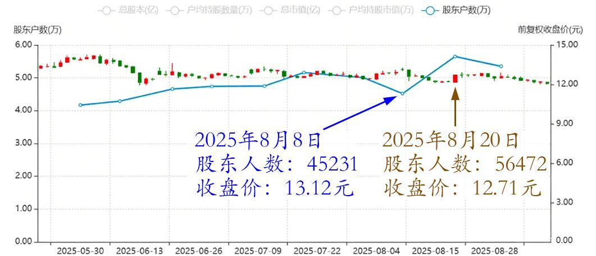
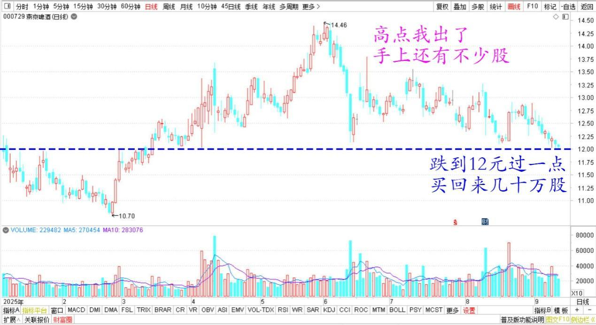
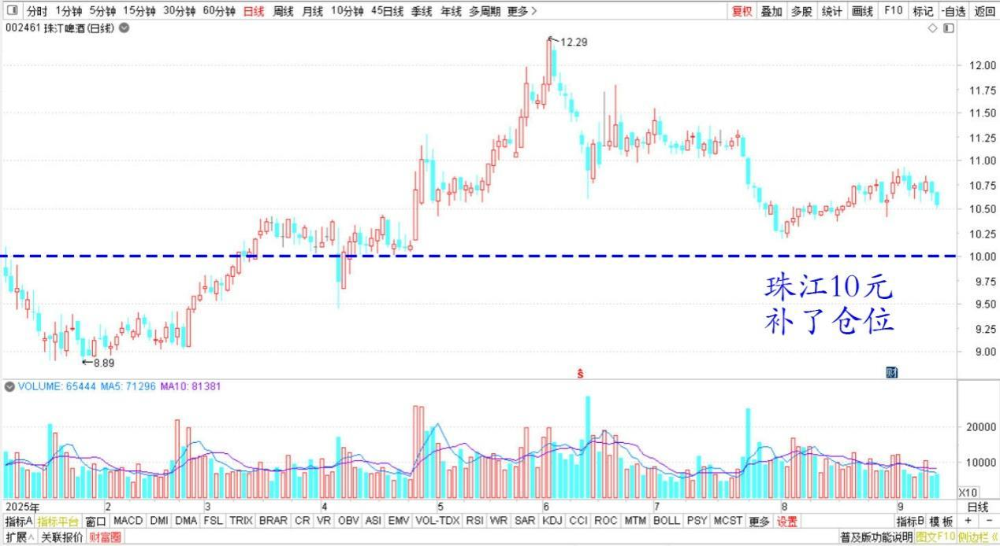

**179篇.燕京股东增多，人气逐步激活**

**清一山长**[2025-09-02 20:03](http://www.zhihu.com/pin/1946302251237873589)

刚看到燕京的股东人数，8月8日是45231人，收盘价格是13.12元。8月20日是56472人，增加了一万多人，股价是12.71元。这一天算是连续下跌后的大涨，应该有不少散户抛出了股票，可以推算8月19日以前的散户人数更多。

燕京啤酒2025年5月～8月股东人数与收盘价

**只跌了不到一块钱，就吸引来这么多的接盘手，可见燕京的人气逐步激活了。现在震荡，只是让这些获利盘尽量离开。往后应该会继续拉升的，现在的价格不高！**主力真厉害，我佩服至极，完全弄不赢他，只能玩高抛低吸。**虽然赚了钱，但靠的是运气好，不是眼光好。我常常看错。**

不过我现价也不准备买回来（高点我出了）。手上还有不少股，我想换点别的，更低价位的股票。其实跌到12元过一点的时候，我买回来几十万股了。我总认为现在的12元是个底部。珠江的10元也是底部位置。现在进的风险不大，涨了，也没必要补仓了，珠江10元，我是补了仓位的。用高位卖掉的燕京换的。三季报你们会看到仓位表的（如果没有涨的话）

燕京啤酒2025年日线图

珠江啤酒2025年日线图

**（标题、图片为编者所加）** **文章音频**：

[596篇.燕京股东增多，人气逐步激活](http://link.zhihu.com/?target=https%3A//www.ximalaya.com/sound/911273829)

**参考链接：**

[175篇.中粮糖业涨停，卖出退出十大](https://zhuanlan.zhihu.com/p/1946518083939336830)

[176篇.只拿本分的本金仓位，只赚本分的利息钱](https://zhuanlan.zhihu.com/p/1948022731460314408)

[177篇.只能赚认知范围内的利润](https://zhuanlan.zhihu.com/p/1948065037659910791)

[178篇.张清一是傻瓜？](https://zhuanlan.zhihu.com/p/1950663717466411770)

[链接汇总（截止2025年8月12日）](https://zhuanlan.zhihu.com/p/621215591)

