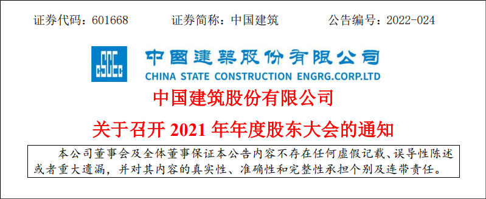
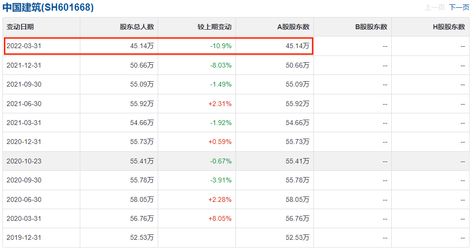
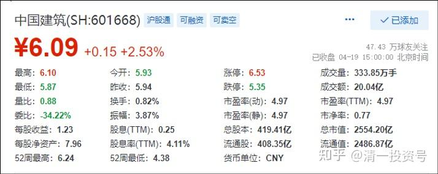
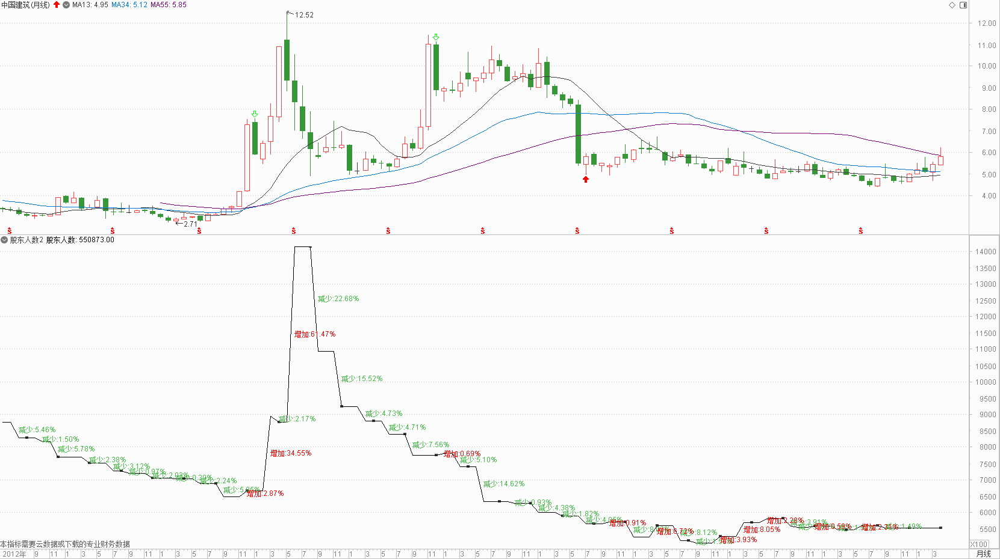
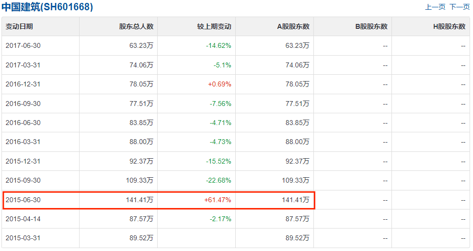
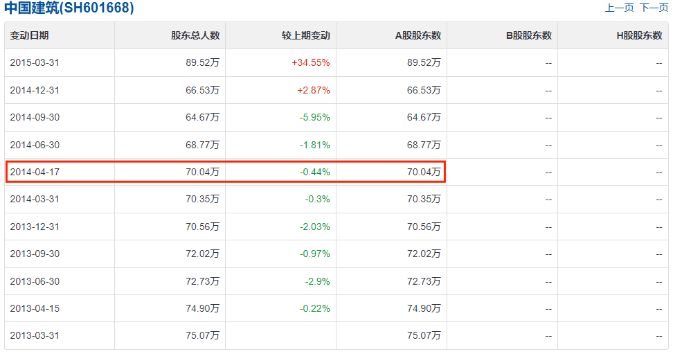
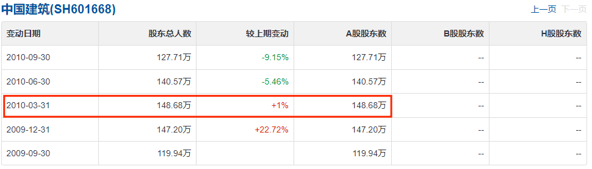

17篇.中建股东数历史新低

清一山长 2022年4月19日

很意外的发现：中国建筑的股东人数，只有45万了。最近几个月流失了10万人，是上市以来的最低人数。2010年最高的股东人数是148万人。2014年的最低点—上证2000点位置，中国建筑也有70万人。2015年的高点，中建也有140万人。现在，已经冲过了6元，居然股东只剩45万人了？**历史新低**。所以：中国建筑应该快真正的上涨了。**散户没有的股，就会大涨。散户多，主力就不拉升。**

我怀疑，燕京不涨真的怪我。吸引了大批散户，而且洗不掉。主力放弃了拉升[大笑]。当然，我认为这是笑话。

**附录：相关文章**

**整理文章 **[《第13篇中国建筑对话录：不养独子》 链接zhuanlan.zhihu.com/p/463971765](https://zhuanlan.zhihu.com/p/463971765)

**整理文章 **[《第19篇.涨停之际，谈我的啤酒股投资逻辑》 链接zhuanlan.zhihu.com/p/477378802](https://zhuanlan.zhihu.com/p/477911616)

