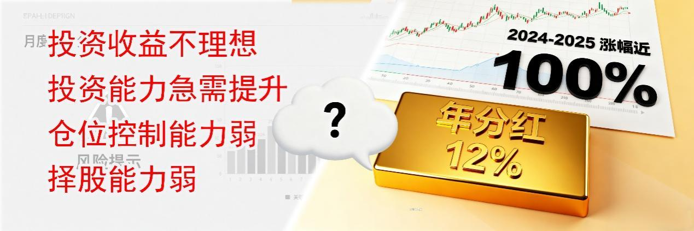
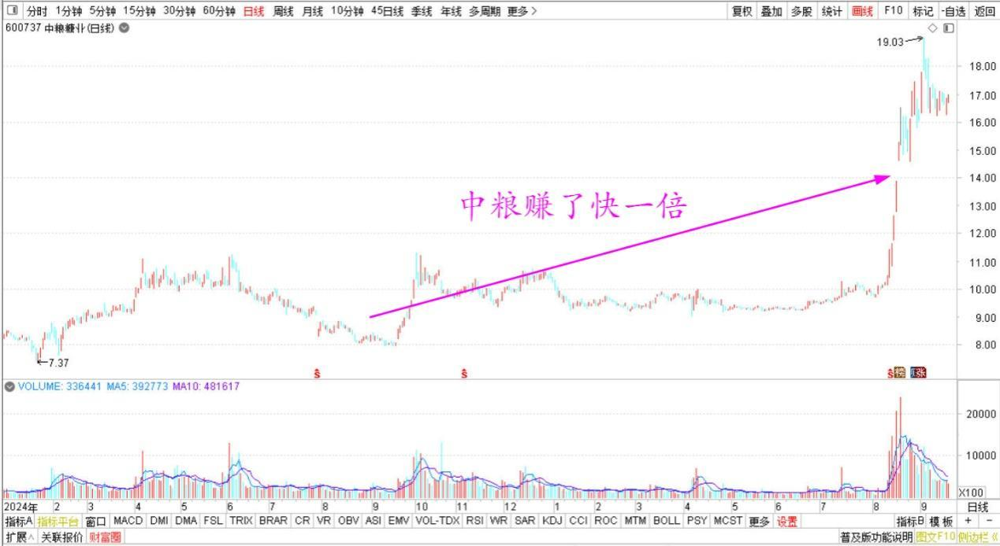
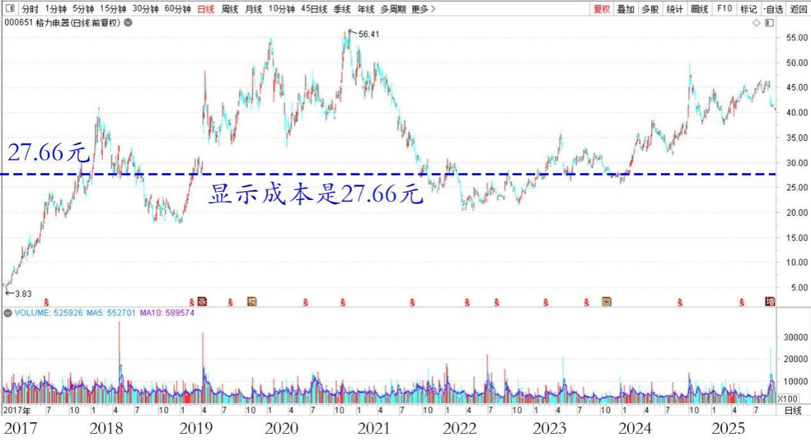

**180篇.听券商的话，会不会赔死？**

**清一山长**[2025年9月5日14:45](https://www.zhihu.com/pin/1947309329750430121)

我的月度账户分析：

我看了券商给我的月度账户分析，是这样的评价：“您的投资收益不理想，投资能力急需提升。主要是仓位控制能力和择股能力稍弱，应加强关注市场风险变化。做好仓位管理，注意回避市场整体下跌的风险。

投资的食品加工行业近一年涨幅跑输24.03%的行业（我的中粮赚了快一倍了呢！）。应加强对行业和个股的研究，提高选股成功率。不适宜盲目买入股票。”

中粮糖业2024～2025年日线图

我去——原来连券商都是清黑。

我真听它的话，我会不会赔死？

券商评估报告，真是常有理。

**我猜：在券商系统看来，任何人都是投资有问题的人，都有毛病。就是他们自己没有毛病，但他们自己赚到钱没有？**

我看券商只会赚手续费，投资收入很差的，不然也不会给我借款买股才收3%的利息了。

**我的这个账户上，还有十几万股格力电器，我看显示成本是27.66元一股，每股分红三元。我长期持有的话，每年利息都是12%了，我融资长期这些股份的话，等于用3%的银行利息，拿了9%的无风险利润。**就这样，券商系统还说我不会投资。我跟它学——我把钱给你赚3%的贷款利息？你自己去拿12%吗？这清黑怎么教人的？害人害己！（当然，如果前段时间把它49元多卖掉，现在41元再买进来，我就更划算了）。利息不少收，还赚了差价！

格力电器2017～2025年日线图

可能清黑券商嫌弃我操作不够快，没抓机会，坐了过山车。

我认真思考一下券商清黑对我的批评，其实是对的！

就两个问题：

第一是仓位控制能力差。的确差，这几年全是满仓满融，哪有啥仓位控制。从来不空仓，违背了专家们的指导——必须控制仓位……我涨跌都只能随大流，坐过山车。

第二个问题是择股能力差。还专门提到了食品行业是我重仓，但收益很差。事实上也是真的，**我拿中粮的时候，都没有人买它。我拿了就是准备放10年的！我买的股票，全是冷门，根本就不热，市场上没有人要的垃圾。**

估计这个评价是中粮上涨之前给出来的。也许过一个月再来评价，我就是股神了！

所以，清黑看起来说的，还是有事实依据的。可是综合起来看，总有点不对！

我这么差，怎么实现30年万倍的呢？清黑券商是不是该改改你们的评价系统了？也许你是用普通散户的眼光来看我。你们评价体系，只适合99%的散户，不适合我这种1%的怪人！

**（标题、图片为编者所加）** **文章音频**：

[597篇.听券商的话，会不会赔死？](http://link.zhihu.com/?target=https%3A//www.ximalaya.com/sound/913488430)

**参考链接：**

[175篇.中粮糖业涨停，卖出退出十大](https://zhuanlan.zhihu.com/p/1946518083939336830)

[176篇.只拿本分的本金仓位，只赚本分的利息钱](https://zhuanlan.zhihu.com/p/1948022731460314408)

[177篇.只能赚认知范围内的利润](https://zhuanlan.zhihu.com/p/1948065037659910791)

[178篇.张清一是傻瓜？](https://zhuanlan.zhihu.com/p/1950663717466411770)

[179篇.燕京股东增多，人气逐步激活](https://zhuanlan.zhihu.com/p/1951677642467156967)

[链接汇总（截止2025年9月1日）](https://zhuanlan.zhihu.com/p/621215591)

