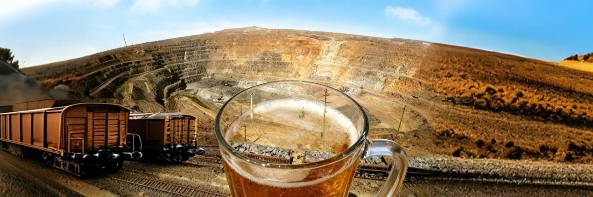
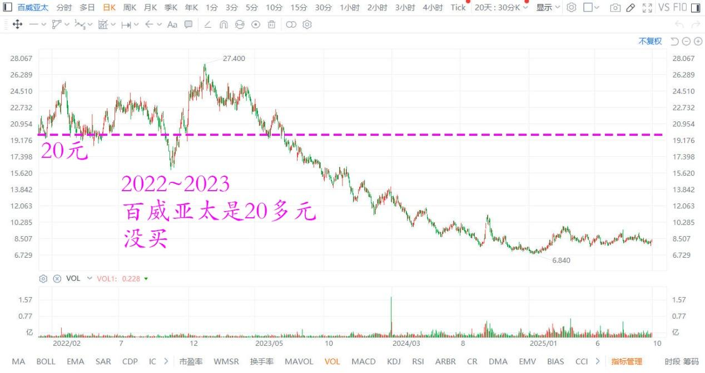
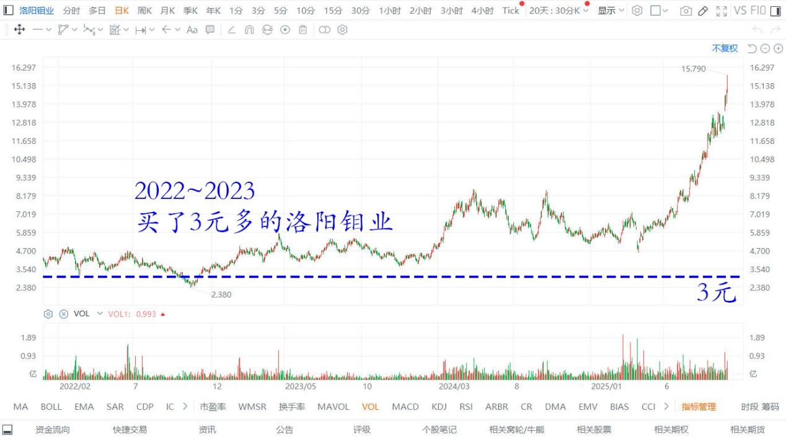
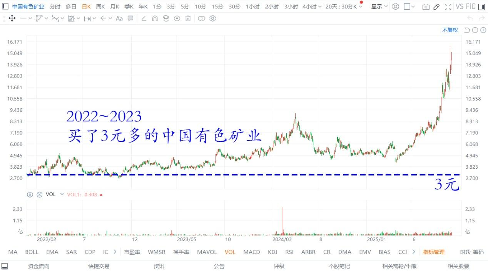
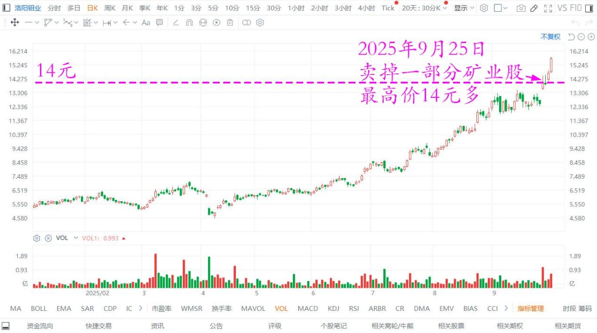
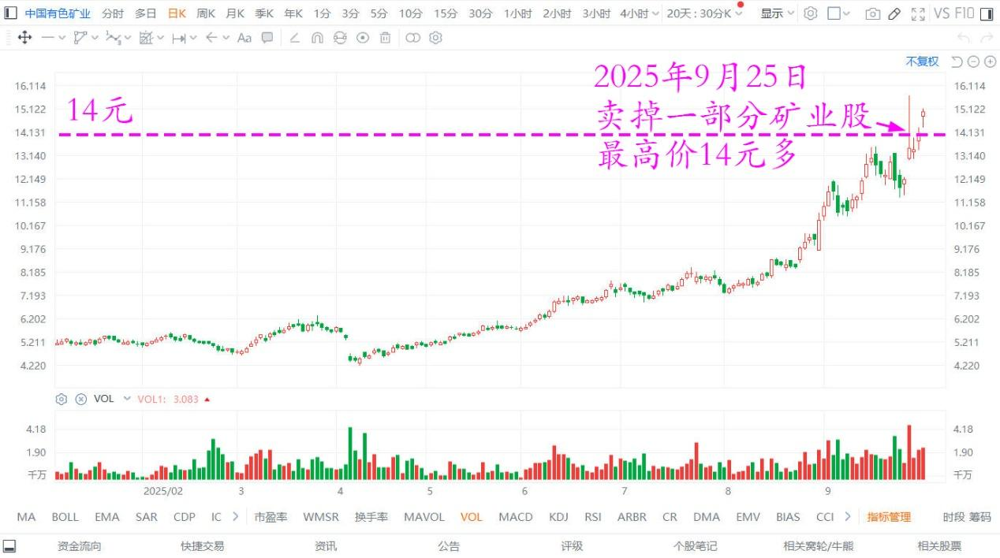
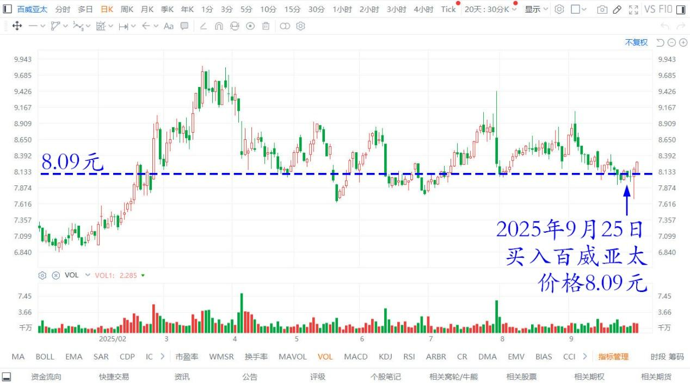
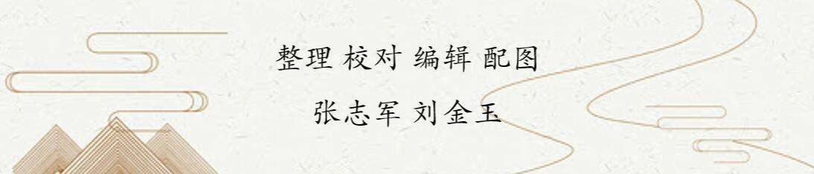

184篇.卖矿买啤酒，啤酒也是矿

[清一山长](https://www.zhihu.com/people/shan-chang-qing-yi) [2025年9月25日10:11](https://www.zhihu.com/pin/1954488124823560560)

股市真的很疯狂。两三年前，百威亚太是20多元，我没买。我买了3元多的洛阳钼业，也买了三元多的中国有色矿业。

百威亚太2022～2025日线图

洛阳钼业2022～2025日线图

中国有色矿业2022～2025年日线图

当年我一直呼吁粉丝们买有色，我也买了很多，还借钱去买了！我说：“全世界的票子都印多了，我们买点实物会更靠谱一些，拿钞票最不靠谱。**钞票不是财富，我们要换成财富**。”

我的话，一般总是不被人相信。有色股当年看上去就像要破产，等了几年，这个逻辑才应验。

今天，我最高价是14元多，卖掉一部分矿业股，每股赚了超过10元。有色大赚，让我的账户再创新高。**我根本没有想到会这么赚的，只是想逃过通货膨胀就行了**！今天居然是有色狂涨！会不会涨过20元？天知道。我不明白市场先生会有多疯。

洛阳钼业2025年日线图

中国有色矿业2025年日线图

然后我买了8.09港元百威亚太。

百威亚太2025年日线图

**我不知道我是对的、还是错的，反正我只要便宜的。**

**啤酒也是矿——每年都在产出净现金流的欲望之矿。万一哪天又发疯、涨回原地，我是不是又赚了？**

**（标题、图片为编者所加）** **文章音频**：

[601篇.卖矿买啤酒，啤酒也是矿](http://link.zhihu.com/?target=https%3A//www.ximalaya.com/sound/917640715)

**参考链接：**

[180篇.听券商的话，会不会赔死？](https://zhuanlan.zhihu.com/p/1953143141692605509)

[181篇.白银有色：中国股民真蠢！](https://zhuanlan.zhihu.com/p/1954398004627894953?utm_psn=1956920188550230942)

[182篇.投资就是认错的艺术和技术](https://zhuanlan.zhihu.com/p/1955773035073210008?utm_psn=1956920040768139542)

[183篇.抢钱游戏，傻人有傻福](https://zhuanlan.zhihu.com/p/1956918511621345947)

[链接汇总（截止2025年9月12日）](https://zhuanlan.zhihu.com/p/621215591)

开启送礼物
