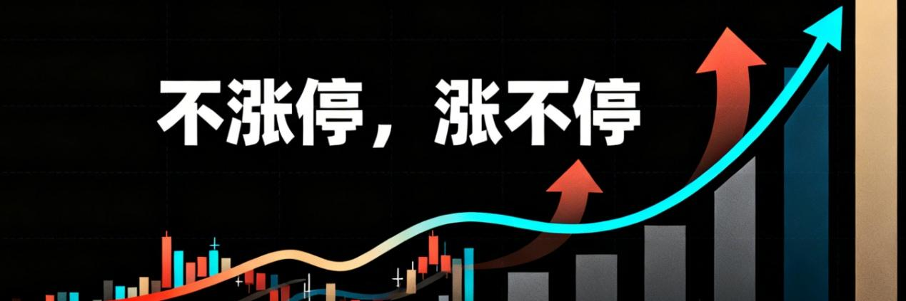
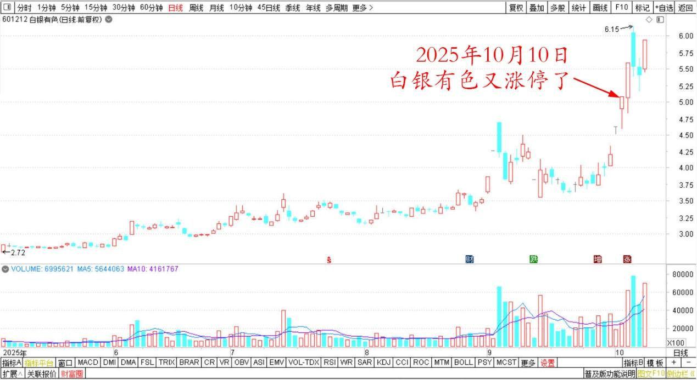
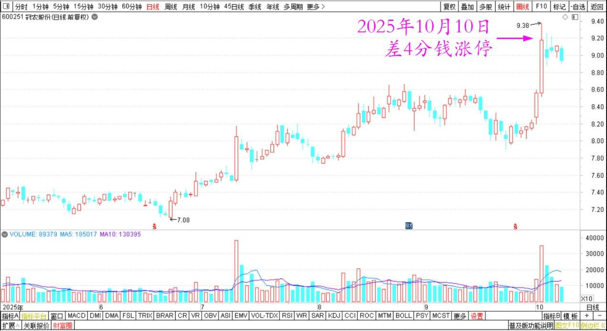
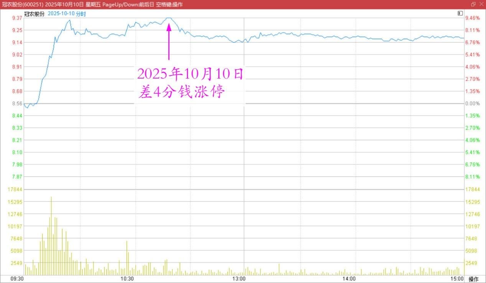
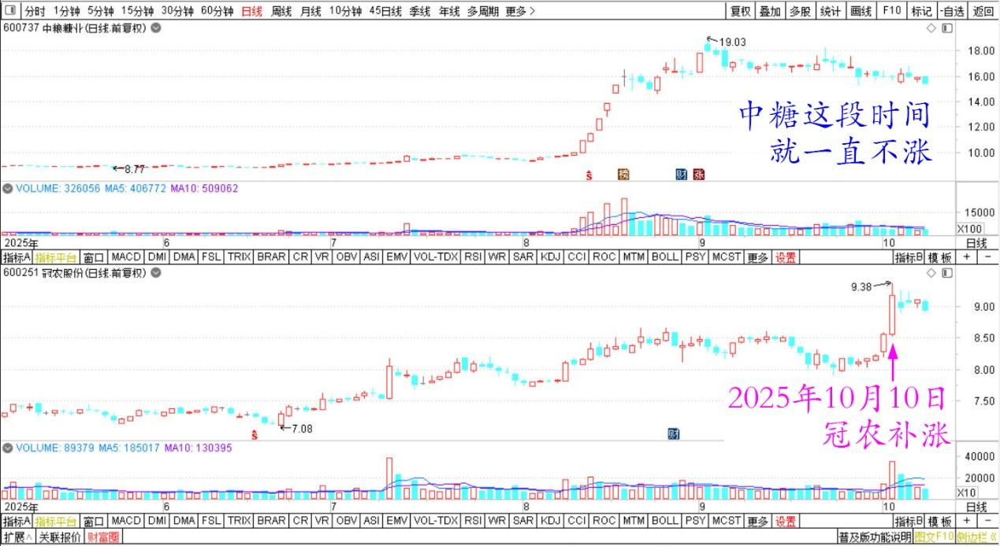

189篇.白银涨停，冠农不涨停

**清一山长[2025年10月10日11:24](https://www.zhihu.com/pin/1959942267721749670)**

白银有色今天又涨停了[惊喜][惊喜]

白银有色2025年5月～10月日线图

不过，今天为我带来最大利润的是冠农股份。在昨日取得突破的基础上，今天居然差4分钱就涨停了。其实昨天是右侧买入的最佳机会，但我是左侧投资者，就没有去抢，只是拿它来分析了一下。告诉大家缩量上涨了，主力已经控盘。果然，今天就大涨了。不过，今天不涨停是好事，一早就拉涨停的话，会吓得我赶快跑掉的。

冠农股份2025年5月～10月日线图

冠农股份2025年10月10日分时图

**“不涨停，涨不停**。”这就是股谚。老股民都知道。

很多人以为是顺口溜，说了玩的。其实是对人心深刻的把握。主力故意用不涨停，甚至快速拉涨之后，还缓慢下跌一点，来让一些信心不坚定的获利筹码，赶快趁机套现离场。如果一早就急拉涨停的话，过于强势，反而吸引了一堆人跑来跟风，不利于以后的长期上涨。我认为是主力想要快速兑现的手法，我就会跑掉了。（当然，这样做也未必是对的，中糖我就是吃了这个亏——看它急涨，我就赶快跑掉了，没有跑掉的部分后来反而多赚了很多。）

因此目前冠农这样不涨停的局面，就意味着未来可能有更大的空间和机会！我连账户都懒得打开。

我的冠农的仓位大幅增加，说来话长，是个意外。我新买入的大多数冠农仓位，都是我在痛苦地卖出中糖之后，舍不得放弃新疆概念股。我忍痛换仓8元前后买入的（基础仓位成本才7元）。由于中糖我就只做了一个季度的十大，就灰溜溜地被主力踢出去了。内心实在很难过，就去抢了冠农的三大来当。在冠农十大还占了两个位置，总仓位比中糖高得多。这样才勉强安慰一下自己，不至于因为失去了中糖而痛苦。

但也真心没有想到：中糖这段时间就一直不涨。但冠农现在就补涨了。算起来——涨幅已经基本弥补了中糖我提前卖出带来的一点点小遗憾。

中粮糖业、冠农股份2025年5月～10月日线图

因此，**别为自己没有得到的忧心。如果该你的，换一个你也能得到一样的，甚至更好的。**

**如果不该你的，祝福得到的人就好了！不需要去嫉妒他人**。

谢谢大家！

**（标题、图片为编者所加）**

文章音频：

[606篇.白银涨停，冠农不涨停](http://link.zhihu.com/?target=https%3A//www.ximalaya.com/sound/923673692)

**参考链接：**

[183篇.抢钱游戏，傻人有傻福](https://zhuanlan.zhihu.com/p/1956918511621345947)

[184篇.卖矿买啤酒，啤酒也是矿](https://zhuanlan.zhihu.com/p/1958174319248152048)

[185篇.有色逻辑得验证，和大家反过来走](https://zhuanlan.zhihu.com/p/1958220089020097164)

[186篇.用涨了的矿，换低位的矿](https://zhuanlan.zhihu.com/p/1960840960616399003)

[187篇.在绝望的时候进场，随欢呼的浪潮退场](https://zhuanlan.zhihu.com/p/1961858710361047662)

[188篇.冠农的技术图形与走势](https://zhuanlan.zhihu.com/p/1963456936990204416)

[链接汇总（截止2025年10月9日）](https://zhuanlan.zhihu.com/p/621215591)

