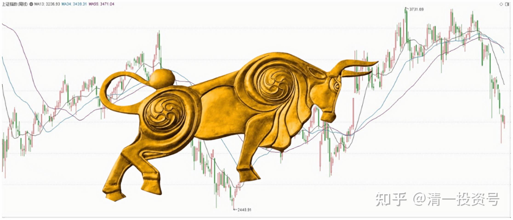
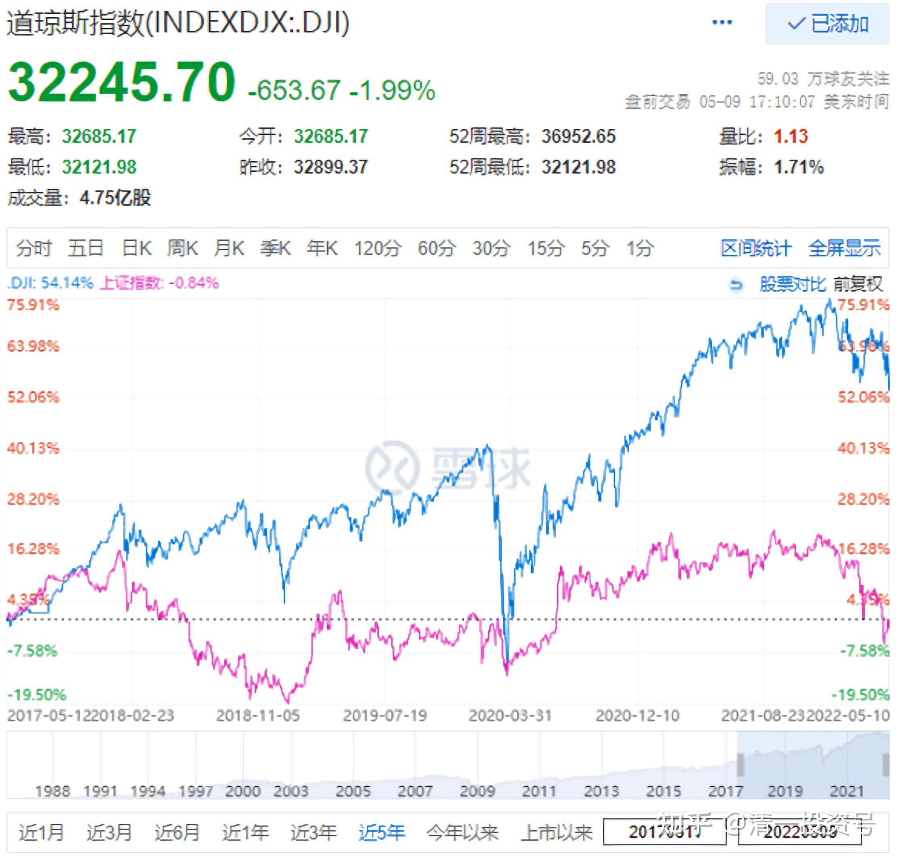
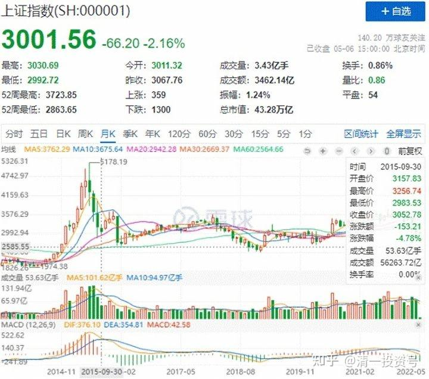
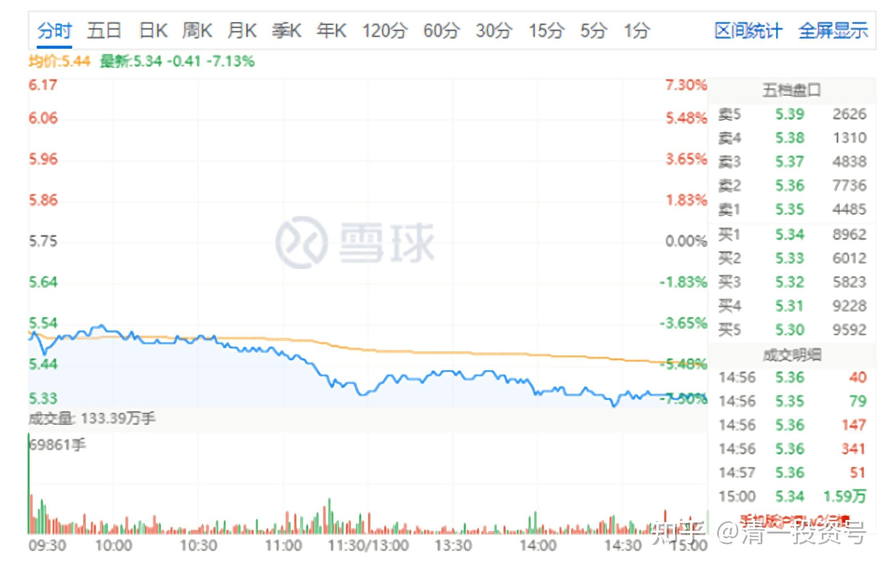
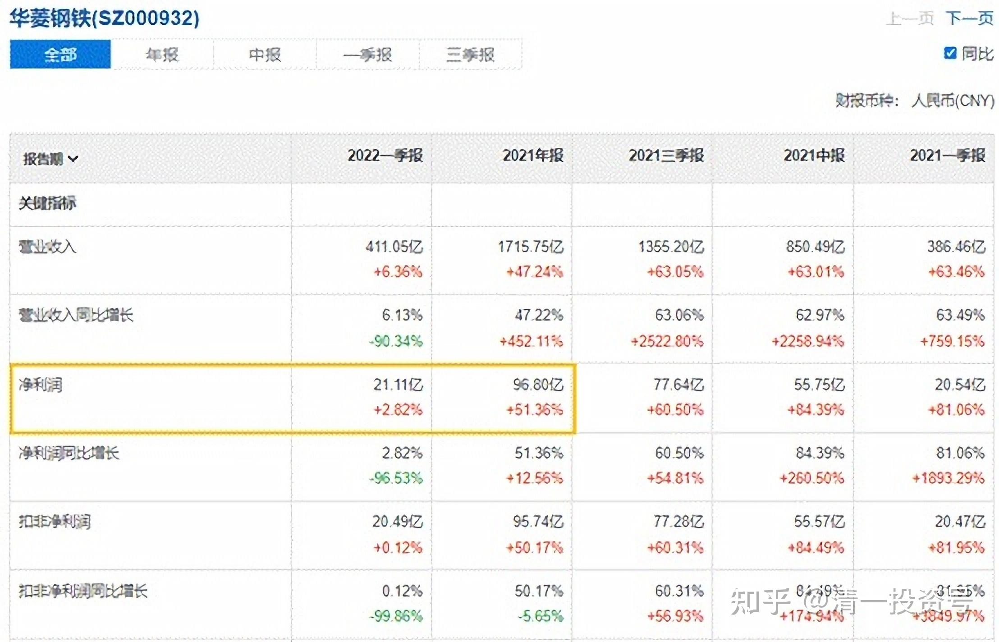
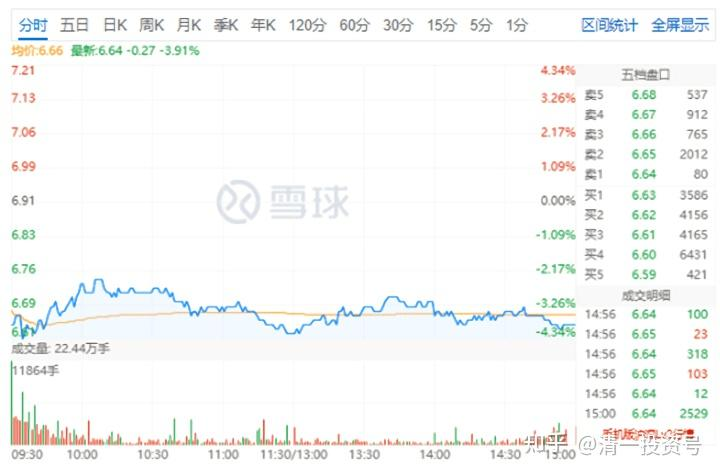
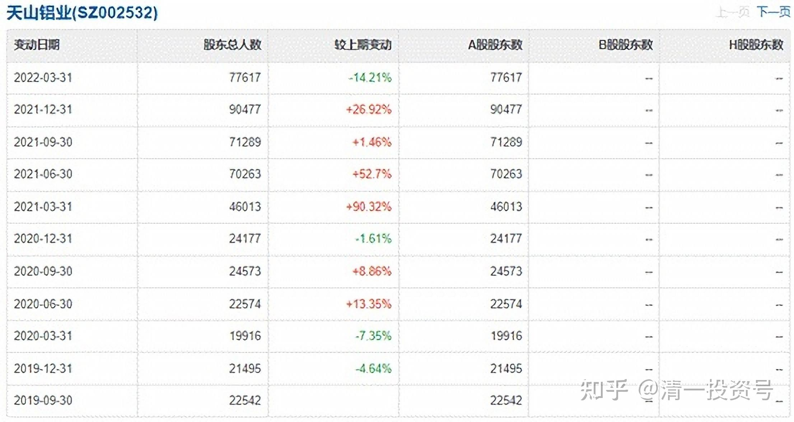

18篇.全面狂跌中如何独善其身

清一山长 2022年5月6日

**大家小心了，最近市场会有一些震荡。**但总体来看，是中国股市快要有动作了：美股开始巨幅震荡，上一周末，美股大跌接近1000点。之后，周三晚上突然大涨接近一千点。**美股一涨，中国股就要下跌。**所以昨天的股市走势不好，一些指标股也下跌了。中国建筑也下跌了。但这只是美股的回光返照，昨天晚上，突然又大跌一千多点。如果所料不差，今天A股的分化会很明显，一些赛道股又要大跌，但一些国家队，应该又要涨了。比如中国建筑。这一次美股高位的时候，还要加息的时候，中国政府成功地让A股跌破3000点，回到15年前的位置，让人感叹中国股市15年不涨，这是何种手段[赞]！把A股成功地压在地面上，看美股疯。**现在美股大跌，中国股市正好开启慢牛，吸引全世界的资金来中国，中国就抢走了美股的“铸币权”。**

2018年年初，我就一直在等这一天，可能今天真的开启了。美国资金利用和制造金融危机，大肆洗劫全世界。但中国用趴在地上的模式，用使劲压大蓝筹的模式，避免了跟随美股狂跌，让美国无法收割中国的股民。反而资金涌入，就必定上涨。这是国家干预才有可能的结果，其他国家跟随美股，一样会大跌的，会陷入不景气，从而全球金融危机开启。而中国反而可以成为一个优等生的榜样，稳定发展，从而吸引全世界的资金进入。

狂跌其实也可以制造利润的，我的泰股在高位卖出后，也等了很久，就等美股崩。现在不知道是否等来了最好的时机？也许今天晚上，是美股的黑色星期五，它已经连续两个周五大跌接近千点了。今晚如果继续大跌，美股就开始用下跌来收割世界了。但很多资金会逃跑来中国或者香港。**前段时间香港的大蓝筹，中铁等都在涨出近期高点，说明了资金的流向。**美国今晚救市不成功的话，下周就可能狂泻了。欧洲被乌克兰打烂了经济，涨绝对没道理，也只有跟随狂跌的，**只有中国独善其身。**

修改一下预测：美股很疯，也许今天来一个千点大涨，就恢复人的心态了——美股果然强悍，还是投美股。过去四年，我已经发现每次美股快死的时候，大跌千点的时候，总有一股力量把它拉起来。虽然基本面根本就不配合，但别人就是能涨，还能不断创新高。有啥脾气？**我们就只能等了，反正时间在我们这边，耐心没啥不好的。**中国越等下去，美国的情况只会越差，我们的情况只会越好。再等一年，不到两年，华为都要“满血复活”了。[大笑]

*（道指与上证同期对比，蓝色线为道指，红色线为上证）*

山长清一 2022/5/6 15:14:12

幸亏上次中建上涨，我减了仓，不贪心，今天才有钱买股。今天华菱钢铁跌惨了，都快奔跌停去了。我5.35元买了一百万股。我的华菱本来是赚钱的，现在都变绿了。我买的道理：**它是除了宝钢之外最赚钱的钢企，但市值仅仅是宝钢的零头**[滴汗]，你觉得这正常吗？她的2021年利润创历史新高，2022年一季度的利润，也创历史新高。它的股价，却从最高点9元多跌到快腰斩。你认为合理吗？另外，船运周期到来，船用钢板它家的最强。怎么说，都不应该跌成这个样子。所以我就出手了，再跌再买。

转发帖子：

2022Q1归母净利润创同期新高水平：2021年公司品种钢销量不断提升，占比提高到55%，同比+3PCT，2021年公司归母净利润创历史新高水平，2022Q1归母净利润创同期新高水平

作者：华菱钢铁(SZ000932)

相关链接：[https://xueqiu.com/S/SZ000932/219197097](http://link.zhihu.com/?target=https%3A//xueqiu.com/S/SZ000932/219197097)

*华菱钢铁2022年5月6日*

山长 清一2022/5/6 15:24:25

今天还买了天山铝业，6.65元买了30万股。这个股很奇怪：2021年一月，它的股东数才2万，一季度就4万，到了四季度，居然股东数9万了。说明一路上主力派发，都给了散户了。现在股价，又跌回2021年启动之前的股价了。我现在买入，等于是当时主力持仓的价格，不妙之处是股东数7万。所以，主力会不会继续用时间换空间？低位磨上个几年？让散户割肉离场？或者是——涨一点让散户离场？我也算不清楚。

只是我认为：未来美元就是一张纸。如果我是有钱人，我绝对不要美元，我宁肯买上一些铝锭，放上几十年都可以，保证不会贬值。谁的货币我都不放心，铝锭就是能源的聚合品，能源上涨，它就上涨。所以，当钱存起来肯定没错。**如果我所料不差，今年一些国家，都会启动“战略储备”的，会买入各种金属存起来当钱用，反正不能存在美联储了。一张纸，还说翻脸就翻脸，是在靠不住。现在没有谁的货币靠得住的话，就只有学古代了——金银才值钱。其实也没这么多的金银，就买金属吧！这就是我的投资观念。**错没错？不知道。除了金钼股份，以及洛阳钼业，我的其他金属股是绿色的，也许我错了。但买金属，总比存啤酒更值钱吧？啤酒有保质期，金属没有，放上几十年的铝锭，照样用。

*天山铝业 2022年5月6日*

相关文章：

[清一投资号：14篇.华菱钢铁涨停](https://zhuanlan.zhihu.com/p/497049665)

[清一投资号：11篇.金融战开打了](https://zhuanlan.zhihu.com/p/485173866)

[清一投资号：6篇.A股与美股的微妙关系](https://zhuanlan.zhihu.com/p/513063583)

