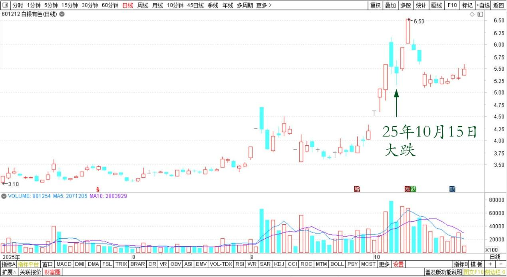
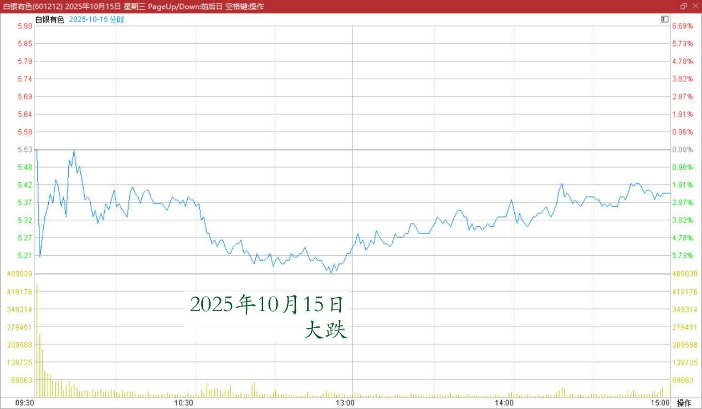
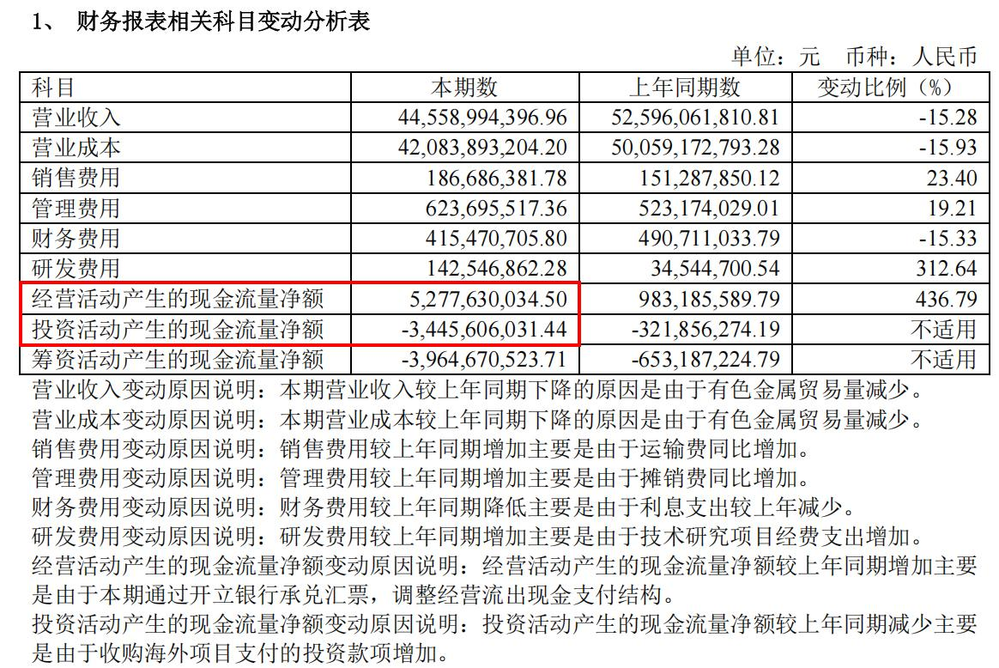
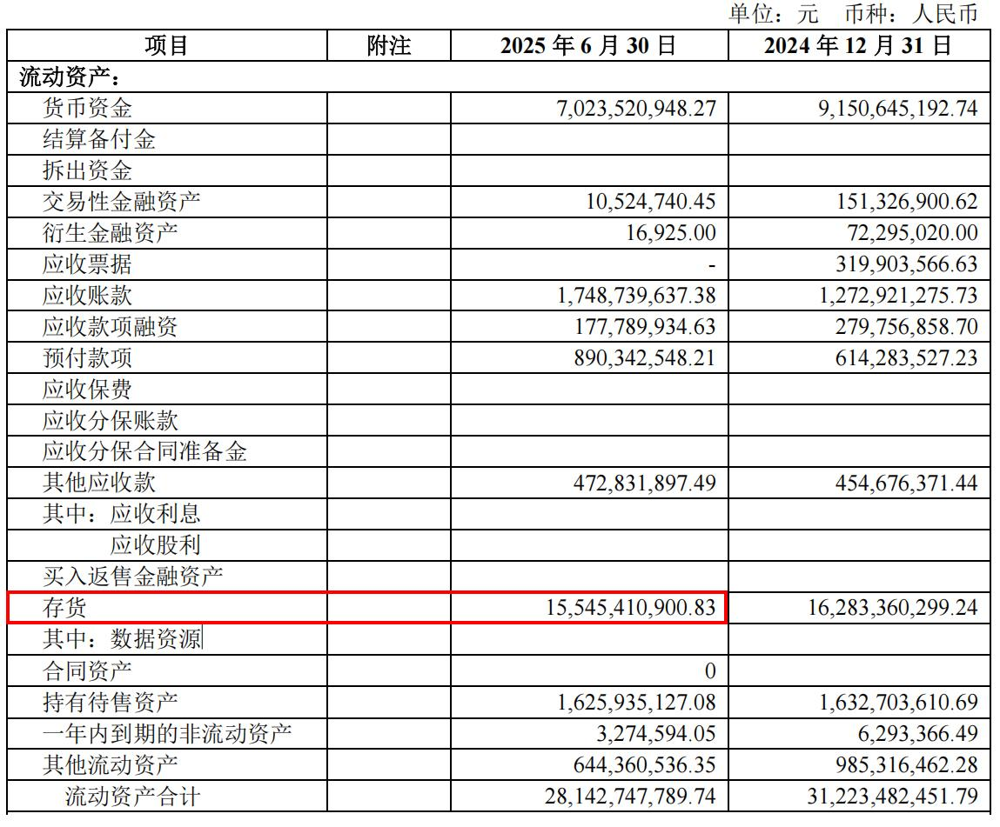

**194篇.白银的应对方式，不动**

**清一山长 **[2025年10月15日13:54](https://www.zhihu.com/pin/1961792137696883302)** 云南**

白银大跌？

我原来就卖飞了半天？

白银有色2025年7月～10月日线图

白银有色2025年10月15日分时图

白银有色好像运气特别不好，刚一涨，就有官方出来打压，结果大跌。

白银企业官方还专门出来说，白银企业效应不好，还亏损严重，都是负收益。而且大股东还质押98%（这都拿出来说了），大股东都没钱，快破产了！

可是，我注意到，**上半年的净现金流量是52亿，投资流量是负数。**

白银有色2025半年报相关科目变动分析表

**还有，存货是152亿，现在有色都在涨，这存货，不更值钱了吗？**

白银有色2025半年报流动资产

我是不是先把卖飞的部分接回来呀？

现在的走势，特别像出货。

就因为像，所以，也可能是主力故意让你知道，故意让你跑的！

当然，也可能是游资几日游，完了就跑掉！

是啥？不知道！

**不知道的最佳应对方式，就是不动。**

**（标题、图片为编者所加）**

文章音频：

[611篇.白银的应对方式，不动](http://link.zhihu.com/?target=https%3A//www.ximalaya.com/sound/929694654)

**参考链接：**

[188篇.冠农的技术图形与走势](https://zhuanlan.zhihu.com/p/1963456936990204416)

[189篇.白银涨停，冠农不涨停](https://zhuanlan.zhihu.com/p/82013845894)

[190篇.是狼还是羊？](https://zhuanlan.zhihu.com/p/1965856208259900157)

[191篇.今天上了白银主力的当](https://zhuanlan.zhihu.com/p/1967003445232918755)

[192篇.历史上中金涨得比白银更疯](https://zhuanlan.zhihu.com/p/1968290682704749393)

[193篇.有色也能涨十倍？](https://zhuanlan.zhihu.com/p/1968311311009030155)

[链接汇总（截止2025年10月15日）](https://zhuanlan.zhihu.com/p/621215591?utm_psn=1967007144831350474)

