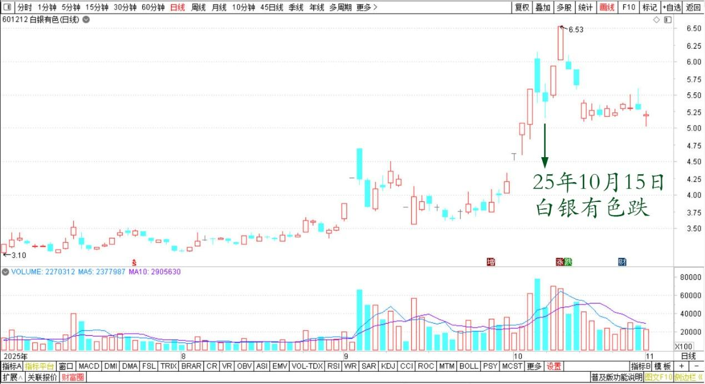
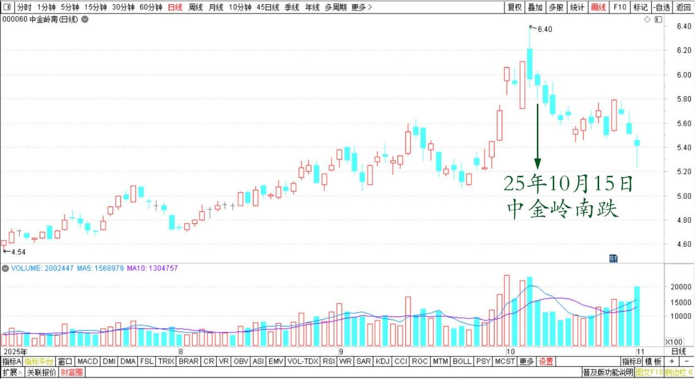
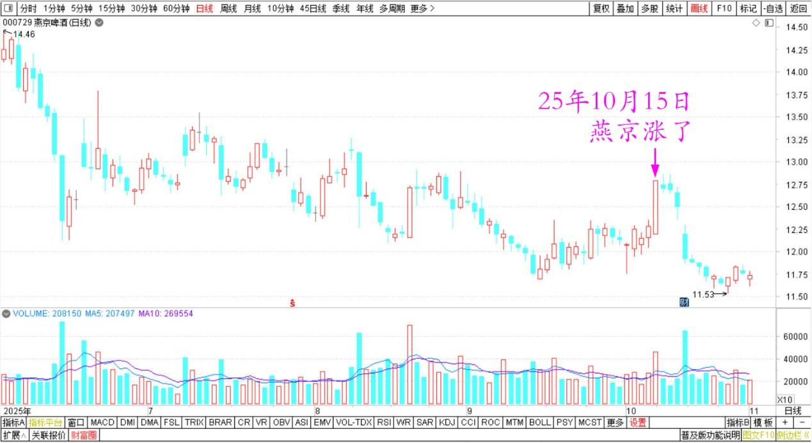
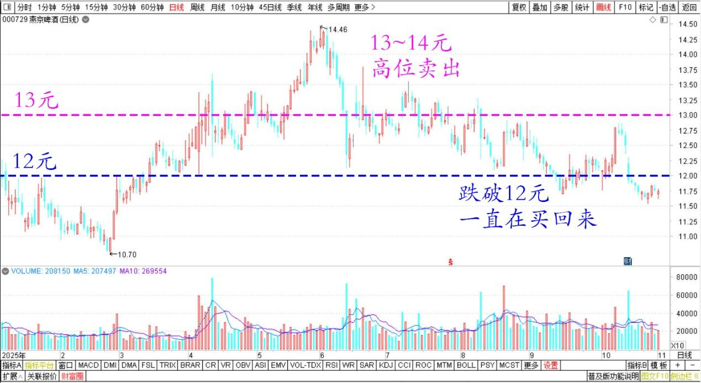

**195篇.今天尝试新股**

**清一山长**[2025年10月15日14:24](https://www.zhihu.com/pin/1961799688266191074)

今天上午关注有色，我以为今天我的账户肯定跌惨了。刚刚打开账户一看：怎么又创新高了？比昨天赚的还多？国庆以来天天赚呀？

白银有色2025年7月～10月日线图

中金岭南2025年7月～10月日线图

再仔细看盘。原来是燕京涨了——这股跌破12元，我就一直在买回来我原来13～14高位卖掉的持仓。我不怕它跌，就怕它涨。现在又接近13元了。有本事再涨我再抛，反正就是低价白白捡到的货！

燕京啤酒2025年6月～10月日线图

燕京啤酒2025年日线图

今天打开账户，是想买一个新股，我从来没有买过的股。平台公司，主要就是观察到这只股的股东人数一直在减少……这种股，嗯……我有兴趣。

今天就买了个观察仓，一百万股！

正好把今天一天股市送给我的涨幅吃掉了。也就是说，今天股市送了我一百万股某股。这是一个我从来没有关注过的行业，我觉得我也该扩大一下自己的经验范围了。别老是买过去熟悉的公司，也要接触新事物。

**（标题、图片为编者所加）**

文章音频：

[612篇.今天尝试新股](http://link.zhihu.com/?target=https%3A//www.ximalaya.com/sound/929694800)

**参考链接：**

[188篇.冠农的技术图形与走势](https://zhuanlan.zhihu.com/p/1963456936990204416)

[189篇.白银涨停，冠农不涨停](https://zhuanlan.zhihu.com/p/82013845894)

[190篇.是狼还是羊？](https://zhuanlan.zhihu.com/p/1965856208259900157)

[191篇.今天上了白银主力的当](https://zhuanlan.zhihu.com/p/1967003445232918755)

[192篇.历史上中金涨得比白银更疯](https://zhuanlan.zhihu.com/p/1968290682704749393)

[193篇.有色也能涨十倍？](https://zhuanlan.zhihu.com/p/1968311311009030155)

[194篇.白银的应对方式，不动](https://zhuanlan.zhihu.com/p/1968324499964425974)

[链接汇总（截止2025年10月15日）](https://zhuanlan.zhihu.com/p/621215591?utm_psn=1967007144831350474)

