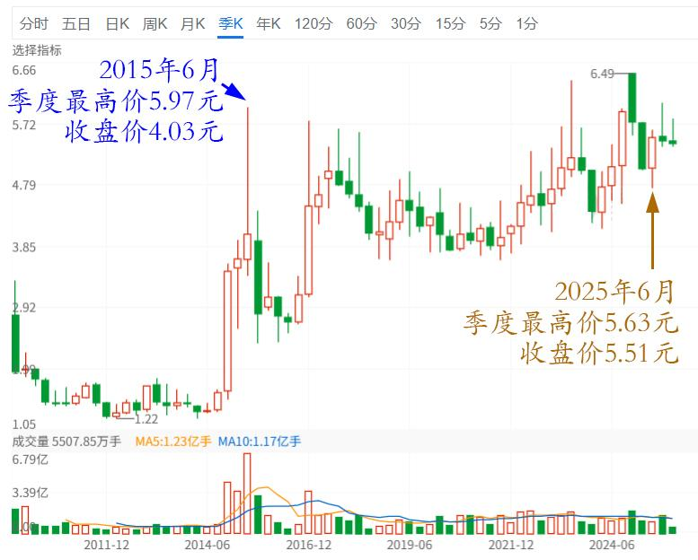
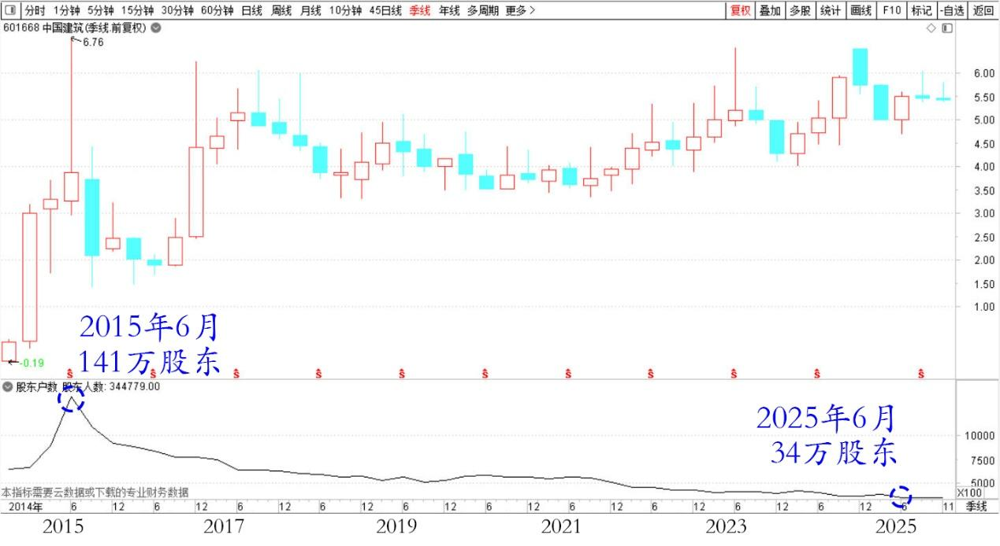
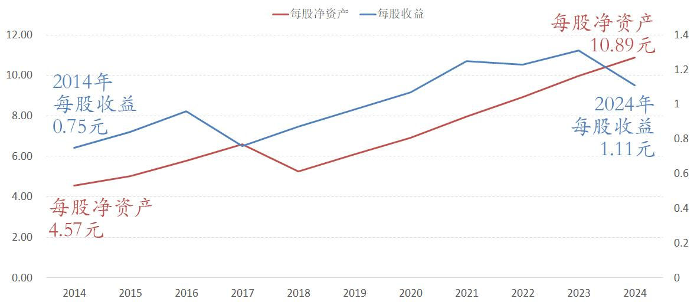
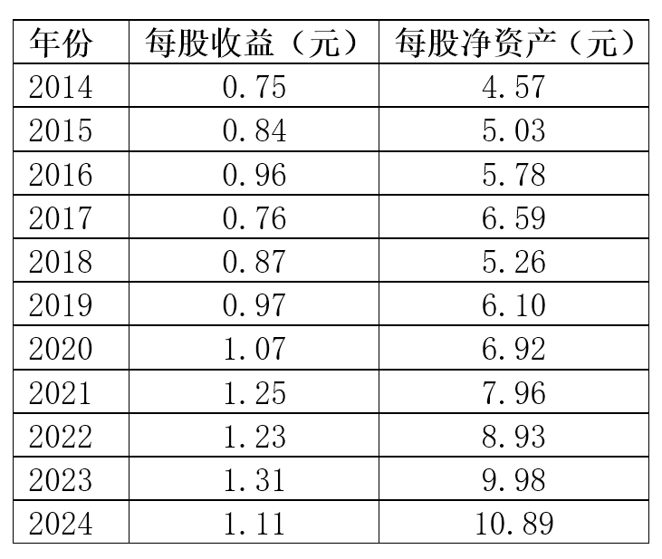
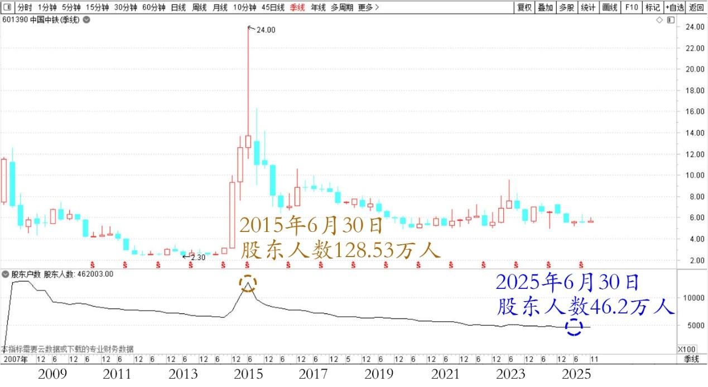
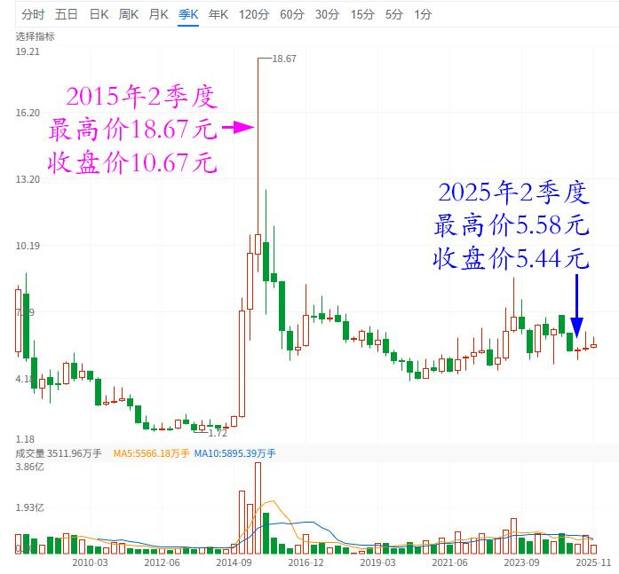
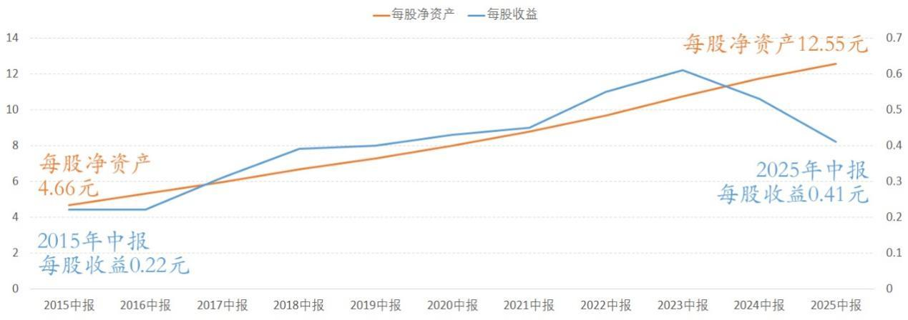
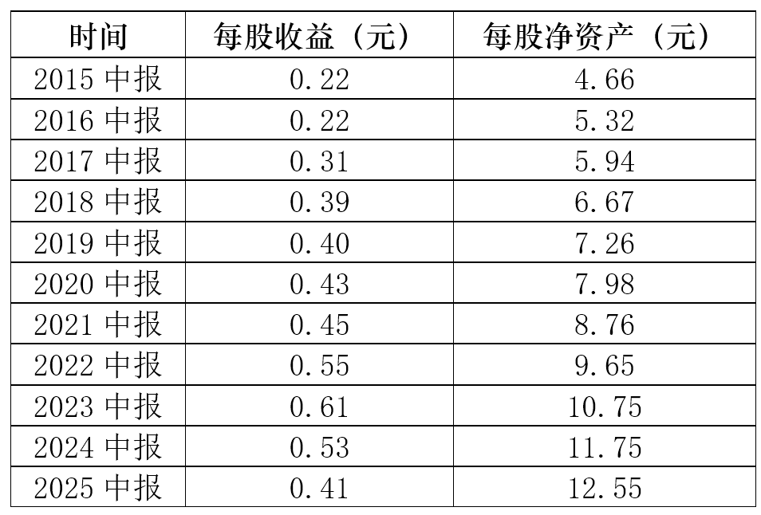
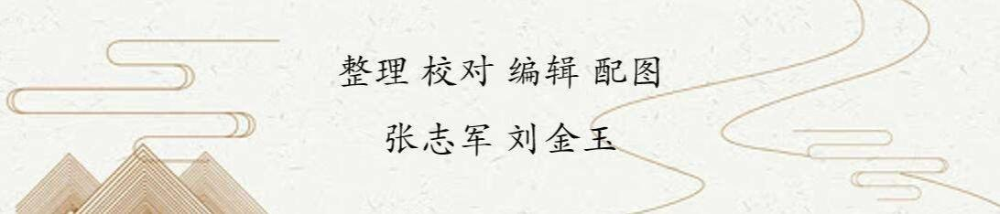

196篇.清一公社：为何绩优股10年不赚钱？（配图版）

**清一山长**[2025年10月16日16:55](https://www.zhihu.com/pin/1962170785683740420)

**清一公社**的社员，每个月都享有相当于一个上海工人的基本月收入的分红。大致上是分红率3.3%的样子，分红金额还会随着工资的上涨同步上涨，永无匮乏。

仅仅这一条，就超过了99%的金融产品。更别提清一公社社员还有超级的其他福利待遇了（申请入读私立名校的赞助，养老和医疗资助等等）。甚至这份基金，还能跨越时空，将来把钱发到你的子孙后代手里。这个难度就更大了，可以说全世界独一无二，连马云都没有这个福气。如果提供了这种产品，你的子孙后代剩下来就财务自由了，当然就让利益集团没有了牛羊。这怎么行？因此，实际上它是一个亿万身价都得不到的大宝贝！

可是，还是有人贪心不足，想要更多的收益。因为，这些人不知道**这份社员资格是一份久期100年的长期保证，是一个亿万资产买不来的机会。**他们居然把清一公社基金当作是一份“承诺高回报”的投资，而且，这些人比较的对象，是我的私人账户过去34年的增值空间！想要得到这一份收益。实话实说，谁敢这样来承诺收益的话，谁就是骗子！现在连银行贷款给客户，都只敢要2.3%的利息。你们存款给你个1.8%还算照顾客户，银行都不敢给你超过3%的利息，你却要我给你30%的年息？

由于我的账户业绩，基本上做到了10年10倍（2005～2008年十倍，2008～2015年，又是10倍。2015～2025，也有10倍了）。最新的收益，是最近一年我的账户收益57%。的确远远超过一般人。

因此，一些公社的社员们就认为：他们“入股公社”后，也要取得这个业绩，现在就开始做梦怎样分这笔钱了！以为高收益是理所当然的！其实，连我都没有信心做到这一点。

**我也只希望：将来一百年，我的账户每年都能够锁定不低于3%的确定性收益，就真的要感谢上帝了。**银行的总资产回报率，10年前还有1.5%左右，现在这几年，我看都只剩下0.75%左右了，相当的低！我要敢给银行资金3.3%的利息，行长都恨不得给我下跪了！

**因为过去不等于未来。**

**金融市场是很无情的。10年十倍，20年百倍，真的需要巨大的运气和机会。绝对不是你们以为的理所当然。买了劣质股，持有十年，你们就归零了。**

至于连续在中国A股市场活了20年的人，依然保持盈利的人，还剩下1%有没有？你们谁认识身边有连续投资20年，把自有资金的90%都放在股市上，长期满仓20年以上的成功投资人有没有？我身边连一个人都没有——除了我。你们更别说20年还拿到百倍、千倍回报的高手了。我就认识我一个人，媒体上的，我听说过，林园啥的不错，其他人每年都在换人。

**买差股会破产，长期持有绩优股，坚持买入行业顶尖的股票，也有可能10年收割一个寂寞！**

比如我现在，已经再度买入了几百万股中国建筑。也许我以后，也会给清一公社基金买入中国建筑。这是一只过去我赚了大钱的股票，除了啤酒，就它赚得多。排行盈利第二位。因为我多次进出，才赚到这些钱的。如果长期持有不放，就有人守了10年，守了个寂寞的，最后气得离开了！

我们看看过去10年，中国建筑的收益情况。

2015年6月：中国建筑141万股东，该季度的最高价5.97元，收盘价4.03元。当年（2014）中国建筑每股收益0.75元，每股净资产4.57元。

10年后：

2025年6月：中国建筑只有34万股东，十年最低！连2015年的零头都不到。这个季度它的最高价5.63元，收盘价5.51元。2024年中国建筑每股收益1.11元，每股净资产10.89元。

中国建筑2009～2025年季线图（前复权）

中国建筑2015～2025年季线和股东人数

中国建筑2014～2024年每股净资产和每股收益

如果用当年的最高价买入，持有到现在还是亏的！如果以收盘价买入，总利润不到40%。算起来年化率3%都不到。

以清一公社每年分掉3%的红利来算的话，这份公社基金，持有到现在是亏损的！

更惨的，是中国中铁！这也是我现在重仓的一只股票：

2025年6月30日，股东人数是46.20万人，比中国建筑的人气旺多了。

2015年6月30日，中铁的股东人数是128.53万人。作为一只市值只有中国建筑一半的同类企业，这个股东数字，相当的惊人了。

中国中铁2009～2025季线和股东人数

股价表现：中国中铁2015年2季度，最高价是18.67元，收盘价是10.69元。

2015年中报业绩：每股收益0.22元，每股净资产4.66元。

10年后的今天：中国中铁2025年2季度，最高价是5.58元，收盘价是5.44元。（以上均为前复权价格，剔除了分红影响）

2025年中报业绩：每股收益0.41元，每股净资产12.55元。

简单地说：中国中铁的业绩增加了一倍，股价跌了一半！有80多万股民，这10年牢牢地套在了高山上！

中国中铁2009~2025年季线图（前复权）

中国中铁2015～2025年中报每股净资产和每股收益

因此，你们作为小股民，不应该把别人的10年十倍作为标准。而只应该把普通人作为对标的对象。正常情况是这样：这10年来，从股市上赚到钱的人，绝对没有超过10%。这10年，A股指数从5100点，到现在也才3800点，依然低于2015年的时候。

你只看到有人10年10倍，不知道这种人，不仅仅不是1%的优等生，其实恐怕是万里挑一的特等生！也许是别人的运气就是特别的好！

你居然认为你去加入一个基金，就能得到10年10倍？就算真的得到了，也不是你有啥本事，是别人帮你赚到的！你只有这样想，才不会有妄心。

**得陇望蜀之心，就是清黑之心！贪心，妄心！**

当然，也许我们清一公社，是得到上天眷顾的集体，**万一真的取得了这个收入，我们就更加要感谢老天爷，更要拿钱出来做好事。**

而不是成天想：怎么不多分一点给我！

**你该赚的钱，就是本分钱，就是随着中国的市场正常成长的钱。**

**至于超额利润，十倍、百倍、万倍的钱，是老天给的福报，大家不要去期待！**

[张清一：【家族财富百年传承课】思考方案及解答](https://zhuanlan.zhihu.com/p/1958079264944531265)

**（标题、图片为编者所加）**

文章音频：

[613篇. 为何绩优股10年不赚钱（配图版）](http://link.zhihu.com/?target=https%3A//www.ximalaya.com/sound/931670620)

**参考链接：**

[188篇.冠农的技术图形与走势](https://zhuanlan.zhihu.com/p/1963456936990204416)

[189篇.白银涨停，冠农不涨停](https://zhuanlan.zhihu.com/p/82013845894)

[190篇.是狼还是羊？](https://zhuanlan.zhihu.com/p/1965856208259900157)

[191篇.今天上了白银主力的当](https://zhuanlan.zhihu.com/p/1967003445232918755)

[192篇.历史上中金涨得比白银更疯](https://zhuanlan.zhihu.com/p/1968290682704749393)

[193篇.有色也能涨十倍？](https://zhuanlan.zhihu.com/p/1968311311009030155)

[194篇.白银的应对方式，不动](https://zhuanlan.zhihu.com/p/1968324499964425974)

[195篇.今天尝试新股](https://zhuanlan.zhihu.com/p/1971965825603866634)

[链接汇总（截止2025年10月15日）](https://zhuanlan.zhihu.com/p/621215591?utm_psn=1967007144831350474)

