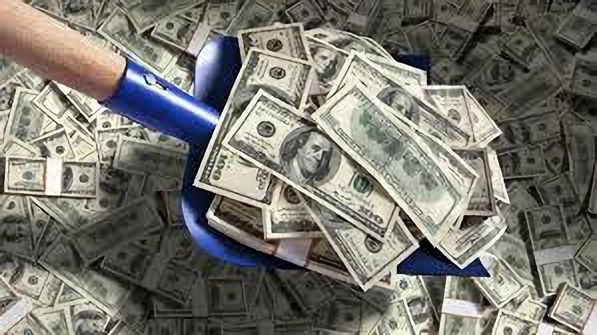
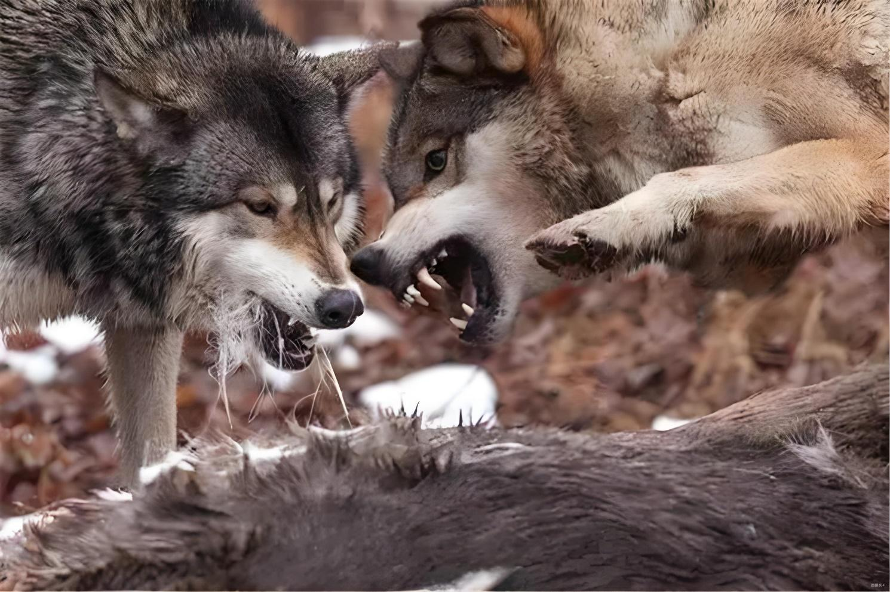

197篇.不要相信现金

**[清一](https://www.zhihu.com/people/shan-chang-qing-yi)**山长 **[2025年10月20日10:28](https://www.zhihu.com/pin/1963582407207813880)**

我从来不相信现金，因此我从银行借现金，把现金再换成我认为**可靠的资产（优质股权）**。34年前我就这样做，目前我依然在这样做。34年来，我的资产增加了万倍，我的债务也增加了差不多万倍，都是银行的现金，我认为蛮低利息的资产。我**利用了中国储户对于不靠谱的现金的崇拜心理而获取与金融利益集团一起合作吃羊群**！

但我也会非常小心地打理这些资产，不用它们去冒险，不然银行就会吃掉我。因此，**我的股权涨了就卖掉，高位绝对不买，这个策略是我得到取得万倍收益的核心**。但我不准备把这个技术交给孩子们，他们老老实实地守住财产不贬值就行了！

[年内涨幅超60%！达利欧最新撰文，直面回答关于黄金的六大“高能”问题](https://zhuanlan.zhihu.com/p/1963565495505617688)

“历史还告诉我们，自1750年以来，全球约80%的货币已经消失，剩下的20%也都经历了严重的贬值。黄金，依然屹立不倒。当泡沫破裂，或当国家之间、个人之间不再信任彼此的信用时（例如战争时期），黄金是股债之外最好的分散化资产。”

**（标题、图片为编者所加）**

文章音频：

[614篇. 不要相信现金](http://link.zhihu.com/?target=https%3A//www.ximalaya.com/sound/932124284)

**参考链接：**

[190篇.是狼还是羊？](https://zhuanlan.zhihu.com/p/1965856208259900157)

[191篇.今天上了白银主力的当](https://zhuanlan.zhihu.com/p/1967003445232918755)

[192篇.历史上中金涨得比白银更疯](https://zhuanlan.zhihu.com/p/1968290682704749393)

[193篇.有色也能涨十倍？](https://zhuanlan.zhihu.com/p/1968311311009030155)

[194篇.白银的应对方式，不动](https://zhuanlan.zhihu.com/p/1968324499964425974)

[195篇.今天尝试新股](https://zhuanlan.zhihu.com/p/1971965825603866634)

[196篇.清一公社：为何绩优股10年不赚钱?（配图版）](https://zhuanlan.zhihu.com/p/1971985927011284250)

[链接汇总（截止2025年10月20日）](https://zhuanlan.zhihu.com/p/621215591?utm_psn=1967007144831350474)
