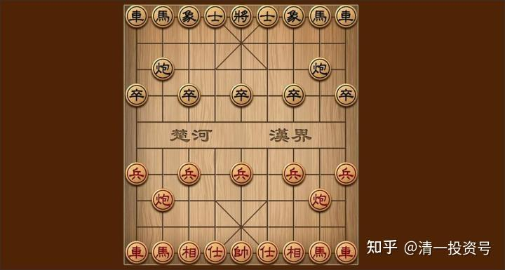

19篇.何以安然度过这场金融战

清一山长 2022年5月10日

昨天晚上，美股大跌了650点，创近期新低了。最近12个交易日，美股四次跌了800～900点，但一股无形之手一直在护盘，双方一直交战。昨天的大跌，破了多方的护盘的努力，看样子是空方胜了。不知是不是看到美股的颓势真的开启了？终于今天A股探底后，开始上涨，正在应验我说的：**美股跌，A股就有机会了。我认为会是慢牛，不会急涨的。**

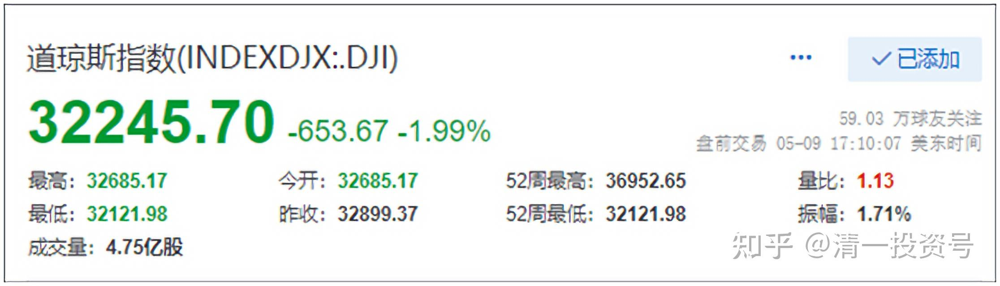

*道琼斯指数 2022年5月9日*

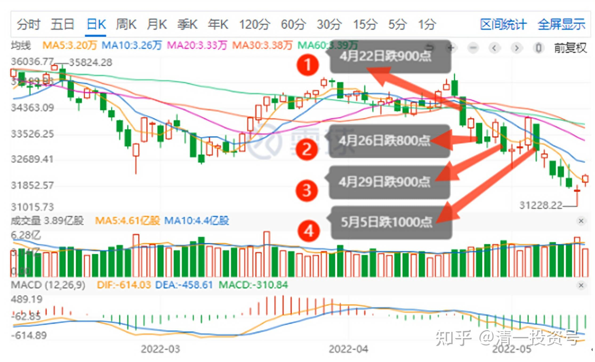

*道琼斯指数最近四次跌800～900点*

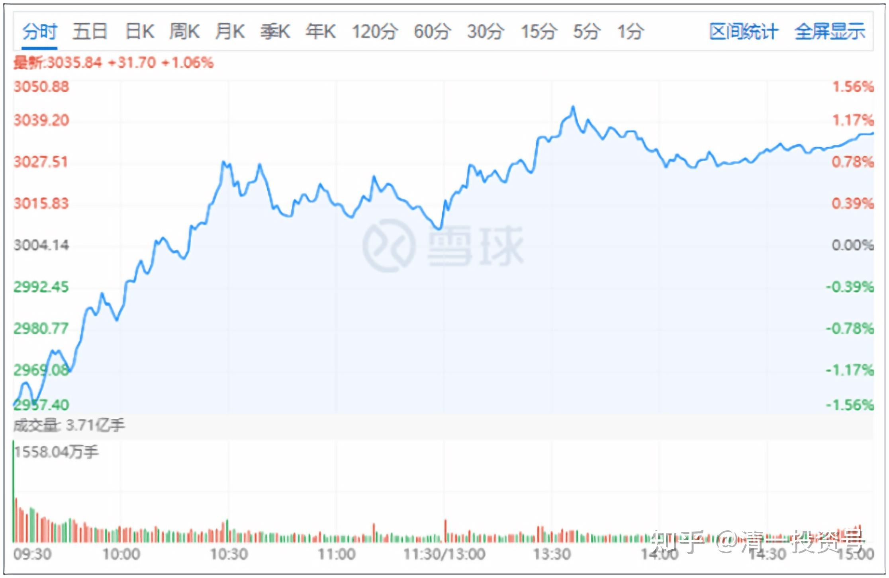

*上证指数 2022年5月10日*

今天正好卖掉几十万股中国中铁，5.59元卖掉的，买入了80万股价格仅3.57元的洛阳钼业。这家企业，业绩越来越好，股价却如此乱跌一气，实在想不通，想不通就买了放起来。我不相信印钱的美元比“印”工业必需品的各种金属的洛阳钼业更值钱。认为美股加息就会导致大宗反转低迷的恐惧，促使一些不会算账的傻瓜抛出股票持有美元。我相反——**我不愿意持有资金，我愿意买入金属股票。**今天大跌7%。正好给我良好的买入机会。原来港股的洛阳钼业赚了不少，我没有走，持有到现在账面亏了。**亏就是买的时候，赚了就是走的时候。**A股的洛阳钼业，负成本持有一点点。因为上次冲高卖掉后，就一直空仓，现在跌到4元多，就买了一点点进来。但价格上觉得港股更划算，所以主要买港股。金目股份一直在涨，居然是赚钱的，验证了我原来判断的：**金钼股份弹性更好。**

不过：万一今晚美股又涨了，估计A股又要趴窝了。

**抓紧大蓝筹不放，可以安然度过这场金融战。**

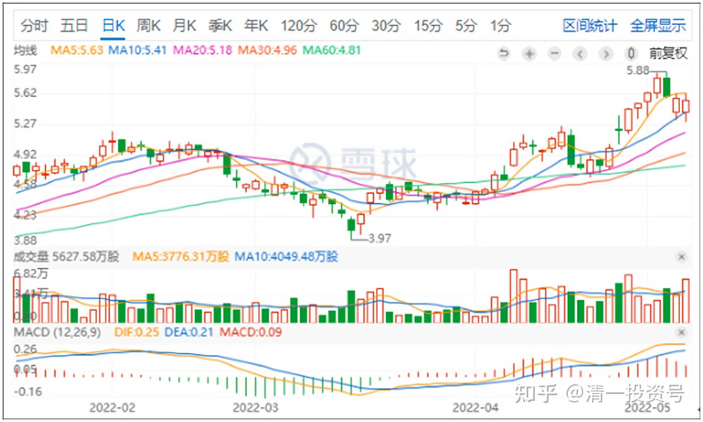

*中国中铁2022年5月10日*

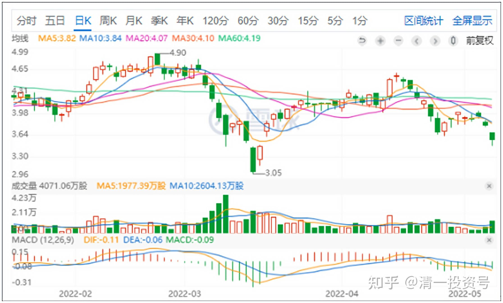

*洛阳钼业HK2022年 5月10日*

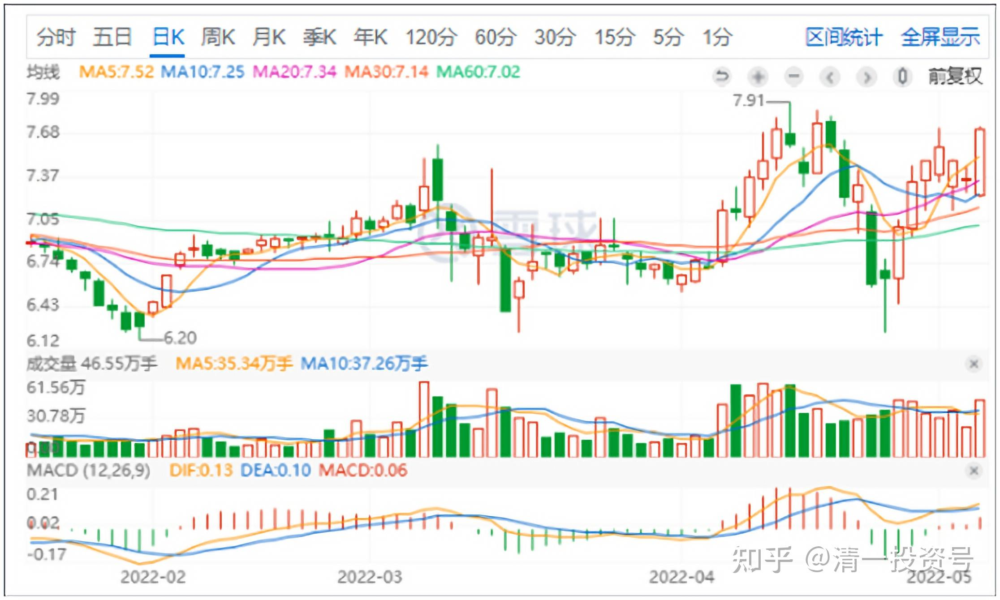

*金钼股份 2022年5月10日*

山长 清一 2022年5月11日

美股如果要拉回原有上行轨道， 昨天美股就必须上涨才行。但美股昨天高开后，架势十足，但一路低走，明显的弱势，反弹无力，尾盘拉了一点又跌下来。明显拉不起来的感觉。所以，**今天大A见状，就稳步上行了，非常明显的跟美股唱对台戏。**

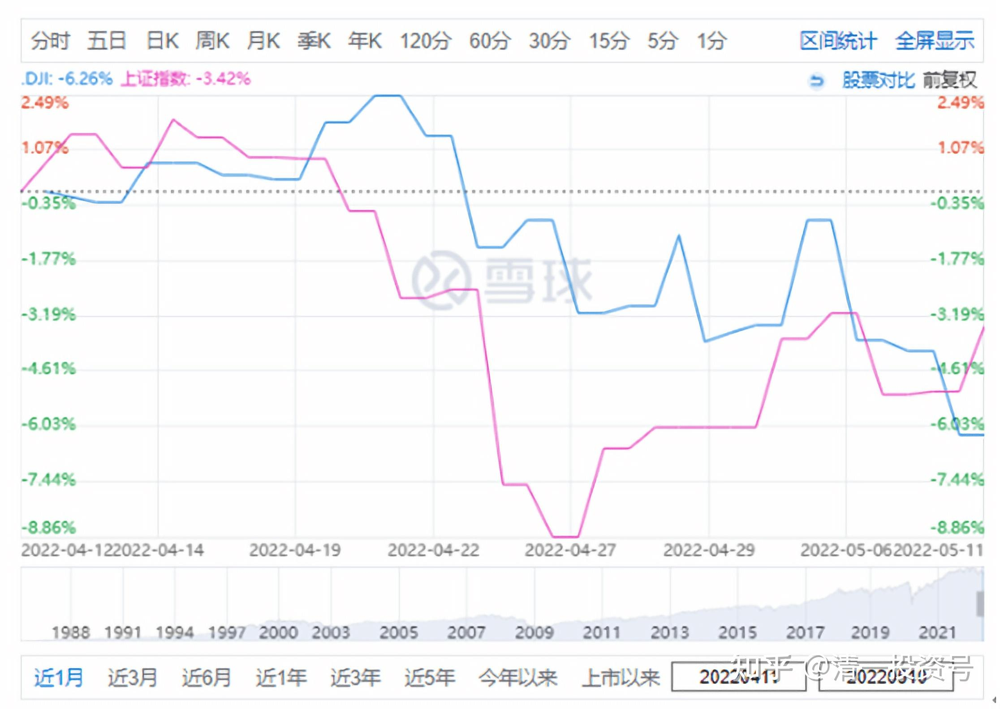

*（道指与上证同期对比，蓝色线为道指，红色线为上证）*

也许我们可以见证国运反转的开始。多年之后，你们才会知道：为了布局今天，我们国家布局了7年（2015年金融战输给了美股，据说损失万亿。后来一直在布局，不再上当。2015的疯牛，就是被美国人拉起来又打下去的，破坏了中国政府“慢牛”的计划）。后来就慢慢布局，一涨中央就打压，一直维持在低位，各位看中国建筑7年来中间几次大涨都被打回来，甚至越来越低，就是把中建打到极致低位。让我们有机会捡到大量的股票，看懂了金融战略，赚钱很容易，只是跟风的话，往往吃灰。但跟随国家布局，就会很寂寞，这不：7年了中建等大蓝筹才开始出现一点机会。**但好处是：没赚钱是真，但也不会亏。**今年看到雪球一些人说亏了40%以上，很同情。我的港A账户，都是涨了新高的。

**中国建筑等今天跌，我看是蓄势。大盘危险，它才会起来。今天大盘积极，它就负责“打压”。避免过热，这样稳健，是好事。**

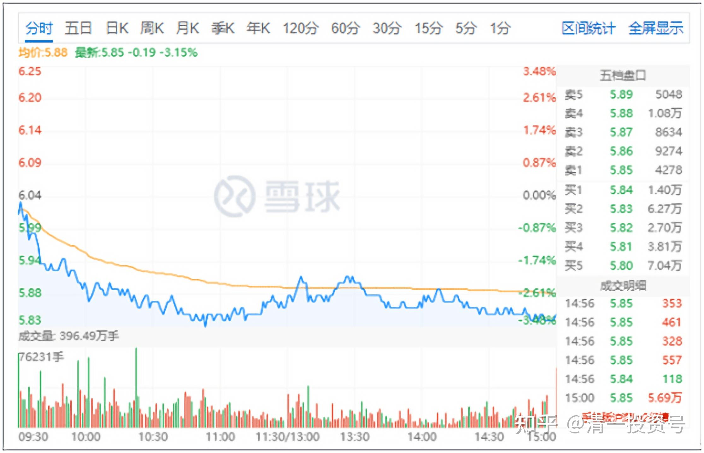

*中国建筑 2022年5月11日*

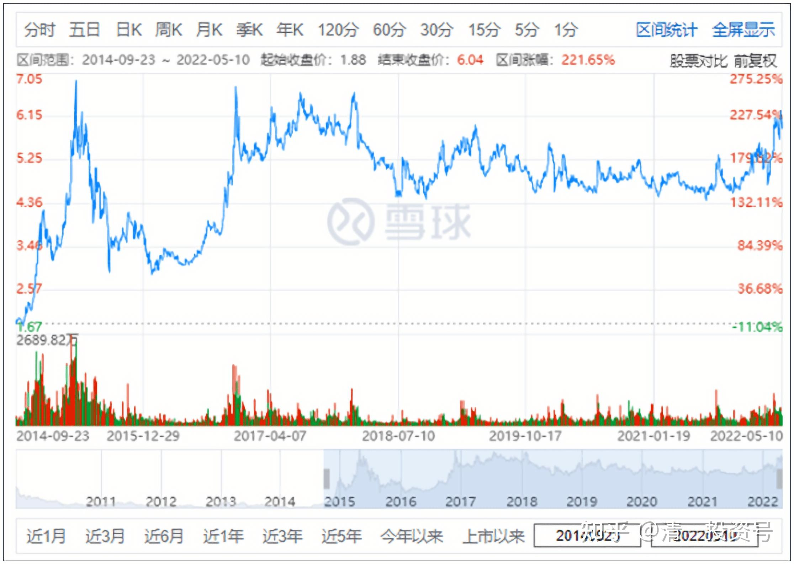

*中国建筑2014～2022年*

相关文章：

[清一投资号：11篇.金融战开打了](https://zhuanlan.zhihu.com/p/485173866)（新作）

[清一投资号：16篇.中国中车与中国中铁](https://zhuanlan.zhihu.com/p/501574841)（新作）

[清一投资号：18篇.全面狂跌中如何独善其身](https://zhuanlan.zhihu.com/p/513631895)（新作）

[清一投资号：6篇.A股与美股的微妙关系](https://zhuanlan.zhihu.com/p/513063583)（整理文）

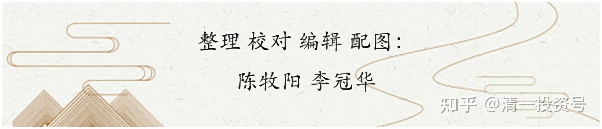
