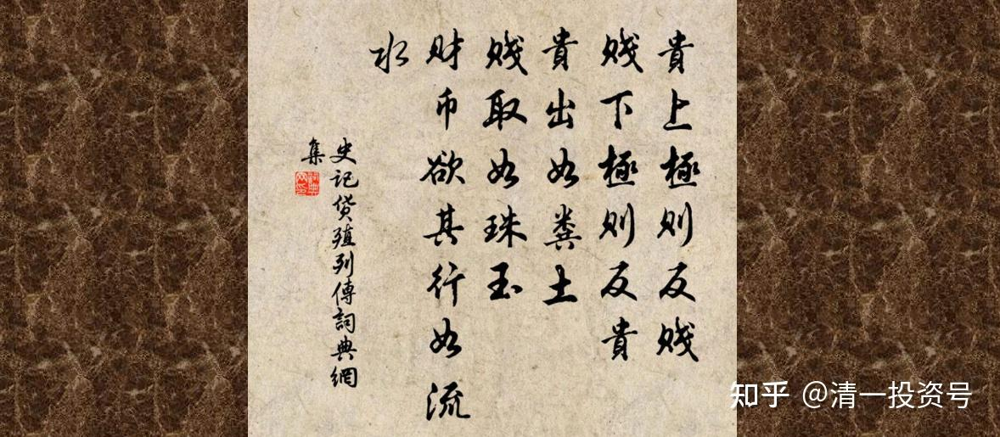
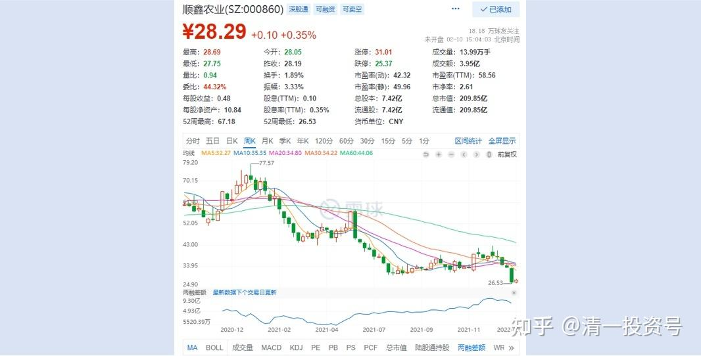
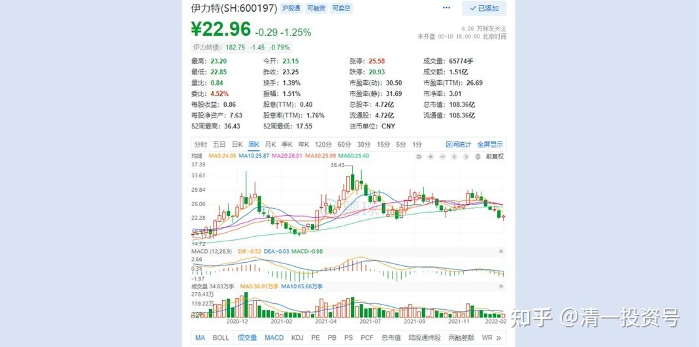
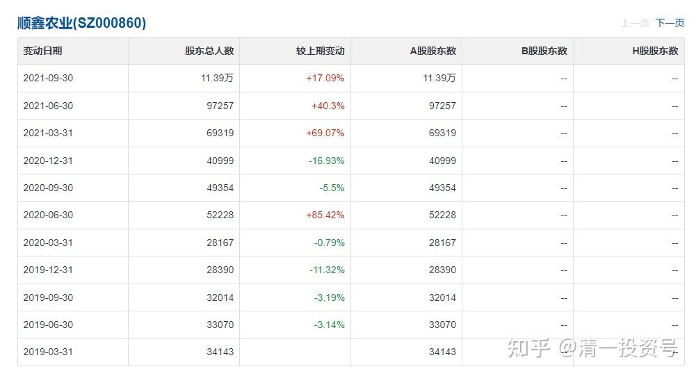
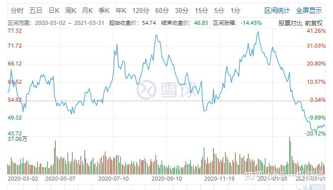
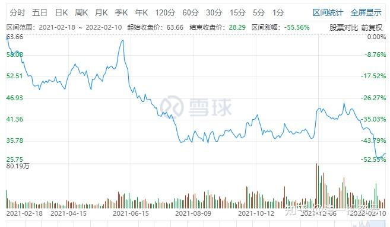
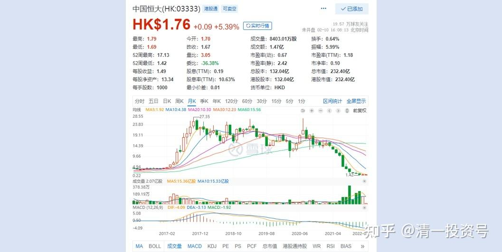
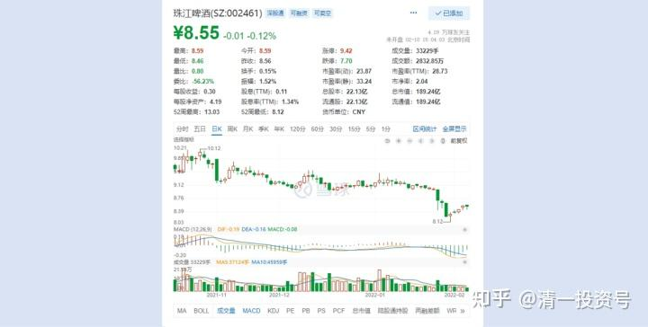
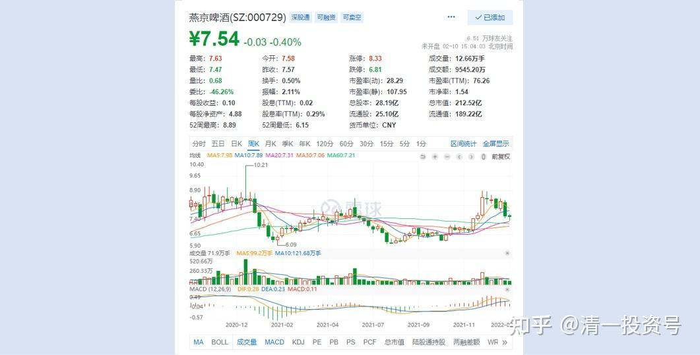

清一山长 2022年2月10日

最近看到原来让我赚了一大笔的顺鑫农业，从70多元跌到27元了，我在想是不是该买入了。我是相当于前复权15元左右的价格买进的，50多元就卖光了。账上只留了两百股做纪念。赚了1.5千万，这些钱连本带利，我都去买啤酒和伊力特，老白干了。因为我的逻辑是**以酒养酒，**又赚了不少钱。这两年取得的投资收益，主要就是各种酒提供的。其他大蓝筹，如中建等，基本上没有收益。没亏就算赚了。所以，我对顺鑫农业还是很有感情的。

没想到现在，它居然跌得这么惨，还玩利空突袭，大幅破位下跌的游戏。但我看看图形，觉得现在明显没有到位。不到买入的时候。我宁肯买回原来高位卖掉的伊力特补仓，也不想买回现价的顺鑫。

虽然最近的超跌，可能会有一点反弹的需要，但趋势已经走坏，看不出有长期上涨的空间。看起来，它的高光时机，已经过去了。账面的业绩也不咋的。**主力已经有明显出逃的迹象**，想要再度进入上升通道，需要很长的时间了，可以耐心继续等等，主力操作不会这么着急的。现在进去，只是短期博反弹罢了，没有多大的意义。所以我就放弃了重新买回顺鑫农业的想法。

最有趣的就是**看它的股东数量，最能说明一个股是怎样上涨的了**。原来顺鑫在高点的时候，江湖上传言：顺鑫是民酒第一（我说这个概念的时候，这个股才19元，可没人愿意听）。**这个高光，最有魅力的时候，顺鑫的股东数，才两万多人。**其中还包括我在内，我虽然只持有几百股，但至少占了三个股东的名额（我用三个不同的股东，每个账户留有100股。其中一个账户最可笑，才留有3股，只剩了最少的零头在账面上）。所以，60元以上的高位，其实持有这个股的股民是很少的，很多人只能望着“顺鑫牛股”流口水。

但后来冲高回落，很多流口水的散户就冲进去大吃“豪华大餐”了。后来剩下来的人，就为前面的人买单了[大笑]。我看2020年3月，这个股价是60元左右。一年之后，中间经历了拉高冲70多元之后，股价震荡回调，这一次跌到了50元左右。看起来相对70多元的高位，已经便宜了很多。不少小散就冲进去站岗了。股东人数猜猜到了多少了？**已经6万多人快7万了。聪明人一看就知道：顺鑫的主力，开始派发筹码给散户了。**

高位的价格，全都是自拉自唱的，其实没啥散户真正的参与，所以各位记住：**高位就是做给你看的，别以为你就应该高位卖给主力。涨高的股票，一般来说，你不会有股票持有在账上的。如果散户的筹码，还比较多的话，主力也绝对不会拉高的。他们才不喜欢帮散户抬轿子呢！**

接下来，顺鑫并没有走出“恢复前高”的架势（但同期的白酒，不少创了新高）。反而继续一路慢慢跌，主力趁机在别的白酒股“高歌猛上”在示范的时候悄然退出，利用老百姓比价效应，觉得顺鑫很便宜，肯定会跟涨的心态，主力悄悄的毫无留恋的出货。去年9月30日，股价已经腰斩，**跌到了30元左右。股东人数有多少了?居然是11万多人**了。散户们一看下跌，就纷纷买入。越跌越买，结果是越买越套，现在已经在20多元徘徊了。

我不知道现在的股东数有多少，不像燕京啤酒，公司10天就报告一次。顺鑫农业是一个季度才报告一次。但我猜：肯定破12万，甚至13万了。比2020年初的两万多人，**多了五六倍的散户，不跌才是没道理**。难道现在主力想要重新从这么多的散户手上买回股票冲高吗？我不这么想。当年他为了从散户手中夺走股票，磨叽了至少三年。我当年不断坐电梯，就是坚持持有不动，被他上上下下多次，熬得就像个傻瓜一样。我才不认为现在，谁个大傻的主力，会出来拯救这么多严重套牢的散户。

**只有筹码重新集中起来了，才是有可能涨升的时候。**这个过程是很长的，要把散户的耐心彻底泡没了，才有可能涨升。**观察这个指标，可以让你逃过很多坑。只会看股票价格涨跌的人，是傻瓜。**这种人就别炒股了，只拿股息就好。

**市场上，最危险的股是什么？高位放量，是主力套散户。**企业不一定有问题，只是高估了而已。**但更可怕的就是低位大放量—就是主力不计代价逃走。**

比如恒大等的走势，就很危险。一般来说，就是企业除了严重的问题。所以，我看到高位放量， 不会买的。如果低位放量，我也不敢买。**正常的股，是低位缩量，买进股票来很难**。遇到这种股，你就耐心慢慢的收集。比如当年的恒大，3元左右，就一直在收集，收了几百万股。但现在才1元多的价格，我根本就不敢买。因为当年的3元附近，它缩量严重。现在的1元多，每天是放量很多倍的成交，我哪敢要呀？原来买恒大，赚了8位数。当年地产股赚最多的。但如果持有到现在不放，就腰斩了。

所以，在中国，**还要比跑得快。不能长期持有不放。恒大如此，顺鑫也一**样。别学巴菲特持有十年不放。**不涨你持有十年没问题，涨了还不走，就是贪心了。等到高位放量的时候，就是你该走的时候了，啥都别留恋。**学古人的做派：“**贱取如珠玉，贵出如粪土**”**。**当年顺鑫在底部长期平台上，我十几元贱取如珠玉。涨了两倍以上，我当然就贵出如粪土。虽然没有卖到60元以上的高价，看着我卖光后它继续扶摇直上，但我已经很满足了。回头去买地板上的珠江啤酒，惠泉啤酒当。最终我都在13元的高位成功清空，操作比顺鑫农业的更漂亮，它们两只，也都让我取得了比顺鑫农业更高的收益。

现在这两只股，我账上依然是只持有纪念仓的水平。珠江居然跌破9元的长期支撑位，让我很惊讶。但它上一轮在10元上方的时候，我已经看出主力无意拉升的迹象了，所以主动远离。跌到9元也没有重新买进。本来按照技术图形，9元是可以买进了。原来13元回到9元，我就重新买入过一次的。又涨了一波之后走掉了。再度跌下来，看到10元主力依然在出货的迹象，我就再也不买珠江了。上一次重新买入，是看到主力9元多，有在收集的迹象。

所以——**价格真的不是你买入的逻辑，而是主力动向、趋势，才是你买入的逻辑。**燕京现在的价格，**虽然走势很不好看，但有明显的主力动向。这种股，就只能“等”了。跟主力比耐心吧！**主力有三年的耐心，你就要有五年的耐心。说不定，燕京将来走出顺鑫的走势，突然涨个四五倍呢?天知道。燕京三年不飞，甚至十年不飞。会不会将来一飞冲天？[大笑]

