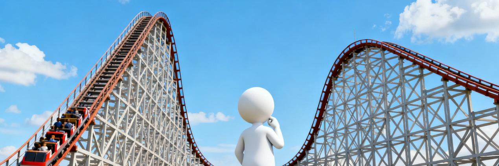
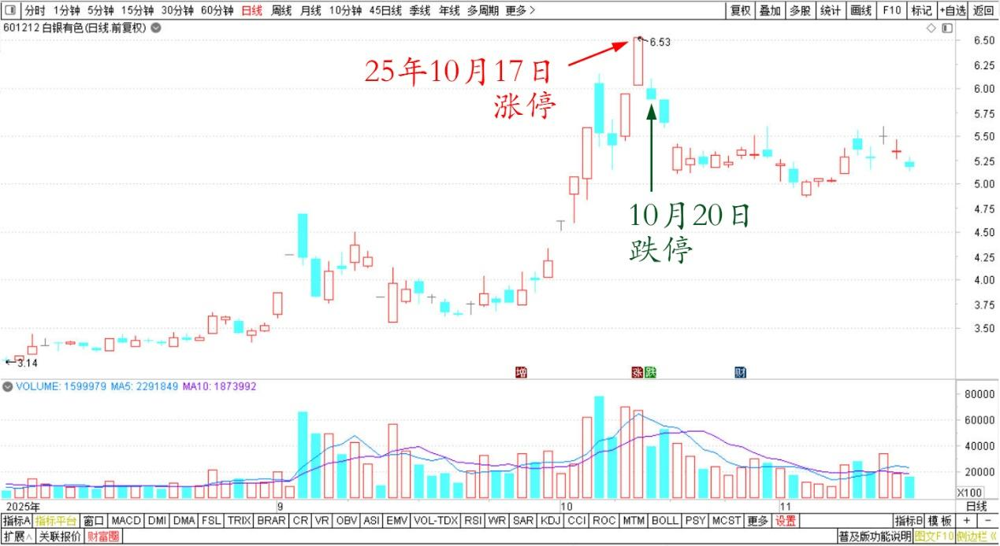
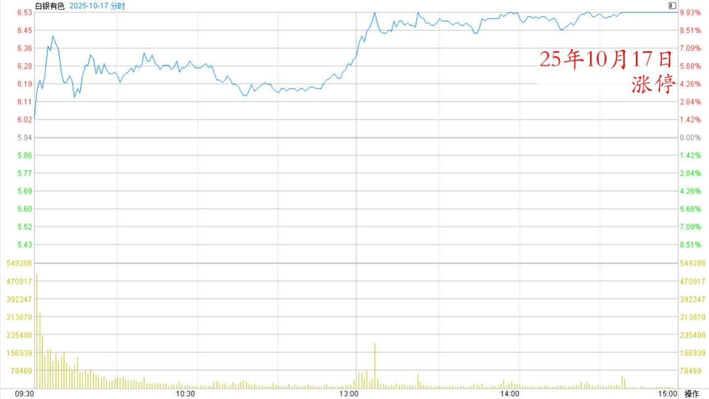
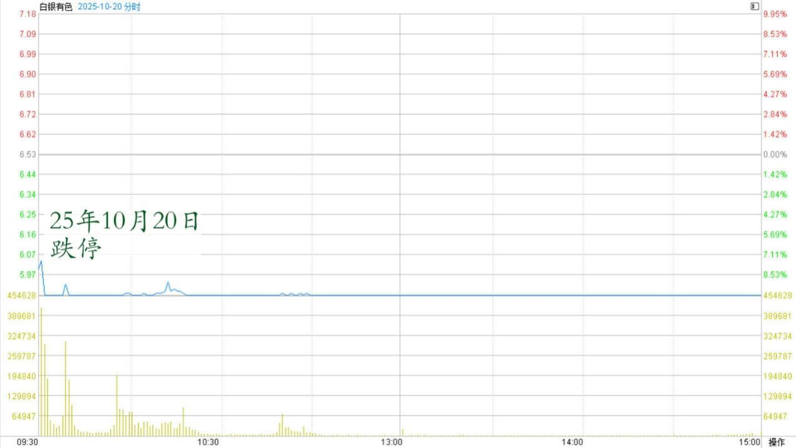

**201篇.白银涨停又跌停，学习观望不买卖**

**清一山长[2025年10月20日12:12](https://www.zhihu.com/pin/1963578295904862580)**

我完全无法理解白银有色上个交易日的涨停，我也无法理解它今天的跌停，都完全超出了我的理性判断的范围！

白银有色2025年8月～11月日线图

白银有色2025年10月17日分时图

白银有色2025年10月20日分时图

不过，从逻辑上来说，今天似乎是买入点（我绝对不买的，只是说逻辑）。逻辑就是：上一交易日的涨停，主力的资金大量“套牢”，如果真想出货，其实是如同中粮糖业一样，拉高然后高位震荡横盘出货的。

第二天就低开，然后跌停，挺不正常的，存心把筹码都死在自己的手上，因为跟风盘会疯狂地卖出。

如果这样来判断的话，就可以说白银有色今天的跌停，就是刻意为之的。如果是真的话，当然就应该买入了！

不过，我不买。我就看热闹！看懂了觉得很有趣，不赚钱也没事；没看懂，我就继续学习，长见识。所以，我会继续认真学习观望，白银有色到底在玩啥把戏？

黄金价格跌一点，我认为可以不理它。未来美元计价的黄金，只会越来越贵的！有人都看到一万美金了！美元崩盘，大宗不飞起来才怪！

**（标题、图片为编者所加）**

文章音频：

[618篇.白银涨停又跌停，学习观望不买卖](http://link.zhihu.com/?target=https%3A//www.ximalaya.com/sound/933984274)

**参考链接：**

[195篇.今天尝试新股](https://zhuanlan.zhihu.com/p/1971965825603866634)

[196篇.清一公社：为何绩优股10年不赚钱?（配图版）](https://zhuanlan.zhihu.com/p/1971985927011284250)

[197篇.不要相信现金](https://zhuanlan.zhihu.com/p/1974035759771174478?utm_psn=1974210802497132044)

[198篇.赚快钱的人，正在快速被消灭](https://zhuanlan.zhihu.com/p/1974199886363779424)

[199篇.白银又涨停，西部换中冶](https://zhuanlan.zhihu.com/p/1974448126355072939)

[200篇.金融有风险](https://zhuanlan.zhihu.com/p/1974442465772736597)

[链接汇总（截止2025年11月8日）](https://zhuanlan.zhihu.com/p/621215591?utm_psn=1967007144831350474)

