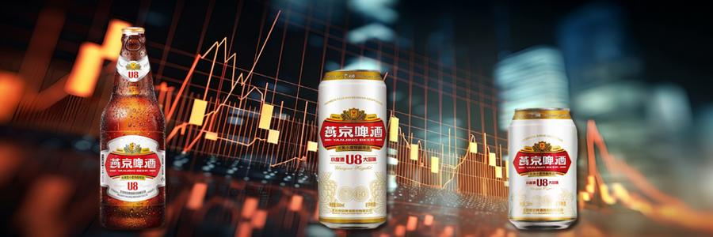
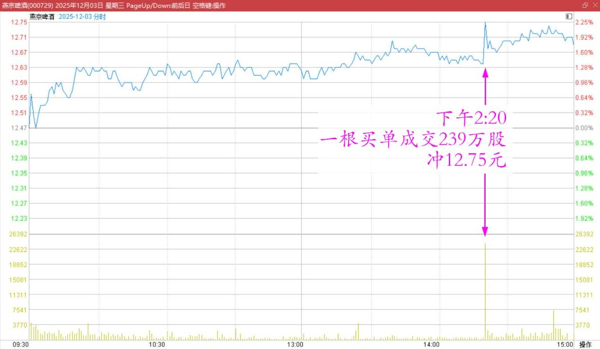
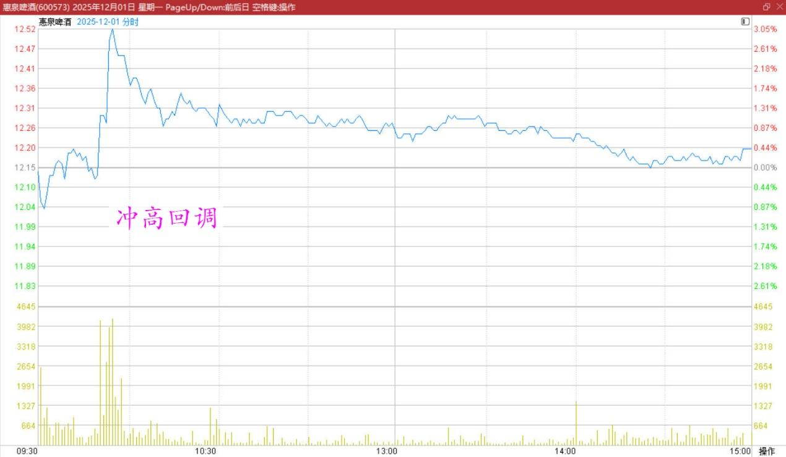
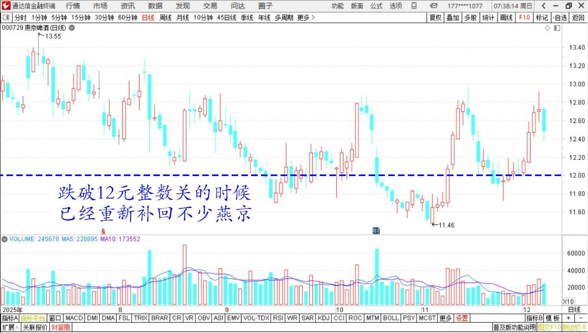
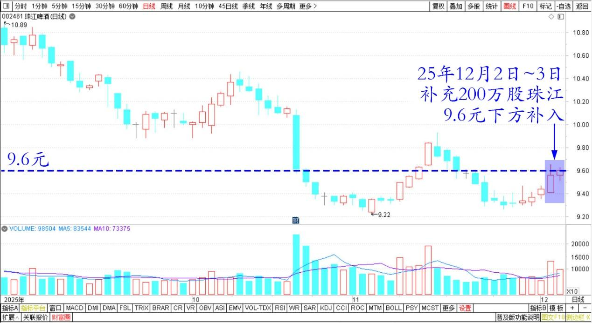
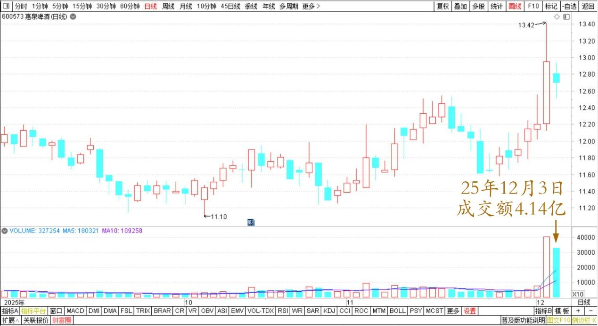

206篇.燕京快涨了，12月的啤酒行情也许有惊喜

清一山长**[2025年12月03日15:17](https://www.zhihu.com/pin/1979565955274278550)**

试盘动作观察。

燕京快涨了。今天盘中，下午2:20分，一根买单成交239万股，冲12.75元的价格。20分钟后，又有一个买单买掉50多万股，扫掉了12.75元挂的卖盘！

燕京啤酒2025年12月3日分时图

这个动作，和前天惠泉冲高回调的动作一样！

惠泉啤酒2025年12月1日分时图

当时我看到了这种冲高回调，就知道必须忍住不卖。实际上，对于右侧投资者来说，这种信号，就是明显的买入标志，如果我前天看到惠泉的这种情况，我就应该买入，第二天就直接抓到了一个涨停。一天就10%，然后卖掉再去找一只股。原来早期我做A股会这样干，现在我是“看多不做多，反而可能做空”。

所以，今天看了燕京的买入信号，试盘信号之后，我没有跟风买入（跌破12元整数关的时候，我已经重新补回了不少燕京），目前是零成本持有燕京。**但告诉各位：燕京快涨了！**

燕京啤酒2025年7月～12月日线图

不过我也没闲着，**昨天和今天一共补充了200万股珠江，都在9.6元的下方补入的。**按照市盈率和市净率来说，珠江都比较低估。如果燕京和惠泉涨的话，它没有理由不涨吧？

珠江啤酒2025年9月～12月日线图

而且它的成交实在太低了！比它盘子小七倍的惠泉，今天成交量是4.14亿。珠江今天一天也才9千多万。**我喜欢买低迷成交的股票，这个时候肯定是底部。**

话说回来：今天惠泉调整我倒是不惊奇。我奇怪的是惠泉的调整成交量太大了！有点像主力出逃的样子。相当于昨天买入的主力，今天低价卖股一样，相当不正常！

惠泉啤酒2025年9月～12月日线图

当然，如果是跟风盘逃跑，反而是好事，筹码洗刷非常的清晰！

耐心等等吧！**12月，也许啤酒的行情，会给大家一个惊喜的！**

**（标题、图片为编者所加）**

文章音频：

[623篇.燕京快涨了，12月的啤酒行情也许有惊喜](http://link.zhihu.com/?target=https%3A//www.ximalaya.com/sound/938168601)

**参考链接：**

[198篇.赚快钱的人，正在快速被消灭](https://zhuanlan.zhihu.com/p/1974199886363779424)

[199篇.白银又涨停，西部换中冶](https://zhuanlan.zhihu.com/p/1974448126355072939)

[200篇.金融有风险](https://zhuanlan.zhihu.com/p/1974442465772736597)

[201篇.白银涨停又跌停，学习观望不买卖](https://zhuanlan.zhihu.com/p/1976000714212927087)

[202篇.金融专业人员的投资水平也就7926选4？](https://zhuanlan.zhihu.com/p/1976003501927707111)

[203篇.涨停的白银换跌停的铜陵](https://zhuanlan.zhihu.com/p/1976757570615133189)

[204篇.大跌和大涨，都是骗人的](https://zhuanlan.zhihu.com/p/1978516963094442584)

[205篇.惠泉涨停卖出300万股](https://zhuanlan.zhihu.com/p/1979518999168571200)

[链接汇总（截止2025年12月3日）](https://zhuanlan.zhihu.com/p/621215591?utm_psn=1967007144831350474)

