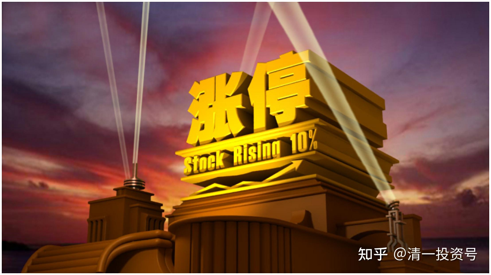

20篇.三种涨停

清一山长 2022年5月19日
最近一个月，我原来买过，但没赚钱就跑掉的会稽山，居然一个月连涨9个涨停。让市场惊叹：来行情了。散户们纷纷追进去。但主力吃进去不吐骨头。每天10%的成交，接近十亿的过手，早已完成建仓的庄家在勾引贪心的小散进入。现在出货完毕，连续三个跌停。高位抢票的韭菜们全部被套牢，连走的机会都不给。实在是狠人！大进大出。所以：**一句话，别当自己是聪明人，承认自己傻。别什么钱都想赚，这种钱，太烫手了。多玩几次，你的本金就彻底玩完了。**

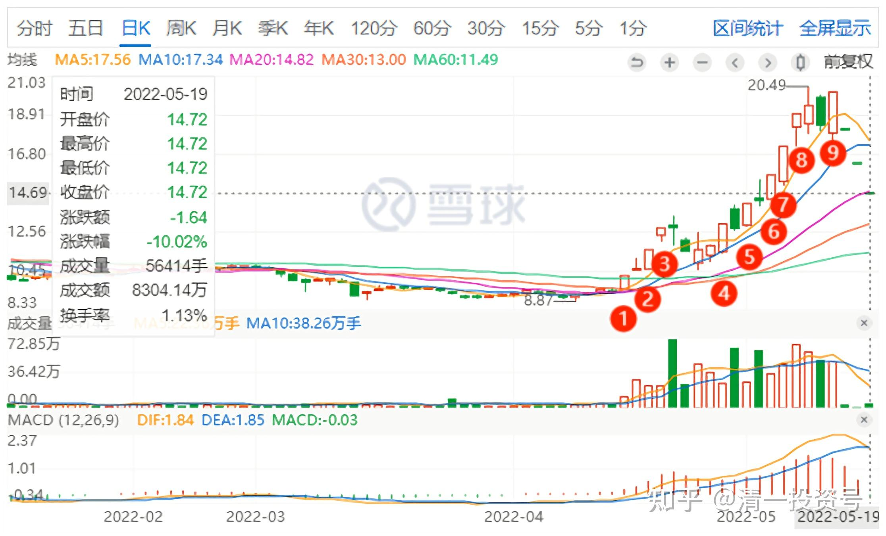

*会稽山9个涨停备注图*

清一山长 2022-5-20
今天古越龙山涨停，金枫酒业涨停，都是一开盘就拉封死涨停的**。你们知道是干啥的吗？是来救市的。救谁？救会稽山(SH:601579)。**让小股民假想黄酒股有行情。资金涌入，不然就套死在会稽山了。我原以为只是套的小股民呢！原来还有大鱼。但你们也看到了大鱼的凶悍，一旦被套，反抗很剧烈，果断的断臂而逃。而小股民往往舍不得亏本，结果又亏钱，又输时间。如果我说的是对的，明天古越和金枫就会跌。完成了掩护任务的资金，明天就会快速的撤退。他们绝对不会恋战的。如果掩护资金运气好的话，还可以赚一点钱。另外，今天1579成交十几个亿，总市值也就几十个亿。我认为今天救市成功，明天继续阴跌。**如果没有两个股的涨停。今天就算跌停也无法出货的。散户不愿意思考，不好好学习，不懂人心，只懂自己，来股市就是送钱的命。[滴汗]**

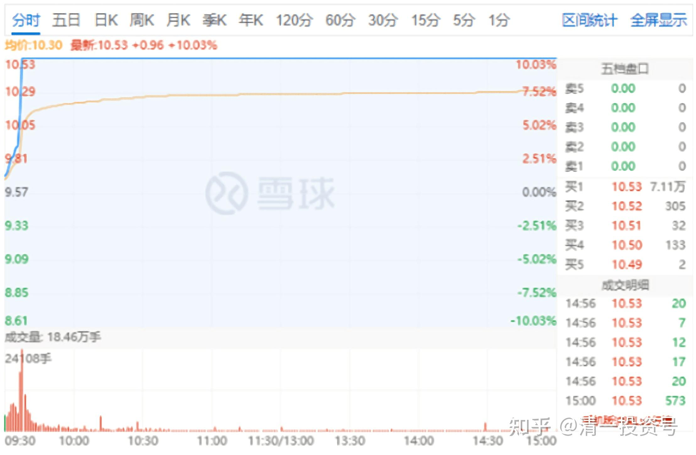

*古越龙山2022-5-20*

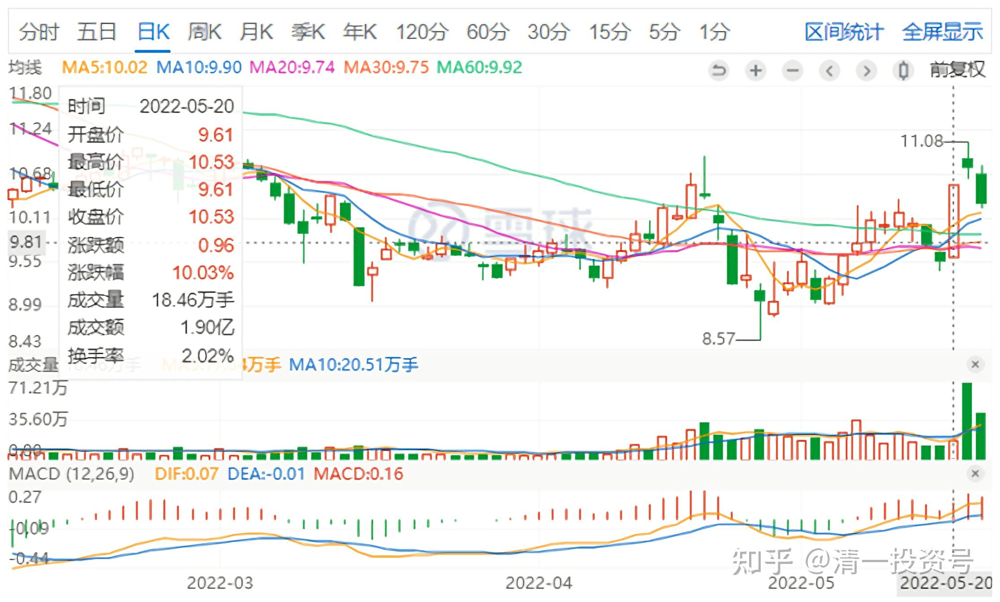

*古越龙山日K线图*

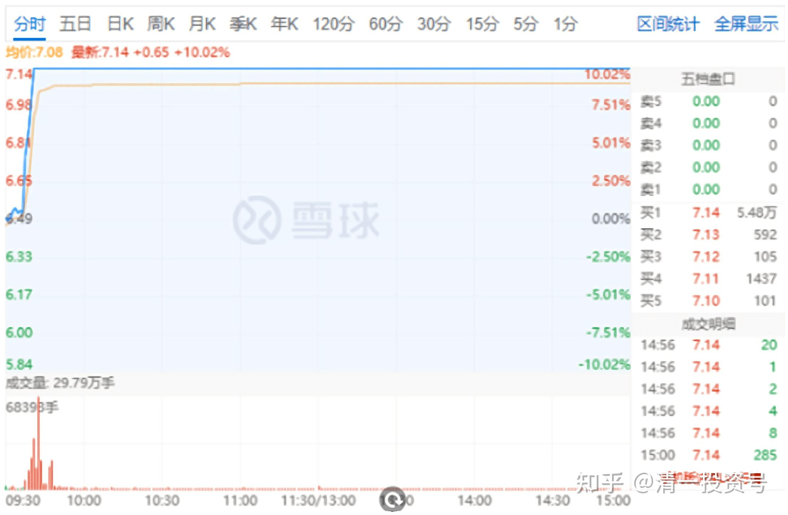

*金枫酒业2022-5-20*

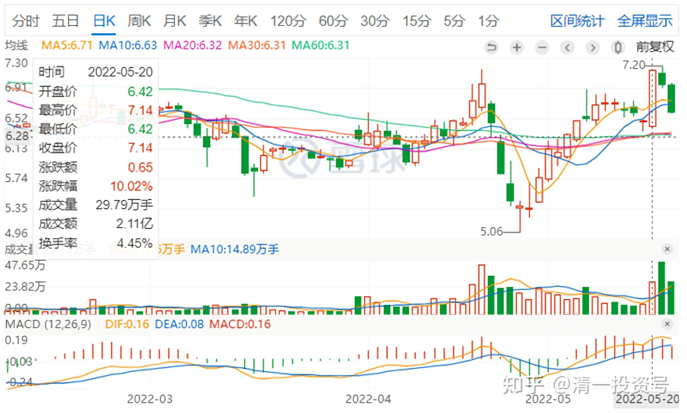

*金枫酒业日K线图*

有三种涨停，你们要知道、原因都不一样。

1.

有些涨停，主力是用涨价来“收货”的。盘面上，涨得犹豫不决的样子，还多次破涨停。天山今天的涨停，就不干脆，有点像是“要收货”的样子，快速把浮动筹码清扫掉。今天天山，封住涨停的资金很少，才一百多万股。总资金一千万左右，一个大户就打掉了。

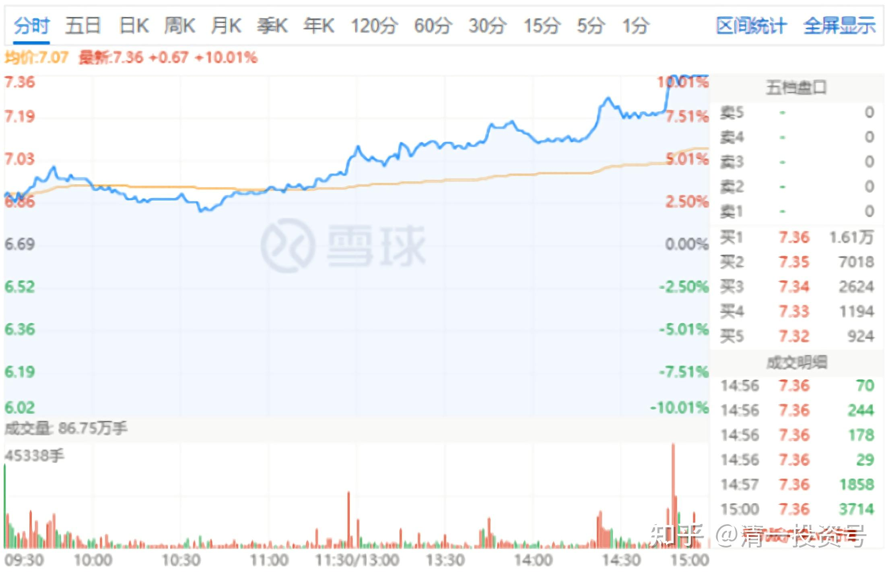

*天山铝业2022-05-20*

其实4月26日大跌，都快跌停了，27日就全涨回来了，量都没有放大。说明是资金有意打压，但舍不得筹码，这是个黄金坑。后来又跌了，我就买入了。底部形态很明显，我才敢告诉你们的。现在涨停，也只是刚回到前期平台而已。

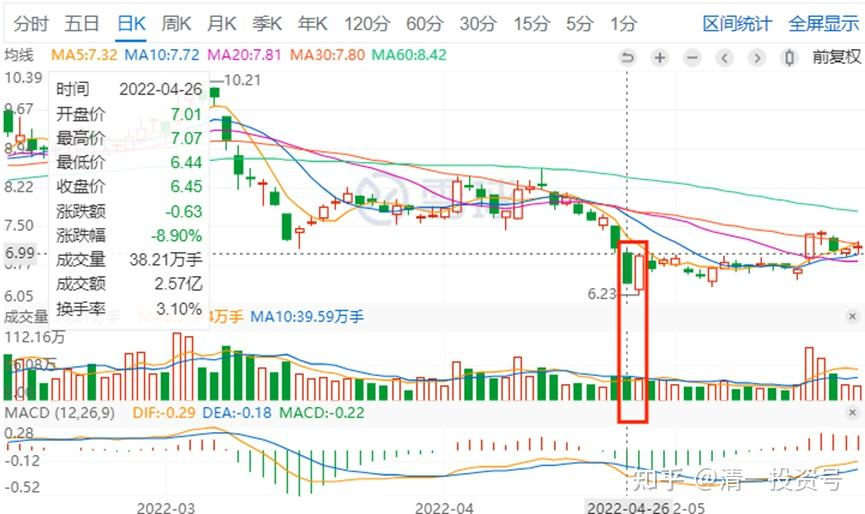

*天山铝业2022年4月26日，27日*

2.

有些涨停，是为了出货。涨停，往往是借利好出货，涨停之后，又慢慢阴跌。

3.

还有一些涨停，是假装天山这样，假装“到拉升时候了”，做一回“假涨停”。好像要货的样子，量也不放大。其实是为了出货。

**附录：涨停进货，涨停出货**

清一山长2020-06-05 16:28

$惠泉啤酒(SH600573)$

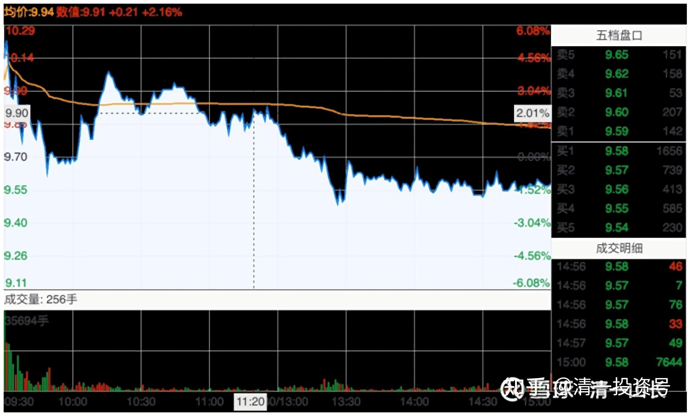

这张图是今天的珠江走势图，明天就看不到了。所以特别发在这里做个纪念。

上午是主力派货，很成功。可以断定是短炒的游资成功出逃了。最后的一个多小时，却并不是出货，而是长期的主力在慢慢收货。我注意到9.50元有30万股的买单，下面两分钱下方9.48元，还有20多万股等着。估计是昨天涨停出货的人想低价买进来。但一直没有被打掉。如果有人急于出货的话，绝不会放过这种大单派货机会的。但交易却一直在9.50元上方不断出现几万股的成交，就是不碰9.50元小买单不断的吃掉抛盘。如果上方有较大的抛盘（五万股以上的），就会主动上浮10个价位去快速吃掉，然后有退下来，这种挂的卖单时间都不长，往往很快就没了。最后的一单也是上移吃货接盘的（9.58元）。尾盘的买卖挂单还看得到，可以看到上面都是小卖单，没有大卖单。因为有了就会被定点收掉。**这个就说明：珠江的主力惜售，9.7元上方。特别10元以上，高兴的派货，9.5元上下却在吸货。说明此波行情还没有完。后面还有大的机会。**

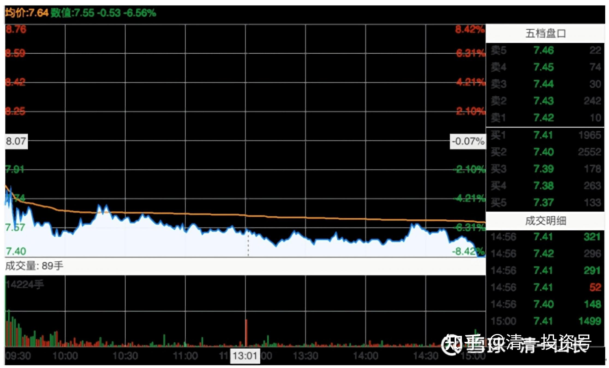

这张图是惠泉的，相比就完全两回事了。昨天就在借题材出货，不像珠江是洗掉跟风盘快速拉升。当然也有拉升的地方，**但主力筹码的出逃迹象很明显。核心点评就借是涨停出货，而不是真的要货。**你们别以为出货一定价跌，**聪明的高手会利用外围的人气来在涨势中出货的**。今天表现就更是典型了，盘面上一直是在派货，很明显的痕迹，比珠江主力差很多了。特别是尾盘，更是拿出了不加掩藏的“我就是不想要筹码”的典型走势。虽然上方的卖单看起来也不多，但与珠江不一样。珠江是往上吃推上去看不到大卖单，惠泉尾盘是往下打，涌进来的卖单。因为大一点的买单，都被抛盘打掉了。所以，短期内，惠泉走牛的希望不大，珠江短期依然处于强势，其实燕京相对也稳定得多。只是差价尚小，我还不想买入做T的砝码。想等几天再看。

看图其实很难，

**第一张是明出暗进。盘面夸张，但人气极佳。**上今天高开低走，成交比昨天放大了很多。证明主力成功地拉来了不少同盟军。

**另一张图是看起来走势有点柔弱无力，假装几次上攻却有退下来。**主力这样就悄然撤退。股价在慢慢的降低。操盘手法上，珠江一流。惠泉比较平庸。可能是主力的实力差太远。恭喜昨天涨停卖出的主儿，你们赢了！我以五元多的惠泉持仓成本，继续看惠泉大佬们的表演。短期难以期待精彩演出了。我相信长期输不掉的。

附：相关文章

[清一投资号：2篇.庄家入住操盘四个阶段](https://zhuanlan.zhihu.com/p/477773067)（整理文）

[20篇.三种涨停_清一山长新作 喜马拉雅](http://link.zhihu.com/?target=https%3A//www.ximalaya.com/sound/537712686)

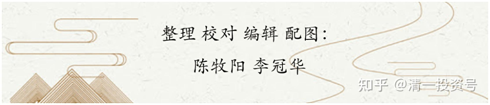
