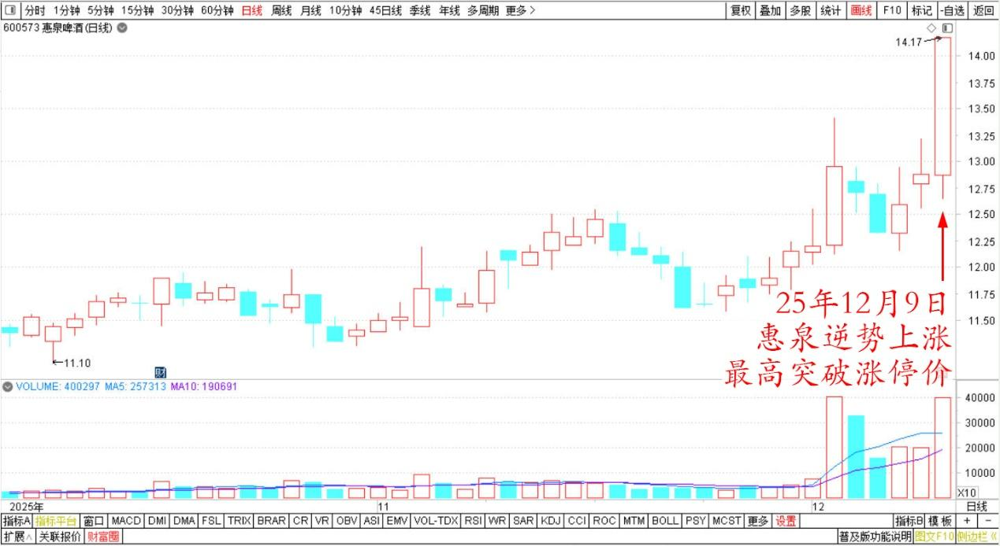
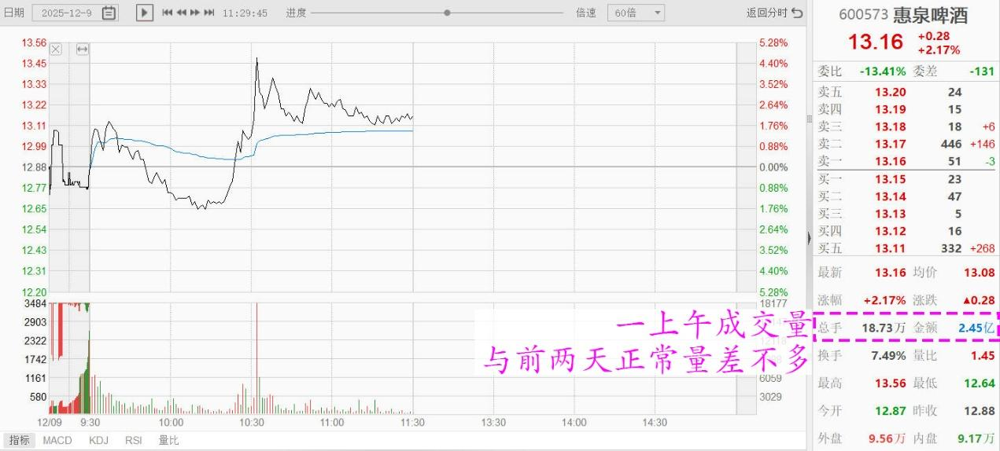
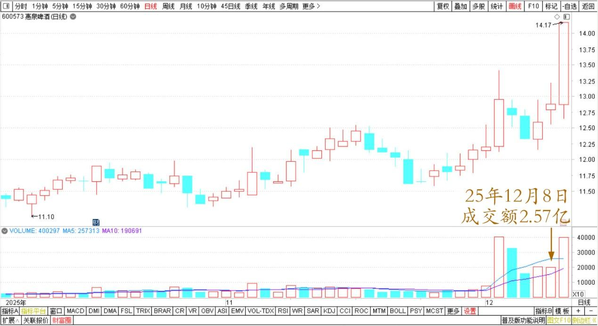
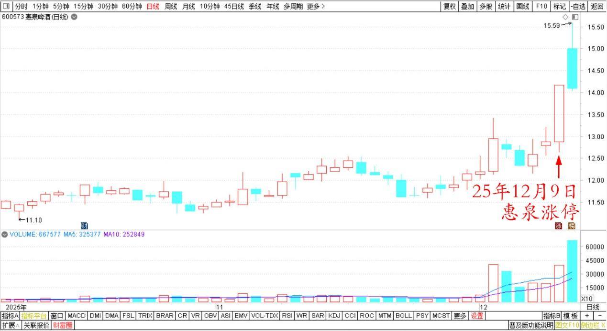
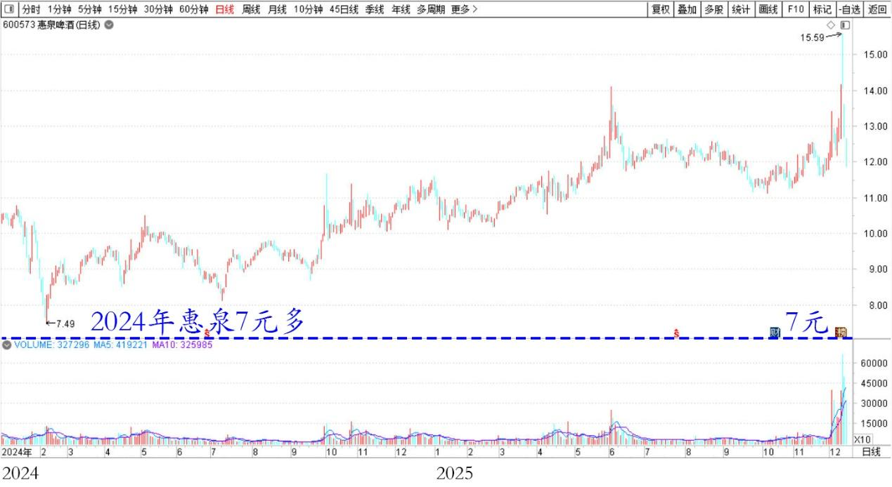
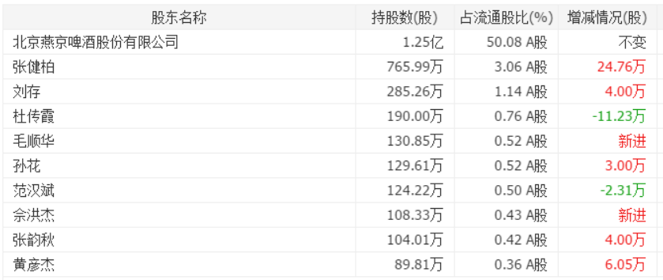

211篇.惠泉逆势上涨突破涨停价

**清一山长 2025年12月9日～10日**

**一、惠泉逆势上涨突破涨停价**

清一山长[2025年12月9日12:33](https://www.zhihu.com/pin/1981701704035606648)

惠泉啤酒异动。

**今天逆势上涨，最高还突破了涨停价**。

惠泉啤酒2025年10月～12月日线图

成交量：一上午成交已经与前两天正常量差不多了。我猜测是上涨，很多人就跑掉了。

惠泉啤酒2025年12月9日上午分时图

惠泉啤酒2025年10月～12月日线图

但如果换入主力思维的话，现在是趁机把散落的筹码拿走了。理论上，现在的筹码集中度更高了，主力控盘几乎就是铁定的。

这个高价还继续拿货，为什么？

肯定就是要上涨。理由是啥？不知道！也许是卖壳？合并？

主力控盘后，股价就是随意定的了！如果这样想，现在就应该买入。

但我会这样想，但看多，不做多，可能反而做空！反正已经赚了不少了，够了！

**换没有涨的吧！我会这样想！**

**二、惠泉这样涨，已经不是啤酒了**

[清一山长](https://www.zhihu.com/people/shan-chang-qing-yi)[2025-12-10 08:45](https://www.zhihu.com/question/1981742134878032772/answer/1982008057815905348)

说实话：我知道未来体育领域很有前途，但没有想到：会有这么大的市场！

[七万亿的大市场](http://link.zhihu.com/?target=https%3A//www.xinhuanet.com/fortune/20250911/524a769c89c040b9bb00e4627f730042/c.html)，够不够多了？

2030年，清一武道就已经成熟了。你们居然还要去体制内卷死卷生的当打工仔，是不是大路就是不走，偏走崎岖的小路？国人就是喜欢没苦硬吃吗？

看后视镜开车，是很多人在事业上的惯性。买股票也是（我看到昨天惠泉涨停，有人涨停板买进还得意洋洋的）。

惠泉啤酒 2025年10月～12月 日线图

这些人现在来抢14元多的惠泉，干嘛不在去年去买才7元多的惠泉呢？我可是低价买，高价卖的！

惠泉啤酒 2024～2025年日线图

现在惠泉这样涨，它已经不是啤酒了，是啥我不知道。涨到天上也有可能。

但我只剩半仓了，虽然半仓，也是二大。但再涨的话，我决定就走了。剩下的超出我认知的钱，就给别人赚吧！

惠泉啤酒 2025三季报 十大股东

体育行业也是一样的。现在的体育行业，估计就是6～7元的惠泉啤酒。2030年的体育产业，就是20元，甚至30元的惠泉！等你2030年才看到的话，你大概率是来买单的！

我看好什么方向？

就是中国过去最缺乏的方向，就是未来最有前途的方向！中国都有传武梦，被李小龙、少林寺、金庸们激发出来的传武梦，又被徐冬瓜打碎了的传武梦。

将来，如果你有实战格斗的世界冠军水平；你有传武的套路演练能力；你有对传武的深刻理解；你是某一门派的新一代文武双全的掌门人。你就拥有七万亿的机会！

你拥有多国语言能力，你就可以去全世界氪金了！这一个赛场，广阔天地，大有作为！

干嘛你们不去好好的拼一下？你居然要去大厂拼打螺丝？太傻了！

**（标题、图片为编者所加）**

文章音频：

[628篇.惠泉逆势上涨突破涨停价](http://link.zhihu.com/?target=https%3A//www.ximalaya.com/sound/941478061)

**参考链接：**

[205篇.惠泉涨停卖出300万股](https://zhuanlan.zhihu.com/p/1979518999168571200)

[206篇.燕京快涨了，12月的啤酒行情也许有惊喜](https://zhuanlan.zhihu.com/p/1981117920756142902)

[207篇.买回几十万股惠泉，比2天前卖价低了1元多](https://zhuanlan.zhihu.com/p/1982146009615333147)

[208篇.股市案例分析——主力操盘的周期有多长（配图版）](https://zhuanlan.zhihu.com/p/1982798321073533837)

[209篇.中粮糖业主力走势猜想](https://zhuanlan.zhihu.com/p/1983556072204703566)

[210篇.茅台换什么？](https://zhuanlan.zhihu.com/p/1984033552149545369)

[链接汇总（截止2025年12月3日）](https://zhuanlan.zhihu.com/p/621215591?utm_psn=1967007144831350474)

