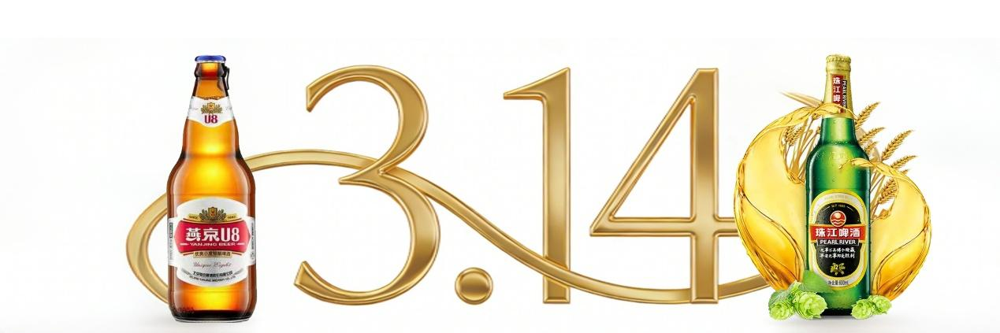
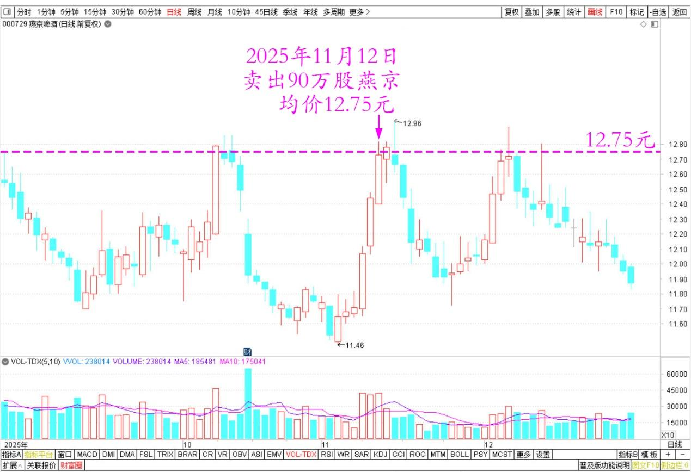
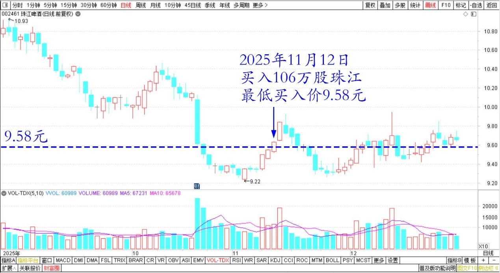
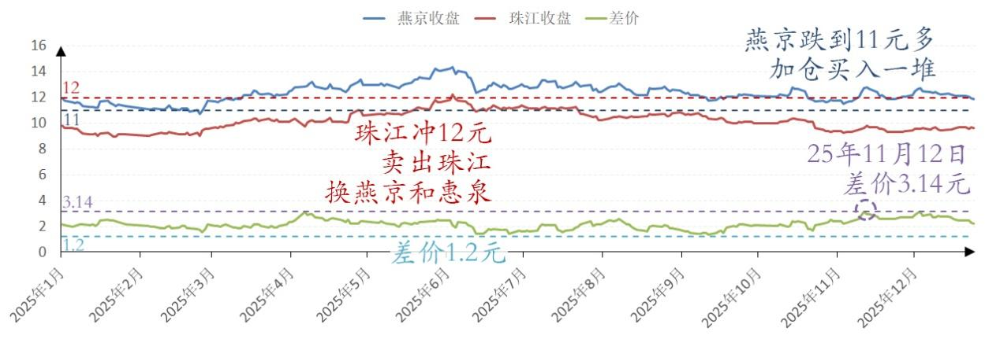

215篇.差价3.14元卖出燕京买入珠江

[清一山长](https://www.zhihu.com/people/shan-chang-qing-yi)[2025年11月12日15:19](https://www.zhihu.com/pin/1971960390175946036)

今日操作：

卖出了90万股燕京。均价12.75元。

燕京啤酒2025年9月～12月日线图

买入了106万股珠江。均价9.61元（最低买入价9.58元）

珠江啤酒2025年9月～12月日线图

两股差价3.14元，足以让我动心换股了。珠江居然有足够的卖家让我买入，挺难得的盘面，不然今天也无法操作如此顺利。

上次珠江冲12元，我也卖出了相当部分珠江的筹码，换了燕京和惠泉。当时的差价1.2～1.3元。记得珠江当时的卖出很困难，盘面上买卖都很少，现在下跌了，买卖都多了一点。所以上次就导致燕京等的买入也不顺利。本次燕京跌到11元多，再度加仓买入了一堆。现在涨了一元多，就先卖掉吧！我不贪心，赚一点点就走。更别说珠江还更低的下跌了，就多买了一点回来。

燕京啤酒、珠江啤酒2025年收盘价

感谢市场先生，现在让我用负成本持有上千万股燕京，燕京的激烈波动，让我的买入卖出行为得到了比持仓不动更好的回报。不过唐牛散根本不在意这点波动吧？他账面利润至少已经超过3亿了。

目前以零成本（0.17元）持有惠泉当十大。就是现在珠江啤酒的持有成本最高，有6元左右。主要是大量的珠江头寸，是在燕京等涨了之后才换入的，自然换入的成本相对较高。而且它的波动不大，还没有给我太多的卖出机会。导致仓位较重。所以现在珠江的持有成本相对较高，但也在能接受的范围内。6元珠江，应该没啥负担吧？

目前我的啤酒还不想减仓，只是换仓玩。总觉得……中国应该配得上啤酒大国的称号，目前中国的啤酒市值太可笑了。我就当中国的可口可乐来持有吧！一种大众饮料。

**（标题、图片为编者所加）**

文章音频：

[632篇.差价3.14元卖出燕京买入珠江](http://link.zhihu.com/?target=https%3A//www.ximalaya.com/sound/945315847)

**参考链接：**

[205篇.惠泉涨停卖出300万股](https://zhuanlan.zhihu.com/p/1979518999168571200)

[206篇.燕京快涨了，12月的啤酒行情也许有惊喜](https://zhuanlan.zhihu.com/p/1981117920756142902)

[207篇.买回几十万股惠泉，比2天前卖价低了1元多](https://zhuanlan.zhihu.com/p/1982146009615333147)

[208篇.股市案例分析——主力操盘的周期有多长（配图版）](https://zhuanlan.zhihu.com/p/1982798321073533837)

[209篇.中粮糖业主力走势猜想](https://zhuanlan.zhihu.com/p/1983556072204703566)

[210篇.茅台换什么？](https://zhuanlan.zhihu.com/p/1984033552149545369)

[211篇.惠泉逆势上涨突破涨停价](https://zhuanlan.zhihu.com/p/1984031933164955450)

[212篇.惠泉主力已经成功撤退了](https://zhuanlan.zhihu.com/p/1985014426399691858)

[链接汇总（截止2025年12月3日）](https://zhuanlan.zhihu.com/p/621215591?utm_psn=1967007144831350474)

