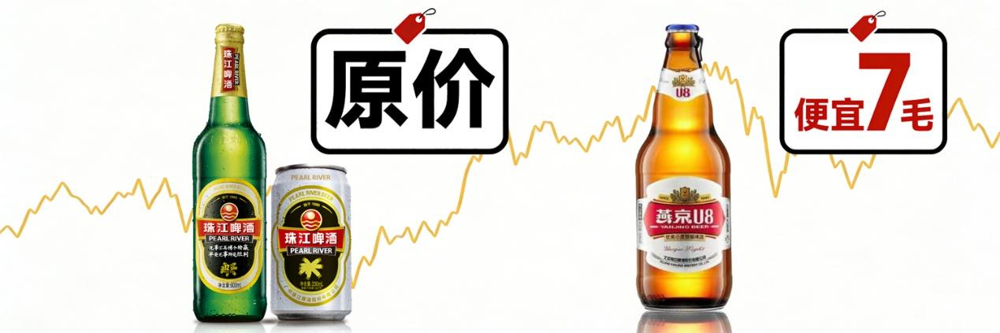
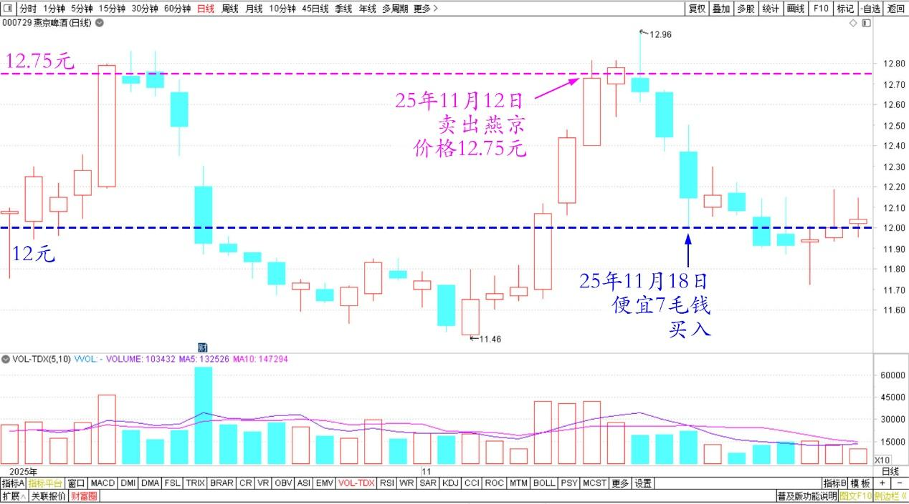
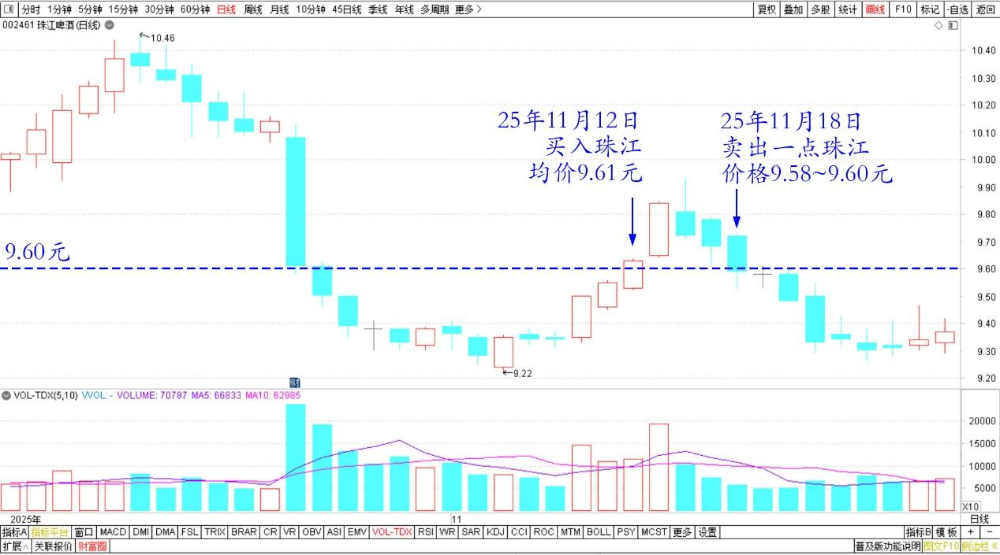

217篇.相比上次，原价卖出珠江、便宜7毛买入燕京

[清一山长](https://www.zhihu.com/people/shan-chang-qing-yi)[2025年11月19日15:02](https://www.zhihu.com/pin/1974127674373988892)

今日操作：

上次12.75元卖出的燕京，今天便宜了7毛钱买入。怎么能够想到几天之后，价格就跌到12.00了？

燕京啤酒2025年10月～11月日线图

同时今天也卖出了一点珠江，卖出的价格——正好是上次买入的价格，9.58～9.60元。相当于做了一个T。如果珠江第二天涨了三毛就卖掉，今天就拿到一块钱的差价了。只是我嫌弃3毛钱太少了不想要！七毛钱的话，可以做。

就是今天成交量不大，不像上次很容易成交，所以只做了一两成单子，没有完全拿回来。明天有机会再换。

珠江啤酒2025年10月～11月日线图

怎么觉得——就是有人要送我钱一样？乱做乱卖都赚钱！

几天又赚了几万……

不过，换句话说，今天我的市值损失了上千万，也许我应该躲起来哭一会！

谁才正常？哭还是笑。

链接：今日操作：|卖出了90万股燕京。均价12.75元。[https://www.zhihu.com/pin/1971960390175946036](https://www.zhihu.com/pin/1971960390175946036)

**（标题、图片为编者所加）**

文章音频：

[634篇.相比上次，原价卖出珠江、便宜7毛买入燕京](http://link.zhihu.com/?target=https%3A//www.ximalaya.com/sound/947112364)

**参考链接：**

[210篇.茅台换什么？](https://zhuanlan.zhihu.com/p/1984033552149545369)

[211篇.惠泉逆势上涨突破涨停价](https://zhuanlan.zhihu.com/p/1984031933164955450)

[212篇.惠泉主力已经成功撤退了](https://zhuanlan.zhihu.com/p/1985014426399691858)

[213篇.惠泉如此下跌，恐慌局面彰显](https://zhuanlan.zhihu.com/p/1986167584551356371)

[214篇.中国中冶下跌21%，买入600万股](https://zhuanlan.zhihu.com/p/1988364880248602866)

[215篇.差价3.14元卖出燕京买入珠江](https://zhuanlan.zhihu.com/p/1988669857282140083)

[216篇.白银换铜业，惠泉换燕京](https://zhuanlan.zhihu.com/p/1991242970293352126)

[链接汇总（截止2025年12月3日）](https://zhuanlan.zhihu.com/p/621215591?utm_psn=1967007144831350474)

