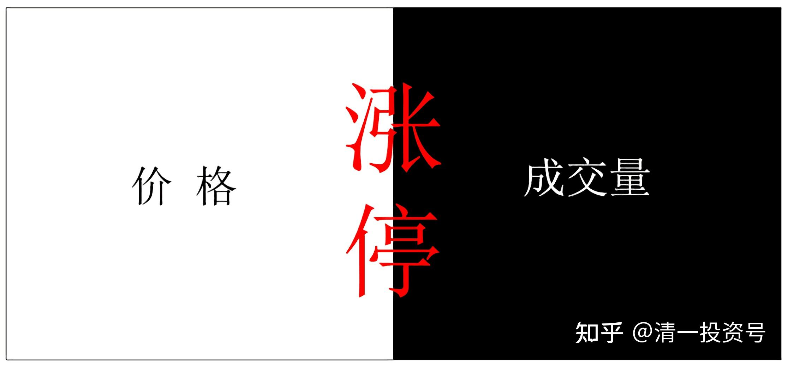
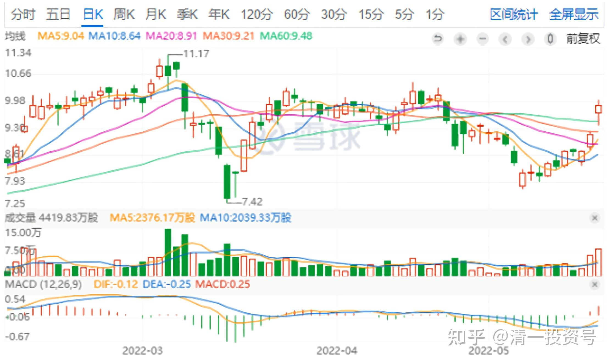
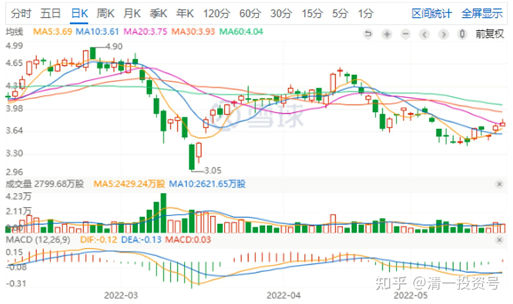
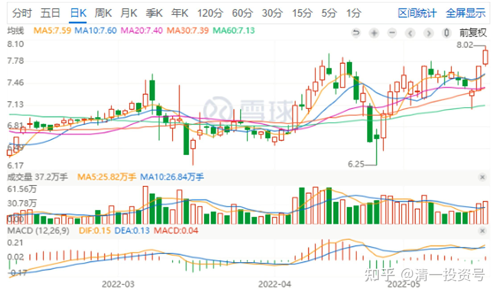
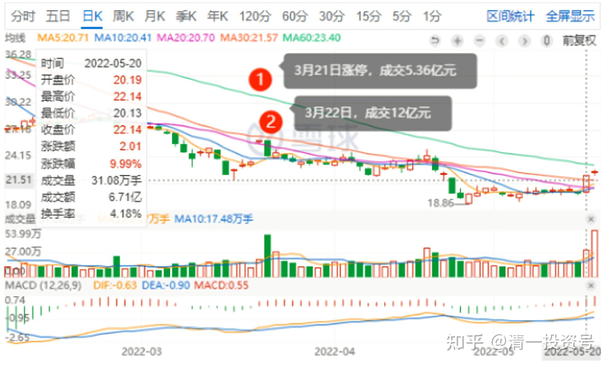
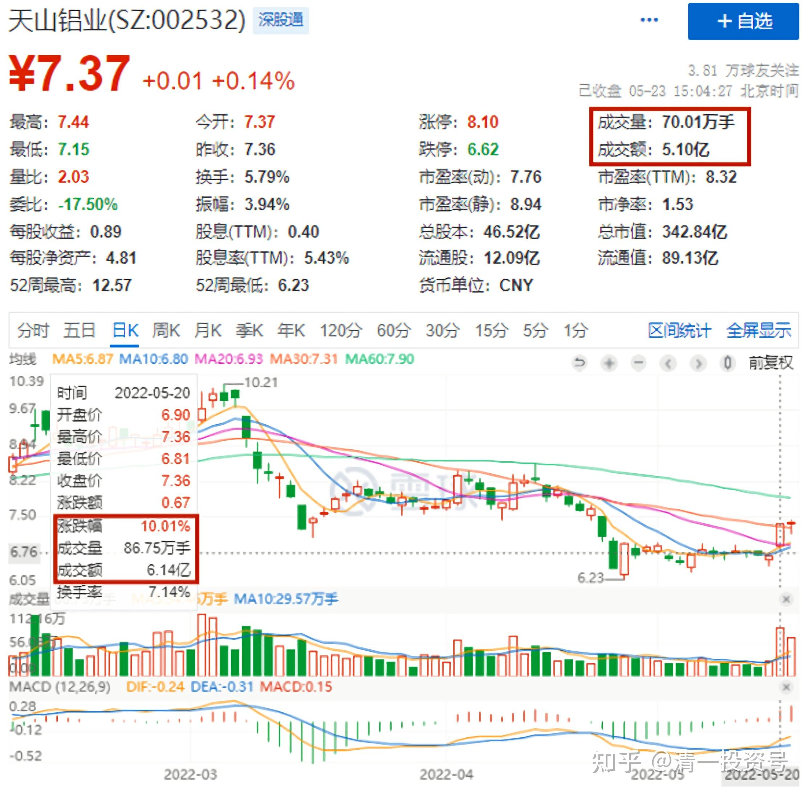
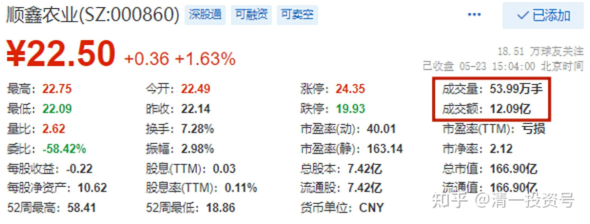

21篇.涨停心得：价格可以骗人，量不能骗人

清一山长 2022年5月23日

**一、积极调仓中**

今天9.90元，卖出30万股中国宏桥。这是前期跌到7元多补回来的部分。卖出的原因，是据说宏桥被纳入恒指蓝筹指数，所以导致基金被动买入，导致今天明显上涨。据说：指数基金调仓的时间会是三天，所以未来两天应该还会涨吧？目前负成本持有2M的仓位，持仓感觉还比较良好，正因为良好，所以卖出一点让大家一起幸福，想买的都可以买。但我不想失去有色股的仓位份额，所以，卖出的这部分资金，直接买了3.76元的洛阳钼业。

*中国宏桥日K线*

*洛阳钼业日K线*

2018年3月，中国宏桥和洛阳钼业都是5～6元的价格。到今天一个天上，一个地下，居然差价是3倍了。我这个人，喜欢“捡破烂”。**现在大家都不要洛阳钼业，都往死里砸盘，我就要一些吧！总比拿着美元港元好。**另外，为了平衡钼业的仓位，还卖掉一点金钼股份，8.00元卖出的，让别人也可以跟着赚钱吧！不过只卖了10%仓位。**有色似乎正在有点起色。我也在积极调仓中，争取多赚一点股。**

*金钼股份日K线*

**二、新手死于追高，老手死于抄底**

看盘心得分享——盘后看了一下顺鑫的走势，昨天居然涨停了，有趣。昨天没有放量，但今天量特别大。近期的成绩量新高了。这是我曾经重仓了两年的酒股，走掉的时候，创下单股利润第二的记录（当时的第一是中国建筑，至今依然保留第一的头衔。但第二名桂冠，早已经被珠江和惠泉等分别超越了。燕京也快超越了，还有望超越第一呢[大笑]）。所以，我对顺鑫还是有点感情的。

3月份，跌破22元的时候，我想过：是不是跌到20元左右盘整的话，我就买回来（当年我是19元买入长持的）。但正在想，还没动手，3月21日，它就来了一个涨停。如果缺乏头脑的前情人们（原来在顺鑫上赚了钱的人），一看有人抢筹呀？都会赶快重新买入了**。这种走势，就是诱惑原来在顺鑫上看好，但已经高位抛出的持股人，再度低位买入的。**但我多了一个心眼，就是觉得，现在涨停，不像顺鑫的风格，真要“抢货”，没有这样急的。**原来的顺鑫主力，很像燕京现在的主力，超级有耐心，也超级磨人，特别喜欢反向做盘，出人意料。所以才不会这样抢货呢！**反而判断—这应该是被套住的主力自救的行情，这货这样走，不计代价，说明基本面已经走坏了，不能入了。所以，我一股也没有买。

果然，顺鑫农业后来又跌下来了。还破了我计划买入的点位20元（按道理，如果顺鑫基本面没有走坏的话，20元应该是底部的）。一路最低跌到18元多，但我真心不敢动了。一看这种股走势，进去就是“刀口舔血”的架势，弄不好就被闷在里面了。**上一个交易日（上周五），居然又再度的涨停了。**我想：是不是又是诱多？目前走势，虽然还不好说明到底如何。

但今天成交量大增，比上次的3月22日的涨停次日的跌势成交量更大。我绝对不相信是主力高价把货都买走了，我相反认为：是主力在赔本卖货。买一送三（顺鑫最高价78元多）。**如果主力低位出货的话，此后多年，这个股都没有希望再恢复昔日荣光了。**不然，里面的主力资金，不会这样疯狂拉涨停来出货的。如果不拉涨停，正常出货的话，一个台阶一个台阶的下去，跌得更难看。**用涨停勉强修复一下技术指标，还可以多拖一点时间。**但已经疲态尽显。**这就是【新手死于追高，老手死于抄底】的道理**。主力庄家是什么人都可以吃定你的。**我老手新手都不当，就当股市滑头。死不追高，涨停就卖货，发现不对劲，就赶快溜走。**

*顺鑫农业日K线*

大家小心这种走势的股。我非常感谢顺鑫，让我对酒业有了感觉，敢重仓了。虽然现在重仓啤酒，看样子不太聪明，但起码走势，基本面，都能让人放心。**假如燕京真的走出顺鑫这样的走势，我也会吓得赔本就跑的。绝对不会在底部看到两个涨停就很兴奋，跟随追入。**

**多年没有涨停的燕京，我敢于持有。两个月就两个涨停的顺鑫，我一股也不敢买。**这就是“看透本质”的价值，谁说“学哲学没有用？”。最强调看透事物本质的，就是哲学。

**三、基本面没坏的涨停**

**对比：正常的底部拉涨停，基本面没有坏的，应该是天山铝业这种涨停模式**。昨天的涨停，成交量不太高，但也不少，6个多亿了。但今天**涨停价的高位上下震荡，但成交量居然还减少了，**今天才成交5个亿。但总市值只有天山铝业一半的顺鑫农业，昨天涨停，成交近7亿。今天高位震荡，看起来比天山走得好，涨了一个多点，天山只象征性的涨了一分钱，但今天成交量是12个亿。**现在你们知道了？价格可以骗人，但量不能骗人的。这个走势说明——顺鑫的主力肯定是出货。**天山主力，至少没有看到明显的出货迹象。

教你们这些看盘知识，希望你们学会自己吃饭。学不会，注定是被机构主力吃死的角色。想赚快钱，注定九死一生。

附：相关文章

[清一投资号：2篇. 现在投资大宗和有色金属的理由](https://zhuanlan.zhihu.com/p/467079274)（新作）

[清一投资号：7篇． 重新开始买钢铁股，有色股也正在接入](https://zhuanlan.zhihu.com/p/475579872)（新作）

[清一投资号：12篇.看盘心理学－博弈学的智慧](https://zhuanlan.zhihu.com/p/490393601)（新作）

[清一投资号：20篇.三种涨停](https://zhuanlan.zhihu.com/p/519414679)（新作）

[清一投资号：第5篇.四大“最庄”评比：最佳，最傻，最阴险，最无为](https://zhuanlan.zhihu.com/p/520593354)（整理文）

[清一投资号：第2篇.庄家入住操盘四个阶段](https://zhuanlan.zhihu.com/p/477773067)（整理文）

（标题为编者所加）

