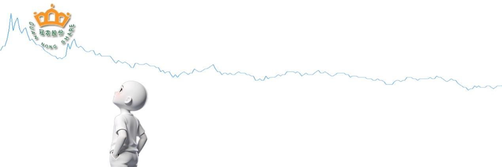
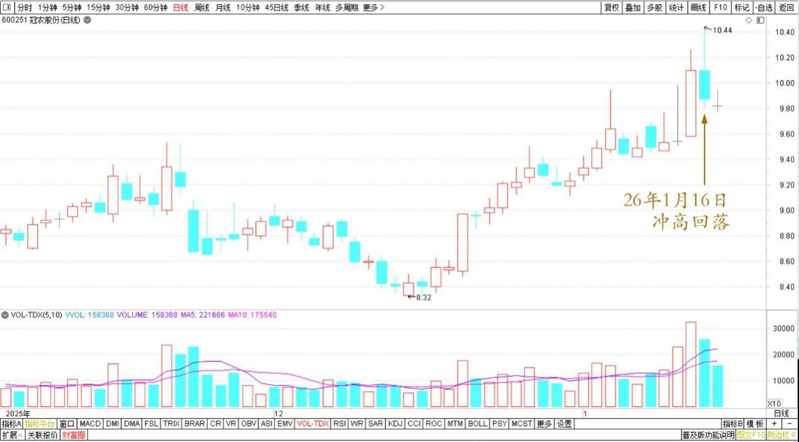
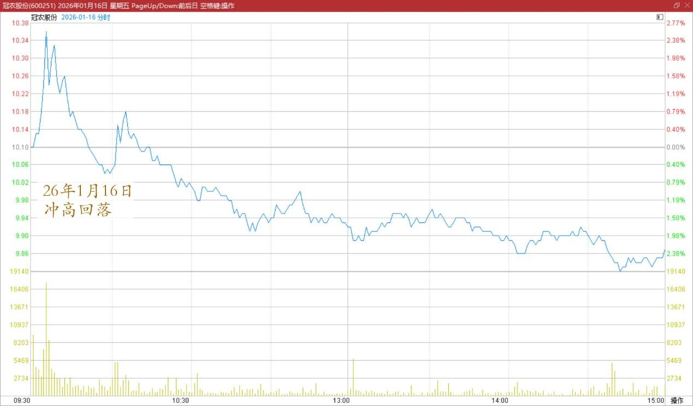
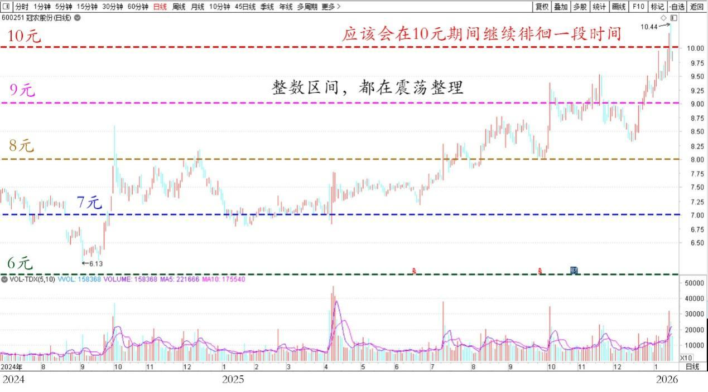

221篇.冠农在洗盘，看着不做T

清一山长 [2026年1月16日13:52](https://www.zhihu.com/pin/1995492018080720105)

冠农股份今天冲高回落，说明冠农还在洗盘。

冠农股份2025年11月~2026年1月日线图

冠农股份2026年1月16日分时图

应该会在10元期间继续徘徊一段时间，真的是步步为营。6元、7元、8元、9元整数区间，它都在震荡整理，证明主力志在长远。

冠农股份2024年7月~2026年1月日线图

我们也没啥好操心的，安心持股就行了，等整理结束。因为这架势，也不是出货的架势，有啥害怕的。

当然，如果只是会看K线图，今天就是冲高回落，出货的架势。只是我不相信现在谁会出货，只会吞吞吐吐的，做一点差价！

我没本事，也没时间陪玩。就不做T了，看着，等待！

**（标题、图片为编者所加）**

文章音频：

[639篇.冠农在洗盘，看着不做T](https://link.zhihu.com/?target=https%3A//www.ximalaya.com/sound/951972284)

**参考链接：**

[211篇.惠泉逆势上涨突破涨停价](https://zhuanlan.zhihu.com/p/1984031933164955450)

[212篇.惠泉主力已经成功撤退了](https://zhuanlan.zhihu.com/p/1985014426399691858)

[213篇.惠泉如此下跌，恐慌局面彰显](https://zhuanlan.zhihu.com/p/1986167584551356371)

[214篇.中国中冶下跌21%，买入600万股](https://zhuanlan.zhihu.com/p/1988364880248602866)

[215篇.差价3.14元卖出燕京买入珠江](https://zhuanlan.zhihu.com/p/1988669857282140083)

[216篇.白银换铜业，惠泉换燕京](https://zhuanlan.zhihu.com/p/1991242970293352126)

[217篇.相比上次，原价卖出珠江、便宜7毛买入燕京](https://zhuanlan.zhihu.com/p/1992280288085156435)

[218篇.今天的燕京总算涨了](https://zhuanlan.zhihu.com/p/1992385943613744206)

[219篇.燕京开年首日交易涨了5%](https://zhuanlan.zhihu.com/p/1993717323442431455)

[链接汇总（截止2026年1月16日）](https://zhuanlan.zhihu.com/p/621215591?utm_psn=1967007144831350474)

