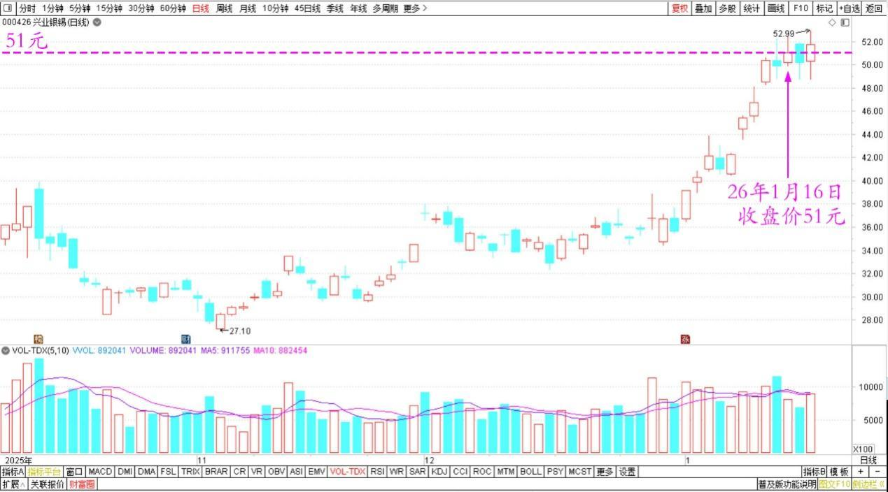
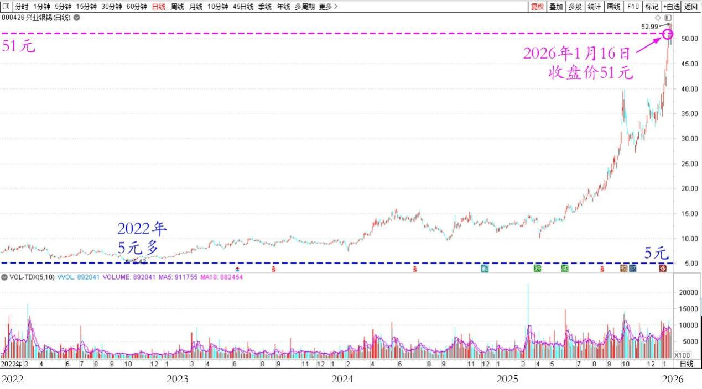
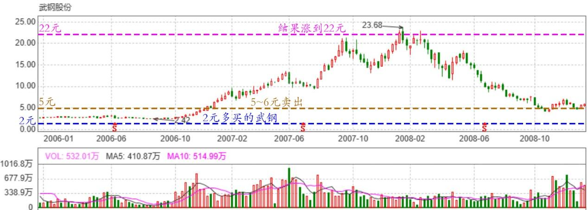

222篇.牢牢守住手中的有色筹码

清一山长[2026年1月16日16:28](https://www.zhihu.com/pin/1995532252273213870)

10倍股，真疯了！

今天意外看到兴业银锡，价格居然是51元。

兴业银锡2025年10月～2026年1月日线图

我有点疑惑的看它的走势，发现两年多以前，也就5元。现在涨了10倍。真的了不起！

兴业银锡2022～2026年日线图

好好研究一下主力的手法，怎么可能有这么大的差异！

想看2006年我错过的财富机遇。2元多买的武钢，5-6元就卖掉了。结果涨到22元！

武钢股份2006～2008年周线图

也许现在20年后，还要再玩一遍这样的游戏，所以：我需要牢牢守住手中的有色筹码！

**（标题、图片为编者所加）**

文章音频：

**参考链接：**

[211篇.惠泉逆势上涨突破涨停价](https://zhuanlan.zhihu.com/p/1984031933164955450)

[212篇.惠泉主力已经成功撤退了](https://zhuanlan.zhihu.com/p/1985014426399691858)

[213篇.惠泉如此下跌，恐慌局面彰显](https://zhuanlan.zhihu.com/p/1986167584551356371)

[214篇.中国中冶下跌21%，买入600万股](https://zhuanlan.zhihu.com/p/1988364880248602866)

[215篇.差价3.14元卖出燕京买入珠江](https://zhuanlan.zhihu.com/p/1988669857282140083)

[216篇.白银换铜业，惠泉换燕京](https://zhuanlan.zhihu.com/p/1991242970293352126)

[217篇.相比上次，原价卖出珠江、便宜7毛买入燕京](https://zhuanlan.zhihu.com/p/1992280288085156435)

[218篇.今天的燕京总算涨了](https://zhuanlan.zhihu.com/p/1992385943613744206)

[219篇.燕京开年首日交易涨了5%](https://zhuanlan.zhihu.com/p/1993717323442431455)

[链接汇总（截止2025年12月3日）](https://zhuanlan.zhihu.com/p/621215591?utm_psn=1967007144831350474)

