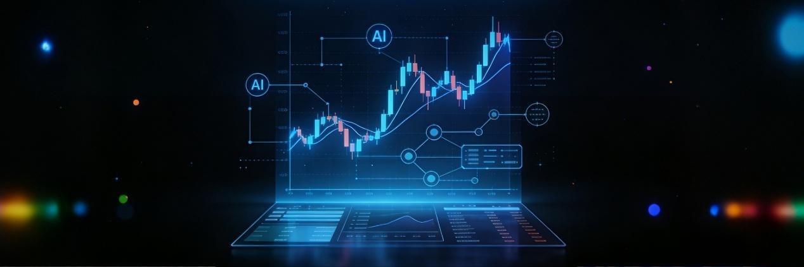
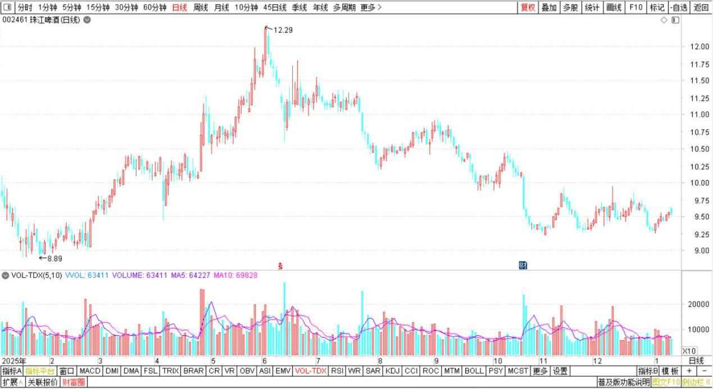
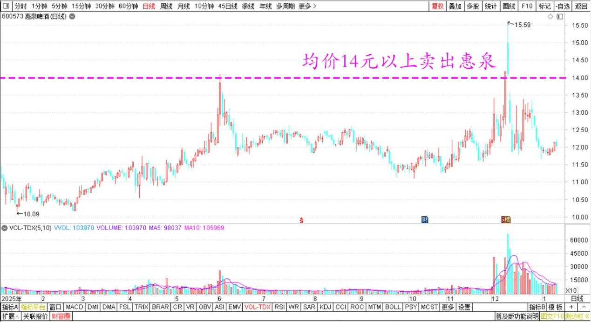
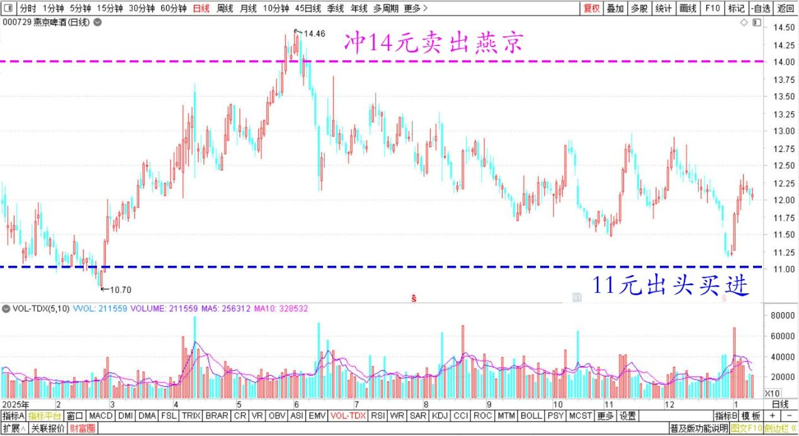
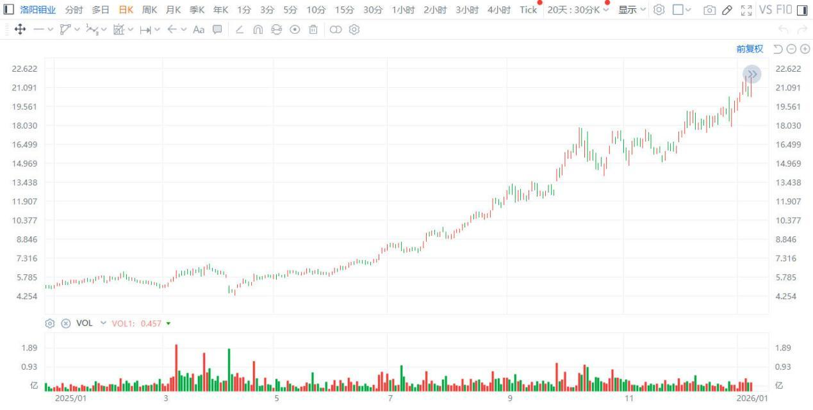
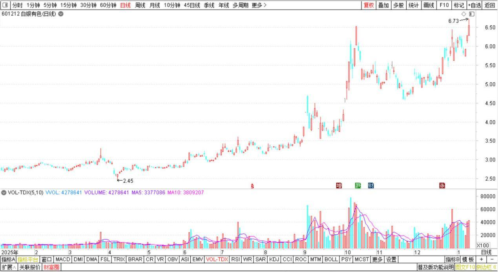
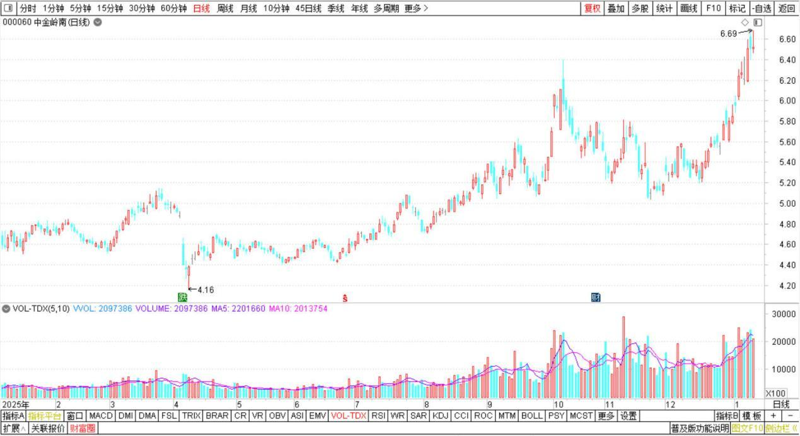

223篇.AI智能测算我的投资

**清一山长[2026年1月6日16:24](https://www.zhihu.com/pin/1991905541346309768)**

今天看到我的券商。对我2025年度的业绩评估！估计是AI自动做的！

**1、最精准抄底**

在8.49元买入珠江啤酒？我有点懵——我记得去年的珠江，有跌到7元的时候吧？怎么我就精准抄底了？

珠江啤酒2025年日线图

**2、最成功的卖出**

单笔卖出收益8位数，是燕京啤酒！大概是燕京冲14元的时候卖出的？

**3、燕京是亏损还是赚钱？**

但累计收益是负数，负130401.95元！

燕京明明是我最赚钱的股票好吧？不过这是2025年末，我正好高位。（均价14元以上卖出惠泉后，大量买进燕京11元出头的燕京。这样算起来，似乎摊到燕京上的成本就太高了。导致“亏本”？）

惠泉啤酒2025年日线图

燕京啤酒2025年日线图

**4、收益最多是有色金属**

这个是对的！

洛阳钼业港股2025年日线图

白银有色2025年日线图

中金岭南2025年日线图

**5、亏损最多的是酿酒、饮料？**

这个怎么和我的记忆不符合？燕京亏了十几万就最多了？哼！

**结论：**别相信AI有多智能，我看——它的指标是很单纯的。不足以评估对象的投资风格，别相信他们“懂你”。

也别相信他们懂市场！

于是我放心了。我认为AI目前应该还打不赢我的（投资上）。

不过据说梁文锋的AI就很厉害。这怎么回事呢？

**山长 清一2026-01-06 16:44老挝**

我看了K线年线图，我怀疑是把年末持仓数量，简单地乘以这一年的收益率（珠江和燕京年度收益都是负数），因此AI来个总结，判决我应该是亏了，其实燕京是大赚的。饮料食品的行业投资总体也是赚的，没有亏损。只是年线图亏了。所以，**别相信这些智能机器，**它们真的很呆！[捂脸]。一方面AI说总收益创年度新高，一方面又说重仓的收益不好，有点好笑！[耶]

**（标题、图片为编者所加）**

文章音频：

[637篇. AI智能测算我的投资](http://link.zhihu.com/?target=https%3A//www.ximalaya.com/sound/950994171)

**参考链接：**

[215篇.差价3.14元卖出燕京买入珠江](https://zhuanlan.zhihu.com/p/1988669857282140083)

[216篇.白银换铜业，惠泉换燕京](https://zhuanlan.zhihu.com/p/1991242970293352126)

[217篇.相比上次，原价卖出珠江、便宜7毛买入燕京](https://zhuanlan.zhihu.com/p/1992280288085156435)

[218篇.今天的燕京总算涨了](https://zhuanlan.zhihu.com/p/1992385943613744206)

[219篇.燕京开年首日交易涨了5%](https://zhuanlan.zhihu.com/p/1993717323442431455)

[220篇.冠农果然启动了](https://zhuanlan.zhihu.com/p/1996318789797691507)

[221篇.冠农在洗盘，看着不做T](https://zhuanlan.zhihu.com/p/1997433535749981954)

[222篇.牢牢守住手中的有色筹码](https://zhuanlan.zhihu.com/p/1998832938889020019)

[链接汇总（截止2026年1月16日）](https://zhuanlan.zhihu.com/p/621215591?utm_psn=1967007144831350474)

