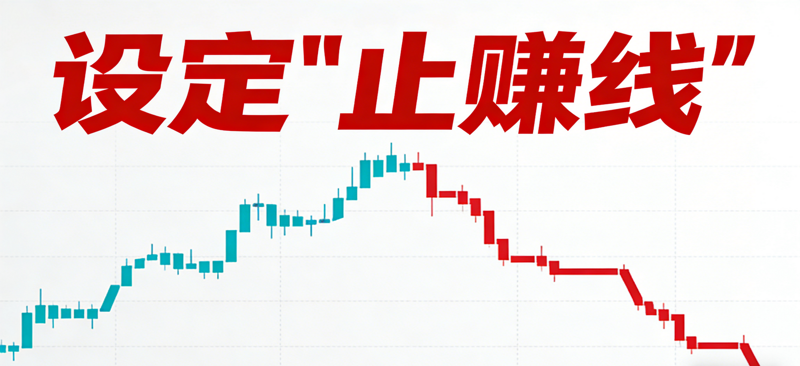
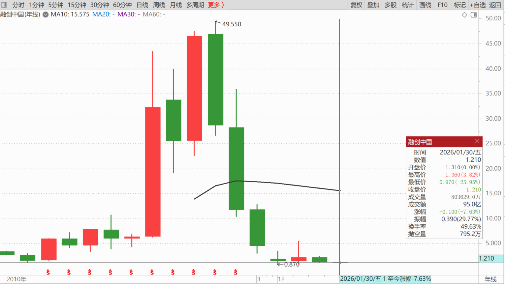
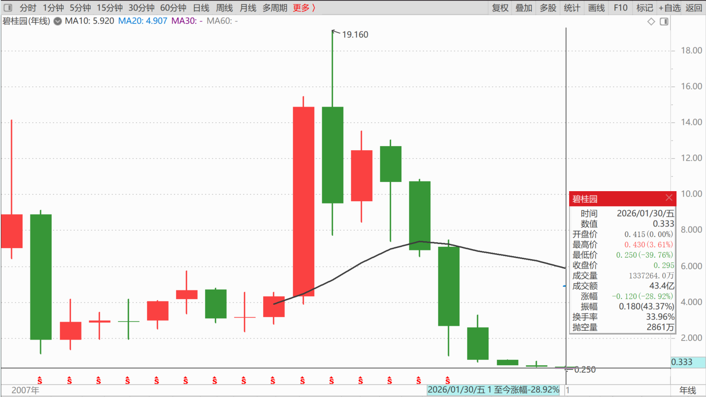
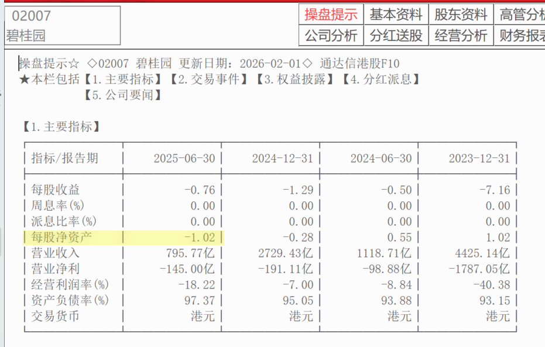

226篇. 设定“止赚线”

清一山长2026-01-21 16:27

首富的堕落。

今天去看了一下融创，还有碧桂园，这些原来赫赫有名的企业，今天凄凉地躺在地上。

碧桂园的年K线，2020年前都是往上走的，记得多次媒体报道他们家接班的女儿是中国首富。我相信过去40年，他们一家是勤奋努力，打拼了两代人的。

但现在，一切归于零，净资产已经是负数。当年多辉煌，今天就有多凄凉。比《红楼梦》的曹家更凄凉吧？

其实政府根本就不怕你致富，只怕你不玩这个游戏了。就像赌场一样，不怕你赚钱，就怕你赚钱之后就走了！不玩了！

我认为：**每个人都要设定“止赚线”，钱赚够了就算了，别去拼命赚，不然没赚到更多还把原来的钱都赔回去了！**

如果2020年，或者再早一点，杨家就不玩了，退出了，现在不就是很牛的牛人吗？

李嘉诚虽然被很多人骂，嘲笑他很早就“跑了”，但他不当英雄，当狗熊，不就躲掉了一个大大的大坑吗？

**（标题、图片为编者所加）**

文章音频：

[643篇. 设定“止赚线”](http://link.zhihu.com/?target=https%3A//www.ximalaya.com/sound/954158074)

[218篇.今天的燕京总算涨了](https://zhuanlan.zhihu.com/p/1992385943613744206)

[219篇.燕京开年首日交易涨了5%](https://zhuanlan.zhihu.com/p/1993717323442431455)

[220篇.冠农果然启动了](https://zhuanlan.zhihu.com/p/1996318789797691507)

[221篇.冠农在洗盘，看着不做T](https://zhuanlan.zhihu.com/p/1997433535749981954)

[222篇.牢牢守住手中的有色筹码](https://zhuanlan.zhihu.com/p/1998832938889020019)

[223篇.AI智能测算我的投资](https://zhuanlan.zhihu.com/p/2000092630047031860)

[224篇.坚持有色不减仓，卖出白银换铜业](https://zhuanlan.zhihu.com/p/2000104725555736998)

[225篇.燕京的猜想](https://zhuanlan.zhihu.com/p/2001294008115287766)

[链接汇总（截止2026年1月22日）](https://zhuanlan.zhihu.com/p/621215591?utm_psn=1967007144831350474)

