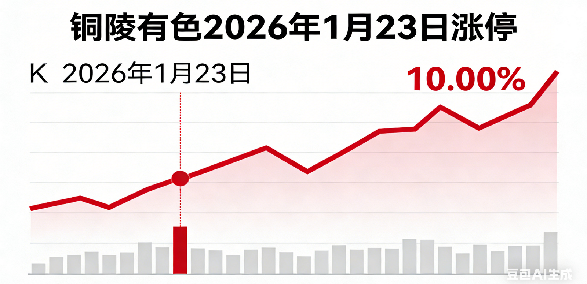
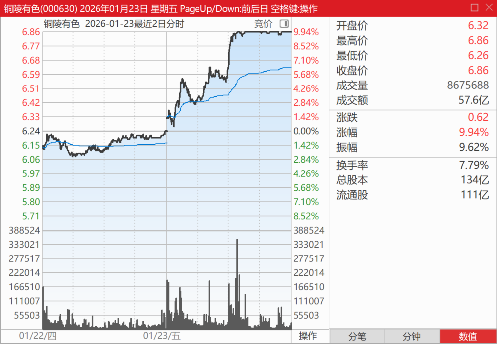
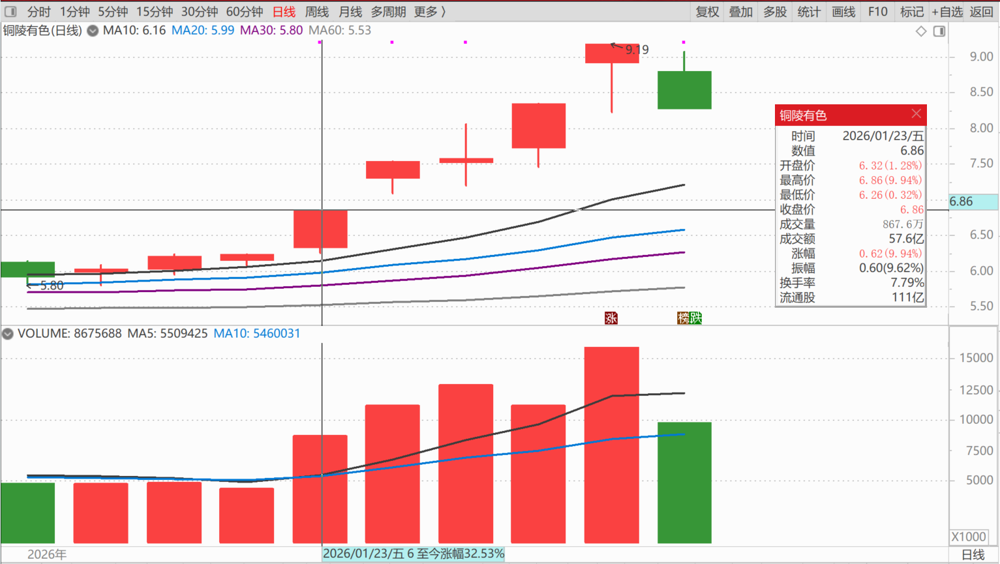

[清一山长2026-01-23 14:28](http://www.zhihu.com/pin/1998037848323015267)

今天账户再创新高了，不可思议。有时候钱就这样送来了。等待几年的行情，突然出现在自己面前的时候，还有点不太适应！

我重仓的三个有色金属，两个涨停了，另外一个也接近涨停，冲涨到9.22%了。

我最高兴的就是昨天补仓了200多万股的铜业股今天也涨停了。

从走势上看，今天的涨停成交量巨大，封板封不稳，很多人都在跑！

但今天应该是买入的时机，因为大多数人都在逃走，但大多数人应该是错的。我们必须要反向而行，所以今天应该继续买入。

不过我已经拿了千万股的仓位，就不要贪心了，赚到的已经够多了。

我另外找了一个没涨太多的金属股票，补上了100万股，纪念今天的涨停潮。

感觉上今天的有色很强，很疯狂。周一有望继续。

**（标题、图片为编者所加）**

文章音频：

[644篇.昨天补仓的铜陵今天涨停](http://link.zhihu.com/?target=https%3A//www.ximalaya.com/sound/954413409)

[220篇.冠农果然启动了](https://zhuanlan.zhihu.com/p/1996318789797691507)

[221篇.冠农在洗盘，看着不做T](https://zhuanlan.zhihu.com/p/1997433535749981954)

[222篇.牢牢守住手中的有色筹码](https://zhuanlan.zhihu.com/p/1998832938889020019)

[223篇.AI智能测算我的投资](https://zhuanlan.zhihu.com/p/2000092630047031860)

[224篇.坚持有色不减仓，卖出白银换铜业](https://zhuanlan.zhihu.com/p/2000104725555736998)

[225篇.燕京的猜想](https://zhuanlan.zhihu.com/p/2001294008115287766)

[226篇. 设定“止赚线”](https://zhuanlan.zhihu.com/p/2001908287390650417)

[链接汇总（截止2026年1月22日）](https://zhuanlan.zhihu.com/p/621215591?utm_psn=1967007144831350474)
