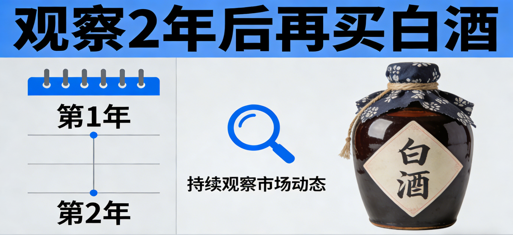
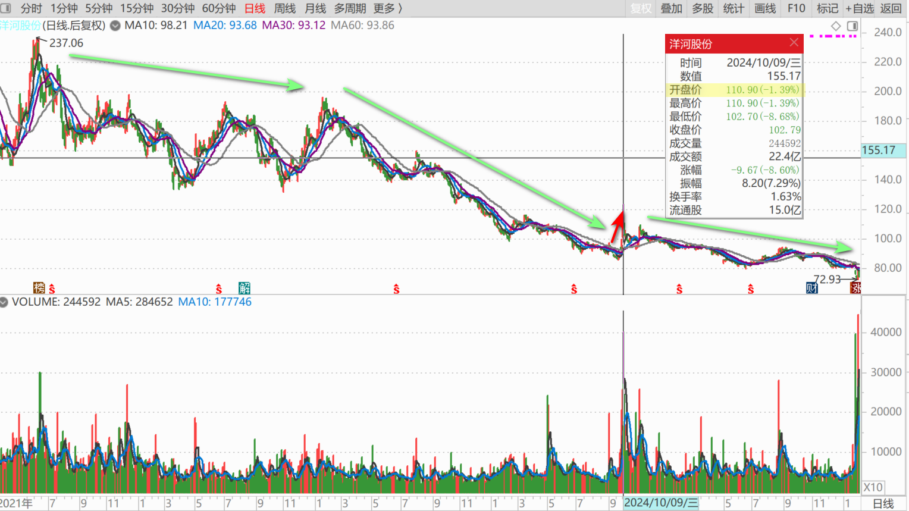
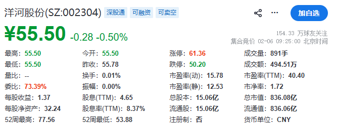
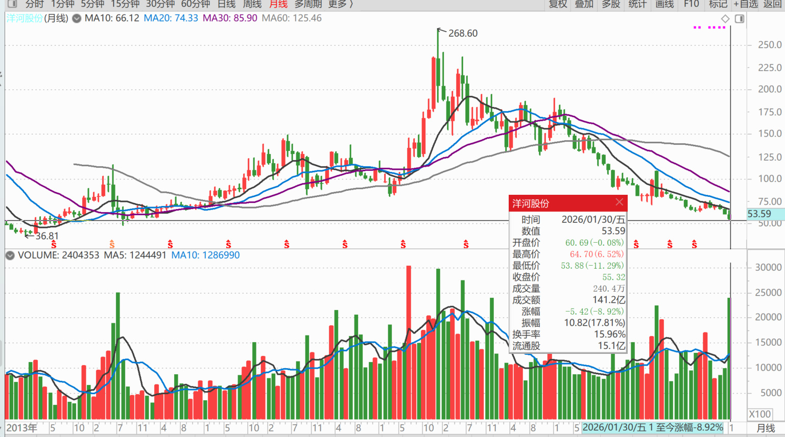
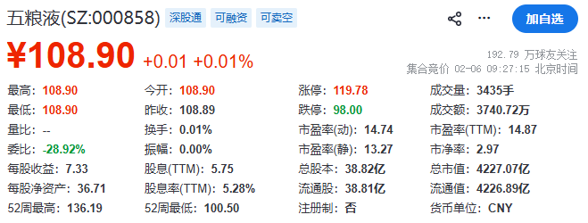
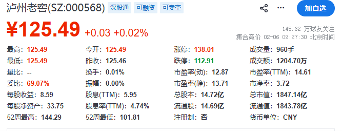

**

**

229篇.观察两年之后，再买白酒

**[清一山长2026-01-24 21:58](http://www.zhihu.com/pin/1998510092539172719)**

**洋河背后的猫腻：**

很多人冲着洋河股份拿分红，目前股价按去年的分红率是7%以上买入，认为是一笔绝佳的投资！因为洋河保证每年分红不低于70亿。因此这个分红率是稳的。

我心想：真相信洋河的保证，银行自己有钱，就首先都全买洋河股份，长期去拿7%的分红，真没必要3%借给我用。

但，似乎真有这个承诺，两年前洋河股份的承诺！

仔细一看，就有点好笑了：洋河承诺每年利润70%分红，而且不低于70亿的时候，它这年实际上的利润，也才66亿元！

我查了一下，这个承诺，是洋河在从224元的高价，跌到70元的时候（2024年8月），管理层为了安抚股民推出来的政策。这一政策，让当时已经跌到底部的洋河（73元多），涨回了100元以上。成交量也放大了，我不知道是不是帮助一些人逃走了。但事实上，之后就是连续下跌一直到现在，再创新低60元。当时相信洋河管理层的承诺，甚至还以为利润可以冲100亿的幻想家股民，全给套牢了。至今已经跌到了只剩60%了。假如当年是高位100多元满仓满融买的洋河，想要吃利息的股民，现在已经快要爆仓了！

说实话，我也眼馋7%以上的股息，只是我不敢相信真的有这笔钱。毕竟，分红是企业有钱才能分给你，没钱它分个啥？

**如果企业走在下行通道上，你去接飞刀，就会死得快！**

所以，**我打算观察两年之后，再买白酒。**忍住心，管住手。现在看起来再馋，我也不动手，只看不动。

别说洋河了，五粮液和泸州老窖，股息率、市盈率，看上去真的好吸引人。可我真不敢买！**死死地管住手，等两年再来看，能买不能买，两年后决定。**

我喜欢洋河，但没买过，也没喝过。但是我知道管理层很有水平，营销做得很好，也许，两年后我们可以与洋河合作，推出**“洋河冠军酒”**。哈哈！

【洋河股份于2026年1月23日发布《现金分红回报规划（2025-2027年度）》，取消原2024-2026年“每年现金分红不低于净利润70%且保底70亿元”的承诺，调整为“不低于净利润100%”的新政策，但删除金额下限。根据2025年业绩预告（净利润21～25亿元），实际分红额将从70亿元降至20～25亿元，降幅达65%。】

**（标题、图片为编者所加）**

文章音频：

[646篇. 观察两年之后，再买白酒](http://link.zhihu.com/?target=https%3A//www.ximalaya.com/sound/954629645)

**参考链接：**

[225篇.燕京的猜想](https://zhuanlan.zhihu.com/p/2001294008115287766)

[226篇. 设定“止赚线”](https://zhuanlan.zhihu.com/p/2001908287390650417)

[227篇.昨天补仓的铜陵今天涨停](https://zhuanlan.zhihu.com/p/2002022964682568534)

[228篇.白银第四个涨停，铜业第一个涨停](https://zhuanlan.zhihu.com/p/2002506915129880752)

[链接汇总（截止2026年1月24日）](https://zhuanlan.zhihu.com/p/621215591?utm_psn=1967007144831350474)
