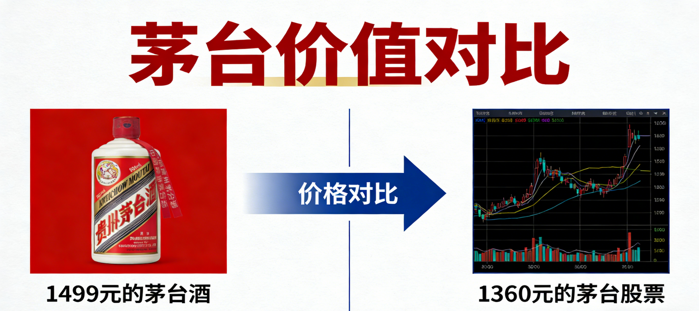
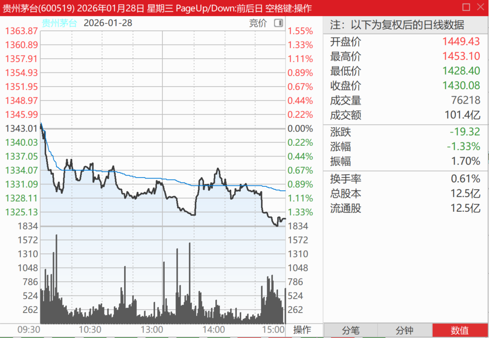
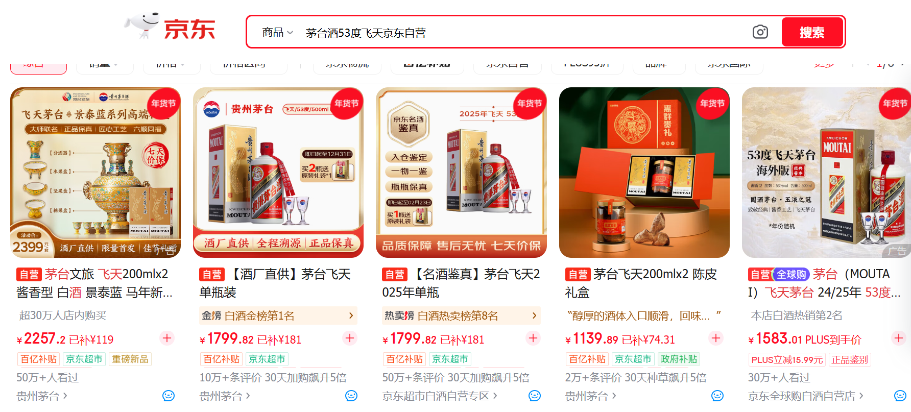

231篇.1499元的茅台酒与1360元的茅台股票

[清一山长2026-01-28 14:32](https://www.zhihu.com/pin/1999851343557436446)

1499元的茅台酒与1360元的茅台股票！

**今天股市大涨，茅台等绩优股却在跌，昨天有色的跌，原来是假跌，今天报复性上涨。**

我很奇怪现在很多人去抢茅台酒。

如果你真的喜欢茅台，愿意花1499元去买一瓶茅台酒，你干嘛不少花一点钱，只用1360元去买一股贵州茅台股票，然后存股票？

这样的话，每一股贵州茅台股票，每年都会分52元以上的红利给你！

可是你买的茅台酒，不会每年多涨几克给你吧？还要让你操心怎么存放。

这种划不来的事情怎么能做呢！

**（标题、图片为编者所加）**

文章音频：

[648篇. 1499元的茅台酒与1360元的茅台股票](http://link.zhihu.com/?target=https%3A//www.ximalaya.com/sound/955772184)

**参考链接：**

[225篇.燕京的猜想](https://zhuanlan.zhihu.com/p/2001294008115287766)

[226篇. 设定“止赚线”](https://zhuanlan.zhihu.com/p/2001908287390650417)

[227篇.昨天补仓的铜陵今天涨停](https://zhuanlan.zhihu.com/p/2002022964682568534)

[228篇.白银第四个涨停，铜业第一个涨停](https://zhuanlan.zhihu.com/p/2002506915129880752)

[链接汇总（截止2026年1月24日）](https://zhuanlan.zhihu.com/p/621215591?utm_psn=1967007144831350474)
