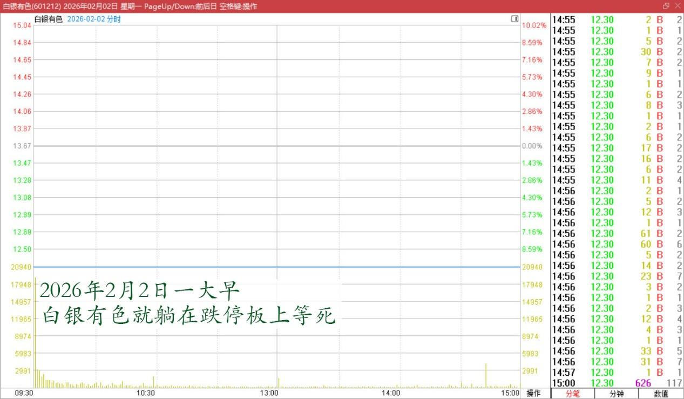
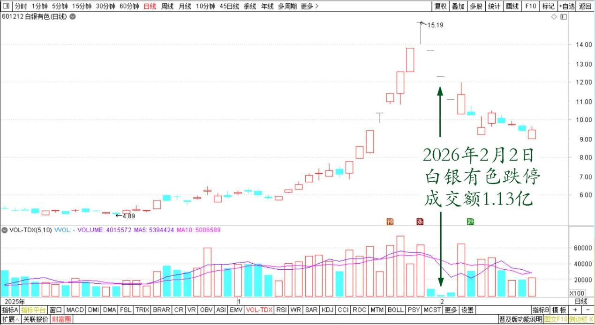
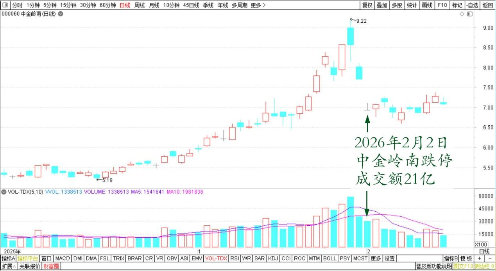
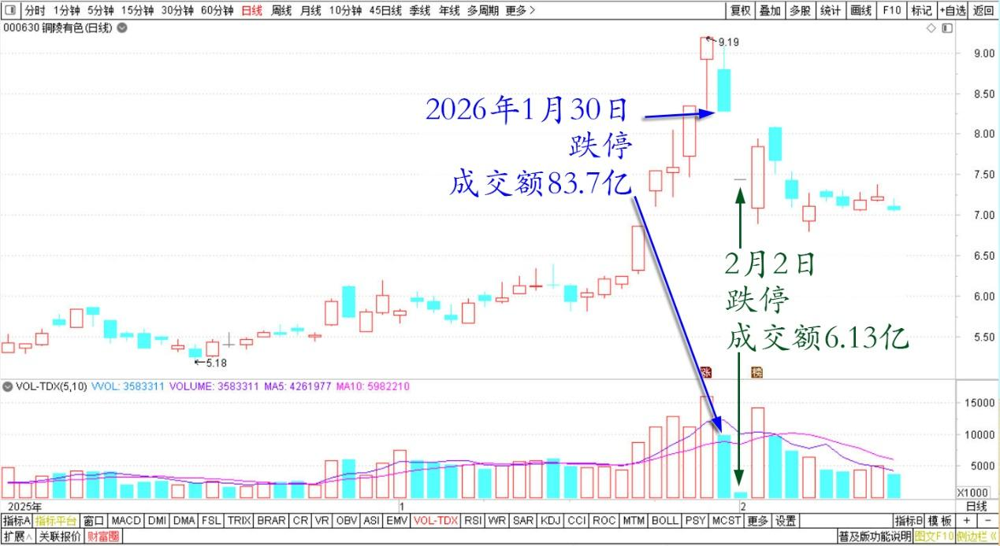

237篇.同样的跌停，不一样的成交量

清一山长[2026年2月2日11:55](https://www.zhihu.com/pin/2001619484591535409)

高手看量不看价！

今天周一，一大早白银有色就躺在跌停板上等死，成交才数千万元！上一交易日的成交很少！

白银有色2026年2月2日分时图

白银有色2025年12月～2026年2月日线图

这是无量空跌。最危险的一种跌法！

我认为：白银有色已经完了，现在没有人想要它了！前段时间的猛涨，就像幻梦一样不真实。

目前这种无量空跌的局面，我怀疑主力已经走了，未来很不乐观！

很庆幸我的几百万股白银有色，之前都全出光了。出货后，看它继续涨停，我显得像个傻瓜。我认为不是我的菜，根本没有啥想法。

当然，我持仓的其他有色也在大跌，我似乎没有讨到啥好处的！

中金岭南的局面就完全不一样，大量资金在跌停板上抢货，每天都有几十亿成交。

中金岭南2025年12月～2026年2月日线图

**未来这两只股的命运，肯定是完全不一样的！中金，应该是率先反弹的有色个股！**

铜陵有色也一样，连续两日跌停！

**这些股票不一样的地方，就是成交量不一样！**

上一交易日跌停封死，但居然有80多个亿的成交量，说明上一天，有很多资金，是非常看好铜陵的。但今天就大幅萎缩了，只有5个亿。

铜陵有色2025年12月～2026年2月日线图

老股民都知道：价格可以骗人，但成交量没法骗人。涨停，跌停，都是大资金可以玩给你看的东西，但成交量才能说明真正的奥秘！

只是懂得看成交量的人很少，大多数人是傻子，只会看价格！价格就像是斗牛士手中的红布——只能骗没脑子的傻瓜牛。

我昨天很傻气，接了下跌的飞刀：买了一百万股中金岭南。

今天打算什么都不动。继续等等，等明天再看！

**如果再跌，就再出手！反正手上有钱，心里不慌！**

**我相信有色的趋势没有完，还刚开始。我相信会回来的！**

铜陵9.19元，我只卖掉一百万股太少了，我真傻。反省自己的贪心！

但铜陵上一个交易日的大跌80多亿元的成交让人印象深刻！今天板上20多亿的卖单，也令人印象深刻！

我明天再看看动静！

**现在有机会就买点有价值的好股，存起来过冬！学松鼠！**

**（标题、图片为编者所加）**

文章音频：

[654篇.同样的跌停，不一样的成交量](https://link.zhihu.com/?target=https%3A//www.ximalaya.com/sound/958257135)

**参考链接：**

[230篇.白银继续涨停，中金岭南涨一倍](https://zhuanlan.zhihu.com/p/2002834813908963593)

[231篇.1499元的茅台酒与1360元的茅台股票](https://zhuanlan.zhihu.com/p/2002832147816413177)

[232篇.连续两天重仓大涨的复盘思考！(配图版)](https://zhuanlan.zhihu.com/p/2004623291822932869)

[233篇.卖百万股铜陵，买入百万股中建](https://zhuanlan.zhihu.com/p/2005054869774541276)

[234篇.我认为有色还没有走完](https://zhuanlan.zhihu.com/p/2005494857267946428)

[235篇.今天又再次为国接盘了！](https://zhuanlan.zhihu.com/p/2005417198714394453)

[236篇.美元霸权消逝，意味着比亚迪会涨33倍吗？](https://zhuanlan.zhihu.com/p/2006834058479556052)

[链接汇总（截止2026年1月24日）](https://zhuanlan.zhihu.com/p/621215591?utm_psn=1967007144831350474)

