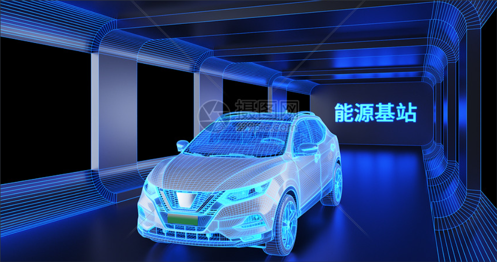
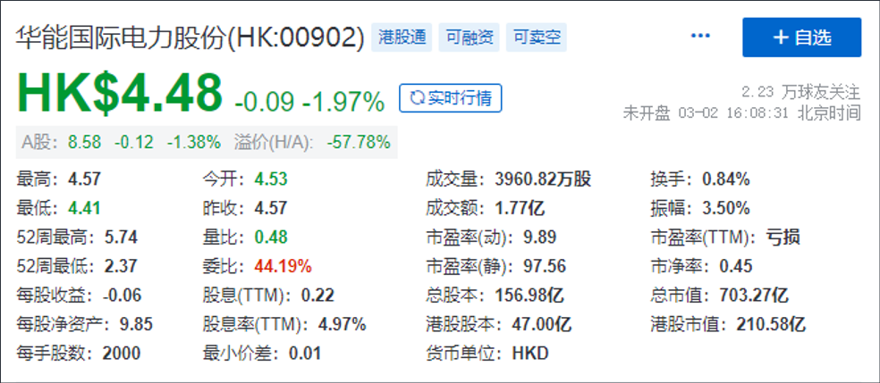

23篇.新能源汽车

清一山长 2021年12月2日-2022年6月6日

**一、新能源车的方向应该是氢能源**

山长清一 2021/12/2 11:08:48

我认为：新能源车的方向应该是氢能源，不是电。我们的电网负荷受不了，本质上还是石化能源。很多化工产品都附产氢气的，关键是找到纯化的技术，因为杂质较多，被称为灰氢。纯氢称为绿氢。似乎中石化已经找到了纯化的技术，目前是国内氢能源提供最领先的企业（远远超过中石油）。未来爆发牛股的应该是氢能源领域，就是很难知道谁是未来的赢家。

转：重磅！中石油、中石化氢能业务大爆发！

[https://xueqiu.com/9803086374/172688267?ivk_sa](http://link.zhihu.com/?target=https%3A//xueqiu.com/9803086374/172688267%3Fivk_sa)

**二、未来电力需求旺盛是明盘**

山长 清一2022/3/2 20:28:14

今年看到一个消息：裘国根夫妇和重阳集团，正在快速减持华能国际电力港股，这两个月就减持了7亿股，大约是收回了30个亿的资金。据说是清仓式减持，减持价格在3.8港币到4.4港币之间。我查了一下重阳是什么时候买入的这些货？一查不得了，他们在2018年就买入了54亿港币，占当时港股总市值的23%的比率，算是一笔很大的投资了。我看他们在2018年买入的时点，价格一直在4～5元之间徘徊。后面2019年，突然狂跌到了2元多。现在股价对他们2018年买入的人来说，只是刚刚回本，还没算上利息。裘国根这样就赶快减持了？这伙计，我很难理解他在干什么！现在减持华能电力，看起来也很不对劲。因为未来电力需求旺盛是明盘，新能源车的大量销售，给电力造成的需求缺口，近几年是不可能弥补的，电力企业的未来是可以稳步收入的，为啥现在要大量减持，清仓式减持？只能说他根本就不看好电力的前景。当初买入的逻辑是什么？现在逻辑改了吗？联想到重阳在燕京啤酒的清仓式减持，现在回过头来看，就是一笔糊涂账，完全没有正常的投资逻辑。我认为：裘国根不至于这个基本的投资思维都没有，自己重仓介入的股票，刚回本就狂卖？倒像是故意打压市场一样。难道是有人授意的吗？毕竟他的钱是有金主的，难道要听从金主的旨意来进退？反正，如果燕京跟着裘国根的节奏来做，肯定亏死[滴汗]。

**三、我们的无知就是他人的利润**

山长 清一 2022/6/6 9:43:16

众所周知，进口车在国内的售价要比国外贵很多，动辄多一两倍，而诸如埃尔法、陆地巡洋舰之类的热门车型，在指导价的基础上，还得加价才能买到。

以丰田埃尔法为例，在日本只卖人民币三十万元左右，到了国内卖到上百万，还要加价二三十万元才能提车。

陆地巡洋舰（兰德酷路泽）日本28万元起步，到了国内100万了，像雷克萨斯LX570日本售价仅仅是70多万， 国内落地至少200万元。

虽说进口车有关税等其他费用，但即便算上这些，丰田埃尔法也不过是40来万，如今动辄卖到100多万，已经是翻了好几倍，可见这其中的暴利有多大。

对此，丰田汽车的会长丰田章男日前回应：“丰田总公司从来没有加价卖出过任何一台埃尔法给中国经销商，加价完全是中国国内经销商的个人行为，与丰田集团无关。”

事实上，类似的话他早在2019年就说过，“埃尔法我们是没有加一分钱给经销商的，大家可以直接找他们说”。

丰田章男的一句话，撇清了丰田公司与加价行为的关系，并将矛头指向了国内的经销商。

点评：经销商是很坏，但主要是国人太蠢了。愿意花一百万去买30万的东西。所以，我们的无知就是他人的利润。

**英2022/6/6 11:10:27

这个模式很快估计就会终结了，现在国内新能源电车发展非常迅速，因为没有发动机所以特别安静，价格10几万的车比保时捷提速还快，还送终身免费保养，续航也有500公里左右，即使是没有充电不方便的油电混合车也比传统燃油车省油，车内的软件配置传统燃油汽车根本无法比拟，性价实在太高，公司财务计算过10多万的电车比较燃油车的油费和保养费，3年多就能收回所有成本（上周我们公司果断把10来部燃油工作用车都换电车）看到国家大力增加充电站跟购置新能源汽车补贴和免购置税，未来在新能源汽车领域中国应该会领先其他国家好多步，因为我们公司有作汽车配件所以对汽车领域有所了解，浅薄见解分享给大家。

山长 清一2022/6/6 11:17:39

@**英 [献花花]。好意分享者有福了[抱拳]

相关文章：
1、[清一投资号：6篇.A股与美股的微妙关系](https://zhuanlan.zhihu.com/p/513063583)（整理文）

2、[清一投资号：33篇.中国神华的投资逻辑](https://zhuanlan.zhihu.com/p/509950099)（整理文）

