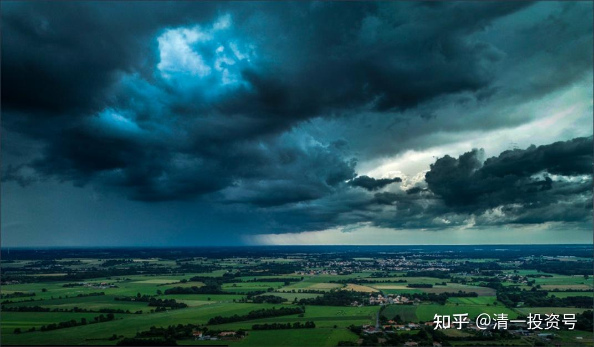
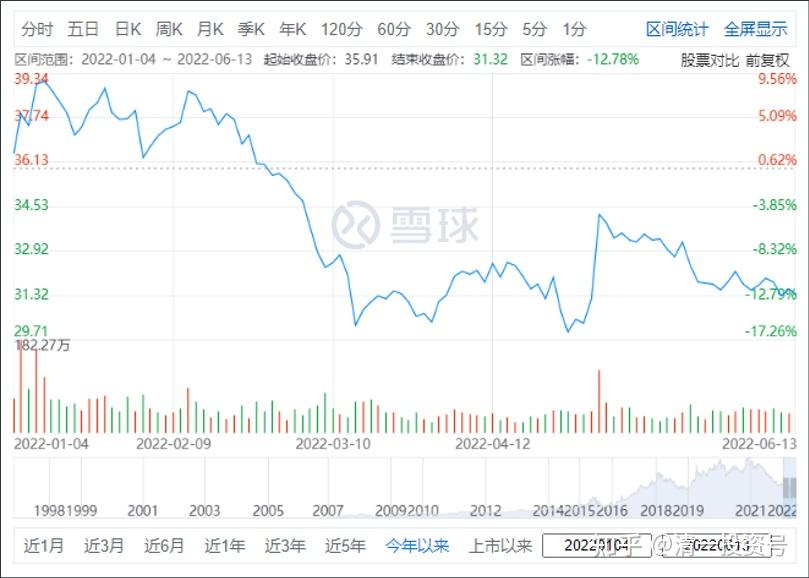
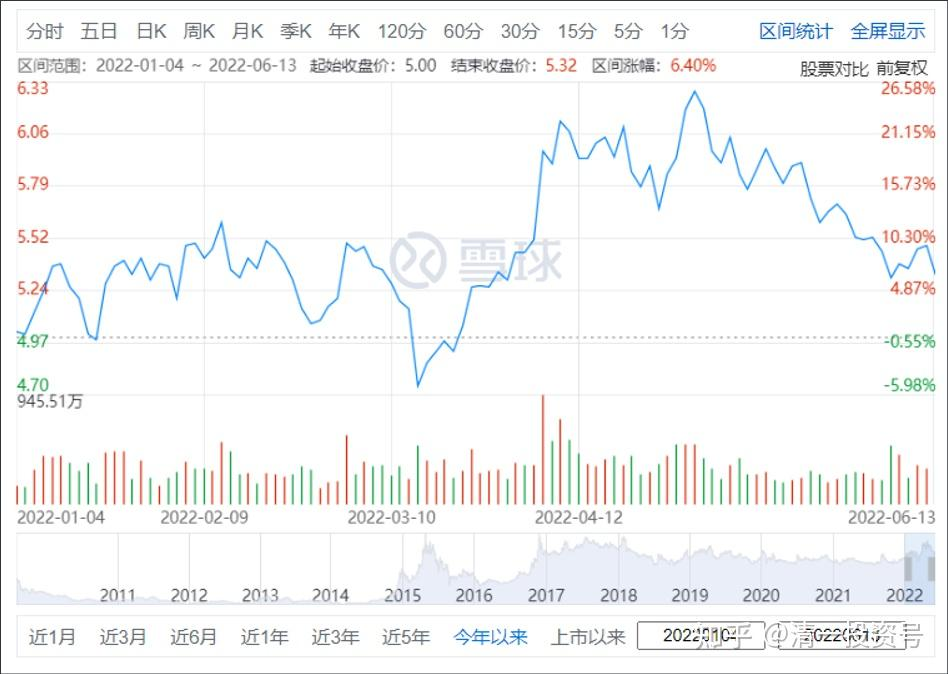
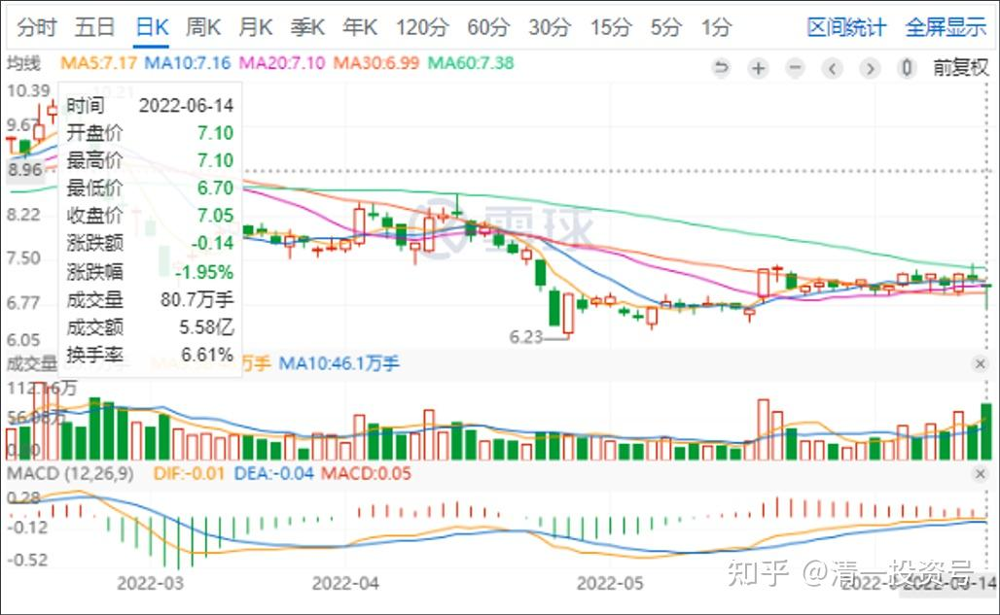
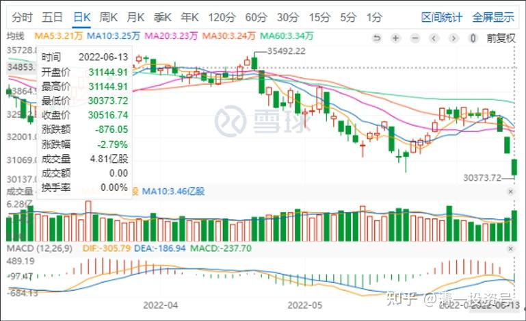

24篇.黑云惨淡时，默默地坚守

清一山长 2022年6月13日

山长 清一2022/6/13 15:21:19
说一下今天的操作：31.34元买入了格力电器。高瓴资本46元多买入的，涨回他的成本，我就赚50%了。我认为格力不会这么烂，上次是36元第一次买进格力，不久就涨了，所以买的不多。56元就卖掉了，换了40元的万华化学，后来万华涨到110元退出了，但一直没敢买回格力。现在看消息，我放心了，网上全都是骂格力和董明珠的，谁说几句好话都要被骂。我看架势，应该是重新买回来的时候了。我喜欢在赞歌声中默默地离开（当年56元离开格力，公布操作，还收获了很多人的骂语）。**但我愿意在黑云惨淡的时候，重新回来默默地坚守。**董明珠是一个值得尊重的人，制造业，就需要一些狂人才有希望。本田宗一郎也是个怪人，他不怪，没有今天的本田。当然，也有可能董明珠会把格力带到坑里面，真这样，我也认了。亏最多的肯定不是我。董大妈说：持有格力，不要在意股价，看分红就行了。格力分红已经超过9%了，有啥好担心的？我相信国际电器企业一起竞争，想要干掉格力，要比干掉恒大，干掉中国平安，都要困难得多。它绝不是一个好对付的对手。

另外，今天开仓100万股买入中国建筑。价格是5.28元，这是我的投机仓。6元上方卖出的部分，尚未完全买回来，因为买了很多其他股（有色股），有色虽然涨了一些，但我觉得远远没到位，还舍不得卖掉，所以就有多少钱，买多少股回来。剩下的就算了。我认为美股今晚如果继续跌的话，会带动A股，港股都惯性下跌的，如果跌惨了，难说中国建筑又要出来护盘了。**我跟国家队共进退——不，提前一点进，也提前一点出。**中国建筑，继续蝉联A股最高盈利个股的荣誉，希望它继续保持优势。

*格力电器2022年1月～6月*

*中国建筑2022年1月～6月*

山长 清一 2022/6/14 12:28:59
昨天，美股继续大跌800多点。把一年半来的美股涨幅全跌没了。本周全球跟跌，是必然的。如果美股这样子再跌几天，估计就是爆发“全球金融危机”了。**你们有钱还是稳妥点，别轻易进场被咬住了。**不过，我看今天格力和中建都稳住了，其他股大跌，今天买了一点跌惨了的天山铝业。

[美股大跌！道指重挫880点！日本市场上演“股、债、汇三杀”](http://link.zhihu.com/?target=https%3A//view.inews.qq.com/a/20220614A027UA00)

[https://view.inews.qq.com/a/20220614A027UA00](http://link.zhihu.com/?target=https%3A//view.inews.qq.com/a/20220614A027UA00)

**“美股收盘：黑色星期一来袭！鹰派加息恐慌压顶，三大指数狂泻，疫情以来标普首次收于熊市”**美东时间周一，美国5月CPI通胀超预期创40年新高，市场对美联储的鹰派加息预期急剧上升，投资者担心本周的FOMC将自1994年以来首次加息75个基点，三大指数显著扩大了跌幅，最终大幅收跌。

截至收盘，纳指跌4.68%，较历史高点下跌超33%；标普500指数跌3.88%，为2021年3月以来的最低报价，较历史高点下跌超21%，进入技术性熊市；道指跌2.79%，较历史高点下跌约17%。投资者正在大举抛售风险资产，恐慌指数“VIX”日内涨22.59%。

[鹰派加息恐慌压顶 疫情以来标普首次收于熊市](http://link.zhihu.com/?target=https%3A//finance.ifeng.com/c/8GpOsY2vRj1)

[https://finance.ifeng.com/c/8GpOsY2vRj1](http://link.zhihu.com/?target=https%3A//finance.ifeng.com/c/8GpOsY2vRj1)

*2022年6月14日天山铝业日K图*

*2022年6月13道琼斯指数*

山长 清一 2022/6/10 19:27:12

玻利维亚、古巴、危地马拉、洪都拉斯、墨西哥、尼加拉瓜、委内瑞拉、乌拉圭和萨尔瓦多等国总统拒绝出席在美国举办的美洲峰会。 ​​​

了解一下：这些都是公开不给美国脸，表示就是不肯跟美国一起混的南美国家。美国从来没有这么孤立的时候吧？

去的人，心怀二心，不一定支持美国，不去的人，是肯定不支持美国的。墨西哥公开不给美国脸，真是个意外。

[拉美9国总统拒绝赴美参会，美国CNN列出了缺席名单！](http://link.zhihu.com/?target=https%3A//www.163.com/dy/article/H9PTTBEM0543OO5K.html)

参考链接：

[清一投资号：6篇.A股与美股的微妙关系](https://zhuanlan.zhihu.com/p/513063583)（整理文）

[清一投资号：21篇.【股灾来了怎么办】系列之一](https://zhuanlan.zhihu.com/p/481788728)（整理文）

[清一投资号：22篇.未来什么东西最有价值——资源](https://zhuanlan.zhihu.com/p/526512816)（新作）

