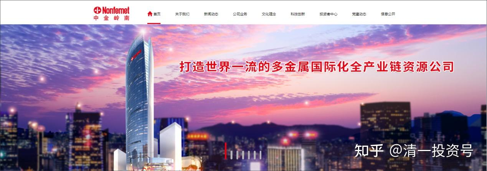
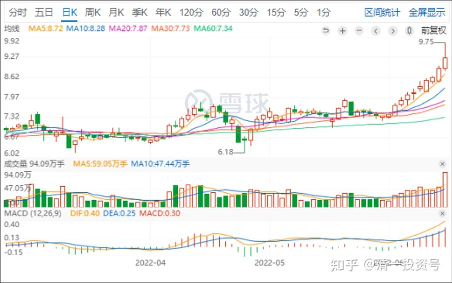
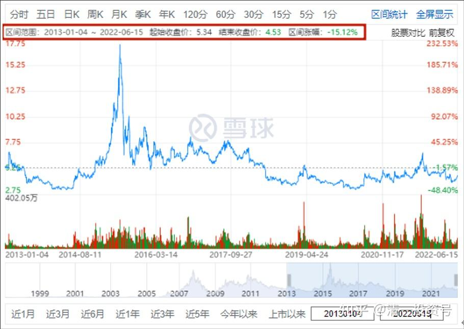

25篇.存钱不如存铜存铝

清一山长 2022年6月15日

今日操作：卖出了一些大涨的金钼股份。最高以9.69元卖掉了几十万股金钼股份，赚了三元多了，接近50%的浮赢，我已经很满足了。不过由于它跌下去了，我的主仓位还是没有卖掉。上午我就想，如果下午拉涨停（今天差几分钱就涨停了），我就全部出掉算了。让勇敢者去赚后面的钱。后来下午一直跌，就只好算了，就再等等看，毕竟刚启动，不像是要砸盘的样子，下午也没有见到砸盘的资金，都是散户自由交易。这股让我赚了两轮。

*金钼股份日K图*

随后我用卖出的，补充了一点4元多的中金岭南。原来4元出头，就已经买入了大量仓位，但现在涨不多的话，就再买一点。现价，比2013～2014年的中金岭南底部价格还低，我奇怪了：这8～9年，中金岭南白活了吗？未来的有色行业，一定会有明显的变化，十年一个周期，也到了新周期的起点了。这家公司，拥有千万吨的有色矿产储备，在未来钱不值钱的时代，它拥有的矿产是保值的好工具。我相信其他资金也会看到这一优点的。这个世界，政府总在印刷大量的钱。**我们只会存钱，已经靠不住了。可惜存米没法存，不如存铜、存铝，放个20年肯定不会贬值。**

*2013年至今中金岭南日K线图*

**学 @山长 清一：

感谢山长的示范，我跟着山长操作，今年多了两套海外社区房，金钼股份是从中国建筑换过来的，当时老是不涨，就买了几十万金钼股份，结果一路涨一路卖，已经很知足了。现在经济形势很不好，进入金融市场绝大多数都是亏得哭天喊地的，而我的账户一直是红的，这都是山长给的机会。

另外，给山长报告一下更好的消息，我把山长的操作示范，结合自己的操作，总结出来，分享给我们的财富课学员，（这些学员是精挑细选出来的，必须有小组长邀请才能进群，我只选小组长加入），他们跟着山长的操作也都捡钱了。

这些人未来都是宣传新教育的助力，有些赚钱的，想捐点款，问询金融心理行为课还有没有机会开呢？

山长 清一@**学

恭喜发财。关于**“金融心理行为课”**，这个课，是专门研究人类面对金钱的心理行为的，目前很少有这样的研究。懂的人更不愿意分享出来，相当于**“财富密码”**。**很多人穷，以及赚钱之后守不住，就是缺乏正确的金钱心理行为，导致“穷命”。**因此，价值是超级高的。只是这门课，不是看名字，而是看谁讲。我讲的话，内容就是高级到可以去当“庄家”了。可以“猎杀散户”，洞察普通人的金钱和心理行为。如果是更高级一点，像我就是“猎庄”的人，难度更高，专门洞察庄家的心理行为（比散户的更高级），所以才能跟上庄家的步子。

我上课，会用真实的案例，市场上现成的案例。一个一个人的分析，每天学会“看人”，看“凡人”，看“散户”，洞察散户的弱点，改掉自己身上的弱点。**真能跟随好好学下来，会换一个人的——换人生的命运**。所以价值超级高。不过由于本课程难度较高，只给上完了普通心理行为课的学员来上，没有福气的人是不能来的。因此必须优先安排**“心理行为学”**的课程。

由于疫情导致控制严格，昆明方向不鼓励超过30人的会议和聚集，会严查的。我们不想惹麻烦，更不想“顶风作案”，让神经紧张的当地官员们更加紧张，他们特别怕外地人聚集活动。所以延后了。什么时候能开，只能看大家的福气了。

**学@山长 清一：

谢谢山长提醒，跟随学习十多年了，直到上了心理行为课后才发生翻天覆地的改变，真的改变了自己的命运轨迹。

就拿财富来说，我是一元财富课的获得者，当时自己的账户里只有十几万退伍补助费，但十年过去了已经翻了几十倍。

其中增长最快的时期就是参加完心理行为课后。

没有上课之前，我经历了2014年的暴涨，当时就已经翻了不止十倍。但2015年全吐出去了，幸亏山长提醒降杠杆，才没有死掉，还略有盈利。真的是守不住财富。

上课之后，不断的反省对照自己的信念系统和山长的区别，总算能够理解山长的教导了，改掉了很多自己的弱点和毛病。

我变了，世界就变了。

山长在群里的发言都能够看懂了，为了让自己看懂，还经常修改山长在群里的发言，看能不能理解里面的逻辑，结果操作也能够跟上了，财富开始不断的递增。

[清一投资号：22篇.未来什么东西最有价值——资源](https://zhuanlan.zhihu.com/p/526512816)（新作）

[清一投资号：10篇.有色钢铁今年肯定会有一波](https://zhuanlan.zhihu.com/p/479071592)（新作）

[清一投资号：9篇.从制造业的现状看未来的投资方向](https://zhuanlan.zhihu.com/p/478502637)（新作）

