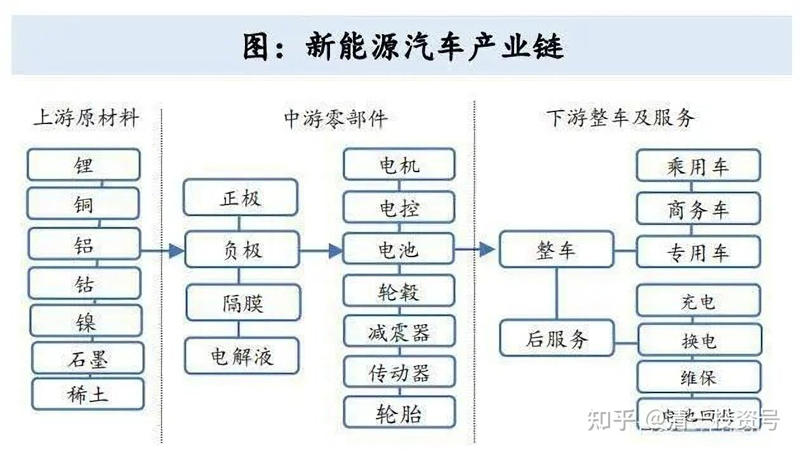
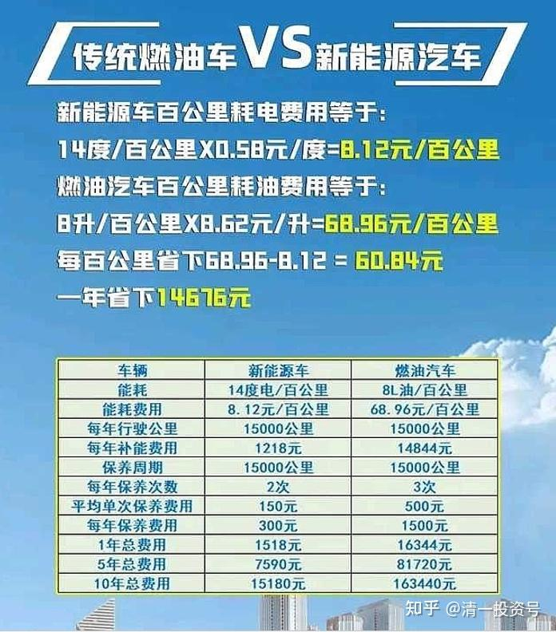

26篇.新能源产业链投资规划（重要）

清一山长2022年6月15日

题记：

**这个图，说明了未来的投资方向。**（下图）

你们自己解读一下。如果你们不动脑子，不想思考，我也不想多说,反正我也不欠你们的。如果想要我的答案，自己先写答案。达到我认为这个群还是愿意思考的，我就发我的思考。否则，就到此为止。过几年你们自己会明白你们错过了什么。

（编者注：群友积极回复70多个讨论近2万字，山长分享了自己的思考。）

正文：新能源产业链投资规划

**都知道新能源车是未来的赛道。未来大量的财富，将是这个领域的。**

想知道美国过去的崛起靠的啥？在芯片之前，美国其实靠的是制造业，是汽车行业,上百年的历史；日本的经济靠的啥？也是日本车在全世界的强势，逼死了美国。这就是历史。

汽车代替了马车，马车时代，马车利益集团、马车贵族时代就结束了。汽车开创了新的世界，是改变世界最重要的工具。包括现在的城市化，也是汽车时代才有可能这么集中的住宿和生活方式。农业时代，怎么有可能？因此，抓住新能源汽车时代的红利，你就可以成为新能源时代的富豪。你抓了油车，就像守住了马车一样，你很可能会破产的。这就是基本的逻辑。

不过，我看了“任泽平：当下不投新能源，就像20年前没买房”，题目这样写是没错，问题是——这个年薪1500万的经济学家，如果居然认为投资新能源，就是要去追买新能源汽车行业股票的话——他的思维就很无厘头了，要不他就是故意出来拉散户去顶缸的。比亚迪号称“迪王”了，还有一个电池王“宁王”。**大大小小的王，其实他们都在等着人接货呢！高位退出的资金去买你不知道的冷门，未来的赛道。**比亚迪现在市值已经超过大众，急追丰田了。未来还有多大的上升空间？号称科技股了，它难道就要按互联网的估值来算吗？归根到底，也就是个造汽车的企业。

**如果你们眼睛里面只看得见 “最终产品”，脑子就是有局限的。**你要投资，现在去投新能源企业，汽车也好，电池也好，电厂也好，现在都已经晚了。多少资金，多年前就看清大势，急切杀向新能源车了，结果很多很多人，都吃了大亏，这个饭不好吃的——贾会计的企业爆了，融创买它也爆了，恒大也跟着爆了。这些都是人精，都知道新能源赛道很赚钱。但——谁是赢家？不小心就是巨亏的。比你买房惨多了。

因此，看了任泽平这个演讲，就去追新能源汽车的人，我不客气地说：他们都是接盘侠，不用等20年，进去就是找死的。跟当年买中石油一样的结果。相信大V，别人说话很有艺术，让你自己上当去。将来，他会说正经话——我说的是新能源产业链，不是汽车，是你们自己误会了。——没错——其实，汽车制造产业，并不是行业中最赚钱的产业。真正创造巨大财富的，是汽车产业带来的各种的财富爆发的机会——各种配套机会——包括旅游行业、酒店行业、远郊居住的别墅等等，如果没有汽车，这些消费都起不来的。因此，**我们现在着眼的，就只能是新能源汽车的产业链，还没有被人发现的潜在的 “新能源概念股”。**其他——你看得见的，很明显的东西，汽车啦，电池啦，充电桩啦？肯定都已经没机会了，别妄想了。

**踏踏实实地顺着这条产业链，去进入它的上游，去发现上游的价值吧！**这样说，就简单了。

首先是电力上游——我们能直接投发电企业吗？其实在中国是很不靠谱的。大多数发电企业，都是靠煤炭、天然气来发电的。中国的电价是封顶的，所以——发电企业，其实面对大量的电力需求的时候，反而要赔钱的。因为这种需求导致煤价上涨，但电价不能涨。因此这种生意，就是需求旺盛，反而会赔钱。没有需求，也会赔钱。只有市场稳定，才能赚钱。但——能源市场从来就不稳定，因此电力企业注定就是苦巴巴的企业。所以估值一直不高。因为它经常就是必须赔钱来做生意的。去年几大发电企业，你们看全是赔本的，白白给社会打工。

这个可不像西方的电力公司，可以随行就市，能源涨了三倍，它的电价可以涨10倍。因此，发电企业，其实活得很不像样子，投它，肯定是找抽的，赚不到啥钱。除非是低廉得不成样子，可以短期投机。长期没有投资价值——除了少数水电企业才可以长持。因此，我买了一点“两投水电厂”，这种不要钱的发电厂，不用担心成本上升，而且随着时间，成本还越来越低的电厂，才可以投资。至少可以稳稳的保值、增值。但这种钱，只有保值作用，要想赚快钱，还要靠其他的东西来做。

**想来想去——只有有色企业，已经是十年，甚至是15年没涨了。**我买的一些有色股票，价格比2014年的低谷时期差不多。这就是机会——未来有巨大的爆发空间，至少比汽车的空间大得多。

新能源消耗最大的材料，就是铜和各种有色金属。高盛认为：未来20年相当于石油的地位，就是铜。其实，笼统一点：**未来石油的消费下降了，但有色的消耗会快速上升的，需求会导致这个行业不可能大幅回调的。**造汽车会需要它，做充电站会需要它；完善电网会需要它；做蓄能会需要它；各种新能源电厂大上快上，更是需要它。比如风电、太阳能发电的设施、海上风电等等，全都需要各种金属、铝材等等。因此，有色可能应该迎来了超级大周期。因为石油价格的高企，将逼迫油气产业萎缩，新能源更加快速的崛起。而且会20年一直上升。**原来大宗周期，可能会变成一个超级的长周期，稳增长。这就是我投有色的核心观念。**

**当然，为了避免投错，我只投有矿产资源的、而且股价几乎没大涨的股票、现在还在底部的股票。**一些涨了不少的：如紫金矿业，其实我手上还有几千股，底部买的，赚了十倍的股，但我从来没有给大家说过，为啥？不敢买，更不敢鼓励大家买。虽然大概率上涨，但我干嘛不去买现在还在底部的股呢？我后悔当初买少了，而且涨了两三倍就卖掉了。现在我就坚决不买了，我只买价格与8年前，与紫金价格差不多价格的其他有色股（我是两元多买的紫金，分红几年只有一元多成本了，不可思议吧），优先考虑国际布局，有国际竞争力的龙头企业。**所以，金钼股份、洛阳钼业、中金岭南、几家铝业股份等等，都是我考虑的对象，都会大量布局。赚了钱，我就会转入这些金属股份，计划长期持有它们的。用来躲过未来财富的大崩溃时代，大动荡时代带来的各种不确定。**

另外，**有色——还有一个很多人想不到的好处，就是作为“保值、增值”的中间体。当代的金银等价物，**由于现在货币超发太多，金银是不够用的，无法容纳这么多的资金需求。其实金银的使用价值也不高，也不方便转卖。如果未来各国的纸币信用继续大幅下降，有钱人。会把【金属】作为储备的对象，而把纸币作为抛售的对象。起码中国会这样做，会把原来存在美国手上的国债，换成千吨、万吨、百万吨的可以长期存放的有色金属，作为“国家财富资源”，来作为未来支付的保值品，作为未来人民币信用的捍卫者，不比美元更好用？更靠谱吗？当然，由于钢铁容易生锈，而且相对价值不高。我个人认为：**有色金属才是最佳的货币储备的等价物，比如铜和钼，未来除了有工业使用价值之外，很可能成为一种互不相信的国家之间的——保证货币价值的最好的储备资源和交换手段。**

我猜：将来中国会不会跟泰国做生意，我给你一吨铜，你给我20吨芒果。我们以货易货，大家都不吃亏[大笑]。泰币、人民币，都不如“铜币、钼币”更有效，更有看得见的价值吧！而且全世界绝对都认这种价值？当年美元与黄金挂钩，现在各国货币谁宣布与金属挂钩，肯定比美元更硬，更受世界的欢迎。由于中国是世界最大的钼业生产国，如果我是总统，我已经出“钼币”，按克来算。只要我储备了大量的钼铁，我就开设一个“钼银行”，可以让客户自由交换实物钼铁和“钼银行”的货币，我相信这种货币，肯定能够轻松击垮美元霸权。

当然，也许是我的脑子走火了，闹笑话了。但我总认为——看得见的一吨一吨的金属，肯定比任何看不见的“国家信用”更靠谱，更比“比特币”这种虚假的货币靠谱。也许，未来真的大的通货膨胀，会逼世界走上我的说道路的，虽然现在看上去像是笑话一样[大笑]。

当然，**还有铝——也是可以长期储备的物资，**而不担心生锈的。缺点是“太便宜”了。如果20万元一吨的钼，相比两万元一吨的铝，是不是存起来就节省了十倍的仓库？当然，仓库的投资，相对金属来说也不贵。您认为：把钼金属、稀土金属，作为中国的货币等价物，大量的储备，慢慢的使用，不就是轻松地破了美国的“美元收割大法”吗？

实际上，中国持有的美元债，已经达到了12年来的最低值。但中国的出口并没有减少，而是每年都在增加的。您认为——中国这12年多赚的这些美元，去哪儿了？去买了欧元，存在欧洲银行吗？或者买了日元？我猜——肯定不是**。绝对去买了资源来储备。**

**这就是我简单的新能源产业链投资的规划。**在没有找到更好的投资机会的时候，我会紧紧地拿住这些资源股不放手的。**它除了有任泽平的“产业机会”外，还很可能有金融性，就像茅台的金融性一样。因此是双重价值的股票。**我会像过去拿住中国宏桥5年还没有放手一样。宏桥涨到高位卖出来的钱，已经让我换成了上千万股的其他有色资源股。如果我相信任泽平说的话——我就拿住这些资源股20年吧！看值几辆新能源的汽车。

**为了防范风险，我会分散到五只有色个股上，不定期的调仓。**比如金钼上涨快了，我调整了一些仓位去洛阳钼业上，还有其他股。**分散投资的好处是：其中任意两家企业破产，我也不会亏掉，因为它的份额会被其他的企业占有。**如果我这样来玩，你们猜猜看：如果我坚持，这样来拥有**“新能源财富链”**的机会，等我80岁的时候，会更有钱呢？还是会破产？我宁愿去相信，现在去高位追买新能源汽车股、电池股、锂资源股的股民，才会破产吧[大笑]。**他们的眼睛都太直了，只盯着最表面的价值，这是最不可靠的。**

参考链接：

[清一投资号：25篇.存钱不如存铜存铝](https://zhuanlan.zhihu.com/p/534377433)（新作）

[清一投资号：23篇.新能源汽车](https://zhuanlan.zhihu.com/p/529803921)（新作）

[清一投资号：22篇.未来什么东西最有价值——资源](https://zhuanlan.zhihu.com/p/526512816)（新作）

[清一投资号：2篇. 现在投资大宗和有色金属的理由](https://zhuanlan.zhihu.com/p/467079274)（新作）

