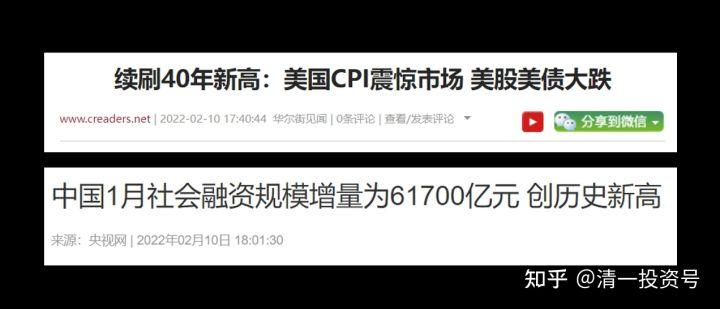
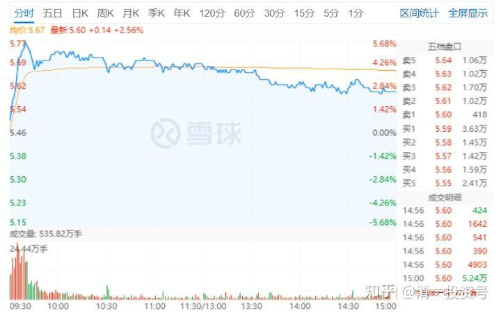
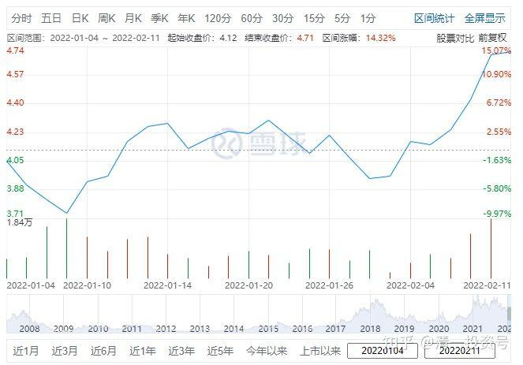
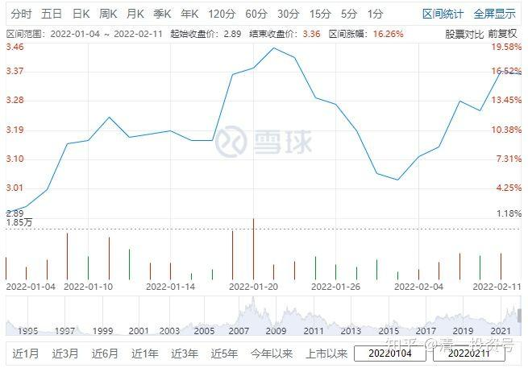
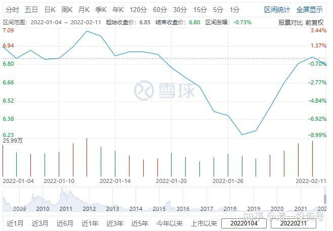
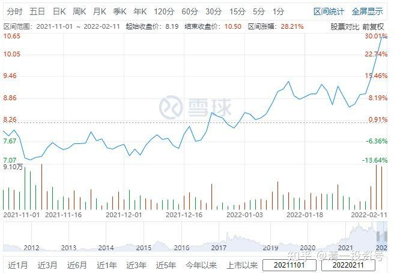
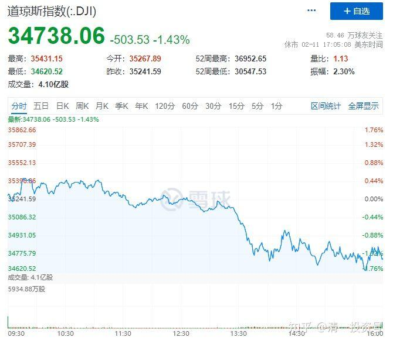

*同一天两大消息*

**2篇. 现在投资大宗和有色金属的理由**

山长清一 2022年2月11日

刚看了一下，中国建筑今天开盘，就奇怪地大涨三个多点。一向温吞的中建很不正常。前段时间的牛股中国电建，不但没涨还跌，其他建筑股也没啥表现。这实在有点怪异，基本上是2016年才发生过的事情。怎么可以如此活跃呢？难道出了什么重要的变化吗？我再继续查信息，最后才发现昨天晚上**美股大跌了500多点。因为美国CPI严重超标，加息压力大。所以股市就先反应了**（我觉得很奇怪，不就是板上钉钉的事情吗？犯得着现在反应？前几天美股一直涨，我觉得就是疯了。因为基本面是不支持的）。

**美国要紧缩货币，而中国正好相反：跟美国同一天公布：社会融资创新高，意味着中国货币在放水**。很有趣——这两年疫情，美国货币大放水，但中国这两年却在使劲地“财政收缩”，把中国地方政府最看中的房地产都搞崩了，还不断地去产能、压产钢铁等等。闹得供应量大减少，钢价、有色金属、煤炭能源都大涨。现在美国受不了通胀，不得不加息了。中国反向来玩“放水”。真的跟美国杠上了。

多年前，我就说：中国建筑，中国的银行股，要看美帝的眼色。美股跌了，就该它们涨了。如果美股旺旺，你就只能死等了。结果从2018年等到现在[疑惑]……**今天的中国建筑，显然就是中美决战的“指标股**”，今天一大早开盘的拉升，就是国家队给信号的：结果兴业银行等原来的大蓝筹，全都涨。看懂了这一条的人，纷纷前来抢筹码。今天成交明显超过昨天。下周如何走？恐怕就要看今晚美股如何走了。如果美股继续跌，我看周一还得涨。

**未来就是美股跌，我们的指标股一定涨。**（但赛道股会跟跌的，市场分化会很严重），**中国建筑等股票，未来会成为中国国家队的指标股。**我们等了几年的机会，今年终于要开始了。至于要问：问啥不是2014-2015年的，我们国家队不去拉银行股？银行才是中国的核心？我认为**中国为了展示自己的“实力”不是虚假的金融，而是代表国家制造力的行业。**所以，**未来的指标股，不再是银行，而是代表【中国制造】的基建狂魔。但银行未来也会跟涨**。我几年前就判断这个趋势会出现，中美对决的方式会用这种方式展开，现在真的开启了，有点小激动？看来我又判断对了。

**为啥我春节前后一直在布局有色金属？钢铁等大宗商品？**按照美国加息的原则，一旦加息之后，大宗会走弱。**因为加息的原则，是要压制通胀。所以，很多人都这样认为，所以赶快卖出大宗避险。**造成这段时间，节前后大宗商品的大幅下跌，给了我难得的机会买入。包括原来高位卖掉的洛阳钼业、金目股份等等。钢铁股也跌到了我认为比较理想的位置，我买了不少。中国宏桥我13元多的时候，卖得只剩下100多万股了，怎么也没有想到会再度跌到7元多，当然重新又买回来了。重新持仓恢复到300万股。没有继续增加，是原来卖出的资金买了中国中铁，以及马钢H股等。没钱了。现在重新涨回来，股价已经超过10元，账面盈利再度创了新高。

我买入的理由，与亲美派的理由完全相反：我认为2008年金融危机，美国货币大放水，是中国大量扩产能，大量制造廉价货物，压住了世界性的通胀，拯救了美国的经济。现在老美不把中国当朋友，当敌人。中国当然也不客气了，自然不会乖乖地配合老美。老美现在需要压制通胀，中国就大量减产，打着碳达峰，环保的名义，还限电。造成商品供应更加的紧缺。你老美的通胀咋下去？我还玩货币放水，故意在大宗紧缺的需求中，压制初级材料的涨幅，提高制造端的利润。利用中国庞大的产能比率，减低产出，利用涨价来实现利润转移，把更多的利润留在中国。**改变原来美国游戏规则下【原料端大赚，终端大赚，中国终端的制造端似乎就是苦力】，现在要重新改写规则了。**

所以，**未来中国的有色，这些提供“制造原料”的企业，将比两端的利润更高。这就是我现在投资大宗和有色的理由。**中国现在，提前紧缩的市场、适度的放水，就可以实现这一切了。好戏连台，我们就好好看戏吧！看我对今年的判断准一些，还是这些牛皮的基金经理们判断更准确一些。他们都拿出了“2022年投资方向”，我看了一堆，认为都是胡说八道。但——市场才是裁判，你们看未来的走势好了。

相关文章：

非专栏整理文章6篇《A股与美股的微妙关系》

链接：[https://zhuanlan.zhihu.com/p/463935372](https://zhuanlan.zhihu.com/p/463935372)）

附录：提及股票对应时间段的走势

*2月11日中国建筑走势*

*洛阳钼业(HK:03993)*

*马鞍山钢铁股份(HK:00323)*

*金钼股份(SH:601958)*

*中国宏桥(HK:01378)*

*美股当天（中国同一天晚上）道琼斯指数(DJI)走势*

编辑于 2022-02-14 06:50
