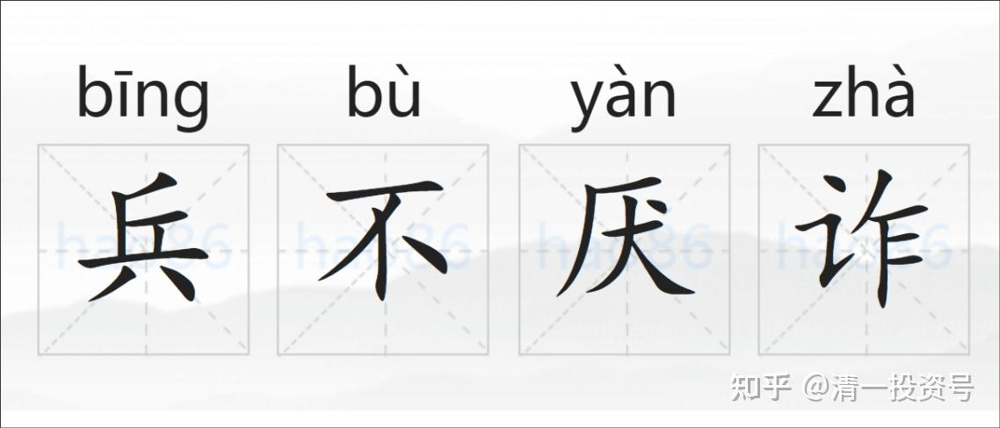
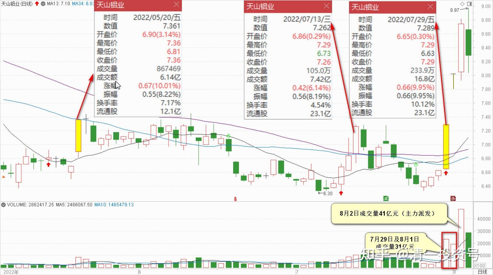

31篇.天山铝业：游资发动的钓鱼行情

清一山长 2022年8月3日

天山铝业分析：现在看，天山大势已去，反弹一波比一波低。典型的“套人”走势。基本判断是过江龙、游资强行发动的一次钓鱼行情，玩得很成功。我很幸运，昨天就全走光了。目前看我走对了，不贪心，还是有好处的。因为我**按常识来投资**，把天山只是当铝业股来投资的。昨天就是应该走光的，但如果是变身赛道股了，我可能赚小钱，丢大钱。它将来涨个数倍不稀奇的，我认为我没这种好命。

今天来看，天山铝业的主力，是游资、过江龙，与燕京的很不一样。燕京是长庄，反复吃这一只股。跟你比的是耐心。天山比的是心眼。上次涨停是5月20日。我当时没走。其实这是主力的一次测试行动。它测出来了—涨停不会放大量。说明7元前后筹码是稳定的。里面的持有者目标肯定在8元以上。后来继续打下来吸筹。中途还有一次造势拉升，7月13日拉升。但目的是让一些眼光短浅的投机客见好就收。

7月29日的这次涨停，是真正的拉升。时间选在周末，应该会借助周末的信息扩散来强化本周的上涨。各种股票群、股吧等。设法把天山的利好消息传出去，说要大涨了，确定无疑的消息。一些投机客，本周一再看又涨停了，没有抢到筹码很着急。于是天山要大涨的信息，更是通过大批的散户，传遍了一些特定的投资圈子。所以，周二的继续涨停。更加坚定了这些投机客的想法。第三天他们开始大量买入。这一天，其实是主力的派发日，我说量大，就是指的这个。前两天的拉升，总共花了31亿。昨天仅仅一天的成交额，是41亿。

所以，可以初步理解为：前两天拉升的成本，已经有人来买单补上了。主力成功控制了拉升成本为零，甚至是负数。今天早上继续拉升，维持股价，但逐级下调。本质上是把高价筹码派出去。（加上前期主力暗中低价6元多本吸的筹码）。

我判断主力资金介入大约需要20个亿左右（前两天的拉升所需资金大约数字）。大约总利润是10-25个点（别以为6元多是主力的本。主力平均成本，应该是7元到7.5元左右。利润多少，就看主力的操盘手有多厉害了）。今天本轮炒作已经告一段落，筹码大致上出完了。但肯定还有今天买入的部分，也不少，今天到现在总成交20多亿，主力至少有5个亿以上要投入进来高抛低吸的。这些筹码会在以后这段时间，震荡出货。出完后，天山就变死股了。（就像主力出完货的珠江一样，死气沉沉的，缓慢下跌）。

一票短期内就赚个几亿，这就是金融大鳄。**每一个这种金融大鳄成功的背后，都是成千上万的小股民被埋**。所以，算起来股市的长期成功者，不会超过1%。这真是一个残酷的市场。**承认自己笨蛋，生存的几率会大一些；以为自己很聪明，啥钱都该你赚，大概率是赔钱的。**

参考链接：

[清一投资号：62篇.“价值投机派”心法之运用——板块轮动与股票切换](https://zhuanlan.zhihu.com/p/551393773)（整理文）：

[清一投资号：53篇.顺鑫农业记录三：买、卖、拿住股票的理由](https://zhuanlan.zhihu.com/p/543704521)（整理文）：

