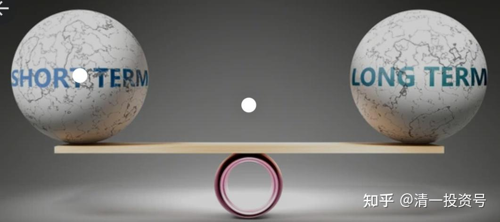
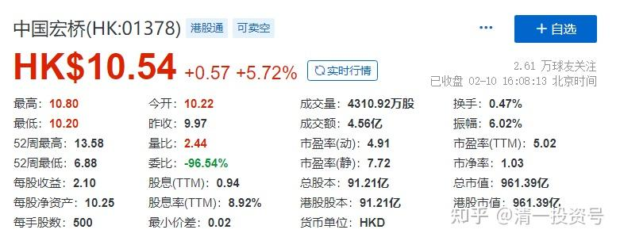
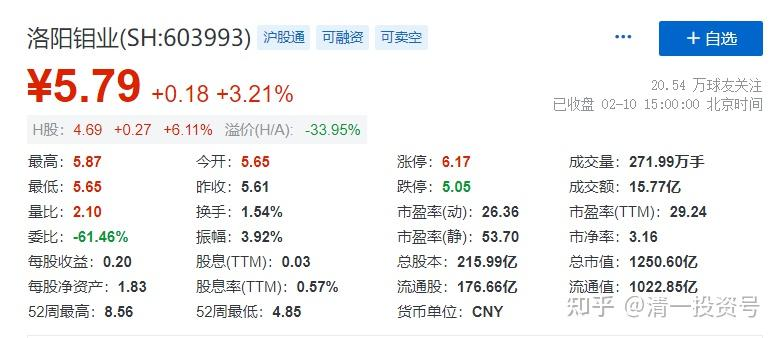
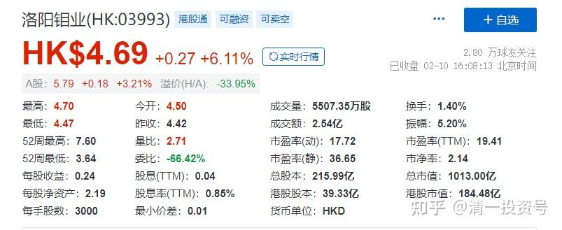
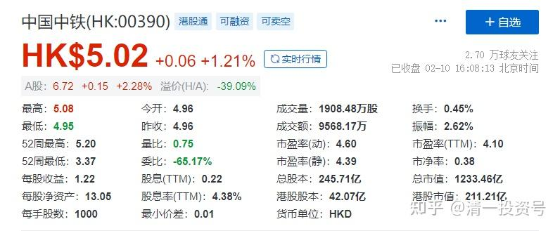

**

**

33篇.洛阳钼业是我计划的长持股

清一山长 2022年2月10日

山长清一2022/2/10 16:40:47

刚收盘了，看了一下盘：春节前后一直在买的，特别是4元下方使劲买的洛阳钼业H，今天居然涨了6%了。现在这个价格，已经接近5元了，我就不计划继续大量买入了。现在的持仓，已经超过M级了。前段时间7元多补回来的中国宏桥，这几天涨了不少，正在找机会出手，再继续换一些其他资源股。我说过：我更喜欢股份，不太关注市值的涨跌。所以涨了的股，我更习惯卖出，去换一些没有涨的同类型的股。

现在我正在慢慢布局资源和有色的仓位，这些都是计划长期持有的配置，中国宏桥连本带利的收益，都会继续留在有色和金属资源股上，不会用来买酒喝的。**洛阳钼业就是我计划的长持股，而不是短炒。**虽然去年我5元买它的A股，但很快就短期上涨，超过50%后，我就卖掉了。跌下来了，回补的时候，我就补了H股。因为是计划长持的股份。虽然A股也跌回到了5元区域，但我买H股还有一个理由，除了价格更低外，就是年前跌到了3.63港币的价格。**我怀疑是有意压盘的，黄金坑，所以特别加快了买入。**这个股，当时这种走势很不正常。所以会吸引我更多的买入。因为原来中国宏桥上涨后出了一些货，需要我补足有色的配置仓位。A股是补充了金钼股份。它是细分行业的龙头企业。洛阳钼业其实不是钼为主业，它的铜，才是真正的主业。还有巴西的磷矿和化肥，很善于布局世界资源的一家公司，值得长期跟随。现在，国内真正的钼业龙头，是金钼股份。**走势上，5元是长期支撑位，不太可能跌破这个价位。所以我是6元多一点买入的，安全垫较高。**跟大家知会一下[抱拳]

*平2022/2/10 17:11:05

感恩山长解盘、分享，前期看山长分享买入的洛阳钼业和华菱钢铁都十多个点的收益了。

*宇2022/2/10 17:17:32

我买入了华菱和马钢，华菱也有10个点的收益了。感恩山长的分享和解盘。

山长清一 2022/2/10 17:50:23

其实，我买的中国中铁，是当有色股买的，没当建筑企业买。它的铜矿储量，大约排中国第三。当时3元多港币就是太便宜了，光它的铜矿，都值这个价了。现在股价已经超过5元了，我就挂眼科等了。我在泰国跟电建的海外总经理聊天，他说电建也在东南亚玩一样的东西，当地建设，拿不出钱来，就给资源。所以也控制了一些矿产。这些基建狂魔，估计以后都变矿老板了。不会永远吃辛苦饭的，就像中建，现在每年赚到的400多亿，不会都拿来“扩大再生产”。只会拿来充实资产，以后用钱赚钱。

*丽2022/2/10 18:26:41

感谢山长分享。群里大部分家人也在清粉群，验证山长说的是不是金玉良言，真的有很多很多方法，因为山长分享的涉及方方面面，饮食，运动，中医，孩子教育，乃至投资。

2016年以来我用自己的身体验证山长的饮食方法、运动方法，身体的改善和健康那是假不了的，山长也不可能来控制他人的身体来造假。

投资呢？我真的是小白，但是我就相信山长的投资理念，不贪，能等，能守，能舍。山长分享的老白干、伊特力、中国宏桥、万华化学、江苏银行、中国海外宏洋等，只要是提到的安全区，我就好好等着这个安全区买入，安心拿着，一定收益就卖出去，然后再买入另一个还在安全区的。账户的收益让我肯定，继续这样实践，不赚钱实在很有难度。

比如前段时间山长分享的马钢H股，洛阳钼业H股、金钼股份，还有华菱股份，也不急吼吼买入，就是守着，一直到老师提到的区域，才买入。前三个买入了，刚看了一下，目前账目浮盈是12%+，20%+，6%+，在这么短的时间！这就是下场亲自验证。

验证的结果会真实地告诉你：对老师的话信受奉行有怎样的收获。山长的话，一定要重视！重视！重视！消化！消化！消化！

山长清一2022/2/10 18:40:01
@*丽[大赞]。我觉得安全的股，才会告诉大家。风险股，我就自己买算了。现在就有一个风险股，我看不懂，买了不多说。A股的洛阳钼业，当初5元买进，我没有多说。卖的时候大家才知道了。因为我不知道还会跌多少。我公开提示的股，基本上下跌空间已经很小了。

*丽2022/2/10 18:51:58
@山长清一 感谢山长。记得您在雪球多次讲过，风险股只是自己买，不分享出来；确实很肯定的才会提一下，能多次提到的，那是极少的标的。山长这样，是对新教育圈家人用心良苦的爱护：让我们能有机会获得收益，又不会因为思维不够乱操作。这些曾经的分享和事实都有文字为证。山长如此引导，如此爱护，身为新教育人，我们无限感恩和珍惜。

*芳2022/2/10 19:16:46
我是个股票小白，做傻猫，跟着山长，老实听话照做，2020年5月开始买股票学投资，一年多的时间，对股票一无所知的我来说，还赚了几十万，之前天天必关注山长的雪球，现在天天关注这个群，每天都在盼着山长的发言，很感恩山长的智慧引领！让我们不但学习成长，还让我们有了一定的经济来源，在此感恩山长。

