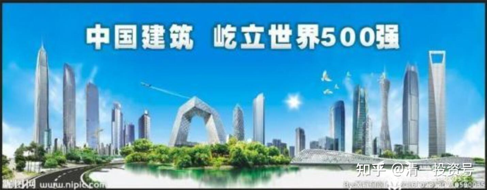
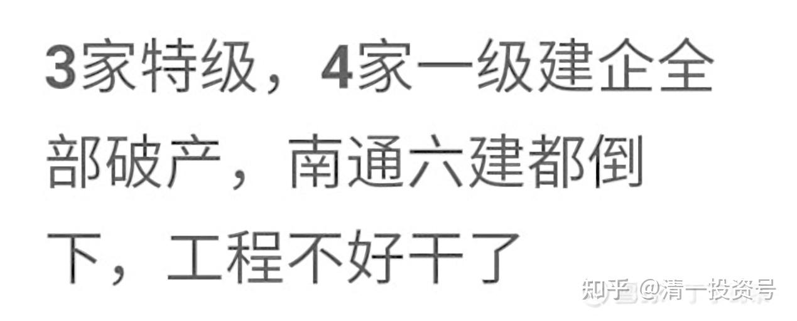
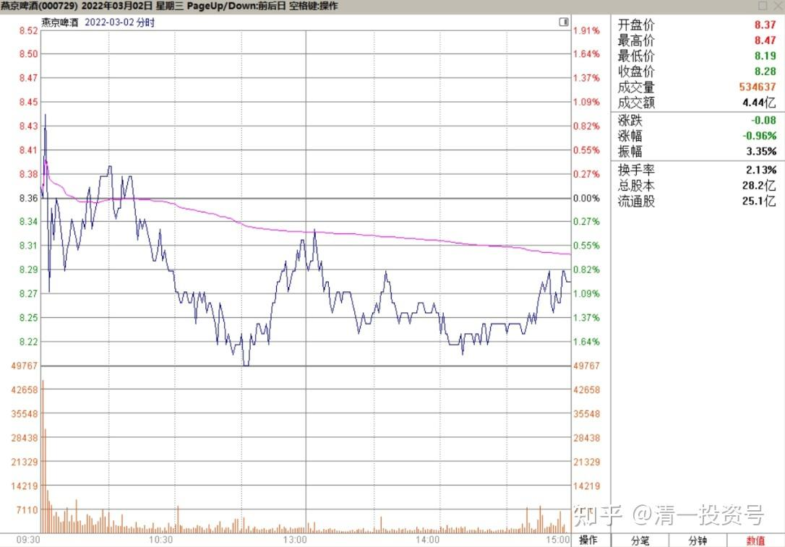
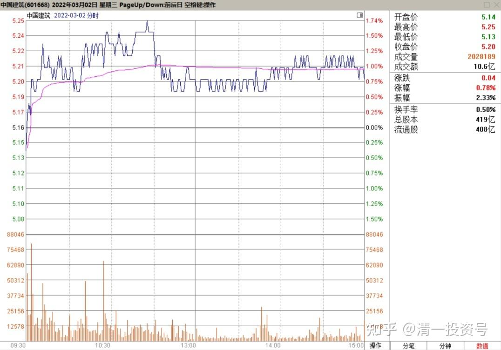
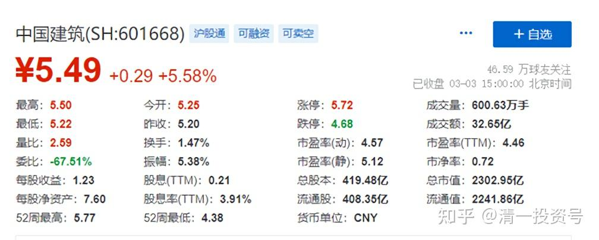

34篇.利好龙头中建

清一山长2022年3月3日

**3家特级、4家一级建企全部破产重组！南通六建都倒下，工程不好干了**
**[https://new.qq.com/rain/a/20220218A07IUG00](http://link.zhihu.com/?target=https%3A//new.qq.com/rain/a/20220218A07IUG00)**

**[https://www.163.com/dy/article/H16KST4Q05458PJY.html](http://link.zhihu.com/?target=https%3A//www.163.com/dy/article/H16KST4Q05458PJY.html)**

**[https://xueqiu.com/8059746817/211550487](http://link.zhihu.com/?target=https%3A//xueqiu.com/8059746817/211550487)**

2021年下半年开始，陆续一批大型建筑施工单位破产。原因基本都一样，无法清偿债务。

这些消息，是利好龙头的。所以大家都在说：地产见顶，建筑行业利空。对是对的，对整个行业来说，肯定是利空。但对中国建筑来说，肯定是利好。因为它是龙头，抗风险能力最强。如果别的都倒下了，反而把更多的市场让出来了。今天涨，也许就是这样一个利好。涨停的燕京卖了买中建，现在中建涨了，再去换跌了的燕京，也许不是一个坏主意[大笑]。昨天我就把卖出的燕京资金全买了股票。中建有一点，不太多，另外一个钢铁股，我一口气就买了两百多万股。虽然今天也涨了，但还是中建涨得多一些[冷汗]。不过中建的存量太大，补一点别的仓位也不错。

关于中建的点评；大家应该明显发现，中国建筑现在不像原来一样死气沉沉的了，有点不安分，上蹿下跳的。**这是因为有主力资金开始建仓了。**你们以为有人建仓就是一路买买买，这是傻瓜才会这样干的。主力资金进入，会制造动荡，在动荡中低成本持有股份。会比市场正常的平均价更低。**这个震荡不会特别大，一般就20%以内，中建这种10%以上的震荡都算很大的了。**这些迹象出现，**就说明中建未来大涨的机会快来了。**如果超级聪明的人，会专等这种震荡到来的时候进场，虽然成本会略高一点（比如中建不太可能买到5元以下了）。但可以省掉几年的等待时间。所以，你们现在出中建换其他股的，也许随时会踏空。除非你绝对有把握，否则还是当傻猫，乖乖地看算了，甚至——看都不看，直接看书学习更好。**至少等中建上10元之后再谈卖不卖。**

