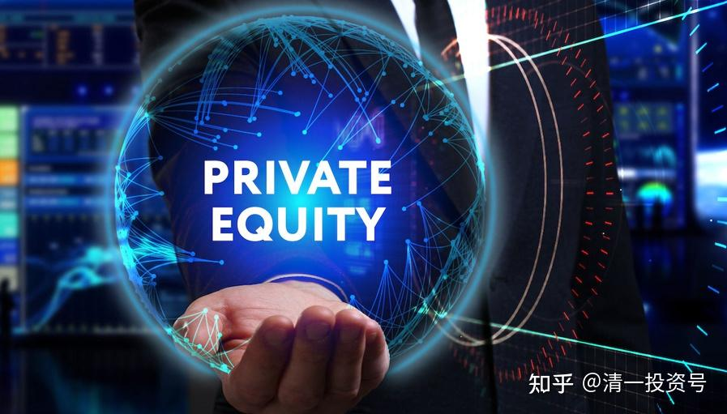

35篇.私募基金巨亏是水平问题还是道德问题

清一山长2022年1月5日

山长清一2022/1/5 20:25:14

原来的明星基金经理转投私募，一年就亏掉百亿，你们见识一下。你认为他是水平有问题呢？还是道德有问题（私下玩利益输送。）？这家私募基金的投资风格很奇怪，去年春节快速满仓，然后追涨杀跌，每次都很精准的买套。“基金经理每次追热点都站在了山岗。如果不频繁调仓，净值反而不会跌那么凶。”

**“信披透明度低，前公募大佬林利军旗下私募产品巨亏！风控缺失，投资人质疑其高位站岗”**

**[https://xueqiu.com/2994748381/208044788](http://link.zhihu.com/?target=https%3A//xueqiu.com/2994748381/208044788)**

**超深圳2022/1/5 20:42:20

我认为是道德问题，短时间这么精准买套，如果不是提前设计好私下玩利益输送，谁信呢？

*磊2022/1/5 20:45:26

因为无法查到“正心谷”的私募基金具体持仓情况，根据山长分享文章，个人认为他是水平问题。

原因如下：

一，如果玩利益输送，选一些小票更好操作。该基金成立不久的的重仓股多是千亿市值的龙头股。

文中资料：前三大重仓板块分别是半导体、农林牧渔、商业银行，且持仓标的以千亿市值以上的超大盘股为主，即偏好龙头股。

二、精准买套，是因为他们风格就是投机，投机就是追涨杀跌，但今年风格变化很快，所以感觉主动买套。如果在价值的基础上投机，就不会造成这样的结果。但生物科技，就不是在价值的基础上了。

如果是道德问题，还意味着他们有能力。若真是能力问题，明星经理，都不懂投资常识。股民90%以上亏损，就很好解释了。感恩山长和刘老师创立的新教育平台，传播真智慧。

山长清一2022/1/5 20:59:22

*磊 你真天真——茅台这种万亿市值的票，没有几百亿的资产，连接盘都不够格的。**公募基金，如果偏离市场太明显，会被国家严查的；私募基金，就没有人严查内幕交易的，亏了自认倒霉。把原来在公募基金积累的人脉、名气，拿出来后，用这种方式，卖个几十亿出去，不比在公募基金拿一份“高薪”更划算吗？公募不敢贪，私募贪了还让你查不出来，只要“承认自己水平低”就行了。认怂可以换几十亿，我看多少人都会抢着去干的。**【**正因为是公募明星基金经理，才不太可能很短时间就把几百亿打进去满仓买股的**】。

*磊2022/1/5 21:01:27

学习，感恩山长教诲。

**宇2022/1/5 21:52:30

我家有个业内的亲戚，他告诉我说国内基金都是跟庄家合作的，有协议。庄家把价格炒到一定高度后撤出，把大量的筹码出给几家公募基金，庄家会按一定比例把利润分给这些基金，对冲他们接盘的损失，然后由公募基金继续往上炒，吸引散户继续跟进，然后在更高的位置，基金再把筹码慢慢地出给散户。所以我从来不碰基金，都是骗人的。更搞笑的是，证券从业资格考试基金那本书第一章关于基金的定义，直接就告诉你基金不是为了赚钱的。

山长清一2022/1/5 21:57:43

**宇成都 我接近30年的投资历史，了解到的内幕差不多。看到的事实也很多。其实，你们留心一点也看得到的。

你们看看惠泉的十大股东。会发现：

1、原来都是自然人，我这个自然人还进了二大呢！但最高点（去年第四季度），有几家基金就进来了。低的时候不进，专门高点进场。他真的这么傻吗？惠泉后来很久，我看到都是出货模式，身边就在发生这样的事实。**金融市场，到处都是狼。监管只是让大家别吃得太难看了，慢慢吃。不思考的代价很高的。**

2、惠泉去年3季度之前，基本上是自然人，有两家上海的私募会进入。去年的四季度，最高点，一堆基金进来接盘，我虽然四季度也在里面，但我已经是高点几乎全卖光之后，相对低点再次进入的一些仓位。

3、去年的一季度，惠泉跌到近期的底部，7元多，我不断买入，这些公募基金全跑光了，私募也没有。留下的全是自然人，我居然成了第二大股东。

4、6月份，冲13～14元的高点，我撤出了，又来了四家基金。9月份依然在里面。你说——这些基金玩个啥呢？还有一只是【华夏养老基金】，这不是开玩笑吗？老老实实地买中建，是最好的养老。这样追涨杀跌的，实在是奇怪。

**梅2022/1/5 22:06:27

只有屏蔽普通投资者的银行间市场的基金算是相对收割普通人较少、人家吃肉给你喝汤的基金。

*胜2022/1/5 22:32:47

这个世界，本就是精英的天下。这辈子跟随山长学习精英思维，下一步，让子孙们跟随新教育成为精英，也就成了自己的人生使命。

**超2022/1/5 22:39:43

做庄相当于美国的做市商制度，不过中国股市本身流动性很好，暂时不需要这种制度，美国那种做庄是一种明庄，只是不这么说。这种做法总体上对游戏设计者和部分参与者有利。国内股市江湖传说，一个轮回是由不同的资本派系和游资共同完成的，比如有人负责点火，有人负责加速，有人负责山顶，有人负责右滑道等等。不论明的、暗的，基本的人性规律是不变的。

附录：山长2022/1/5 20:25:14帖子提到的文章

[信披透明度低，前公募大佬林利军旗下私募产品巨亏！风控缺失，投资人质疑其高位站岗](http://link.zhihu.com/?target=https%3A//xueqiu.com/2994748381/208044788)

参考链接：

[清一投资号：43篇.基金系列之一：从博弈学 看金融市场上专家比不过大猩猩的逻辑](https://zhuanlan.zhihu.com/p/535572286)（整理文）

[清一投资号：44篇.基金系列之二：博弈学：与傻子和疯子作战其实也不容易](https://zhuanlan.zhihu.com/p/535582518)（整理文）

[清一投资号：45篇.基金系列之三：彼得·林奇 谈沃顿商学院的教育价值](https://zhuanlan.zhihu.com/p/535585835)（整理文）

