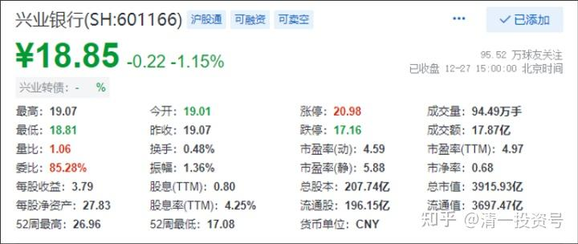
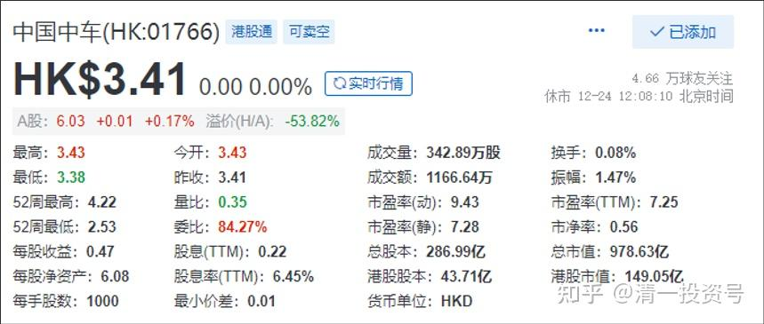
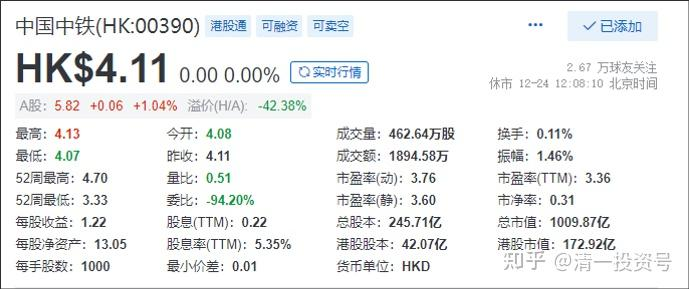

36篇.买入兴业、中铁

清一山长 2021年12月27日

自2018年年初，我19元多卖出之后，今天重新买入了兴业银行。快四年来，兴业银行多赚了12元的利润，今天才卖18元多的价格，不买有点不好意思。对不起这个价。燕京啤酒不能买了，中国建筑也早买成了重仓，看看账上还有钱，就配一点兴业银行吧！我判断明天肯定涨。因为，今天是转债配债的时点。很多持有者不得不卖出兴业来配债。这两天跌就是因为这原因。估计转债上市之后，就会涨上去了。

这种确定性很强的股，买进来长期持有，是不吃亏。【价值分析——有可能未来兴业银行是比招商银行更火的银行】。它的高管认为：兴业是银行业的第一。我觉得：吹是吹了一点。但，万一是真的呢？就像今日学堂的高管，自己吹自己是新教育第一。吹是吹了一点，但万一是真的呢？[大笑]。所以我不希望失去这个有可能第一的股票。

当年持有它超过200万股，为我赚过8位数的利润，现在起码把赚到的利润部分买回来，零成本持有吧？**有钱再继续加仓。实际上，我已经发现：现在银行普跌，但它已经不太跌了。**你们去看看其他银行，都跌得不能看了。包括四大在内。所以，有可能他吹的有道理。如果未来银行涨了，它有可能涨得最多。

对了：宣布一下，原来美国制裁的时候，投机买入的中国中车H股，这笔持仓，已经在前段时间卖掉了，账面利润赚得不多，就几百万港币。我换了3.6元多的中国中铁。**因为我认为中国中铁的成长性超过中国中车，它们也算一家子人，都是吃中国铁路这一碗饭的。**既然我是买股票的人，当然就买入更低估，更有成长性的中国中铁H股了。后来是中国中车股票下跌了10%左右，中国中铁上涨了10%左右，看样子，这一次我换对了[大笑]。以后对不对就不知道了。**这种持仓是长期持股，拿红利过日常的。**所以就是闭眼买的，涨不涨我不太关心。
