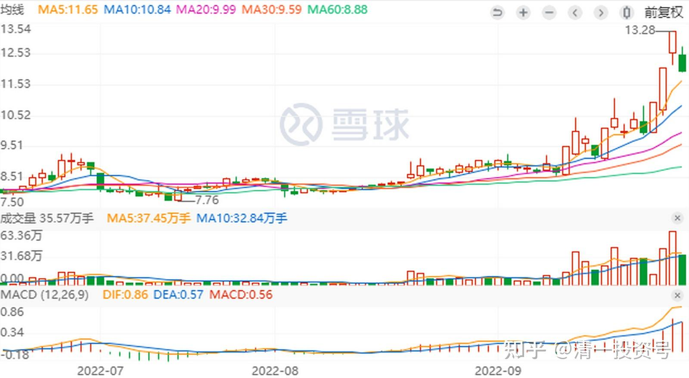
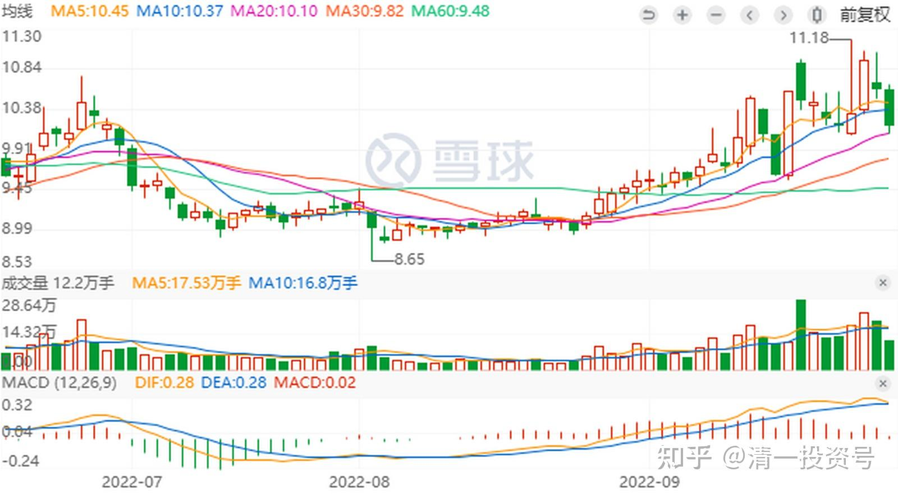
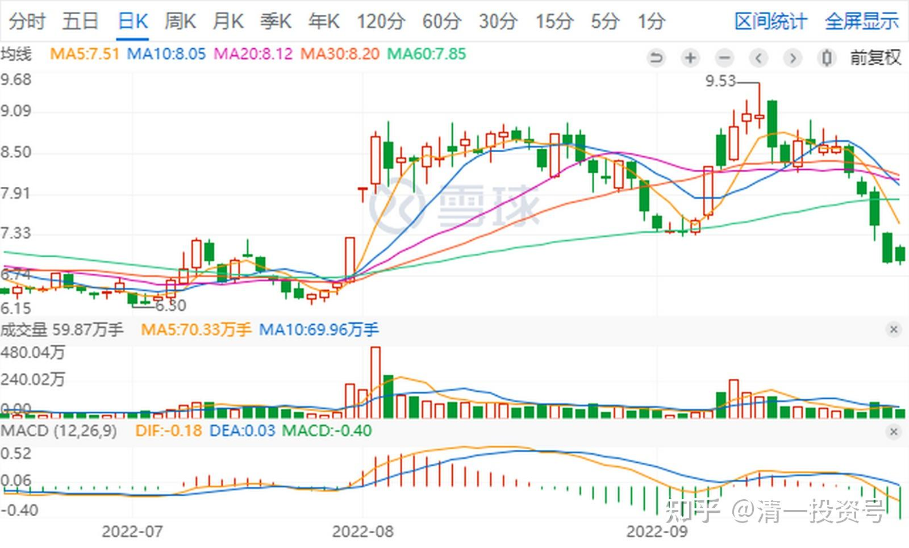

37篇.老实人只能“守株待兔”

清一山长 2022年9月29日

昨天之前，兰州黄河连续三天涨停。昨天放巨量，主力采用涨停出货。一批跟风的二傻子被套，今天跌停出货。这就是游资手法，极为凶悍。老实人只能“守株待兔”，一两年等一次这种机会。**不会这样走的，盘子相对大，不适合这样快进快出，一旦量大了，就需要走掉了。

继续等待啤酒的节日，我们不知道这只兔子在什么时候撞树，但我决定守在最有确定性的一颗树下来等。黄河这种树，一直在观察，但一直没下手。就是它的确定性还不如惠泉。当然，目前来看，当初换黄河收益会更高，但风险也更大。我不去趟这趟水。

*兰州黄河日K线*

*惠泉啤酒日K线*

昨天天山铝业破7，我原来冲涨停全卖光了。昨天补了十万股回来。天山当初走的就很妖，我当然见利就走了。我看见天山的主页下，有一个人在寻死觅活的，说自己40万只剩2万了，不想活了，做鬼也不放过庄家。看样子：就是追涨杀跌被吸光了。不然正常投资，就像单打融创，也不至于95%都跌光的。这种人，太傻了。他把40万股投入股市之前，花20元买本**《巴菲特之道》**读完再来买股票，无论如何也不会这样惨的。这是“拿命来换钱”吗？别以为你的命多金贵。你的命，就你妈觉得值钱，这个世界不在乎你的命，只在乎你作对了事情没有！

*天山铝业日K线*

参考链接：

[清一投资号：31篇.天山铝业：游资发动的钓鱼行情](https://zhuanlan.zhihu.com/p/554194867)

[清一投资号：21篇.涨停心得：价格可以骗人，量不能骗人](https://zhuanlan.zhihu.com/p/523937400)

[清一投资号：20篇.三种涨停](https://zhuanlan.zhihu.com/p/519414679)

[清一投资号：5篇.四大“最庄”评比：最佳，最傻，最阴险，最无为](https://zhuanlan.zhihu.com/p/520593354)

