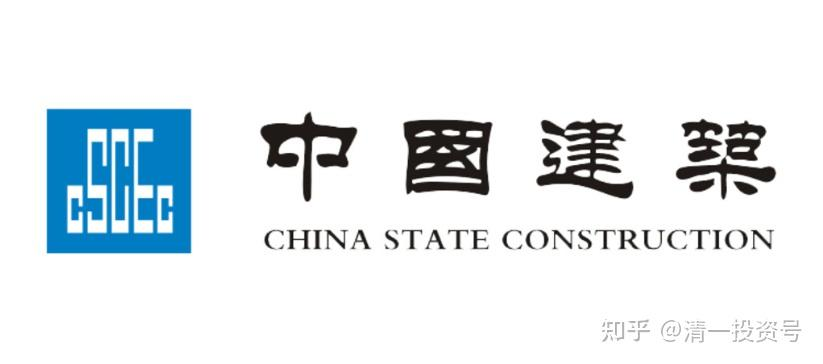
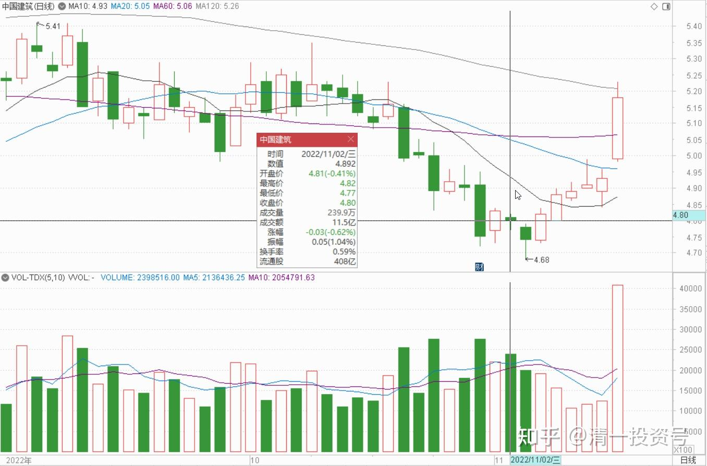

38篇.卖出涨停的部分，补回跌惨了的中建

清一山长 2022年11月2日

今天4.79元买入2百万股中国建筑。钱来自涨停卖出了某个标的。还有多的钱，会留在账上慢慢用。这是老人家的养老账户。**中建6元左右的时候卖掉了，我全部换了今天卖出的标的，当时跌得很惨，就像现在的中建一样惨。我一直想补回来的这些货的，因为我认为中国建筑才是养老股，可以放在账户上几年不动的。**

今天正好给了我这样的机会，这次转换两头赚。还比较划算。其他账户就没动了，继续等待。玩这么久，不会只是这点动静的，我也不贪，慢慢守候。别人有耐心弄个几年，我凭啥不耐心慢慢等结果？[笑]。

另外——**中国建筑也相当于现金股。**如果未来大跌的话，它应该跌不下去了，可以卖出去救援其他股。就像我上次做的一样。看市场给我啥机会吧！有可能是耳光——我卖掉的继续涨，买入的就是不涨。我会祝福买我股票的人多多发财的。这些利润是他的，不是我的。祝福接盘的人。反正我其他账户还有很多的。

