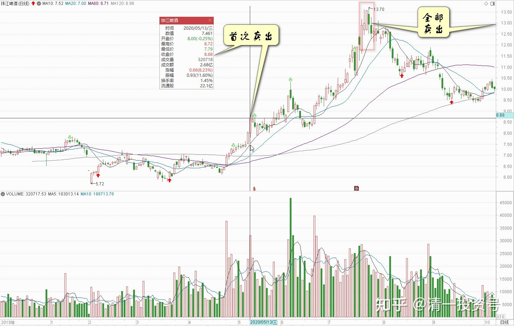
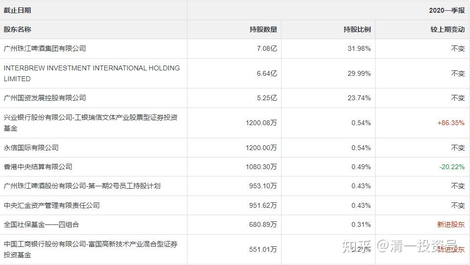
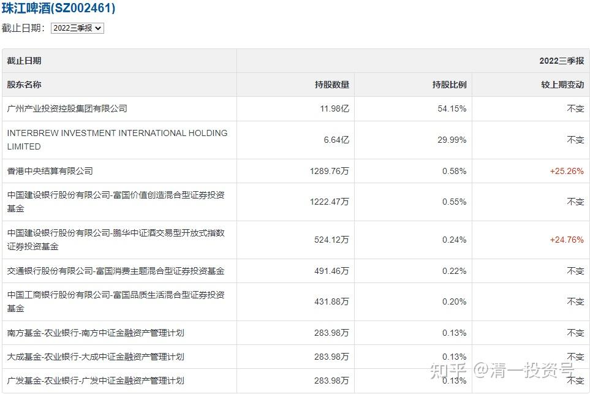
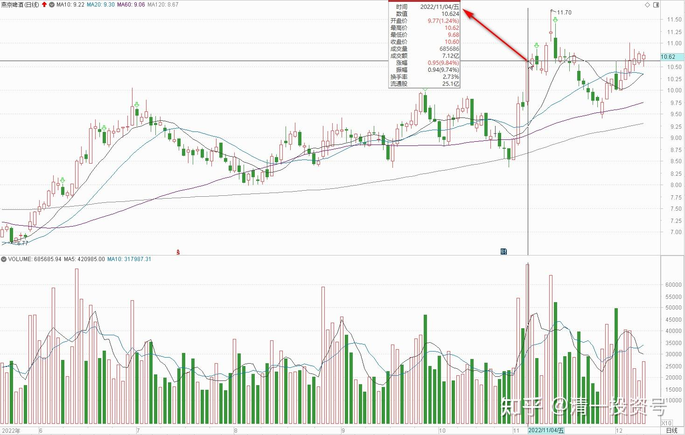
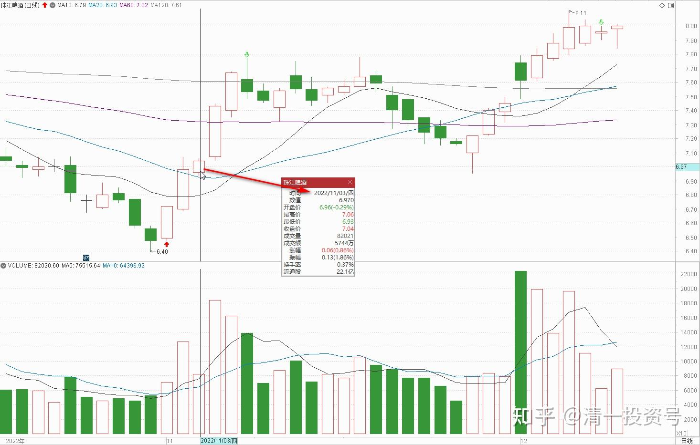

39篇.抛掉珠江两年多后，现在我再度成为珠江的十大股东

清一山长 2022年12月9日

《[86篇.游资进货与出货手法及散户如何防骗？](https://zhuanlan.zhihu.com/p/585167445)》[https://zhuanlan.zhihu.com/p/585167445](https://zhuanlan.zhihu.com/p/585167445)

难得你们把我当初的发言保存得好好的，现在我都找不到了。[赞]

雪球禁言一年多，真有本事。看样子，说真话，真的不被欢迎。这帖子价值万金。当初几个人信我？不信？自己买单去。

查了一下，2020年5月13日，我这当年珠江十大，首次开始卖出10%的持仓。首批卖出的价格是8.67元。今天回头看这个记录，就是**我执行了【看多不做多，反而做空】的格言**。结果珠江后市果然不断的上涨，后期冲13元，就全部卖出了，从十大消失退出至今。2019年年报，可以看到十大中，我的持仓4M多。但2020年一季度，我就退出了十大。但不是我的股票少了，而是进入十大的门槛突然提高到了800多万股。我的持仓不够最低的第10名，当然看上去就消失了。但这些冲进来高价抢筹的机构，现在来看都成了韭菜。今年三季度的十大入门才2M多就够了。说明原来的大户全跑了。

2020年，是我的啤酒丰收，惠泉珠江表现都相当的优秀，我都在冲高回落做了几个来回后，就全部高位撤退了。本利一起变成了燕京，默默滴守到现在，还在继续守候。据说，买股票想要赚钱，就要受得住寂寞。**买股如守寡！**唐建华守燕京5年多了，我2021年中报才进入燕京十大，还不到两年呢！继续守三年，看能否追上唐总。

查了一下：我首次卖出珠江的这一天，燕京的开盘价是6.07元，一周多后还跌破了6元整数位。而珠江之后果然逐级上攻，冲到了13元。

抛掉珠江两年多后，现在我再度成为珠江的十大股东——按照上一季的股东持有情况来算的话。如果本月没啥行情，珠江不冲涨停，年报上就可再度看到我的名字了。不出意外可能会是唯一的自然人十大股东。

今年我换入的价格是多少？大多数持仓都是7元左右买进来的。资金来源何处？上一次燕京涨停，10.61元卖出了2M的燕京，这些资金足够买3M的珠江了。**这一次卖出燕京，依然是【看多不做多，反而做空】。**卖空了2M。余下90%的存货依然慢慢再等，未来燕京的真正突破，就像当年的珠江一样。很多人认为8元多就到头了，我认为还远远没有到头。再坚持守一下。**已经守了这么久了，快开花了走掉。就太性急了。**

回头算了一笔账：我2020年，等于用一股珠江，换了差不多两股燕京（燕京平均成本在6元多，正好是珠江我出手价格的一半左右）。两年后，我用一股燕京，重新换回1.5股珠江，等于多得到了3倍的珠江持仓。怪不得我这次做珠江十大持有成本接近零。光原来的珠江的利润部分就足够了。这些仓位会持有很长时间，**我不想放弃中国的啤酒行业，计划学巴菲特长期持有，不过应该会根据不同的股票行情，换一些仓位。**假如珠江涨上去了，与燕京持平甚至超过了，我又会换回燕京的，谁便宜，我换谁！

**别人赚钱，我赚股[酷]。**

（编者注：此文是2022年12月9日在[86篇.游资进货与出货手法及散户如何防骗？](https://zhuanlan.zhihu.com/p/585167445)的评论）

[清一投资号：86篇.游资进货与出货手法及散户如何防骗？](https://zhuanlan.zhihu.com/p/585167445)

[清一投资号：88篇.游资闲谈二：快进快出的“小李飞刀手法”](https://zhuanlan.zhihu.com/p/589591604)

[清一投资号：19篇.涨停之际，谈我的啤酒股投资逻辑](https://zhuanlan.zhihu.com/p/477378802)

[清一投资号：5篇.四大“最庄”评比：最佳，最傻，最阴险，最无为](https://zhuanlan.zhihu.com/p/520593354)

