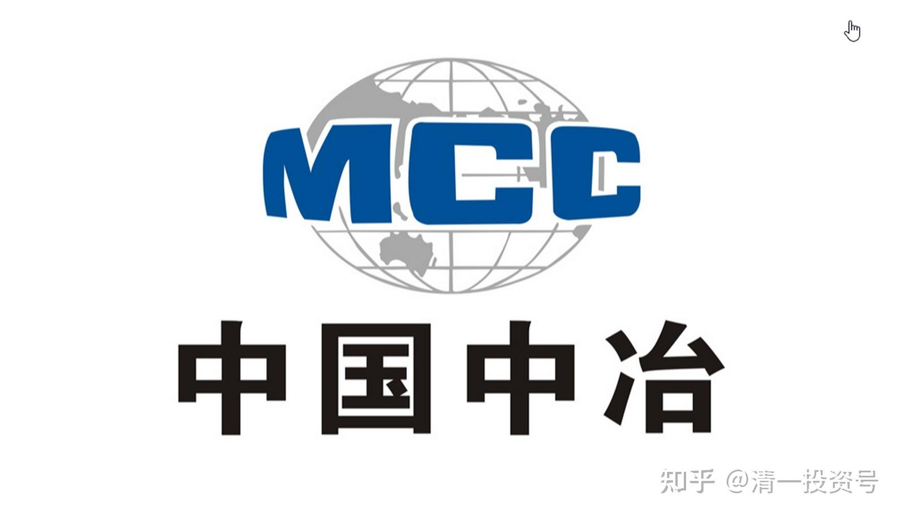
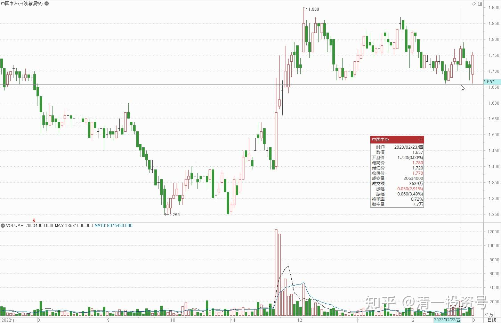
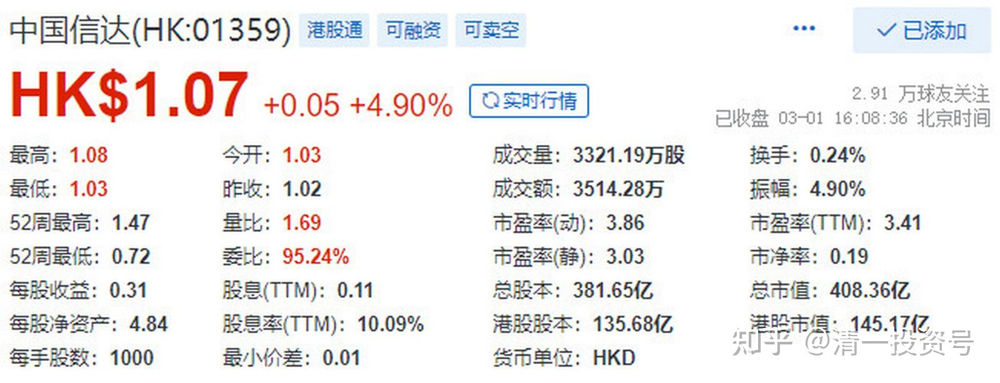

41篇.中建A换中冶H

清一山长 2023年2月23日

**芬柳州 2023/2/23 14:48:40

山长中午好，冒昧请问您一下，江南集团您还拿着吗？我一直还拿着没动，最近江南打算低价私有化了，一起拿了这么久，忍不住想听听您的看法[笑哭][笑哭][抱拳]。我跟着您买了很多股票，有的涨，有的跌，这很正常，总的来说，我还是很感恩您的无私分享，我的账户总体也是赚的，不胜感激[抱拳][玫瑰][玫瑰][玫瑰]

山长 清一 2023/2/23 17:34:51

@**芬柳州 我有几百万股。一直拿着（其实抱有幻想，当初不对的时候，早该清仓的。幸亏我也没有补仓，因为不贪）。我已经对这笔投资做了完全损失的准备。**从这些失败的投资上，我学到的教训就是——要尽量避免民营企业。特别是老板不诚信的企业，风险巨大。**我们股民是不会有机会的，看什么指标不行。**国营的企业。虽然效率低下，但有“恶龙”看门。虽然发财不容易，但也不会这样亏完掉的！**宁肯慢慢的变富！很抱歉我的错误示范让你们亏本了。江南事变后，我也尽量不提小股，不是特别有把握的股就不提了。自己买也不说。

**芬柳州 2023/2/23 17:40:37

@山长 清一 非常感谢您的回复，您不用抱歉，我自己跟着买的，自己对自己负责，股票又涨有跌正常，偶尔踩雷不可避免，对我影响也不大，感恩您一直以来的示范。按您说的只要不融资，怎么跌我都不怕的，遇到江南这样的也自认倒霉了，吸取教训，我以后都不碰港股了。其实我大部分跟您买的股票都是赚的，比如YJ，2018年左右跟着买的，现在还在，整体账户也是赚的，不胜感激。祝福您身体健康，事事顺利[抱拳] [抱拳] [抱拳] [玫瑰] [玫瑰] [玫瑰]

山长 清一2023/2/23 18:21:38

@**芬柳州 港股买国企，拿分红，也是不错的选择，没必要拒绝港股。中国建筑涨了一些之后，我昨天换了5%仓位的港股中国中冶（居然涨了）。A股两个企业的价格估值是差不多的，但港股只有40%的价格。**中建A换中冶H，等于我手上多了120%的五大建股份。**将来涨不涨，我不知道。但多拿一些股票在手上，再拿十年，我应该不会吃亏的。两者都是一个性质的企业，这种互换不吃亏。将来YJ继续涨，卖出后买入低残价值的港股，长持持有，不炒股，只拿分红的可能性也很大。因为涨太多了的A股，没投资价值，我也不买的。至于港股，A股的民企，以后都不能碰了。涨起来涨疯掉，跌起来没底线。注册制执行下来就这结果。**将来金融风暴，这些龙头国企就是压仓石。希望大家学会用拿利息的眼光来买股，而不是炒股。**YJ这种，本质上还是一次投机的股票，靠的是机遇和运气，不是靠本事的。如果靠YJ的业绩，拿利息是不成的。以后这种稳赢的投机机会，就很少了。我现在，也没有发现我敢这样重仓的第二只YJ。**将来会分散持有有发展机会的龙头国企，拿利息，不求有功，但求无过。这是未来保住财富的重要手段，别想赚快钱了。**过去三十年我实现的远远超越巴菲特平均年度回报的炒股业绩，肯定是不可维持的，将来就会明显降下来了，均值回归是必然的。

**芬玉溪 2023/2/23 18:39:43

山长好，冒昧问一下，港股中国信达还一直持有，处于亏损状态，有退市风险吗？是否需要出来[疑问]感恩您的教导。

山长 清一 2023/2/23 18:59:00

@**芬玉溪 您听说谁说，信达要破产了？现价拿10%的分红也不亏吧？[流泪]。我刚说的话就算白说了（拿股息）[流泪]——【[中国信达以1.5万亿资产规模成为中国规模最大的金融资产管理公司](http://link.zhihu.com/?target=https%3A//xueqiu.com/5401654358/242384892)】，国资。

**（雪球链接：**[https://xueqiu.com/5401654358/242384892](http://link.zhihu.com/?target=https%3A//xueqiu.com/5401654358/242384892)**）**

山长 清一 2023/2/23 19:02:58

**金融企业，央企的破产可能性都有的。**不敢说不会破产，比制造业如格力、万华的风险大。而且看不懂的，赌运气！

**不放心，就拿个快消品、工业品。**

**再不放心——拿个资源股。**

**芬玉溪 2023/2/23 19:07:31

感恩山长回复，我是看到上面您回复说江南那个股票才问的，不然一直拿着有四年了。

**芬玉溪 2023/2/23 19:09:04

因为愚钝，打扰您了。[玫瑰][玫瑰][玫瑰]

**芬柳州 2023/2/23 19:09:14

@山长 清一 非常感恩您的教导示范，已保存收藏，经常拿出来看看警醒自己[玫瑰][玫瑰][玫瑰][抱拳][大笑]按您给的思路，我手上还有一些中国信达、中国再保险，也是多年前买的，更不慌了，就收点利息算了。[抱拳][抱拳][抱拳]

[山长 清一：有买股票包赚不赔的奥秘吗？写在燕京创历史新高之际](https://zhuanlan.zhihu.com/p/604260212)

[山长 清一：比尔盖茨花费62亿元买啤酒](https://zhuanlan.zhihu.com/p/609793615)

[清一投资号：8篇.建筑的股性正在激活中](https://zhuanlan.zhihu.com/p/476832159)

[清一投资号：17篇.中建股东数历史新低](https://zhuanlan.zhihu.com/p/505901339)

[清一投资号：22篇.未来什么东西最有价值——资源](https://zhuanlan.zhihu.com/p/526512816)

[清一投资号：26篇.新能源产业链投资规划（重要）](https://zhuanlan.zhihu.com/p/534678751)

