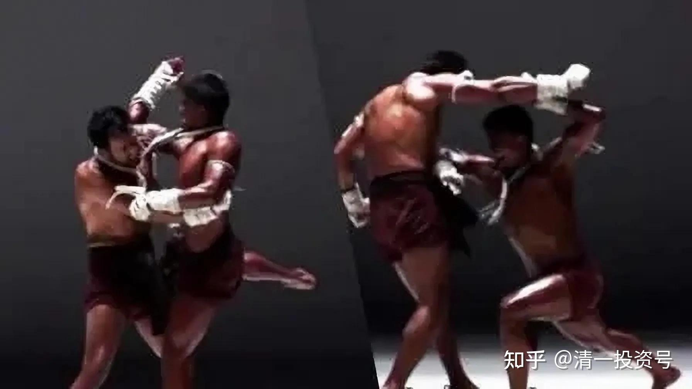
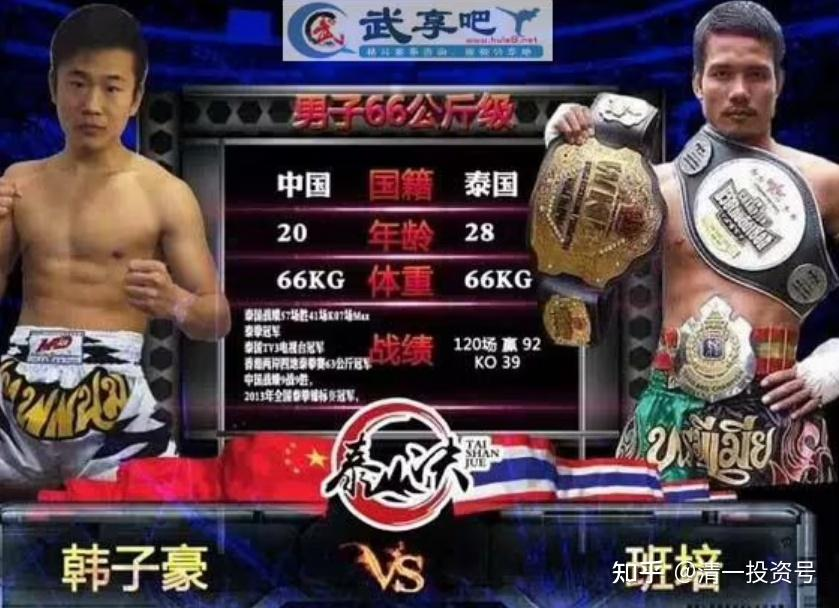

[42篇.清一太极征泰记录：百战无败，创新历史【100场+视频比赛链接】](https://zhuanlan.zhihu.com/p/611886275)

太极征泰第一人 清一大学创办人 山长 清一​ 2023年3月7日

泰拳号称五百年不败！下面中国媒体的文章，就历数了传武征泰惨败的历史，把泰拳抬得高高的。因为百年来传武战泰拳的记录太惨了。最近20年略好一些，因为中国拳手打不赢泰拳手，只好谦虚地学习泰拳，在泰国练拳，取得了一些战胜泰拳手的成绩。甚至张伟丽这种世界拳王，其实是练泰拳的，没传武啥事！中国的武术格斗界，哈俄巴泰思维很严重，完全失去了自尊和自强。

[泰拳500年不败神话名不虚传，传统武术在泰拳面前啥也不是](http://link.zhihu.com/?target=https%3A//new.qq.com/rain/a/20210720A05FUN00)

​[https://new.qq.com/rain/a/20210720A05FUN00](http://link.zhihu.com/?target=https%3A//new.qq.com/rain/a/20210720A05FUN00)

2017年，徐某东击败武术骗子大师雷雷、马保国等，全国武林界的大师们、传武大神们，居然噤若寒蝉，消极避战。中国爱武人士从此风向转换，从传武粉，转为传武黑，一众人马纷纷声讨传武，自甘堕落，自认传武不行。

2019年，清一无法接受传武的堕落，在深圳演讲会场数千人面前，公开声明：从头训练一批没有学过武术的零起点，有志气的学生，三到五年，就足以击败现代职业格斗，甚至击败世界冠军。当时嘲笑者如云，根本不相信传武能够击败现代格斗。

山人清一，一个并未从小习武，而是一路读书考试，上985大学，读研究生，毕业留校当大学教师，仅仅是上大学之后，才开始把武术作为业余爱好练练玩的文人，一生也从未打过实战，没有上过擂台。但眼见传武就要毁在自甘堕落的武林人士手上，以及毁在自吹自擂的传武大神们嘴上。**中华武林，今天不再是精英阶级的宝器，只是一群读书读不进去的底层社会人士，用来跑江湖卖艺，混名利场的工具。**这群底层思维的人，缺乏真正中华武人的荣誉感和至上精神，当然不以弘扬中华传武为事。只是借传武之名，借古人之威，鼓捣一些江湖骗术，出来到处捞钱。

一百多年了，中华武术界毫不进取，现在居然被一个只是业余水平的现代格斗手如此羞辱，让国人大骂传武，真是侮辱祖宗。但这些不肖子孙两三年了都毫无反应。因此清一料定国中之武人，已经失去了中华武人的骨髓，竖子不足为谋。为了替民族争光，替传武扬名，替武术界的列祖列宗争气。在专业武术人士崇洋贬己，体育官僚们对传武不作为的情况下，清一身为一介书生，面对当前中华传武大厦就要覆灭之际，认为匹夫有责，决定自己掏钱做集训平台，召集一批不求名利的年轻人，重新寻古探今，探索用传武技术参加擂台格斗的方法，去征战世界，击败现代职业格斗手。

**“[清一武道馆](https://www.zhihu.com/people/mkaga)”**从此建立，以恢复和捍卫中华传武荣誉为己任！把挑战对象，直接选号称最凶猛的站立格斗技术的泰拳，让世界闻风丧胆的拳种，中国人最畏惧和崇拜的对象。我们计划是先击败泰拳，再去打其他拳种。我们不学泰拳，只打泰拳。用纯正的中国功夫，不同的格斗逻辑，击败泰拳。

清一太极是中国人用传武格斗技术击败现代格斗的第一个，希望不是最后一个！

希望我们的示范，能够激发中华武人已经埋在灰烬中的传武火种复燃。如果我们采用祖宗留下的智慧，可以让一群业余爱好者，就敢挑战职业拳手的饭碗，相信你们也能！

**只要尊重祖宗的智慧，我们就有美好的未来！**

2022年3月25日，清一太极首战泰拳。木兰佳慧和木兰明晓两人首秀，就双双击败了泰拳手，并取得首战KO的成绩。两个木兰第二战就直接与泰国的地区冠军金腰带对战，并KO了金腰带。让泰方精心准备的老拳手戏弄新手的场面翻转过来。让赛前直说“你们死定了”的泰拳馆长和泰拳教练们惊愕无语。

快速晋级的木兰们，甚至**[第七战就敢与职业男拳手（伪娘）对战](https://zhuanlan.zhihu.com/p/557820557)**，创造了泰拳的历史纪录！三战男拳手均战平（我方场上均处优势）。

2023年3月5日，迎来了太极征泰的**[第100场比赛](https://www.zhihu.com/zvideo/1616112106847408128)**。木兰佳慧对战超过60公斤级的泰拳手，轻松取胜！

[征泰的第一场比赛](https://zhuanlan.zhihu.com/p/488027181)，泰拳手面对中国拳手，非常的傲慢无礼，连最基本的礼貌都没有。对明晓的场下问候毫不理睬，上场赛前碰拳都不碰就直接出腿攻击，一副看不起人的样子。

随后的比赛，泰拳手不仅仅收起了傲慢，对木兰们礼貌相待。还多次发生打完比赛后，泰拳手擂台上当场跪下，对我方拳手行匍匐礼的动作，这是清一拳手们用实力获得的尊重。

木兰佳慧去伦披尼比赛，主办人非常惊讶地说——这是中国的女拳手，第一次来到**[伦披尼比赛](https://zhuanlan.zhihu.com/p/589269064)**。这是过去几十年从来没有过的新记录！**[迦南隆拳场比赛](https://www.zhihu.com/zvideo/1579948155369672705)**时，还以为她是日本人！不相信是中国人，知道是“纯中国人”也很惊讶！我们正在改写格斗的历史！

今年的[第100场比赛](https://www.zhihu.com/zvideo/1616112106847408128)时，清一拳手们已经威震泰拳，居然出现了临场弃战，不敢上场的泰拳手。还有勉强上场后，虽然比我方体重、身高、臂展都大一圈，拥有身体优势的泰拳手，却不敢上前搏战，一开场就往后躲避，因为泰拳手已经知道：对拼完全就没有胜算，就一直想办法拖延比赛，搞小动作，试图蒙混过关！用裁判来赢得胜利。

短短一年之间，我们就在泰国人的主场上，毫无疑问地击败了泰拳。泰国拳界只能靠裁判的帮助，来获取对木兰们的虚假胜利！

更惊人的记录是：太极征泰百战，客场纯泰比赛，清一太极无一败战，从未被号称凶猛残酷的泰拳手KO。相反我方总共49次KO对手！被KO的泰国拳手中，不乏各种地区冠军、全国冠军、世界冠军、双金腰带等。超体重来打比赛的金腰带拳手，也败在我方手下。主办方为了挽回面子，一年来都尽量找来泰方能够找到的厉害拳手，试图KO木兰们一次，甚至会给新木兰首战，就安排相当于地区冠军一级的拳手出战。但依然无济于事。

目前我们已经彻底击败了泰拳手的自信。在泰国北部地区，现在已经很难找到愿意跟木兰们对战的泰拳手了！本月内，木兰们将参加泰国的全国锦标赛（循环淘汰赛），迎战泰拳的全国精英拳手。

由于我们在泰国作战，泰国裁判不可能公正判定比赛成绩，不KO就判负。因此我们就用一个简单的方式来判断征泰结果：KO就算胜利，不KO就算双方平局！避免裁判的干扰。按此标准算，我方征泰百战，无一场败绩。一年来，100场实战比赛，我方完胜职业泰拳手。这种完全超越常规的比赛结果（所谓胜负兵家之常），只能证明我们用的格斗技术，肯定不是泰拳技术，不然最多取得泰拳的平均成绩。如此大幅度的优胜职业泰拳手，说明我们采用的技术，一定是优于泰拳的。

取得49%KO率的结果，还是在我方拳手，面对后来畏战的泰拳手，后期都有点放水，上场比赛的时候，以训练、提高为目标，不以KO对手为目的情况下，我方取得的真实战绩。

以下为首批清一太极拳手的百战成绩单！

姓名 KO/比赛场次 KO率

佳惠 14KO/25 56%

明晓 15KO/26 58%

谭琛怡 3KO/15 20%

陆鸽 7KO/12 58%

明骐 1KO/6 20%

郭旗 2KO/6 33%

刘轩宁 2KO/6 33%

程炳森 1KO/1 100%

蔡凯琪 1KO/3 33%

**共KO 49/100场 49%**

这么高的**KO**率，意味着什么？看看一些知名泰拳手的记录就知道了，完全的创新纪录：

播求：百科记录，泰拳战绩420战370胜125次KO对方45负5平，日本媒体称播求为史上最强之男。KO率也只有26%左右。

现年42岁的善猜，职业战绩327胜49负，41场KO。KO率仅仅10%多一点！

播求对阵Jomhod，号称泰拳届的传奇巨星，其266战、240胜、23负、3平、76KO的战绩。据说足以使任何一个泰拳王者都为之赞叹和敬佩。但——KO率不到30%。

下面这个三条金腰带泰国知名拳手，KO率也只有30%左右！

清一太极49%的KO率，以及自身百战无败的战绩，已经充分说明了传武面对现代格斗，拥有巨大的技术优势。传武不需要制定对自己有利的比赛规则，优越的全面技术，完全可以适应任何现代格斗的规则来进行战斗，而且我们都能取得胜利。

2023年，已经开启**“太极征英式拳击”**的规划。目标是全世界的拳击高手。

2024年，将开启打MMA比赛的计划。

清一太极，将与世界各种格斗都一一较量，为中华争光，为传武扬名！为自己争气！

发布于2023-03-07 05:24

**[百战无败，开创历史——太极征泰100场战事回顾总结](http://link.zhihu.com/?target=https%3A//www.bilibili.com/video/BV17g4y1g7oT)**完整版文件链接:

[https://pan.baidu.com/s/1wLX2BOm2ipkThNXbSf13OQ?pwd=hylt](http://link.zhihu.com/?target=https%3A//pan.baidu.com/s/1wLX2BOm2ipkThNXbSf13OQ%3Fpwd%3Dhylt)

提取码: hylt

2022年3月，正式在泰国开启征泰比赛，次年三月已打百战。打遍泰国的地区冠军，全国冠军和世界冠军等，创造了百战无败的历史，49场KO泰拳手。 面对中华木兰的气势，泰拳手们现已纷纷避战。实现传武正名目标！

**辨别真传武的方式很简单：去跟世界格斗职业拳手，真打实战就行了。不是打一场两场。而是打一百场、两百场。甚至一千场实战比赛。打多了，行不行，不用自己说，别人会自动评价的。**

** 中国传武的毛病，就是骗子太多，动嘴巴的人太多，编故事的人太多。实战的人太少！真正传武的发扬，需要中国也有一批日本泽村忠一样的人，去踏实研究，发展中国的传武，传武才能发扬光大。**

清一太极征泰，做到了百场无一败，大比例KO职业泰拳手。我们的胜率太高了，远远超过泰拳的正常KO率、正常胜率。除了相信拥有完全不同于泰拳的格斗技术，还有啥能解释这个奇异的结果？

因此，不是传武不行，是学传武的人不行。别把两个不同的概念混为一个概念。

当然，我们也很遗憾：还没有打出拳经上“犯者立扑”的效果，还没有做到4两拨千斤。毕竟——真正的古太极，是十年不出门的。我们出征太早，弘扬传武的心太急，才三年就出来打，太早了一点。但**假以时日，你们会见到“犯者立扑”的高级格斗技术的。只要多给我们一些时间，你们还会看到我们的女孩子，优雅地击倒职业男拳手。这一天。将是中华传武创造世界新纪录的日子！**

山长清一 2023/6/16 8:38:24

我说过：泰方不会放过一切机会KO从木兰拳馆出来的拳手。因为他们的记录——目前已经149战无一KO，绝对是泰拳的耻辱。血耻的方式，自然是取得一次无可争议的胜利。因此用金腰带来对付我方才16岁的新拳手，也不足为奇怪。“欲带皇冠，必承其重”。想要光耀中华武术。我，孩子们从首战开始，一步一擂台，用真实的战绩，建立起我们中华人的武术文化自信！

**参考链接：**

[太极征泰第1、2战：泰拳500年不败神话，正被清一太极终结](https://zhuanlan.zhihu.com/p/488027181)

[太极征泰第3战：佳惠第2场](http://link.zhihu.com/?target=https%3A//www.bilibili.com/video/BV1DL4y1F7Ly)

[太极征泰第4战：明晓第2场，首次KO金腰带泰拳手](http://link.zhihu.com/?target=https%3A//www.bilibili.com/video/BV1X44y1g7Di)

[太极征泰第5战：佳惠第3场](https://zhuanlan.zhihu.com/p/533876532)

[太极征泰第6战：明晓第3场](https://www.zhihu.com/zvideo/1527610544953864192)

[太极征泰第7战：佳惠第4战](https://www.zhihu.com/zvideo/1527614593275203584)

[太极征泰第8战：明晓第4战（一对二第二战）](https://www.zhihu.com/zvideo/1527615263645777921)

[太极征泰第9战：明晓41 VS 50公斤级](https://www.zhihu.com/zvideo/1533384045949460480) [第9场“高清主办方拍摄版”](https://www.zhihu.com/zvideo/1533431860193767425)

[太极征泰第10战：木兰明晓第6场](https://www.zhihu.com/zvideo/1543873773274935296) [明晓对战48公斤级泰国女子全国冠军Pancake高清版](https://www.zhihu.com/zvideo/1543970801426399232)

[太极征泰第11战：佳惠第5场，KO胜，高清近景版](https://www.zhihu.com/zvideo/1546088011623776256) [佳惠打哭泰国女拳手（标清远景版）](https://www.zhihu.com/zvideo/1546090745924415488)

[太极征泰第12战：明晓第7场，53公斤娘炮职业拳手](https://www.zhihu.com/zvideo/1546429790864752640) [明晓第7场，近景高清版](https://www.zhihu.com/zvideo/1546621701760405504)

[太极征泰第13战，佳慧第6场，KO胜，艾拉公主点评版](https://www.zhihu.com/zvideo/1549538446376587264)

[太极征泰第14战：明晓第8场，点数负，原版](https://www.zhihu.com/zvideo/1551249343016828928)

[太极征泰第15战：佳惠第7场，KO胜，小公主艾拉解说版](https://www.zhihu.com/zvideo/1551662001520357376)

[太极征泰第16战：明晓第9场，点数胜，原版](https://www.zhihu.com/zvideo/1552263008361082880)

[太极征泰第17战：木兰佳慧二番战，KO胜](https://www.zhihu.com/zvideo/1553014525674364928)

[太极征泰第18战：明晓第10场，KO胜，近景版](https://www.zhihu.com/zvideo/1554023338728456192)

[太极征泰第19战：佳惠第9场，近景高清](https://www.zhihu.com/zvideo/1554774629603840000)

[太极征泰第20战：佳慧金腰带二番战，打通仑披尼之路](https://www.zhihu.com/zvideo/1556929469822316544)

[太极征泰第21战：明晓第11场，KO胜](https://www.zhihu.com/zvideo/1559671886459387904)

[太极征泰第22战：佳慧第11场，KO胜](https://www.zhihu.com/zvideo/1559834502930784256)

[太极征泰第23战：佳慧VS泰拳世界冠军NAMWAN，艾拉点评翻译版](https://www.zhihu.com/zvideo/1563310349993861121)

[太极征泰第24战：明晓KO清迈地区冠军](https://www.zhihu.com/zvideo/1563925849988022272)

[太极征泰第25战：佳惠第13战，KO胜](https://www.zhihu.com/zvideo/1564538437411241984) [观众视角，创纪录的九连膝终结对手](https://www.zhihu.com/zvideo/1564548136005242880)

[太极征泰第26战：佳惠第14场，KO胜](https://www.zhihu.com/zvideo/1565983557071360000)

[太极征泰第27战：明晓点数胜](https://www.zhihu.com/zvideo/1566326462956892160)

[太极征泰第28战：佳慧第15场，对战56公斤，高壮大对手](https://www.zhihu.com/zvideo/1568155809611210752)

[太极征泰第29战：明晓对战51公斤对手，KO胜](https://www.zhihu.com/zvideo/1568889000470962177) [太极征泰第29战，高清近景版](https://www.zhihu.com/zvideo/1569100329496625152)

[太极征泰第30战：佳慧对阵56公斤级顶尖对手Namthip](https://www.zhihu.com/zvideo/1570807227128127488)

[太极征泰第31战：高手缠拳战，艾拉解说翻译制作版](https://www.zhihu.com/zvideo/1573756752138608640)

[太极征泰第32战：明晓KO胜](https://www.zhihu.com/zvideo/1573596105253789696)

[太极征泰第33战：明晓打满五局](https://www.zhihu.com/zvideo/1573599316131852288)

[太极征泰第34战：谭木兰首秀，打满五局](https://www.zhihu.com/zvideo/1576675825449201664)

[太极征泰第35战：武士郭旗首秀，用劈挂掌KO对手](https://www.zhihu.com/zvideo/1576679889452597248)

[太极征泰第36战：明骐首秀，密集出拳KO超顽强对手](https://www.zhihu.com/zvideo/1576682039557976064)

[太极征泰第37战：佳惠第18场，KO胜](https://www.zhihu.com/zvideo/1578030627974279168) [清一木兰战泰拳第31场（佳惠第17战）20221105](http://link.zhihu.com/?target=https%3A//www.bilibili.com/video/BV1S8411h7SD)

[太极征泰第38战：明晓17场，KO胜](https://www.zhihu.com/zvideo/1578242522379505664)

[太极征泰第39战：明晓18战，KO胜！](https://www.zhihu.com/zvideo/1578546599034245120)

[太极征泰第40战：明骐第2场，打满五局！](https://www.zhihu.com/zvideo/1578923511254515713)

[太极征泰第41战：新木兰陆鸽首秀，KO胜](https://www.zhihu.com/zvideo/1579270133658431488)

[太极征泰第42战：佳慧曼谷南伽隆首战，点数胜](https://www.zhihu.com/zvideo/1579850150452883456) [木兰佳慧首战曼谷迦南隆拳场，高清版](https://www.zhihu.com/zvideo/1579948155369672705)

[太极征泰第43战：谭木兰二番战，打满五局](https://www.zhihu.com/zvideo/1580720352979857408)

[太极征泰第44战：木兰鸽第2场，泰方赢得好难看！](https://www.zhihu.com/zvideo/1581213237244379137)

[太极征泰第45战：谭木兰VS前泰拳青年世界冠军帕卡](https://www.zhihu.com/zvideo/1581578146146648064)

[太极征泰第46战：明骐打满五局，点数负！](https://www.zhihu.com/zvideo/1581941042408022016)

[太极征泰第47战：郭旗打满五局](https://www.zhihu.com/zvideo/1582306193384554496)

[太极征泰第48战：明晓第19战，KO胜](https://www.zhihu.com/zvideo/1583262896313888768)

[太极征泰第49战：谭木兰三番战，打满五局点数负](https://www.zhihu.com/zvideo/1584103766432825344)

[太极征泰第50战：木兰鸽第3场，飞步野马分鬃首秀擂台，KO胜](https://www.zhihu.com/zvideo/1584700839830257664)

[太极征泰第51场：佳惠第20战，点数负](http://link.zhihu.com/?target=https%3A//www.bilibili.com/video/BV1v8411G7Wd/)20221210

[太极征泰第52战：明晓第20战，KO胜](https://www.zhihu.com/zvideo/1585925611146600448) [https://www.bilibili.com/video/BV1RP4y1S7nb](http://link.zhihu.com/?target=https%3A//www.bilibili.com/video/BV1RP4y1S7nb)

[太极征泰第53战：陆鸽第四场，KO胜](https://www.zhihu.com/zvideo/1586878707112800257)

[太极征泰第54战：佳慧对战60公斤超重对手，KO胜，近景版](https://www.zhihu.com/zvideo/1587613961972797440)

[太极征泰第55战：郭旗第3场，KO胜](https://www.zhihu.com/zvideo/1589056785020870656)

[太极征泰第56战：谭木兰打满五局](https://www.zhihu.com/zvideo/1589246682662871040)

[太极征泰第57战：木兰鸽第5场，KO胜](https://www.zhihu.com/zvideo/1589542848353038336)

[太极征泰第58战：木兰鸽第6场，读秒胜！](https://www.zhihu.com/zvideo/1591602967496335360)

[太极征泰第59战：明晓第21场，第三回合飞膝KO对手！](https://www.zhihu.com/zvideo/1591608415171940353)

[太极征泰第60战：谭木兰第6场，越级打60公斤拳手，点数胜！](https://www.zhihu.com/zvideo/1592456286196613120)

[太极征泰第61战：明晓打满五局！](https://www.zhihu.com/zvideo/1593903270350827520)

[太极征泰第62战：谭木兰第7场，第三局KO胜](https://www.zhihu.com/zvideo/1594161422413516800)

[太极征泰第63战：武士郭旗第4场，优势胜！](https://www.zhihu.com/zvideo/1594271031518183424)

[太极征泰第64战：佳慧继续对战超重对手，打满五局](https://www.zhihu.com/zvideo/1594501642736590848)

[太极征泰第65战：新武士刘轩宁首秀，KO胜！](https://www.zhihu.com/zvideo/1594865795267440640)

[太极征泰第66战：谭木兰第8场，KO胜](https://www.zhihu.com/zvideo/1595002461743505409)

[太极征泰第67战：谭木兰第9场，VS前青年世界冠军帕卡，KO胜](https://www.zhihu.com/zvideo/1597163200356696064)

[太极征泰第68战：佳惠23战，优势胜](https://www.zhihu.com/zvideo/1597416160994992128)

[太极征泰第69战：明骐第4场，打平](https://www.zhihu.com/zvideo/1597513798322982912)

[太极征泰第70战：木兰鸽狂虐对手五回合](https://www.zhihu.com/zvideo/1597517604406661120)

[太极征泰第71战：武士刘轩宁2战，五回合打满胜](https://www.zhihu.com/zvideo/1598466069907410944)

[太极征泰第72战：新木兰蔡凯琪首秀，打满五局](https://www.zhihu.com/zvideo/1598472782639325184)

[太极征泰第73战：新武士程炳森首秀，KO胜（最危险的一次比赛）](https://www.zhihu.com/zvideo/1599210724638887936)

[太极征泰第74战：谭木兰第10场，打满五回合胜](https://www.zhihu.com/zvideo/1599216606281957376)

[太极征泰第75战：木兰佳慧对阵60公斤对手，KO胜（开赛以来最佳比赛）](https://www.zhihu.com/zvideo/1599220490689851392)

[太极征泰第76战：大年三十，明晓打满五回合](https://www.zhihu.com/zvideo/1600426087993020417)

[太极征泰第77战：大年初一谭木兰击败英国人，夺得金腰带，为国争光！](https://www.zhihu.com/zvideo/1600855404174540800)

[太极征泰第78战：“中国日”——刘轩宁](https://www.zhihu.com/zvideo/1605498573977800704)

[太极征泰第79战：“中国日”——明晓，被窃取胜利的比赛](https://www.zhihu.com/zvideo/1605500055179501568)

[太极征泰第80战：“中国日”——谭琛怡，点数胜](https://www.zhihu.com/zvideo/1605502662606270464)

[太极征泰第81战：“中国日”——郭旗，点数胜](https://www.zhihu.com/zvideo/1605512404795953152)

[太极征泰第82战：“中国日”——明骐平局](https://www.zhihu.com/zvideo/1605515541397114880)

[太极征泰第83战：“中国日”——蔡凯琪，打满五局胜！](https://www.zhihu.com/zvideo/1605521378798755840)

[太极征泰第84战：“中国日”——陆鸽，KO胜](https://www.zhihu.com/zvideo/1605525989034991617)

[太极征泰第85战：刘轩宁战老油条，打满五局！](https://www.zhihu.com/zvideo/1601767132626481152)

[太极征泰第86战：陆鸽对战超重对手，打满五回合！](https://www.zhihu.com/zvideo/1601948197856956417) [陆鸽打重量级拳，第一局](https://www.zhihu.com/zvideo/1601942989907124224)

[太极征泰第87战：明晓VS冠军帕卡，第一局KO对手](https://www.zhihu.com/zvideo/1601959963072585728)

[太极征泰第88战：蔡凯琪3战，退役之战，首局KO胜](https://www.zhihu.com/zvideo/1602226674489311232)

[太极征泰第89战：谭木兰五连蹬KO双金腰带全国冠军（艾拉翻译版）](https://www.zhihu.com/zvideo/1603491416197582848)

[大年初一金腰带争夺战：木兰首战英国洋人](https://www.zhihu.com/zvideo/1605144033730478080)

[太极征泰第90战：明晓KO地区冠军！](https://www.zhihu.com/zvideo/1603006717528276992)

[太极征泰第91战：陆鸽打假小子，KO胜](https://www.zhihu.com/zvideo/1605244339969609728)

[太极征泰第92战：谭木兰VS泰拳世界冠军甜水NAMWAN](https://www.zhihu.com/zvideo/1606035734401708032)

[太极征泰第93战：刘轩宁打满五回合！](https://www.zhihu.com/zvideo/1607862174457679872)

[太极征泰第94战：木兰鸽KO胜](https://www.zhihu.com/zvideo/1607867224756002816)

[太极征泰第95战：明骐打满五局！精剪版](https://www.zhihu.com/zvideo/1610310413110960128)

[太极征泰第96战：刘轩宁，第二回合KO胜！精剪版](https://www.zhihu.com/zvideo/1610306879854149632)

[太极征泰第97战：谭木兰打满五局，精剪版](https://www.zhihu.com/zvideo/1612974432833716224)

[太极征泰第98战：郭武士打满五局](https://www.zhihu.com/zvideo/1613614510266454016)

[太极征泰第99战：陆鸽第12场，打满五局，剪辑版](https://www.zhihu.com/zvideo/1615492486318678016)

[太极征泰第100战：佳惠外府五局胜超重对手](https://www.zhihu.com/zvideo/1616112106847408128)

[太极征泰第101战：AM泰拳世界锦标赛初赛，谭木兰成功晋级](https://www.zhihu.com/zvideo/1618332544314597376)

[太极征泰第102战：泰拳世界锦标赛初赛，佳惠碾压菲律宾拳手](https://www.zhihu.com/zvideo/1618333814727680000)

[太极征泰第103战：明晓打满五回合](https://www.zhihu.com/zvideo/1618247203054612481)

[太极征泰第104战：陆鸽打满五局！](https://www.zhihu.com/zvideo/1618249837446729728)

[太极征泰第105战：泰拳世界锦标赛决赛，谭木兰夺冠！](https://www.zhihu.com/zvideo/1619665849303916544)

[太极征泰第106战：佳慧打满三回合，碾压对手](https://www.zhihu.com/zvideo/1619666656573177856)

[太极征泰第107战：泰拳世界锦标赛决赛，明晓VS超重10公斤对手](https://www.zhihu.com/zvideo/1619746814227439616)

[太极征泰第108战：刘轩宁KO对手胜！](https://www.zhihu.com/zvideo/1620827358730084352)

[太极征泰第109战：明骐太极旋身肘双击KO纹身男泰拳手](https://www.zhihu.com/zvideo/1620925045760487424)

[太极征泰第110战：郭旗打满五局，点数胜！](https://www.zhihu.com/zvideo/1623857886198661120)

[太极征泰第111战：陆鸽3.31日比赛，打满五局](https://www.zhihu.com/zvideo/1626289829607575552)

[太极征泰第112战：明骐越级打超重对手，第四回合KO胜！](https://www.zhihu.com/zvideo/1626525038500360192)

[太极征泰第113战：谭木兰KO胜](https://www.zhihu.com/zvideo/1629980763289231360)

[太极征泰第114战：明晓外府第三回合KO胜！](https://www.zhihu.com/zvideo/1631777422105272320)

[太极征泰第115战：佳惠打满五回合，泰裁胜](https://www.zhihu.com/zvideo/1631965506276884480)

[太极征泰第116战：陆鸽打满五局，读秒胜](https://www.zhihu.com/zvideo/1633203263964254209)

[太极征泰第117战：谭木兰拳击首秀 【直播录屏】](https://www.zhihu.com/zvideo/1634512972709154816)

[太极征泰第118战：佳惠打满五局](https://www.zhihu.com/zvideo/1634131285391220737)

[太极征泰第119战：明骐连续第三次KO对手，犯者立扑！](https://www.zhihu.com/zvideo/1634132852512874497)

[太极征泰第120战：木兰鸽越级KO重7KG对手](https://www.zhihu.com/zvideo/1635022993133867008)

[太极征泰第121战：刘轩宁打满五局](https://www.zhihu.com/zvideo/1635576633682898944)

[太极征泰第122战：谭琛怡打满五局判胜](https://www.zhihu.com/zvideo/1636054128576176128)

[太极征泰第123战：木兰鸽KO 60公斤对手！](https://www.zhihu.com/zvideo/1637245790388187137)

[太极征泰第124战：明骐打满五局，点数胜](https://www.zhihu.com/zvideo/1637613762697031680)

[太极征泰第125战：谭木兰越级对战62公斤对手 KO胜](https://www.zhihu.com/zvideo/1638892336787787776)

[太极征泰第126战：佳慧打满五回合](https://www.zhihu.com/zvideo/1638866784676630528)

[太极征泰第127战：明晓越级KO 60公斤对手！](https://www.zhihu.com/zvideo/1639920107563556864)

[太极征泰第128战：刘轩宁第三局KO对手！](https://www.zhihu.com/zvideo/1641160751707627520)

[太极征泰第129战：明晓外府对战泰拳老将，打满五局胜](https://www.zhihu.com/zvideo/1641165912920227840)

[太极征泰第130战：佳慧外府打满五局胜](https://www.zhihu.com/zvideo/1641173213831970816)

[太极征泰第131战：明骐飞膝KO对手](https://www.zhihu.com/zvideo/1642156030669844480)

[太极征泰第132战：陆鸽越级打60公斤KO胜](https://www.zhihu.com/zvideo/1642196802878263296)

[太极征泰第133战：谭木兰打满五回合](https://www.zhihu.com/zvideo/1642914340587233280)

[太极征泰第134战：佳惠打满五回合](https://www.zhihu.com/zvideo/1643738747941474304)

[太极征泰第135战：明骐打满五回合](https://www.zhihu.com/zvideo/1645055419751174144)

[太极征泰第136战：刘轩宁 VS 200战老手，打满五局！](https://www.zhihu.com/zvideo/1645173226731700225)

[太极征泰第137战：开创历史的男女大战——木兰明晓战职业男拳手](https://www.zhihu.com/zvideo/1645490606687338496)

[太极征泰第138战：刘轩宁打满五局，点数负](https://www.zhihu.com/zvideo/1646878743741345792)

[太极征泰第139战：谭琛怡打满五回合负](https://www.zhihu.com/zvideo/1646881213469147136)

[太极征泰第140战：刘轩宁打满五局！](https://www.zhihu.com/zvideo/1647645488773144576)

[太极征泰第141战：木兰鸽打满五局胜！](https://www.zhihu.com/zvideo/1647717258703900672)

[太极征泰第142战：谭琛怡狂殴重10公斤对手至读秒](https://www.zhihu.com/zvideo/1647830500013223936)

[太极征泰第143战：佳慧VS白人拳手（苏格兰）金腰带之战](https://www.zhihu.com/zvideo/1648095446194184192)

[太极征泰第144战：谭木兰KO 62公斤对手！](https://www.zhihu.com/zvideo/1648392829226418176)

[太极征泰第145战：明晓44kg对战56.5kg对手](https://www.zhihu.com/zvideo/1648771500311347201)

[太极征泰第146战：新木兰鄢佳彦首战 KO对手](https://www.zhihu.com/zvideo/1650542483787460608)

[太极征泰第147战无一败：刘轩宁打满五局](https://www.zhihu.com/zvideo/1651894606114656256)

[太极征泰第148战无一败：谭木兰对战曼谷拳手，金腰带假小子](https://www.zhihu.com/zvideo/1652959147007143937)

[太极征泰第149战无一败：明骐对战清迈金腰带拳手](https://www.zhihu.com/zvideo/1652976447756128257)

[太极征泰第150战无一败：木兰鸽KO金腰带（地区冠军）](https://www.zhihu.com/zvideo/1654788577346314241)

[太极征泰第151战无一败：鄢佳彦对战金腰带选手](https://www.zhihu.com/zvideo/1654794145196789760)

[太极征泰第152战无一败 明晓再战重量妈妈拳手！](https://www.zhihu.com/zvideo/1654856137311887360)

[太极征泰第153战无一败：谭木兰打哭300战泰拳老手，KO胜！](https://www.zhihu.com/zvideo/1654856187890565120)

[太极征泰第154战无一败：明骐对阵曼谷老油条 KO胜！](https://www.zhihu.com/zvideo/1655339356482179072)

[太极征泰第155战：刘轩宁KO泰拳手！](https://www.zhihu.com/zvideo/1656614198422654976)

[太极征泰第156战：明骐第15战，打满五局](https://www.zhihu.com/zvideo/1656615916451471360)

[太极征泰第157战：首败！佳惠首战跨国赛事！金边赛事](https://www.zhihu.com/zvideo/1656750627039596544)

[太极征泰第158战一败：谭木兰打满五局](https://www.zhihu.com/zvideo/1659267688206757888)

[太极征泰第159战一败：木兰佳彦打满五局 点数胜](https://www.zhihu.com/zvideo/1659290679657304064)

[太极征泰第160战一败：陆鸽KO胜！](https://www.zhihu.com/zvideo/1659347517794840576)

[太极征泰第161战一败：陆鸽第22战，外府对战曼谷Thai Fight拳手](https://www.zhihu.com/zvideo/1660743596025462784)

[太极征泰第162战一败：谭木兰VS伦披尼拳手，KO胜](https://www.zhihu.com/zvideo/1660294638920429568)

[太极征泰第163战一败：明骐第16战，第二回合KO对手](https://www.zhihu.com/zvideo/1660807732436508672)

[太极征泰第164战一负：刘轩宁打满5局](https://www.zhihu.com/zvideo/1661655703994417152)

[太极征泰第165战一败：鄢佳彦打满五局20230718](https://www.zhihu.com/zvideo/1665053413904855040)

[太极征泰第166战第二败：明骐被肘击流血，裁判叫停比赛！](https://www.zhihu.com/zvideo/1664727725242916864)

[太极征泰第167战两败：谭木兰第30战，KO对手胜！20230717](https://www.zhihu.com/zvideo/1665067888959455232)

[太极征泰第168战两败：明晓第35战，打满五局20230717](https://www.zhihu.com/zvideo/1665364484846489600)

[太极征泰第169战两败：木兰佳彦TKO胜！20230720](https://www.zhihu.com/zvideo/1665508397523881984)

[太极征泰第170战两败：木兰鸽越级KO超重10公斤对手20230723](https://www.zhihu.com/zvideo/1666929825510809600)

[太极征泰第171战两败：刘轩宁TKO胜！20230723](https://www.zhihu.com/zvideo/1666932256227774464)

[太极征泰第172战两败：谭木兰第31战，打满五局20230727](https://www.zhihu.com/zvideo/1669031963703574528)

[太极征泰第173战两败：明晓第36战，越级挑战重量级对手打满五局20230728](https://www.zhihu.com/zvideo/1669044565238632448)

[太极征泰第174战两败：陆鸽打满五局，点数胜](https://www.zhihu.com/zvideo/1670963089989271552)

[太极征泰第175战两败：刘轩宁KO对手](https://www.zhihu.com/zvideo/1670967730961379328)

[太极征泰第176战两败：木兰佳彦TKO对手](https://www.zhihu.com/zvideo/1671621644412960768)

[太极征泰第177战两败：明骐首战法国拳击手判胜！20230804](https://www.zhihu.com/zvideo/1671907519114133504)

[太极征泰第178战两败：明晓KO胜重10公斤对手！](https://www.zhihu.com/zvideo/1673091465462050816)

[太极征泰第179战两败：刘轩宁打满五回合](https://www.zhihu.com/zvideo/1673262485565206529)

[太极征泰第180战两败：明骐第19战，打满五局](https://www.zhihu.com/zvideo/1673795711941599232)

[太极征泰第181战两败：谭木兰TKO对手胜！](https://www.zhihu.com/zvideo/1674206455455641600)

[太极征泰第182战两败：陆鸽打满五回合](https://www.zhihu.com/zvideo/1674941417259511808)

[太极征泰第183战两败：明晓第三局KO胜](https://www.zhihu.com/zvideo/1676627186277289984)

[太极征泰第184战两败：木兰鸽对超重选手，读秒胜！](https://www.zhihu.com/zvideo/1687228849220440064)

[太极征泰第185战2败：谭琛怡战伦披尼拳手判胜！](https://www.zhihu.com/zvideo/1688320799751110656)

[太极征泰第186战：明晓外府战伦披尼拳手，打满五局](https://www.zhihu.com/zvideo/1688155712629395457) [太极征泰第186战：明晓打满五局](http://link.zhihu.com/?target=https%3A//www.bilibili.com/video/BV1ai4y1a76L/)

[太极征泰第187战两败：陆鸽金腰带争夺战 VS 澳大利亚白人拳手](https://www.zhihu.com/zvideo/1692526867662454784)

[太极征泰第187战：陆鸽对战澳大利亚拳手中文原版](http://link.zhihu.com/?target=https%3A//www.bilibili.com/video/BV1Cg4y117Ft/)

[太极征泰第188战2败：鄢佳彦打满五局](https://www.zhihu.com/zvideo/1694761148677939200) [太极征泰第188战2败：鄢佳彦打满五局](http://link.zhihu.com/?target=https%3A//www.bilibili.com/video/BV1bi4y1a76B)

[太极征泰第189战2败：明骐KO对手胜！](https://www.zhihu.com/zvideo/1696274369855414272)

[太极征泰第190战：刘武士首战美国白人](https://www.zhihu.com/zvideo/1696283267622449152) [太极征泰190战：武士刘轩宁首战美国白人](http://link.zhihu.com/?target=https%3A//www.bilibili.com/video/BV1sC4y1g7L2/)

[太极征泰第191～197战](http://link.zhihu.com/?target=https%3A//www.bilibili.com/video/BV1sG411Y7TL)

[太极征泰第198～202战 五战完整版赛事合集20231127](http://link.zhihu.com/?target=https%3A//www.bilibili.com/video/BV1sG411Y7TL/) [https://www.bilibili.com/video/BV1sG411Y7TL/](http://link.zhihu.com/?target=https%3A//www.bilibili.com/video/BV1sG411Y7TL/)

[太极征泰第258战：鄢佳彦第五局KO胜](http://link.zhihu.com/?target=https%3A//www.bilibili.com/video/BV19r421T7wk) [https://www.bilibili.com/video/BV19r421T7wk](http://link.zhihu.com/?target=https%3A//www.bilibili.com/video/BV19r421T7wk)

[水灯节“中国日”比赛，太极征泰203～208战（合集）20231126](https://www.zhihu.com/zvideo/1715519640195944449)

[太极征泰第209战，谭琛怡第四局KO对手20231212](https://www.zhihu.com/zvideo/1718033334150733825)

太极征泰第210战，木兰明晓打满五局判负20231218

[太极征泰第211战：鄢佳彦 打满五局点数胜](http://link.zhihu.com/?target=https%3A//www.bilibili.com/video/BV1A64y1W7G5) [https://www.bilibili.com/video/BV1A64y1W7G5](http://link.zhihu.com/?target=https%3A//www.bilibili.com/video/BV1A64y1W7G5)

**[太极征泰第215战 Ella第二战 跳舞读秒胜！](file:///%3C/b%3EK%3Cb%3E:/%E9%%3C/b%3E9F%B3%E5%A3%B0%E4%B9%89%E5%B7%A5%E5%9B%A2%E9%98%9F%E8%B5%84%E6%96%99/%E6%B8%85%E4%B8%80%E5%B1%B1%E9%95%BF%E8%B5%84%E6%96%99%E6%95%B4%E7%90%86/%E6%B8%85%E4%B8%80%E6%8A%95%E8%B5%84%E5%8F%B7%EF%BC%88%E7%9F%A5%E4%B9%8E%EF%BC%89/%E6%B8%85%E4%B8%80%E5%B1%B1%E9%95%BF%E6%96%B0%E4%BD%9C/%E5%A4%AA%E6%9E%81%E5%BE%81%E6%B3%B0%E7%AC%AC215%E6%88%98%20Ella%E7%AC%AC%E4%BA%8C%E6%88%98%20%E8%B7%B3%E8%88%9E%E8%AF%BB%E7%A7%92%E8%83%9C%EF%BC%81)** **[https://www.bilibili.com/video/BV1ZC4y1M7Uy](http://link.zhihu.com/?target=https%3A//www.bilibili.com/video/BV1ZC4y1M7Uy)**

[太极征泰第218战：刘轩宁 打满五局点数胜](http://link.zhihu.com/?target=https%3A//www.bilibili.com/video/BV1kj411J7bf/) [https://www.bilibili.com/video/BV1kj411J7bf/](http://link.zhihu.com/?target=https%3A//www.bilibili.com/video/BV1kj411J7bf/)

[太极征泰第223战 明晓VS王鑫](http://link.zhihu.com/?target=https%3A//www.bilibili.com/video/BV1pk4y1S7Cp/) [https://www.bilibili.com/video/BV1pk4y1S7Cp/](http://link.zhihu.com/?target=https%3A//www.bilibili.com/video/BV1pk4y1S7Cp/)

[太极征泰第226战 明骐VS李嘉兴](http://link.zhihu.com/?target=https%3A//www.bilibili.com/video/BV1TK411h79d) [https://www.bilibili.com/video/BV1TK411h79d](http://link.zhihu.com/?target=https%3A//www.bilibili.com/video/BV1TK411h79d)

[太极征泰第233战：明晓第三回合KO胜](http://link.zhihu.com/?target=https%3A//www.bilibili.com/video/BV1Ly411i7VG/) [https://www.bilibili.com/video/BV1Ly411i7VG/](http://link.zhihu.com/?target=https%3A//www.bilibili.com/video/BV1Ly411i7VG/)

[太极征泰第234战：谭琛怡庙会比赛第四回合KO老油条胜！](http://link.zhihu.com/?target=https%3A//www.bilibili.com/video/BV1Sr42187nQ/) [https://www.bilibili.com/video/BV1Sr42187nQ/](http://link.zhihu.com/?target=https%3A//www.bilibili.com/video/BV1Sr42187nQ/)

[太极征泰第236战：明晓第一回合膝击KO胜！](http://link.zhihu.com/?target=https%3A//www.bilibili.com/video/BV1hb421E7CZ/) [https://www.bilibili.com/video/BV1hb421E7CZ/](http://link.zhihu.com/?target=https%3A//www.bilibili.com/video/BV1hb421E7CZ/)

[太极征泰第241战：陆鸽第3局KO胜！](http://link.zhihu.com/?target=https%3A//www.bilibili.com/video/BV1Tb421n7fs/) [https://www.bilibili.com/video/BV1Tb421n7fs/](http://link.zhihu.com/?target=https%3A//www.bilibili.com/video/BV1Tb421n7fs/)

[太极征泰第249战：明骐对战日本街架手 第三回合KO胜！](http://link.zhihu.com/?target=https%3A//www.bilibili.com/video/BV1oy411q7d5/) [https://www.bilibili.com/video/BV1oy411q7d5/](http://link.zhihu.com/?target=https%3A//www.bilibili.com/video/BV1oy411q7d5/)

**[太极征泰第252战：明晓第二回合KO胜！](http://link.zhihu.com/?target=https%3A//www.bilibili.com/video/BV1i4421U7mj)** **[https://www.bilibili.com/video/BV1i4421U7mj](http://link.zhihu.com/?target=https%3A//www.bilibili.com/video/BV1i4421U7mj)**

**[太极征泰第253战：刘轩宁外府比赛](http://link.zhihu.com/?target=https%3A//www.bilibili.com/video/BV1ZE421c7RF)** **[https://www.bilibili.com/video/BV1ZE421c7RF](http://link.zhihu.com/?target=https%3A//www.bilibili.com/video/BV1ZE421c7RF)**

**[太极征泰第258战：鄢佳彦第五局KO胜](http://link.zhihu.com/?target=https%3A//www.bilibili.com/video/BV1ZJ4m1T7hm)** **[https://www.bilibili.com/video/BV1ZJ4m1T7hm](http://link.zhihu.com/?target=https%3A//www.bilibili.com/video/BV1ZJ4m1T7hm)**

**[太极征泰第259战：明晓第一回合KO对手胜！](https://www.zhihu.com/zvideo/1800549294765391872)**

**[太极征泰第260战：陆鸽碾压超重选手点数胜！解说](file:///K:/%E9%9F%B3%E5%A3%B0%E4%B9%89%E5%B7%A5%E5%9B%A2%E9%98%9F%E8%B5%84%E6%96%99/%E6%B8%85%E4%B8%80%E5%B1%B1%E9%95%BF%E8%B5%84%E6%96%99%E6%95%B4%E7%90%86/%E6%B8%85%E4%B8%80%E6%8A%95%E8%B5%84%E5%8F%B7%EF%BC%88%E7%9F%A5%E4%B9%8E%EF%BC%89/%E6%B8%85%E4%B8%80%E5%B1%B1%E9%95%BF%E6%96%B0%E4%BD%9C/%E5%A4%AA%E6%9E%81%E5%BE%81%E6%B3%B0%E7%AC%AC260%E6%88%98%EF%BC%9A%E9%99%86%E9%B8%BD%E7%A2%BE%E5%8E%8B%E8%B6%85%E9%87%8D%E9%80%89%E6%89%8B%E7%82%B9%E6%95%B0%E8%83%9C%EF%BC%81%E8%A7%A3%E8%AF%B4)** **[https://www.bilibili.com/video/BV1Rm421g7Vw](http://link.zhihu.com/?target=https%3A//www.bilibili.com/video/BV1Rm421g7Vw)**

**太极征泰第261战，谭琛仪打满5局点数负20240611**

**[太极征泰第263战：新武士黄奕儒首秀 对战意大利拳手点数负](http://link.zhihu.com/?target=https%3A//w%253C/b%253Ew%253Cb%253Ew.zhihu.co%253C/b%253Em/zvideo/1800554816176533504)**

**[太极征泰第264战：明晓外府缠麻拳 第一局KO胜！](http://link.zhihu.com/?target=https%3A//%253C/b%253Ew%253Cb%253Eww.zhih%253C/b%253Eu.com/zvideo/1800561529571123200)**

**[太极征泰第265战：谭琛怡外府第二局KO胜！](https://www.zhihu.com/zvideo/1800561468443324417)**

**[太极征泰第267战：陆鸽第3局KO对手胜！](https://www.zhihu.com/zvideo/1800561700941983745)**

**[太极征泰第268战：明晓第2局KO胜！](https://www.zhihu.com/zvideo/1800559507056762882)**

**[太极征泰第269战：陆鸽第四局TKO对手胜！](https://www.zhihu.com/zvideo/1800561157515382784)**

**[太极征泰第270战：佳慧第三回合KO对手！](https://www.zhihu.com/zvideo/1800561990260903936)**

**[太极征泰第273战：刘轩宁第四局TKO对手胜！](https://www.zhihu.com/zvideo/1800562134310080512)**

**[太极征泰第274战：佳慧对战清迈老手 5局点数负](http://link.zhihu.com/?target=https%3A//www.bilibili.com/video/BV1SU411U7H9/)20240723 [https://www.bilibili.com/video/BV1SU411U7H9/](http://link.zhihu.com/?target=https%3A//www.bilibili.com/video/BV1SU411U7H9/)**

**[太极征泰第276战：明晓第2局膝击KO对手胜](file:///K:/%E9%9F%B3%E5%A3%B0%E4%B9%89%E5%B7%A5%E5%9B%A2%E9%98%9F%E8%B5%84%E6%96%99/%E6%B8%85%E4%B8%80%E5%B1%B1%E9%95%BF%E8%B5%84%E6%96%99%E6%95%B4%E7%90%86/%E6%B8%85%E4%B8%80%E6%8A%95%E8%B5%84%E5%8F%B7%EF%BC%88%E7%9F%A5%E4%B9%8E%EF%BC%89/%E6%B8%85%E4%B8%80%E5%B1%B1%E9%95%BF%E6%96%B0%E4%BD%9C/%E5%A4%AA%E6%9E%81%E5%BE%81%E6%B3%B0%E7%AC%AC276%E6%88%98%EF%BC%9A%E6%98%8E%E6%99%93%E7%AC%AC2%E5%B1%80%E8%86%9D%E5%87%BBKO%E5%AF%B9%E6%89%8B%E8%83%9C)！** **[https://www.bilibili.com/video/BV141areKEGf](http://link.zhihu.com/?target=https%3A//www.bilibili.com/video/BV141areKEGf)**

**[太极征泰第278战：黄奕儒第二战 第一回合KO对手胜！！！](https://zhuanlan.zhihu.com/%3C/b%3E/%3Cb%3Ewww.zhihu.co%3C/b%3Em/zvideo/1802765708356108290)**

**[太极征泰第279战：陆鸽第三回合TKO胜！](https://www.zhihu.com/zvideo/1804282021511561216)**

**[太极征泰第280战：谭琛怡首回合KO对手胜！](http://link.zhihu.com/?target=https%3A//www.bilibili.com/video/BV17dYaehEFs)** **[https://www.bilibili.com/video/BV17dYaehEFs](http://link.zhihu.com/?target=https%3A//www.bilibili.com/video/BV17dYaehEFs)**

**[太极征泰第281战：陆鸽5局点数胜！达成个人10连胜！](https://www.zhihu.com/zvideo/1806686960095469569)**

**[太极征泰第282战：明骐第1局KO对手胜！](https://www.zhihu.com/zvideo/1830004646242025473)**

**[太极征泰第283战：佳慧第3局KO胜！](https://www.zhihu.com/zvideo/1830004905991102464)**

**[太极征泰第284战：明晓第二局KO胜！](https://www.zhihu.com/zvideo/1830004829843496961)**

**[太极征泰第285战：刘轩宁外府 1局KO胜！](https://www.zhihu.com/zvideo/1830004688386400256)**

**[太极征泰第290战：黄煜麟对战英国人 3局点数胜！](https://www.zhihu.com/zvideo/1831115633749782528)** **[https://www.bilibili.com/video/BV1ZnCfY1EV6/](http://link.zhihu.com/?target=https%3A//www.bilibili.com/video/BV1ZnCfY1EV6/)**

**[太极征泰第291战：陆鸽第二局KO对手胜！](https://www.zhihu.com/zvideo/1830003631493083137)**

**[太极征泰第292战：鄢佳彦对战泰国拳手 5局点数负](https://www.zhihu.com/zvideo/1832562866210869249)**

**[太极征泰第293战：仑披尼比赛 谭琛怡对战泰国拳手 5局点数负](https://zhuanlan.zhihu.com/p/611989433/%3C/b%3E/%3Cb%3E/www.zhihu.com/%3C/b%3Ezvideo/1832194448332836866)**

**[太极征泰第294战：仑披尼比赛 林佳惠对战泰国拳手 5局点数胜！](https://zhuanlan.zhihu.com/p/611989433/%3C/b%3E/%3Cb%3E/www.zhihu.com/z%3C/b%3Evideo/1836794635432894464)**

**[太极征泰第295战：LWC超级冠军赛 明晓对战泰国选手 五局点数负](http://link.zhihu.com/?target=https%3A//w%253C/b%253Ew%253Cb%253Ew.zhihu.%253C/b%253Ec%253Cb%253Eom/zv%253C/b%253Eideo/1836882223653068801)**

**[太极征泰第296战：刘轩宁外府对战泰国拳手 5局点数胜！](https://www.zhihu.com/zvideo/1835462697745010690)**

**[太极征泰第298战：谭琛怡对战泰国拳手 5局点数胜](https://www.zhihu.com/zvideo/1836442131759235074)**

**[太极征泰第299战：鄢佳彦对战泰国拳手 3局点数负](https://www.zhihu.com/zvideo/1839078498586746880)**

**[太极征泰第300战：陈珂好第三期中国日 第二回合KO胜！](http://link.zhihu.com/?target=https%3A//ww%253C/b%253Ew%253Cb%253E.zhihu.c%253C/b%253Eom/zvideo/1850323427040292864)**

**[太极征泰第301战：黄煜麟第三期中国日 第一回合KO胜！](http://link.zhihu.com/?target=https%3A//ww%253C/b%253Ew%253Cb%253E.zhihu.c%253C/b%253Eom/zvideo/1850329029783199745)**

**[太极征泰第302战：陆鸽外府比赛 5局点数负](https://www.zhihu.com/zvideo/1843816752489848832)**

**[太极征泰第303战：鄢佳彦外府比赛第四局肘击KO胜！](https://www.zhihu.com/zvideo/1843807688397570048)**

**[太极征泰第305战：谭木兰东亚泰拳锦标赛初赛 第二局TKO胜！](http://link.zhihu.com/?target=https%3A//www.z%253C/b%253Eh%253Cb%253Eihu.com/%253C/b%253Ezvideo/1845933554128789505)**

**[太极征泰第306战：刘轩宁东亚泰拳锦标赛初赛 首局12秒TKO对手！](http://link.zhihu.com/?target=https%3A//www.z%253C/b%253Eh%253Cb%253Eihu.com/zvi%253C/b%253Edeo/1845882472522452993)**

**[太极征泰第307战：木兰明晓东亚泰拳锦标赛半决赛 第一局TKO胜！](http://link.zhihu.com/?target=https%3A//www.zhi%253C/b%253Eh%253Cb%253Eu.com/zv%253C/b%253Eideo/1845935687481819136)**

**[太极征泰第308战：谭木兰东亚泰拳锦标赛半决赛 首局KO胜！](http://link.zhihu.com/?target=https%3A//www.zh%253C/b%253Ei%253Cb%253Ehu.com%253C/b%253E/zvideo/1845937065746907136)**

**[太极征泰第309战：木兰陆鸽东亚泰拳锦标赛半决赛 第三局TKO胜！](http://link.zhihu.com/?target=https%3A//www.zhi%253C/b%253Eh%253Cb%253Eu.com/zv%253C/b%253Eideo/1845939185036431360)**

**[太极征泰第310战：刘轩宁东亚泰拳锦标赛半决赛 三局点数负](http://link.zhihu.com/?target=https%3A//www.zh%253C/b%253Ei%253Cb%253Ehu.co%253C/b%253Em/zvideo/1846226196699942912)**

**[太极征泰第311战：木兰明晓东亚泰拳锦标赛决赛 三局点数胜夺得金牌！](http://link.zhihu.com/?target=https%3A//www.zh%253C/b%253Ei%253Cb%253Ehu.com/zvi%253C/b%253Edeo/1846884401478258689)**

**[太极征泰第312战：谭木兰东亚泰拳锦标赛决赛 三局点数胜夺得人生首块金牌！](http://link.zhihu.com/?target=https%3A//www.z%253C/b%253Eh%253Cb%253Eihu.com/zvideo%253C/b%253E/1846884328409284608)**

**[太极征泰第313战：木兰佳惠东亚泰拳锦标赛决赛 三局点数负](http://link.zhihu.com/?target=https%3A//www.zh%253C/b%253Ei%253Cb%253Ehu.co%253C/b%253Em/zvideo/1846730765179707392)**

**[太极征泰第314战：木兰陆鸽东亚泰拳锦标赛决赛 三局点数胜夺得金牌！](http://link.zhihu.com/?target=https%3A//www.zh%253C/b%253Ei%253Cb%253Ehu.com/zvi%253C/b%253Edeo/1847010649537900544)**

**[太极征泰第315战：黄煜麟对战泰国拳手 3局TKO胜！](https://www.zhihu.com/zvideo/1848883139935625216)**

**[太极征泰第316战：陈柯好对战泰国选手 5局点数负](https://www.zhihu.com/zvideo/1850321244211257345)**

**[太极征泰第317战：木兰陆鸽首场仑披尼比赛 打满三局点数胜！](http://link.zhihu.com/?target=https%3A//www.%253C/b%253Ez%253Cb%253Ehihu.com%253C/b%253E/zvideo/1851740969889824770)**

[20250301太极征泰第352战：刘轩宁对战泰国选手，五局点数负](https://www.zhihu.com/zvideo/1880676852613511144)

[20250301太极征泰第353战：于均首战对战泰国选手，5局点数胜](https://www.zhihu.com/zvideo/1880675572339958945)

[20250305太极征泰第354战：陆鸽对战柬埔寨选手，点数负](https://www.zhihu.com/zvideo/1880777792817430995)

**评论回复：**

清一投资号

感谢山长的分享。

这些实实在在的数据让人振奋！

这些清一木兰和清一武士的精神让人敬佩！

这个细节更让人感动——【发布于 2023-03-07 05:24・IP 属地泰国】

这个时间，在泰国是凌晨4点多，很多人还在睡梦中，而山长已经洋洋洒洒写下2000多字的文章，为传武正名，为中华文化之崛起鞠躬尽瘁。新年之际山长的三大誓言仍在耳边——

义之所在，虽千万人吾往矣！

感谢山长的示范，我们有幸能生长在这个时代，一起见证和参与。

同道的，自然会坚定跟随与践行。

不同道的，一别两宽。
