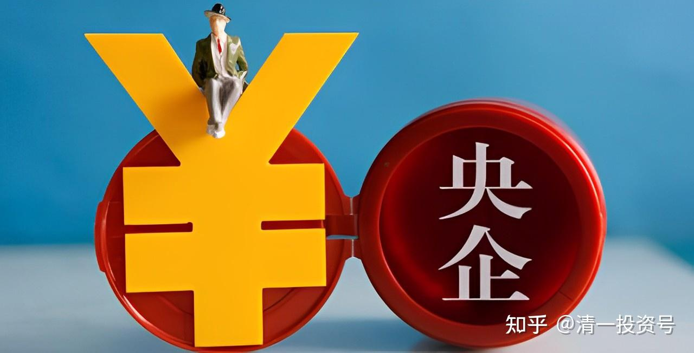
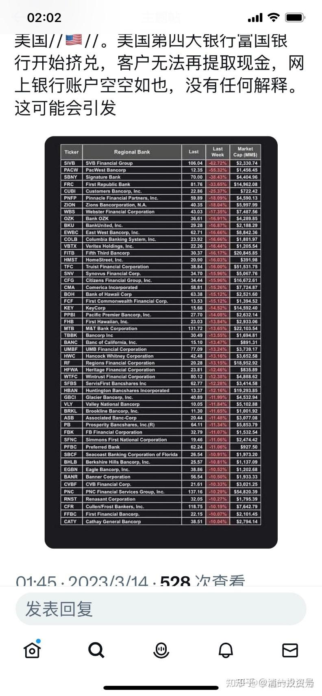
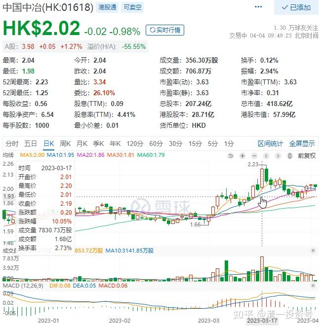
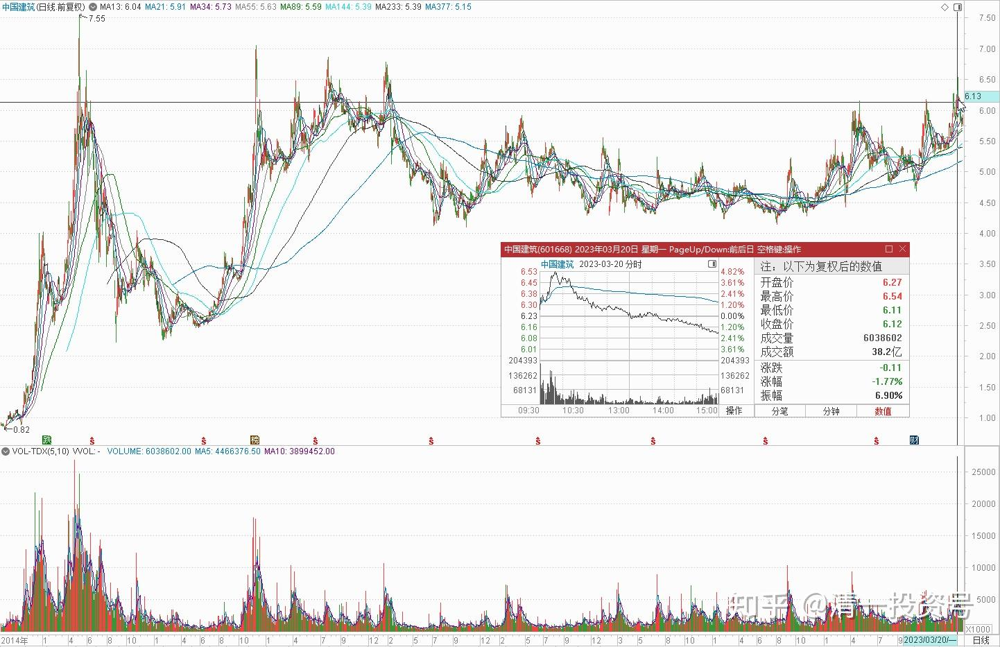

清一山长 2023年3月14日

44篇.拿稳中国的优质资产死不放

山长 清一2023/3/14 16:08:35

[https://www.zhihu.com/question/589219108/answer/2935040379](https://www.zhihu.com/question/589219108/answer/2935040379)

[富国银行和美国银行都出问题了](http://link.zhihu.com/?target=https%3A//export.shobserver.com/baijiahao/html/564863.html)，遭到挤兑。据说去年巴菲特就清空了富国银行。这场金融危机，不可避免的来了。从美国开始爆发，最终会影响全世界的。俄乌危机也没有帮美国撑住[可怜]。现在开始内乱了。

只是希望美国不要急眼了，就提前跟中国打起来转移内部矛盾。美国的计划是两年后打中国，危机提前爆发，也许会让他们有心无力！

山长 清一 2023/3/17 12:17:31

港股中国中冶H居然比A股涨更多，一周涨了17%还多。1.7港币的时候，我用中国建筑换了几百万股中冶，本意是认为估值上中冶H比中建低150%，这样换我肯定不吃亏。前几天1.9元，我还继续换了上百万股进仓。今天居然就涨9个多点了，比中国建筑涨幅多。当然，也没有到我想要卖出筹码的时候，目前这个价格依然在低位，我就继续持股吧！等股息率涨到低于3%的时候，我再换股好了！

我认为现在是国内外的游资，正在寻找安全的投资标的。**现在全世界都是货币超发，未来与货币匹配的资产严重不足。资产荒会很严重的！**（房地产不是真正的资产，听过我财富课的人知道，原来中国的货币被放到房地产上了，现在这些货币要溢出来买真正的资产了。所以我一直**坚持持有真正的资产股**。涨不涨都不管，现在账户不断新高。说明**等待市场风格转换，需要耐心和信心**）**。大家拿稳这些中国的优质资产死不放！不要给游资抢走了！**（但不支持你现在去抢筹码，天知道会不会回调）。

山长 清一 2023/3/20 9:57:17

中国建筑：6.54元，今天已经创7年来的新高。离2015年的历史新高6.86元（前复权价），只有2%的距离了。说明：**耐心持有真正的资产，不用操心就能赚钱。天天研究股市新潮，新技术、新热点，想要一口吃成个大胖子，结果就是追涨杀跌，最终亏损。股市赚钱的逻辑就是耐心，不贪心！[抱拳]**

我的第二重仓涨了，要做什么？答案是——什么也不做，继续等。坐电梯也无所谓。等下去给公主班的学生上小课去，做点有意义的事情[微笑]。

