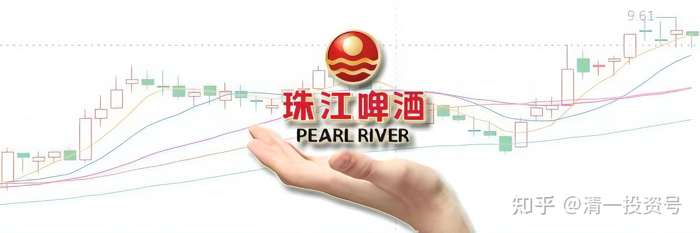
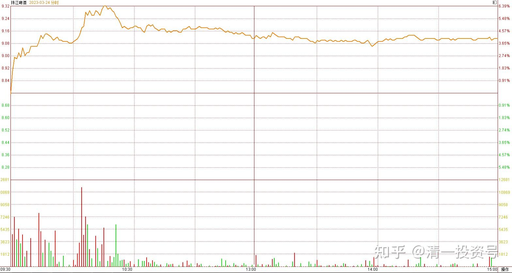
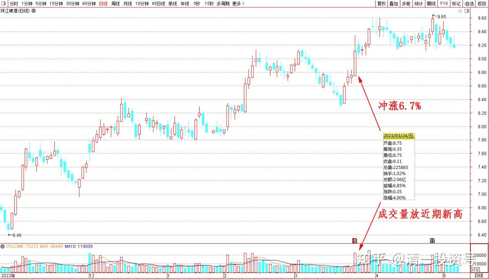
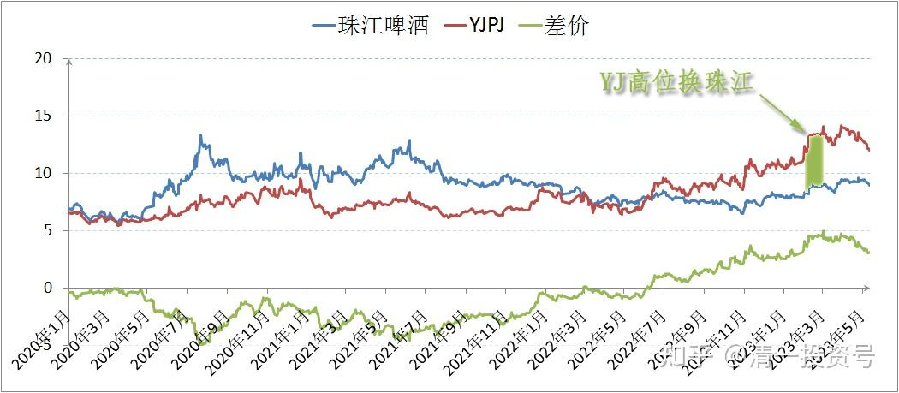
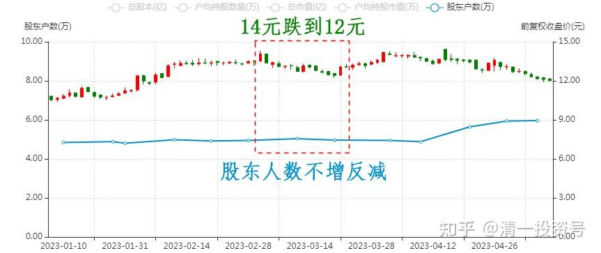
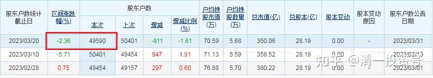

​

46篇.珠江啤酒主力异动的联想

清一山长 2023年3月24日

主力异动的联想：目测珠江啤酒今日异动，主力居然不再辛苦压盘，今日冲涨6.7%后，现跌到9.1元上方守住防线。

如此异动，今日涨幅啤酒股第一名，吸引注意。成交量也放近期新高。主力应该已经完成吸筹了。

YJ高位换珠江几百万股的策略，证明很完美，运气超好。其实我是观察到珠江的盘面有主力压盘吸筹，正好YJ涨幅良好。因此跟随主力的脚步，换筹成功。再次成为珠江的十大股东。如果没有意外，估计我是唯一的自然人十大。倒不是啥原因，而是珠江的盘子太小了，随便一买就到十大了。YJ手中的存货，其实比珠江的更多，但已经退出了十大。**一进一退，一涨一跌**。好好的吃了一笔A股白送的红利。

只是：现在没方向了，所以不知道该咋动？重新换回YJ？锁死换股的利润？——YJ此轮冲高14元多跌到12元多，回调的幅度已经不小，居然股东人数不增反减。

证明筹码已经成功高位换手。现在显然是“老庄换新庄”的节奏，不知道还需要多久才会换完，开始新一轮的拉升?新主力进来肯定也是要吃肉的，不会喝喝汤就走。而且新主力的耐心应该比不上老主力，会拿三五年时间来慢慢压盘。现在的账面，新主力应该还是绿的，浅绿色。将来有多红不知道了。相信不至于被套。但我是否换回来YJ？就不知道了。因为虽然有换股的价差可以锁定，YJ随时有爆发的可能。但他也有更多墨迹的理由。相反：看原来装死的惠泉和珠江，现在都有动静，都到了近期高点位置。股性显然渐渐变活？而且价差依然比较大。拿来换装死的YJ，恐怕未必很明智。也许两陪跑未来变主跑呢？所以——**为了防止误判，两股涨幅不大，就依然不动如山。等看准了，确定了方向，再动手换筹**。

