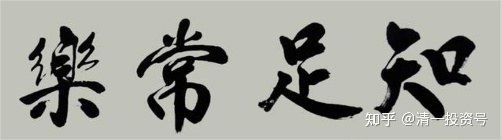
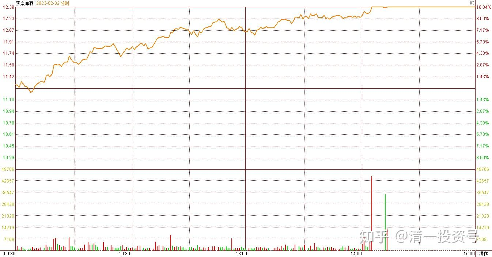
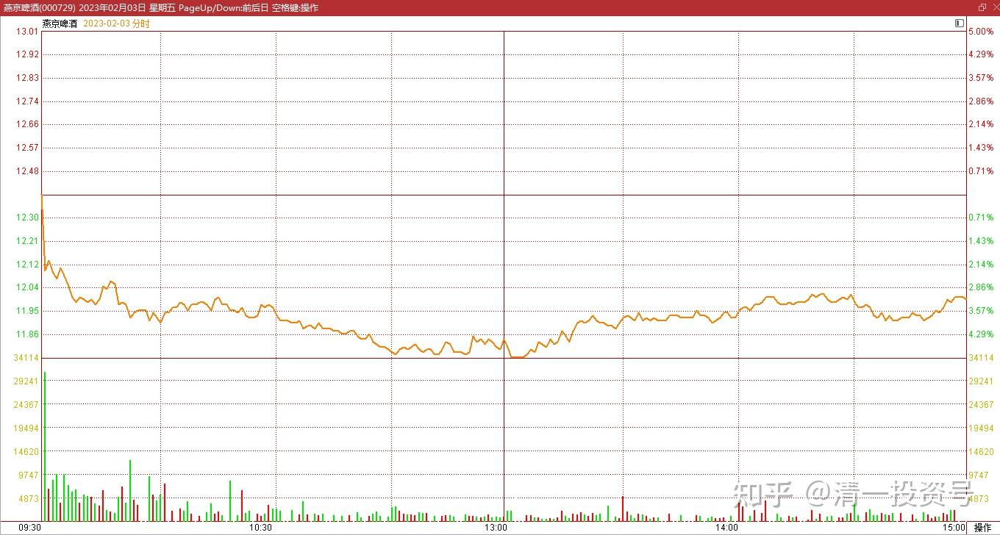
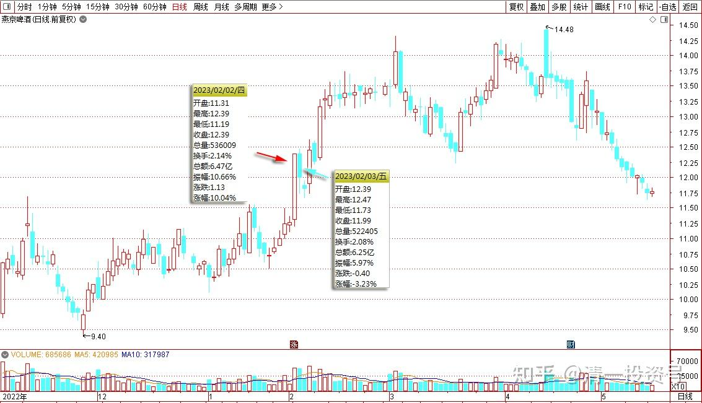
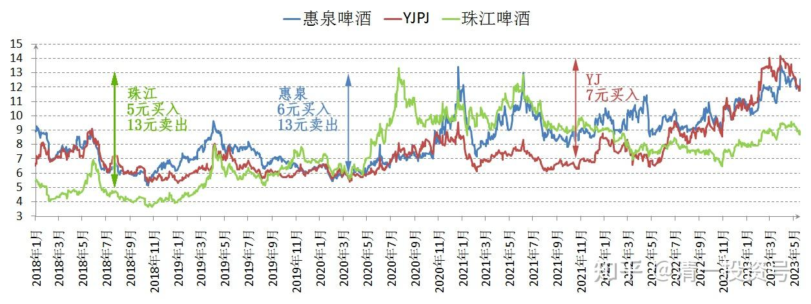

47篇.涨了的大方卖一点，跌了的不怕买一点

清一山长 2023年2月2日

发表今天的想法，就是非常的感谢，感谢这个伟大的时代，感谢我所拥有的各种机会和工具，感谢主力，感谢散户，感谢我的电脑，一直不离不弃地陪我。让我动动手指头，就把将来为公主班准备的世界格斗大奖赛的资金赚出来了！感谢一切机缘！

今天某J的走势，盘面上明显就是勾引人，让你赶快卖货。还用涨停诱惑，还用大量撤单，突然破板，来吓你赶快卖货出来。

这种诱惑和恐惧的力量，实在太强大了。要控制住自己的理性思考和判断，坚持不卖货很困难。明明我判断这只是中级行情开启的标记，就是忍不住要卖。我承认自己内心软弱，还是狠心卖掉了2M拿了很久的筹码，很不甘心地交出了自己十大股东的位置。原因是：我有融资要还。**今天满仓涨停了，赚这么多，还坚持不还融资，实在太过贪心，违背了金融投资的纪律**。我就只能违背“看盘，走势的纪律”了。**祝福拿走我筹码的人，多多发财，多多赚钱，大吉大利**。欣慰的是：目前YJ持仓依然在千万以上。而且——我就算想耍小聪明，今天想要逃走，也是逃不掉的。因为封盘资金——居然最后总共只有两万多手。因此无论主动、被动，我都只能坚持陪着走下去了。感谢主力，让我的账户创出新高，外加创纪录的个股盈利新记录。对于个体散户来说，应该是非常难以逾越的纪录。今天我的观察是——此货的初始封盘资金是17万手。今天的成交量并不大，很多都是小单。很多封盘资金是自己撤掉的，并不是被抛盘打掉的。说明——市场上没啥流动筹码了，主力高度控盘！散户今天大量流失。筹码更加集中了。后市可期。再度强调——某J的主力神秘莫测，走势鬼神难料。我永远猜不透他们在想什么，总是判断错误。只能装死熬时间。因此各位不要依据我的判断来操作，我目前赚钱，都是碰运气，撞大运的。

清一山长 2023年2月3日

YJ走势果然神鬼难料。神都想不到——昨天只有两三百万封单，就轻松封死涨停，居然今天上午就大跌5个点？

洗盘也不需要这样洗呀？主力白白的一天，就送我上百万的心态奖——友好分享奖？联想到当年YJ连续三个涨停，高调突破，然后不久，居然又跌回原地的操作。无一不是超越常理，让人目瞪口呆的操盘手法！佩服至极。不过——跌了，我也一样很开心，我重新买回了百万股啤酒，正好发愁仓位空了一些不踏实。只是我的购入对象，换成了珠江。新买入的是8.138的平均购入成本。相当于我昨天今天，跨品种作T，每股便宜了4.25元重新持有相同的份额。

别忘了——2021年以来的大多数时候（甚至是过去多年的大多数时候），珠江的股价是高于YJ的。当年我是用5元买进，跌到4元没卖，账面亏损数百万元，后来冲到13元才全部卖光，加上当时同类型的惠泉6元进入，13元走光后，慢慢在7元前后，不断买入阴跌不止的YJ，才有今天的超高收益。现在，两只股的股价，再次的反过来了。我似乎也应该反过来操作了。高位卖出势头良好的“好股”，重新买回市场先生抛弃的“不良品种”。

由于市场先生太疯狂，我们没有能力判断市场先生的行为。但我们完全可以【利用他的行为】，做正确的操作动作。就像我现在这样做就行了——**涨了的好股不贪，大大方方地卖一点给别人。跌了的时候，也不恐惧——买一点帮人解决担忧**。这样——心态平和，跟众人相反，就可以在金融市场上走得更加长远一点了。今天虽然我大仓持有的股，跟随市场跌了不少，**但我没有后悔昨天卖少了**。只是今天把昨天卖掉的资金，设法重新买回来就行了。**并极其感恩主力**，在出我意料之外，进行这种完全让我想不到的逆反操作，给我带来的实实在在的一点好处。

**做人要知足：不要去贪恋自己没有得到的东西，而要珍惜自己拥有的东西。每一天，我们都有理由感恩，都有理由快乐，这样你必定心灵富足，物质也富足**。这是常识，但世上绝大多数人，都完全作反了。

最终提醒：今天没有放量，大家不用操心是主力出货。目前价位，出货的空间也不够（连我这一点点货，都出不掉的，何况主力了！）。如果今天这种走势放巨量，大家就应该小心了。而且今天是低开低走的。如果想要出货的手法，是高开，然后慢慢的低走。因此今天的调整，违反“常识”。判断只是洗盘而已，只是洗多久就不知道了。

另外，这种走势，也是给一些短线客上船机会，也给一些胆子大的追涨客鼓励——别担心，套不久的，很快可以解套。这样用这样的盘面语言，才能让越来越多的散户来高位接盘。好容易吸引一点短线客，不能就这样吓跑了！现在股东人数不断减少，人气不足。需要拉一些人气过来，才能走得更远！

