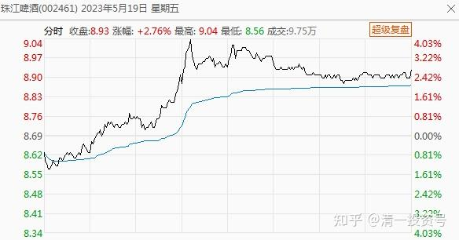
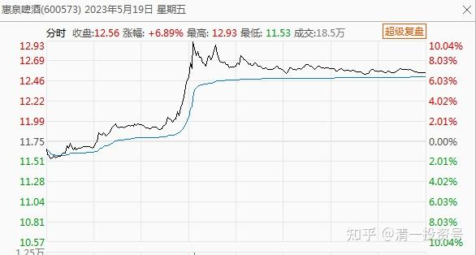
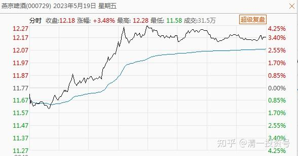

48篇.坚持持仓啤酒不放松！通过适当的切换品种做T，增加账面收益

清一山长 2023年5月19日

今日操作：上午挂单，以8.68元的价格买入20万股珠江，已成交。

下午发现惠泉冲涨停回落，就开始卖一些平仓，出手495400股惠泉，平均售价12.59元。为了补仓，又继续买入珠江28万股。下午的买入价提高到了8.91元。同时以11.75元至12.16元的价格补充了10万股燕京。

毕竟——这些惠泉是燕京价格高于惠泉的时候换的股，现在价格倒置，可以换一些了。最终今日跨品种做T，大概账户上多增了接近10万股啤酒筹码。我们就一点一点的累计优势吧。在不增加资金投入的情况下，继续耐心地等待啤酒行业理论上应该会有的疯狂时刻。坚持持仓啤酒不放松！只是通过适当的切换品种做T，增加一点账面收益！

